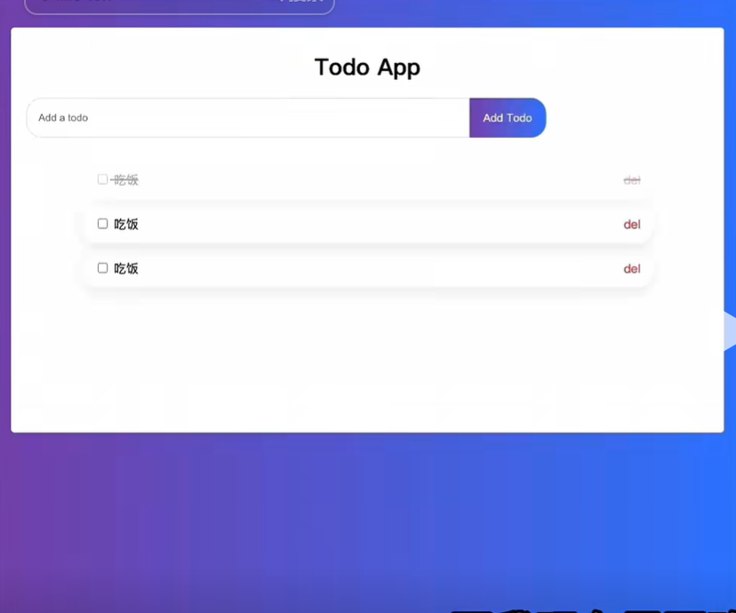

# HTML && CSS

## 前言
如果有个盒子（div），我想设置它的样式，可以这样：

    

    

那如果现在有三个div，每个我都想要不同的样式，那就可以给每一个div加一个类名

        

        

        

        
        
        

style中在类名前面加了个.
margin-top: 10px;为上边距

颜色可以用英文单词表示，还可以用rgb表示，还可以用16进制表示，还可以用hsl（色相、饱和度、亮度）表示。

宽度可以用px表示，也可以用%表示，还可以用em表示，还可以用rem表示。**百分比可以随着页面的宽度变化而变化。**

## 实战

    <!DOCTYPE html>
    <html lang="en">
    <head>
        <meta charset="UTF-8">
        <meta name="viewport" content="width=device-width, initial-scale=1.0">
        <title>Document</title>
    </head>
    <body>
        

        

        
        

    </body>
    </html>

**border: 1px solid #ccc;**
border: 这个属性用于设置元素的边框。
1px: 表示边框的宽度为 1 像素。
solid: 表示边框的样式为实线。
#ccc: 表示边框的颜色为浅灰色。

**box-shadow: 0 4px 6px rgba(0, 0, 0, 0.1);**
box-shadow: 这个属性用于给元素添加阴影效果。
0 4px: 表示阴影在水平方向上偏移 0 像素，在垂直方向上偏移 4 像素，也就是说阴影向下偏移 4 像素。
6px: 表示阴影的模糊半径为 6 像素，值越大，阴影边缘越模糊。
rgba(0, 0, 0, 0.1): 表示阴影的颜色为黑色，透明度为 0.1（即 10%）。

我们想让div盒子离上方有一定距离，我们可以使用**margin-top**
同理左边距就是**margin-left**

我们暂时想要做的效果是这样的：

可以看到有一个标题，因为这个标题是在div盒子里面的，所以需要在div里面再建一个div。此后我们需要让他居中，让他上面有一定的空间，还要改字体的大小。

    

        
姚文达的todo list

    

    .todo-app {
            width: 98%;
            height: 500px;
            background-color: #ffff;
            border: 1px solid #ccc; /* 添加边框 */
            border-radius: 15px; /* 设置圆角半径 */
            box-shadow: 0 4px 6px rgba(0, 0, 0, 0.1); /* 添加阴影 */
            margin-top: 40px;
            margin-left: 1%; /*宽度是98%，那么边距设为1%就是居中了 */
        }
    .title {
        font-size: 30px; /*字体大小 */
        font-weight: 600; /*字体粗细 */
        text-align: center; /*把字横向居中 */
        margin-top: 30px;
    }

给一个盒子加margin不生效的时候（margin塌陷），可以给他的父盒子加一个padding，margin是外边距，padding是内边距。给子盒子加外边距（margin）就相当于给父盒子加内边距（padding）。

但是本来高度是500px的div盒子，加了padding: 30px之后，高度变成了530px，这是因为计算一个盒子的高度是 边框的高度 + 内边距的高度 + 内容区域的高度。

要想解决这个高度改变的问题，需要在这个盒子加上**box-sizing: border-box;**

### 接下来是一个输入框，输入框右边是一个按钮

    

        <input type="text">
        
add todo

    

应该是左右排列才对，这就是为什么在两个元素的外面加了个div，这个div就是用来设置排列方式的。当我们想要两个元素横着排，我们给他外面的盒子加上**display: flex;** 就行。

输入框的样式：

    .todo-input { 
                padding-left: 15px;
                border: 1px solid #dfe1e5; 
                outline: none;
                width: 60%;
                height: 50px;
                border-radius: 20px 0 0 20px;
            }

solid表示实线，`outline: none;`表示去掉边框，`border-radius: 20px 0 0 20px;`是添加圆角的，4个值分别代表左上角、右上角、右下角、左下角的半径。
placeholder的内容太贴近左边了，所以加一个`padding-left: 15px;`

button的样式：

    .todo-button {
                border: 1px solid #dfe1e5; 
                outline: none;
                width: 100px;
                height: 52px;
                border-radius: 0 20px 20px 0;
                background: linear-gradient(to right, purple, blue);
                color: #ffff;
                line-height: 52px;
                text-align: center;
                cursor: pointer;
                user-select: none;
            }

按钮的高度和输入框的高度保持一致，背景颜色和页面的背景颜色一样。`text-align: center;`表示水平居中，行高line-height和输入框的高度一致，这样就垂直居中了，`cursor: pointer;`使鼠标放上去时变成一个手指，`user-select: none;`使得无法选中按钮中的文字。

待办事项的框：

    

        <input type="checkbox">
        
吃饭

        
del

    

其样式：

    .item {
                display: flex;
                box-sizing: border-box;
                width: 80%;
                height: 50px;
                margin: 15px auto;
                padding: 16px;
                box-shadow: rgba(149, 157, 165, 0.2) 0px 8px 20px;
                border-radius: 20px;

                align-items: center;
                justify-content: space-between;
            }

`box-sizing: border-box;`改变了计算总宽度和总高度的方式，如果是`box-sizing: content-box;`（默认值），那么你设置的 width 和 height 属性只应用于内容区域，如果你为一个元素设置了 width: 100px;，并且它有 10px 的 padding 和 5px 的 border，那么这个元素在页面上实际显示的宽度会是 130px (100 + 10 + 10 + 5 + 5)。如果是`box-sizing: border-box;`，你设置了 width: 100px;，那么这个元素在页面上实际显示的宽度就是 100px，内容区域的宽度会自动调整为 70px (100 - 10 - 10 - 5 - 5)。
`margin: 15px auto;`第一个值表示上下，第二个值表示左右，auto表示自动居中。如果是4个值，那么顺时针。
`box-shadow`表示阴影。
`align-items: center;`表示元素垂直居中。
`justify-content: space-between;`表示将元素平分空间。

为了实现想要的效果，把HTML改成：

    

        

            <input type="checkbox">
            
吃饭

        

        
del

    

需要把div改成span，div默认是竖着排，span默认是横着排。

    

        

            <input type="checkbox">
            吃饭
        

        
del

    

想实现这样的效果：

**一个div可以同时拥有两个属性**，所以给第一个div添加以下样式：

    .complete {
                text-decoration: line-through;
                opacity: 0.4;
            }

`text-decoration: line-through;`表示给文字添加删除线，opacity设置透明度。

将该样式添加给第一个div：

    

                

                    <input type="checkbox">
                    吃饭
                

                
del

            

