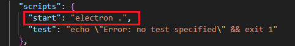
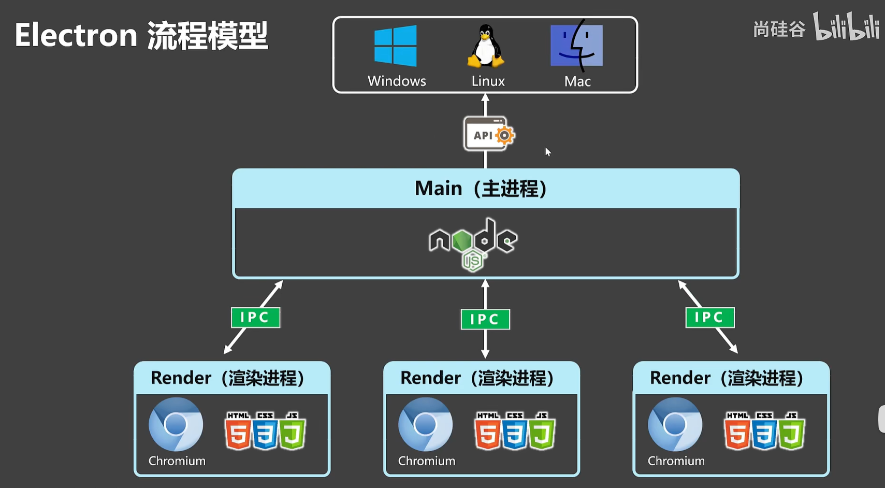

```
npm init -y
npm install electron --save-dev
```

index.js:

```js
const { app, BrowserWindow } = require('electron');

const createWindow = () => {
    const win = new BrowserWindow({
        width: 800,
        height: 600,
    });

    win.loadFile('index.html');
}

app.whenReady().then(() => {
    createWindow();
});
```

启动项目要在package.json设置命令：



启动：npm run start

___

## electron流程模型

主进程最主要的目的是管理“渲染进程”（窗口）



主进程是node环境，可以使用`__dirname`、fs；渲染进程是浏览器环境，可以使用alert()、window()，但并不可以使用`__dirname`、fs等

主进程和渲染进程之间是有通信的：渲染进程是浏览器环境，如果一个按钮想在D盘写一个hello.txt文件，靠的是主进程nodejs进行文件写入操作

主进程是可以调用原生API的

