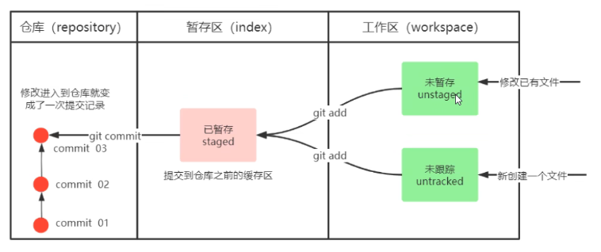
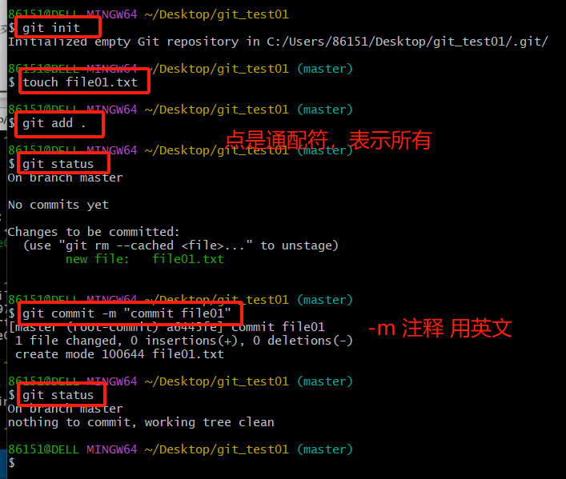
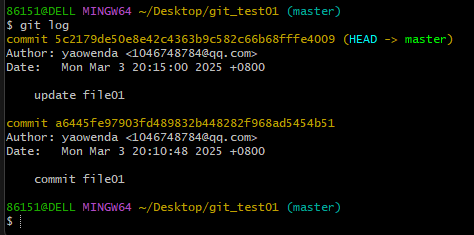
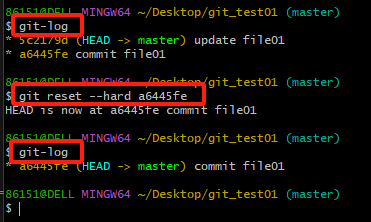
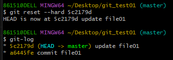
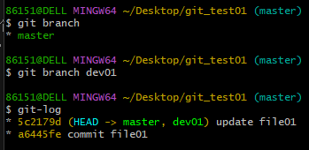
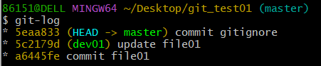

## linux基本命令

ll 查看当前目录
cat 查看文件
touch 创建文件
vi vi编辑器

## 获取本地仓库
创建一个文件夹，在其中打开git bash，执行git init，创建成功后会生成一个.git文件夹

## git常用命令

进入本地仓库之前必须先进暂存区

git log [option] 命令可以查看提交记录：

option:
    --all: 显示所有提交记录
    --pretty=oneline: 将提交信息显示为一行
    --abbrev-commit: 使commitid更简短
    --graph: 以图显示

因为之前在.bashrc文件中配置了git log --graph --pretty=oneline --abbrev-commit，所以可以直接执行git-log命令

## 版本切换
git reset --hard [commitid]
commitid可以通过`git-log`查看

这样就回退到了修改之前

#### 怎么回来？
同理：

但是如果自己把提交记录删除了，可以通过`git reflog`查看前面所有的操作

## 控制部分文件使其不让git管理
假如文件夹中所有`.a`结尾的文件不想让git管理，可以创建一个`.gitignore`文件，在此文件中输入`*.a`，这样继续使用`git add .`命令时，`.a`文件不会被添加到暂存区

很多项目会给.gitignore文件

## 分支
查看有哪些分支：git branch
新建一个分支：git branch [branchname]
查看分支中提交的内容：git-log 就可以查看

从中可以看出master分支和dev01分支都有两次提交，**HEAD指向谁谁就是当前的分支**

在工作区看到的只能是一个分支

我提交了.gitignore文件，但提交到了master分支而不是dev01分支，切换回dev01分支就没有.gitignore文件

### 如何切换分支
git checkout [branchname]

创建并且切换到分支： git checkout -b [branchname]

### 合并分支 
用户1在master分支开发，用户2在dev01分支开发，master分支有.gitignore文件，dev01分支有file02文件

1、切换到master分支 **合并到哪个分支就需要先切换到哪个分支**
2、git merge dev01

### 删除分支
不能删除当前分支，只能删除其他分支

git branch -d [branchname] 删除分支时需要做各种检查
git branch -D [branchname] 强制删除分支

分支没有merge到master，用-d删除会报错，因为git认为可能是误操作，可以用-D

## 解决冲突
多个人都修改了同一行代码，用谁的，git会询问，此即解决冲突

在master分支上将file01.txt的内容改成update count=2 然后 add commit
在dev01分支上将file01.txt的内容改成update count=3 然后 add commit

然后合并，报错：

    $ git merge dev01
    Auto-merging file01.txt
    CONFLICT (content): Merge conflict in file01.txt
    Automatic merge failed; fix conflicts and then commit the result.

file01.txt的内容：

    <<<<<<< HEAD
    update count=2
    =======
    update count=3
    >>>>>>> dev01

head指向的是当前分支

手动修改好想要的结果，例如： update count=5
然后 add commit

## 分支使用流程和原则

在开发中，一般有如下分支使用原则与流程：

**master（生产）分支**

​	线上分支，主分支，中小规模项目作为线上运行的应用对应的分支；

**develop（开发）分支**

​	是从 master 创建的分支，一般作为开发部门的主要开发分支，如果没有其他并行开发不同期上线要求，都可以在此版本进行开发，阶段开发完成后，需要是合并到 master 分支，准备上线。

​	开发功能一般是提交到develop分支，不是直接在develop分支上开发，而是开发的代码都应该提交到develop分支上

**feature/xxxx分支**

​	从 develop 创建的分支，一般是同期并行开发，但不同期上线时创建的分支，分支上的研发任务完成后合并到 develop 分支。

**hotfix/xxxx分支**

​	从 master 派生的分支，一般作为线上 bug 修复使用，修复完成后需要合并到 master、test、develop 分支。

还有一些其他分支，在此不再详述，例如 **test 分支（用于代码测试）**、**pre 分支（预上线分支）**等等。

feature分支合并到develop分支之后就可以删除，但develop分支一般不删。

hotfix分支合到develop分支上面去，在合并到master分支

​	

