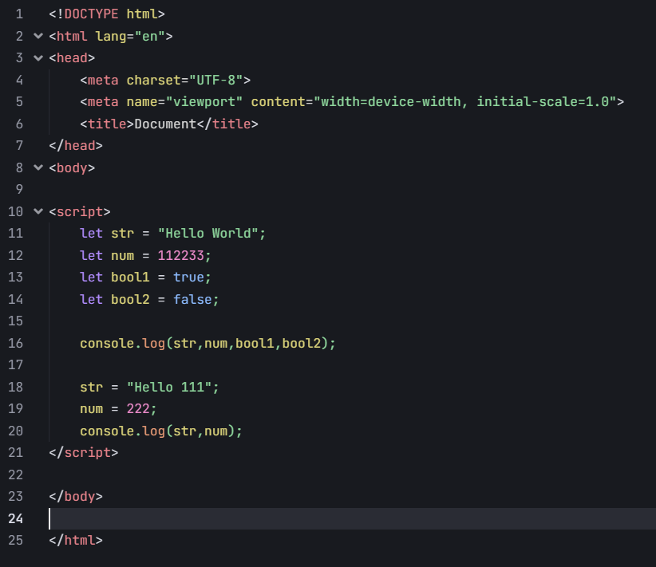
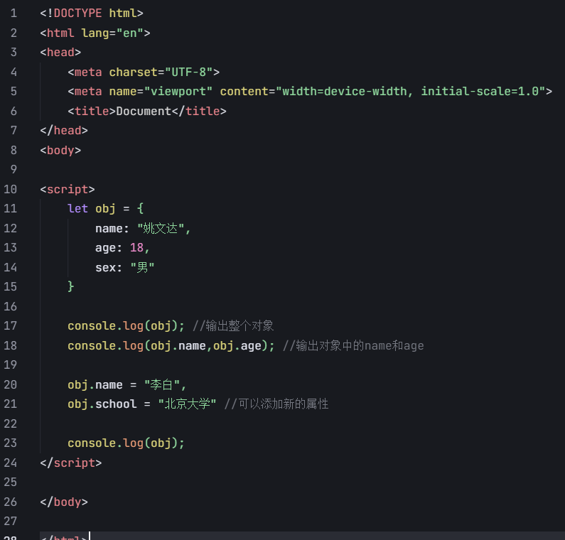
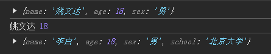

## 前言

#### // 为什么每个人的微信名称是不一样的，但代码是一样的，什么逻辑？
let name = "";
let obj = {};//对微信服务器发起网络请求拿到数据

name = obj.name;

    
{{name}}

#### //让大括号中的代码执行三次

for(let i = 0; i < 3; i++) {
    console.log(i);
}

## 练习

javascript代码写在``标签中，该标签在body中
创建变量用`let`，输出多个变量的内容用逗号隔开。修改不需要使用let。

### 另外一种数据类型，对象

删除属性：

    delete obj.sex;
    console.log(obj);

### 数组

    

### 等号

    

### 方法

    

**参数、返回值：**

    
    
    