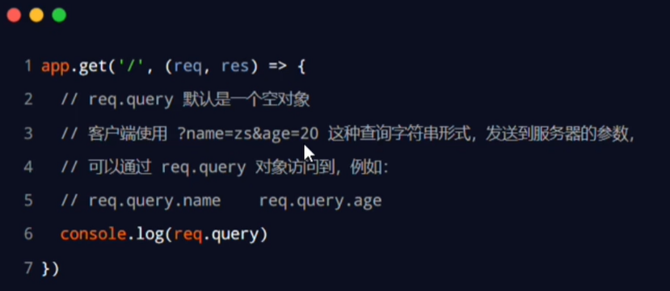
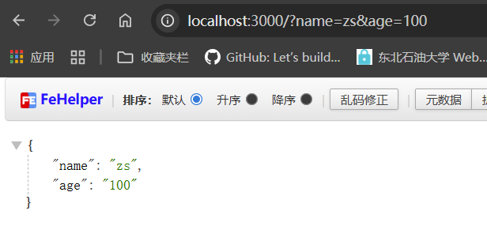
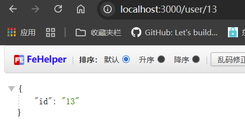

Express的本质：就是一个npm上的第三方包，提供了快速创健Web服务器的便捷方法。

## 基本使用：

```js
const express = require('express');
// 创建web服务器
const app = express();

app.get('/user', (req, res) => {
    // 调用express提供的res.send()方法，向客户端响应一个JSON对象
    res.send({name: 'zs', age: 20, gender: '男'});
});

app.post('/user', (req, res) => {
    res.send('请求成功');
});

app.listen(3000, () => {
    console.log('Express server running at http://localhost:3000');
});

```

___

## 获取URL中携带的查询参数：

通过req.quey对象，可以访问到客户端通过查询字符串的形式，发送到服务器的参数：



例如

```js
app.get('/', (req, res) => {
    res.send(req.query);
});
```



___

## 获取url中的动态参数：

通过req.params对象，可以访问到URL中，通过`:`匹配到的动态参数

传递的id是变化的：


```js
app.get('/user/:id', (req, res) => {
    res.send(req.params);
});
```



```js
app.get('/user/:id/:name', (req, res) => {
    res.send(req.params);
});
```


___

## 托管静态资源

express提供了一个非常好用的函数，叫做express.static0,通过它，我们可以非常方便地创建一个静态资源服务器，例如，通过如下代码就可以将public目录下的图片、CSS文件、JavaScript文件对外开放访问了：

```
app.use(express.static('public'))
```

现在，你就可以访问public目录中的所有文件了：

```
http://localhost:3000/images/bg.jpg
http://localhost:3000/css/style.css
http://localhost:3000/js/login.js
```

**注意：Express在指定的静态目录中查找文件，并对外提供资源的访问路径。因此，存放静态文件的目录名不会出现在URL中。**

### 托管多个静态资源目录

如果要托管多个静态资源目录，多次调用express.static()函数：

```js
app.use(express.static('public'))
app.use(express.static('files'))
```

express.static 会根据目录的添加顺序查找文件，比如两个文件夹都有index.html，在访问index.html的时候，会先从public目录中查找，找到了就不会再去files文件夹中查找了

### 挂载路径前缀

如果希望在托管的静态资源访问路径之前，挂载路径前缀，则可以使用如下的方式：

```js
app.use('/public', express.static('public'))
```

现在，你就可以通过带有/public前缀地址来访问public目录中的文件了：

```
http://localhost:3000/public/images/kitten.jpg
http://localhost:3000/public/css/style.css
http://localhost:3000/public/js/app.js
```

## nodemon

在编写调试Node.js项目的时候，如果修改了项目的代码，则需要频繁的手动close掉，然后再重新启动，非常繁琐。

现在，我们可以使用nodemon这个工具，它能够监听项目文件的变动，当代码被修改后，nodemon会自动帮我们重启项目，极大方便了开发和调试。

```
npm install -g nodemon
```

要使用`nodemon 文件名.js`启动项目