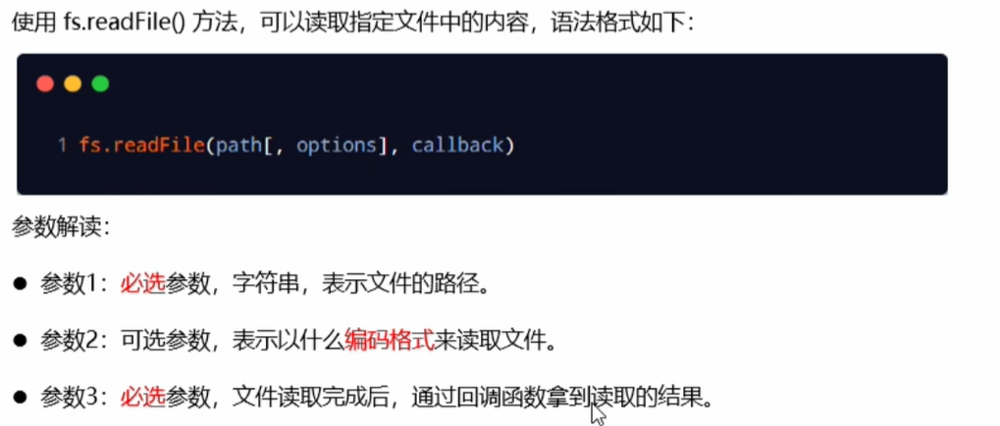
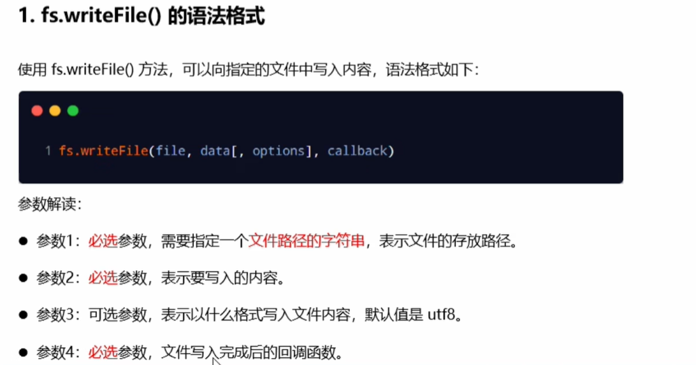
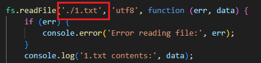
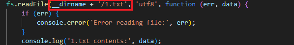

## 初识node.js

node.js是Javascript的后端运行环境

node.js中无法调用DOM、BOM、Ajax等浏览器内置API

## fs文件系统模块

```
const fs = require('fs')
fs.readFile0方法，用来读取指定文件中的内容 
fs.writeFile0方法，用来向指定的文件中写入内容
```





会以执行node命令时所处的目录进行拼接，而非js文件所处的目录：



解决路径拼接错误问题：绝对路径

另外，可以使用**__dirname (表示当前文件所处目录)**



## path路径模块

path.join()方法，用来将多个路径片段拼接成一个完整的路径字符串 

path.basename()方法，用来从路径字符串中，将文件名解析出来

path.extname()方法， 获取路径中的扩展名

```js
const path = require('path');

// path.join()
const pathStr = path.join('/a', '/b/c', '../', './d', 'e.txt');
console.log(pathStr); // 输出: \a\b\d\e.txt

const pathStr2 = path.join(__dirname, '/1.txt');
console.log(pathStr2); // C:\Users\86151\Desktop\nodejsTest\1.txt

// path.basename()
const fpath = '/a/b/c/index.html';

var fullName  = path.basename(fpath);
console.log(fullName); // index.html

var nameWithoutExt = path.basename(fpath, '.html');
console.log(nameWithoutExt); // index

// path.extname()
const fext = path.extname(fpath);
console.log(fext); // .html
```

## HTTP

http模块是Node.js官方提供的、用来创建web服务器的模块。通过http模块提供的`http.createServer()`方法，就能方便的把一台普通的电脑，变成一台Web服务器，从而对外提供Web资源服务。

```
const http = require('http')
```

在Node.js中，我们不需要使用IIS、Apache等这些第三方web服务器软件。因为我们可以基于Node.js提供的 http模块，通过几行简单的代码，就能轻松的手写一个服务器软件，从而对外提供web服务。

### 创建最基本的web服务器

1、导入http模块

```js
const http = require('http')
```

2、创建web服务器实例

```js
const server = http.createServer()
```

3、为服务器实例绑定 request事件，监听客户端的请求

```js
// 使用服务器实例的.on()方法，为服务器绑定一个request事件
// 两个参数，第一个'request'是事件的名称，第二个是触发这个事件时会执行的回调
// 如果有客户端请求这个server，就会触发request事件，就会调用回调
server.on('request', (req, res) => {
	// 只要有客户端来请求我们自己的服务器，就会触发request事件，从而调用这个事件处理函数
	console.log('有人访问了这个服务器')
})
```

4、启动服务器

```js
// 调用server.listen（端口号，cb回调）方法，即可启动web服务器
server.listen(80,()=>{
	console.log('server running at ')
})
```


req请求对象：

只要服务器接收到了客户端的请求，就会调用通过server.on()为服务器绑定的request事件处理函数。

如果想在事件处理函数中，访问与客户端相关的数据或属性，可以使用如下的方式：

```js
server.on('request', (req) => {
	// req是请求对象，它包含了与客户端相关的数据与属性，例如 req.url 是客户端请求的url地址 req.method 是客户端的method请求类型
	const str = 'Your request url is ${req.url} and request method is ${req.method}'
	console.log(str)
})
```

res 响应对象

在服务器的 `request` 事件处理函数中，如果想**访问与服务器相关的数据或属性**，可以使用如下的方式：

```js
server.on('request', (req, res) => {
  // res 是响应对象，它包含了与服务器相关的数据和属性，例如：
  // 要发送到客户端的字符串
  const str = `Your request url is ${req.url}, and request method is ${req.method}`;
  // res.end() 方法的作用：
  // 向客户端发送指定的内容，并结束这次请求的处理过程
  res.end(str)
})
```


5. 解决中文乱码问题

当调用 `res.end()` 方法，向客户端发送中文内容的时候，会出现乱码问题，此时，需要手动**设置内容的编码格式**：

```js
server.on('request', (req, res) => {
  // 发送的内容包含中文
  const str = `您请求的 url 地址是 ${req.url}, 请求的 method 类型是 ${req.method}`;
  // 为了防止中文显示乱码的问题，需要设置响应头 Content-Type 的值为 text/html; charset=utf-8
  res.setHeader('Content-Type', 'text/html; charset=utf-8');
  // 把包含中文的内容，响应给客户端
  res.end(str)
})
```

### 根据不同的url返回不同的html内容

- 获取请求的url地址
- 设置默认的响应内容为404 Not found
- 判断用户请求的是否为/或index.html首页
- 判断用户请求的是否为/about.html关于页面
- 设置Content-Type响应头，防止中文乱码
- 使用res.end0把内容响应给客户端

```js
const http = require('http')

const server = http.createServer()

server.on('request', (req, res) => {
    const url = req.url
    let content = '<h1>404 Not found</h1>'
    if (url === '/' || url === '/index.html') {
        content = '<h1>首页</h1>'
    } else if (url === '/about.html') {
        content = '<h1>关于我们</h1>'
    }
    res.setHeader('Content-Type', 'text/html; charset=utf-8')
    res.end(content)
})

server.listen(3000, () => {
    console.log('服务器启动成功了，可以通过http://localhost:3000/来进行访问')
})
```

当用户不输入时，默认访问index.html


