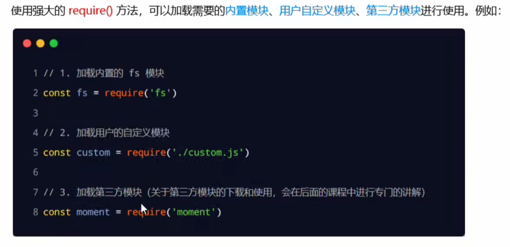
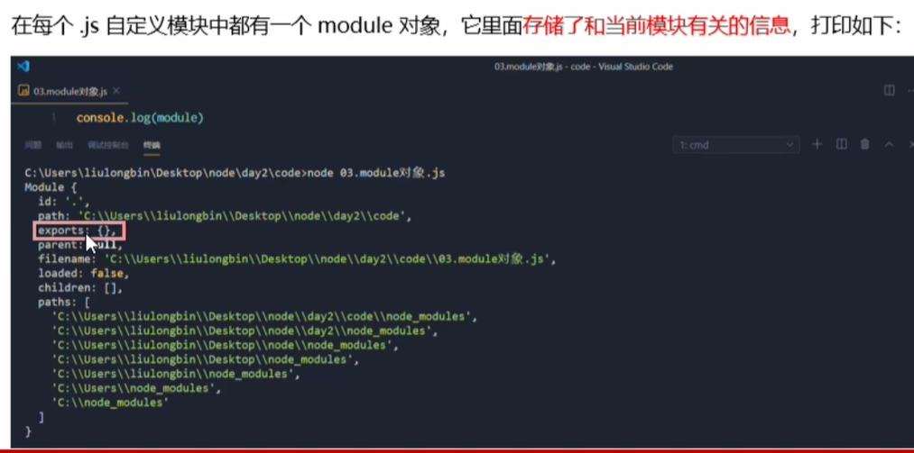
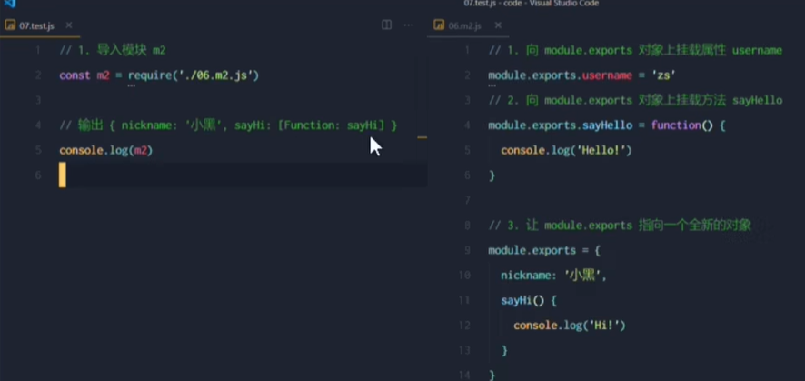
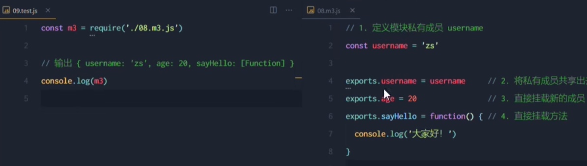
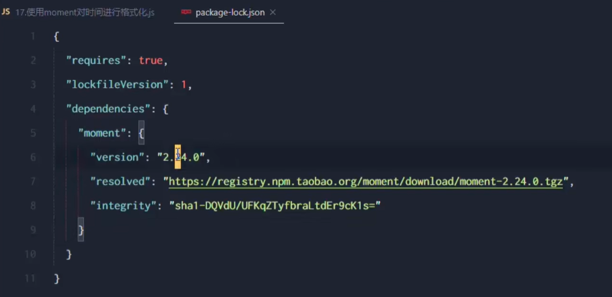
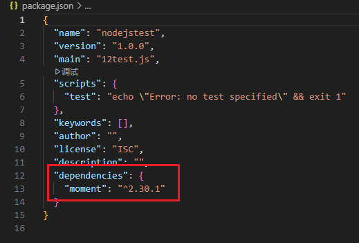

使用require()方法加载其他模块的时候，会执行被加载模块中的代码

## 模块作用域

在01.js中：

```js
const username = '张三' // 成员默认只能在模块内部访问
function sayHello(){
	console.log()
}
```

在02.js中

```js
const 01 = require('./01.js')

console.log(01)
```

访问不到01.js中的成员

防止了全局变量污染 

___

如何把模块作用域中的成员共享出去给别人使用？

module对象



使用module.exports向外共享成员

在自定义模块中，可以使用module.exports对象，将模块内的成员共享出去，供外界使用。
外界用require()方法导入自定义模块时，得到的就是module.exports所指向的对象。

也就是说用require导入模块的时候，导入的其实是这个模块里面module.exports所指向的属性

自定义模块.js:

```js
module.exports.username = '张三';

module.exports.sayHello = function() {
    console.log('Hello, ' + module.exports.username + '!');
}
```

12test.js:

```js
const m = require('./自定义模块');

console.log(m.username);

m.sayHello();
```

输出：

张三
Hello, 张三!

___

注意点：使用require()方法导入模块的时候，导入的结果，永远以module.exports指向的对象为准



___

由于module.exports单词写起来比较复杂，为了简化向外共享成员的代码，Node提供了exports对象。默认情况下，exports 和module.exports指向同一个对象。最终共享的结果，还是**以 module.exports 指向的对象为准**。



## npm与包

第三方模块又叫做包

通过格式化时间的包对时间进行格式化

```js
// npm i moment
const moment = require('moment');

const currentTime = moment().format('YYYY-MM-DD HH:mm:ss');
console.log(`Current Time: ${currentTime}`);
```

初次装包完成后，在项目文件来下多一个叫做node modules的文件夹和package-lock.json的配置文件

其中：

node modules文件夹用来存放所有已安装到项目中的包。require()导入第三方包时，就是从这个目录中查找并加载包。

`package-lock.json`配置文件用来记录node modules目录下的悔一个包的下载信息，例如包的名字、版本号、下载地址等。



### 包管理配置文件

npm规定，在项目根目录中，必须提供一个叫做`package.json`的包管理配置文件。用来记录与项目有关的一些配置信息。例如：

- ·项目的名称、版本号、描述等
- ·项目中都用到了哪些包
- ·哪些包只在开发期间会用到
- ·那些包在开发和部曙时都需要用到

团队项目开发中，应该把node_modules文件夹添加在.gitignore文件中

**快速创建package.json**

npm包管理工具提供了一个快捷命令，可以在执行命令时所处的目录中，快速创建package.json这个包管理配置文件：

```
npm init -y
```

只能在英文目录下成功运行，运行npm i命令安装包时，npm会自动把包的名称和版本记录到package.json

dependencies节点专门记录安装了哪些包：



当拿到一个没有`node_modules`的项目时，先执行`npm i`命令，安装所有依赖包

卸载指定包：npm uninstall

**devDependencies节点**

如果某些包只在项目开发阶段会用到，在项目上线之后不会用到，则建议把这些包记录到devDependencies节点中。

与之对应的，如果某些包在开发和项目上线之后都需要用到，则建议把这些包记录到dependencies节点中。

```sh
npm i 包名 -D
或者
npm install 包名 --save-dev
```

### 模块加载机制

内置模块的加载优先级最高，require('fs')始终返回内置的fs模块，即使在node modules目录下有名字相同的包也叫做fs。