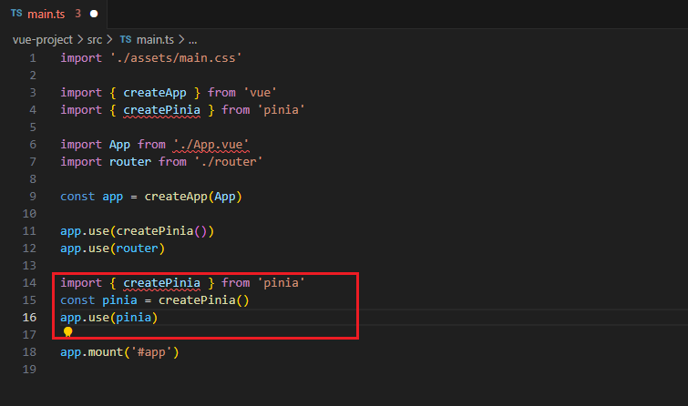
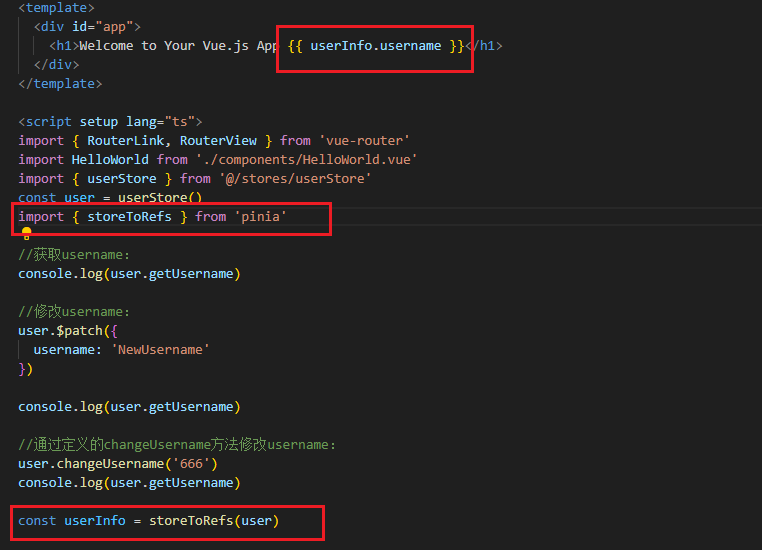
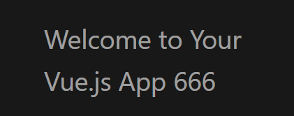

在任意Vue页面之间共享的存储数据。简单理解：在当前Vue项目中使用的MySQL数据库。例如登录信息，只要完成了登录，所有Vue页面都能读取到当前登录用户。

Vue2中提供的集中状态存储框架是Vuex,Vue3中新提供了Pinia。如果你使用的还是Vue2,那么主要下，VueX和Pinia不能一起使用。



接下来使用pinia需要创建Store。一个Store可以理解为MySQL中的一个库，保存一部分数据。Pinia的Store中有三个概念：state,getter,action。这三个概念也可以类比于熟悉的MVC。state相当于是数据；getter相当于是服务，用来获取并返回数据；action相当于是Controller,组织业务逻辑。

创建定义store的文件`store/user.ts`

```ts
import { defineStore } from "pinia";

export const userStore = defineStore('userStore', {
    state() {
        return {
            username: 'abc'
        }
    },
    getters: {
        getUsername(): string {
            return this.username.toUpperCase();
        }
    },
    actions: {
        changeUsername(newName: string) {
            if (newName && newName.length < 10) {
                this.username = newName;
            }
        }
    }
});

```

App.vue:

```vue
<template>
  <div id="app">
    <h1>Welcome to Your Vue.js App</h1>
  </div>
</template>

<script setup lang="ts">
import { RouterLink, RouterView } from 'vue-router'
import HelloWorld from './components/HelloWorld.vue'
import { userStore } from '@/stores/userStore'
const user = userStore()

//获取username：
console.log(user.getUsername) //ABC

//修改username：
user.$patch({
  username: 'NewUsername'
})

console.log(user.getUsername)//NEWUSERNAME
    
//通过定义的changeUsername方法修改username：
user.changeUsername('666')
console.log(user.getUsername)//666

</script>

<style scoped>

</style>
```

我要把store里面的属性暴露给页面，要怎么做？ 



