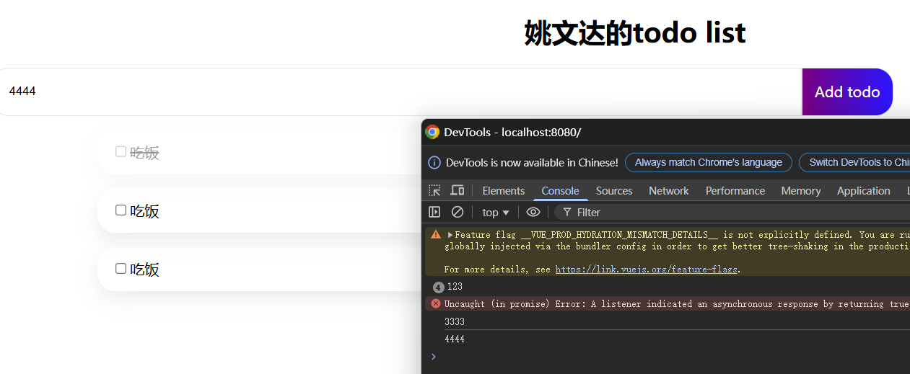
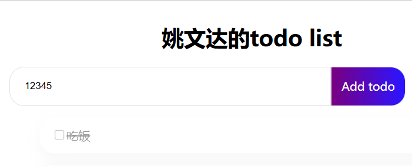
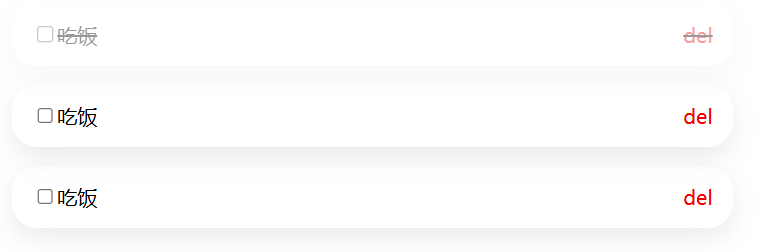
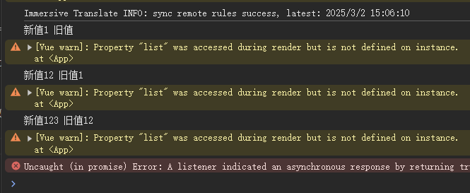
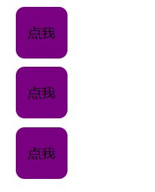

Vue.js - 渐进式JavaScript 框架

    
    
    <template>
        <!-- 写html的地方 -->
    </template>
    
    

### 创建vue项目
安装node.js
全局安装vue CLI：`npm install -g @vue/cli`
执行vue ui 报错：vue : 无法加载文件 C:\Users\86151\AppData\Roaming\npm\vue.ps1，因为在此系统上禁止运行脚本。
在powershell中运行 `Set-ExecutionPolicy -Scope Process -ExecutionPolicy Bypass`
然后再powershell运行vue ui

### 运行项目
`ctrl+j` 打开控制台，`npm i`安装所需依赖 `npm run serve`

### vue3中定义变量

在vue3中创建变量和vue2、javascript不太一样，在vue中定义变量需要通过ref来定义

    

如果想在script中输出其值：console.log(str.value) //要有.value才能输出值

如果在template中输出其值：{{str}} 在template中不需要.value，直接用str即可

### 监听事件

监听事件用@

如果想点击按钮触发函数

    
    
    
Add todo

鼠标移入：@mouseenter 鼠标移出：@mouseleave

### 双向绑定 v-model
输入的值自动绑定到str中：

    

        <input v-model="str" class="todo-input" type="text" placeholder="请输入待办事项">
        
Add todo

    

    
    

输入框输入的内容会绑定到str中，当点击按钮时被输出

既然叫双向绑定，那么当str的值改变时，input中的值也会改变

    

当点击按钮，输入框中的值也会变成12345

双向绑定还可以用于其他地方

    

        <input v-model="str" type="checkbox">
        吃饭
    

    
    

这样每点击一次按钮，checkbox的值就会取反

### 动态绑定

动态绑定类名：

实现当打钩，则变透明，不打勾则正常透明度

之前定义了两个样式 item 和 complete

    
    
    
 <!-- 动态绑定类名 -->
            

                <input @click="add" type="checkbox">
                吃饭
            

            
del

        

上面是写死的，优化：

    
 <!-- 用三元运算符 -->
        

            <input @click="add" type="checkbox">
            吃饭
        

            
del

    

    
    

这样点一次checkbox，就会变成false，再点一次就会变成true

### 循环

    
    
    

        

            <input @click="add" type="checkbox">
            {{ item }} <!-- 这里是插值表达式 {{  }} -->
        

        
del

    

使用 v-for 指令时，需要为每个循环项添加一个唯一的 key 属性

### watch 侦听器
当侦听的变量发生变化，可以执行对应的函数

    
    
    

        <input v-model="str" class="todo-input" type="text" placeholder="请输入待办事项">
        
Add todo

    

由于双向绑定，当输入时，变量str发生变化，就会执行add函数

#### 深度侦听（侦听对象）
现在侦听一个对象：

    
    
    <input v-model="str.text" class="todo-input" type="text" placeholder="请输入待办事项">

发现当输入框发生变化，并不会触发add函数，这是因为侦听的是一个对象，对象并没有变，是对象的属性变了，所以需要使用深度侦听：
watch(str, add, {deep: true})

### 组件
在vue中，每个页面都可以认为是一个组件

假如，页面需要重复用到一个组件，就可以把它写到src/components中
例如一个按钮组件：

    
    
    <template>
        
点我

    
    </template>
    
    

在页面中引入（一定要带.vue）：

    
    
    <template>
        <BaseButton></BaseButton>
        <BaseButton></BaseButton>
        <BaseButton></BaseButton>
        
    </template>

那么如何改变按钮的文字呢？

#### props

props 是父组件向子组件传递数据的方式，子组件通过 props 接收数据

子组件：

    
    
    <template>
        
{{ props.text }}

    
    </template>

父组件：

    <template>
        <BaseButton text="你好"></BaseButton>
        <BaseButton text="他好"></BaseButton>
        
        <BaseButton text="大家好"></BaseButton>

​        

    </template>

除了父组件往子组件传值，子组件也可以向父组件传值：

子组件：

    
    
    <template>
        
{{ props.text }}

    
    </template>

首先，从vue中引入了一个工具类defineEmits，用来定义emit事件，然后定义了一个事件叫ok，当点击按钮，就执行send函数，send函数中调用emit函数，emit发出ok事件，并带一个参数hello

父组件：

    
    
    <template>
        <BaseButton @ok="add" text="你好"></BaseButton>

在父组件监听了ok事件，当这个事件被触发时，就会执行add函数，因为在父组件触发ok事件时带了个hello参数。所以，当点击按钮时，就会在控制台打印hello
