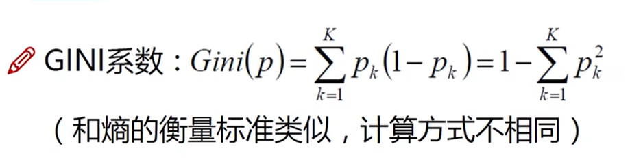
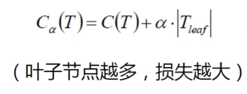

决策树：从根节点开始一步一步走到叶子结点。根节点分类效果 更强

既能做分类也能做回归

训练：从给定的训练集中构造出一棵树（从根节点开始选择特征，如何进行特征切分）

测试：根据构造出来的树模型从上到下走一遍

如何切分特征（如何选择节点）

目标：通过一种**衡量标准**，来计算通过不同特征进行分支选择后的分类情况，找出最好的那个当成根节点，以此类推

衡量标准：熵

熵：物体内部的混乱程度。越混乱熵越大 

离散随机变量的熵的定义：

对于离散随机变量X有n个可能的值{x1,x2,……,xn}，
$$
离散随机变量X的熵H(X)定义为：H(X) = -\sum_{i=1}^{n} P(x_i) \log_2 P(x_i)
$$
其中P(Xi)是X取xi的概率。对数底数取2、10、e都可以，通常取2

信息增益：表示特征X使得类Y的不确定性减少的程度

有一个数据集，要预测一个人是否喜欢运动

| 天气（Weather） | 温度（Temperature） | 湿度（Humidity） | 风（Windy） | 运动（Sport） |
| --------------- | ------------------- | ---------------- | ----------- | ------------- |
| 晴              | 热                  | 高               | 否          | 否            |
| 晴              | 热                  | 高               | 是          | 否            |
| 阴              | 热                  | 高               | 否          | 是            |
| 雨              | 温暖                | 高               | 否          | 是            |
| 雨              | 凉快                | 正常             | 否          | 是            |
| 雨              | 凉快                | 正常             | 是          | 否            |
| 阴              | 凉快                | 正常             | 是          | 是            |

**如何计算信息增益？**

​	原始的熵值减去以某个条件为节点划分后的加权熵值

原始熵值：`-4/7*log(4/7) - 3/7*log(3/7)= 0.9852` 

假如以“天气”为根节点：

晴：都是“否”，熵值为0

阴：都是“否”，熵值为0

雨：`-2/3*log(2/3)-1/3*log(1/3)=0.9183`

晴的概率是2/7 阴的概率是2/7 雨的概率是3/7

熵值计算：`3/7*0.9183=0.3936`

gain(天气) = 0.9852 - 0.3936 = 0.5916

同样计算gain(温度)、gain(湿度)、gain(风)

决策树算法：

ID3：信息增益（如何特征很稀疏，种类很多，就不适合使用ID3）

C4.5：信息增益率（种类多的时候，自身的熵更大，信息增益/自身的熵）

CART：使用GINI系数来当衡量标准

GINI系数和熵都是越小，纯度越高

剪枝

决策树过拟合风险很大，因为无限制的分类下去，理论上可以把数据完全分开，就像一颗足够庞大的大树，每一片叶子都是叶子结点

预剪枝：限制深度、叶子结点个数、叶子节点样本数、信息增益量等，控制树的规模

后剪枝：通过一定的衡量标准

