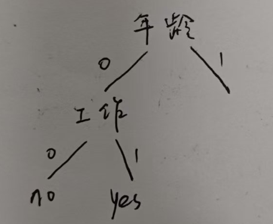
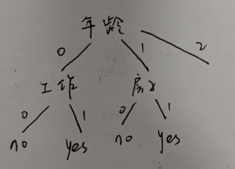
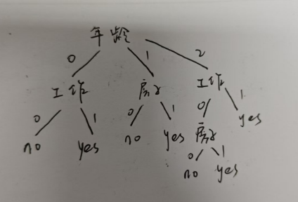
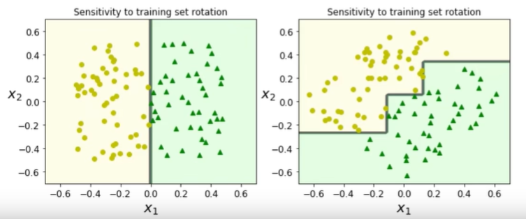
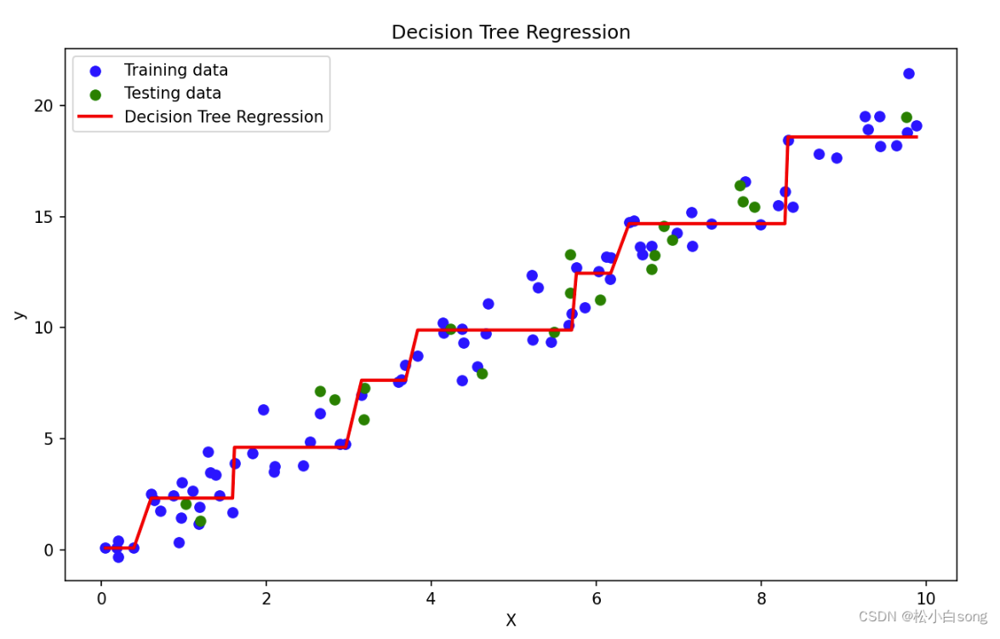

## 决策树例子

| 年龄 | 工作 | 房子 | 信贷情况 0-差 1一般 2好 | 类别 |
| ---- | ---- | ---- | ----------------------- | ---- |
| 0    | 0    | 0    | 0                       | 0    |
| 0    | 0    | 0    | 1                       | 0    |
| 0    | 1    | 0    | 1                       | 1    |
| 0    | 1    | 1    | 0                       | 1    |
| 0    | 0    | 0    | 0                       | 0    |
| 1    | 0    | 0    | 0                       | 0    |
| 1    | 0    | 0    | 1                       | 0    |
| 1    | 1    | 1    | 1                       | 1    |
| 1    | 0    | 1    | 2                       | 1    |
| 1    | 0    | 1    | 2                       | 1    |
| 2    | 0    | 1    | 2                       | 1    |
| 2    | 0    | 1    | 1                       | 1    |
| 2    | 1    | 0    | 1                       | 1    |
| 2    | 1    | 0    | 2                       | 1    |
| 2    | 0    | 0    | 0                       | 0    |

步骤：

1、选择最优划分特征：假设“年龄”的信息增益最大，选择它作为根节点进行第一次划分。然后将样本按照 `年龄=0, 1, 2`分成三类分别构建子树

2、年龄 = 0 的子树：

这部分的数据是：

```python
[[0, 0, 0, 'no'],
 [0, 0, 1, 'no'],
 [1, 0, 1, 'yes'],
 [1, 1, 0, 'yes'],
 [0, 0, 0, 'no']]
```

接着程序**递归**选择信息增益最大的特征，假设是 工作

再对工作=0和工作=1继续递归：工作=0的全是no，工作=1的全是yes，都无需再分裂



3、年龄=1的子树：

这部分的数据是：

```python
[[0, 0, 0, 'no'],
 [0, 0, 1, 'no'],
 [1, 1, 1, 'yes'],
 [0, 1, 2, 'yes'],
 [0, 1, 2, 'yes']]
```

接着程序**递归**选择信息增益最大的特征，假设是 房子，继续分支判断并递归调用createTree



4、年龄=2的子树：

这部分的数据是：

```py
[[0, 1, 2, 'yes'],
 [0, 1, 1, 'yes'],
 [1, 0, 1, 'yes'],
 [1, 0, 2, 'yes'],
 [0, 0, 0, 'no']]
```

接着程序**递归**选择信息增益最大的特征，然后递归直到某个子集中所有样本类别相同或特征用尽。假设 工作 的信息增益最大，工作=0的子树还要继续分，工作=1的子树不需要再分。

工作=0的这部分数据：

```py
[[0, 1, 2, 'yes'],
 [0, 1, 1, 'yes'],
 [0, 0, 0, 'no']]
```

工作=0的子树选择信息增益最大的特征，假设是房子，



[基于ID3的决策树分类器代码](基于ID3的决策树分类器代码.md)

创建数据集：

```py
def createDataSet():
    dataSet = [[0, 0, 0, 0, 'no'],
               [0, 0, 0, 1, 'no'],
               [0, 1, 0, 1, 'yes'],
               [0, 1, 1, 0, 'yes'],
               [0, 0, 0, 0, 'no'],
               [1, 0, 0, 0, 'no'],
               [1, 0, 0, 1, 'no'],
               [1, 1, 1, 1, 'yes'],
               [1, 0, 1, 2, 'yes'],
               [1, 0, 1, 2, 'yes'],
               [2, 0, 1, 2, 'yes'],
               [2, 0, 1, 1, 'yes'],
               [2, 1, 0, 1, 'yes'],
               [2, 1, 0, 2, 'yes'],
               [2, 0, 0, 0, 'no']]
    labels = ['F1-AGE', 'F2-WORK', 'F3-HOME', 'F4-LOAN']
    return dataSet, labels

```

创建树的代码：

```py
def createTree(dataset,labels,featLabels):
    classList = [example[-1] for example in dataset] #获取类别标签

    # 递归停止条件1：所有数据的类别都相同
    if classList.count(classList[0]) == len(classList): #如果类别完全相同则停止继续划分
        return classList[0] # 随便返回哪个都行，因为相同类别
    
    # 递归停止条件2：所有特征都已经用完
    if len(dataset[0]) == 1: #列数=1说明只剩下标签这一列，没有可用于划分的特征了
        return majorityCnt(classList)
    
    # 核心步骤：选择最优特征进行分割
    bestFeat = chooseBestFeatureToSplit(dataset) #选择最优特征进行分割
    bestFeatLabel = labels[bestFeat] #获取最优特征的标签
    featLabels.append(bestFeatLabel)
    myTree = {bestFeatLabel: {}} #key是最佳特征的名称，值是一个空字典，用来存放该节点下的各分支

    del(labels[bestFeat]) # 删除已经使用的特征标签

    featValue = [example[bestFeat] for example in dataset] #获取当前特征的所有取值
    uniqueVals = set(featValue) #set()去重，featValue数组变成了{0,1}或者{0,1,2}
    for value in uniqueVals:
        # 复制标签列表，因为python中列表是可变对象，所以要复制一份
        subLabels = labels[:]
        # 递归构建子树
        myTree[bestFeatLabel][value] = createTree(splitDataSet(dataset, bestFeat, value), subLabels, featLabels)
    return myTree
```

选择最优特征是：for循环计算每一个特征的信息增益，选择信息增益最大的

选择最优特征的代码：

```py
def chooseBestFeatureToSplit(dataset):
    numFeatures = len(dataset[0]) - 1  # 特征数量，减去最后一列的标签
    baseEntropy = calcShannonEnt(dataset)  # 计算数据集的初始熵
    bestInfoGain = 0.0  # 初始化最佳信息增益
    bestFeature = -1  # 最佳特征的索引

    # 遍历特征 i->特征
    for i in range(numFeatures):
        # 获取当前特征的所有取值
        featList = [example[i] for example in dataset]
        uniqueVals = set(featList)  # 去重，得到当前特征的所有唯一取值
        newEntropy = 0.0  # 初始化新的熵

        #遍历特征的唯一取值 value->特征的唯一取值
        for value in uniqueVals:
            subDataset = splitDataSet(dataset, i, value)  # 按照当前特征的取值划分数据集
            prob = len(subDataset) / float(len(dataset))  # 当前子集占总数据集的比例
            newEntropy += prob * calcShannonEnt(subDataset)  # 加权计算子集的熵

        infoGain = baseEntropy - newEntropy  # 信息增益
        if infoGain > bestInfoGain:  # 如果信息增益更大，则更新最佳特征
            bestInfoGain = infoGain
            bestFeature = i

    return bestFeature
```

这里还调用了一个`splitDataSet()`函数，这个函数的作用就是根据选定特征有几个取值，把目标数据集分为几类，其代码如下：

```py
# axis是某个特征 value是特征的某个唯一取值
def splitDataSet(dataset, axis, value):
    # 按照特征axis的取值value划分数据集
    retDataSet = []
    for featVec in dataset:
        if featVec[axis] == value:  # 如果当前样本的特征值等于value(value是有几个特征axis)
            reducedFeatVec = featVec[:axis]  # 保留特征值之前的部分
            reducedFeatVec.extend(featVec[axis + 1:])  # 添加特征值之后的部分
            #axis这一列被删掉了
            retDataSet.append(reducedFeatVec)  # 将处理后的样本添加到新数据集中
    return retDataSet
```

比如选的特征是年龄，年龄有0和1两种取值，如果value=0，则retDataSet是：(就是年龄=0的那几个)

```py
[[0, 0, 0, no],
 [0, 0, 1, no],
 [1, 0, 1, yes],
 [1, 1, 0, yes],
 [0, 0, 0, no]]
```

然后概率prob=5/15 = 1/3。概率与熵的累加（累加是因为年龄还有其他取值，其他取值也计算）就是最终我们要求的以年龄为划分条件的熵

然后算一下信息增益，对比取信息增益最大的


其中还用到了熵的计算：

```py
# 计算给定数据集的熵
def calcShannonEnt(dataset):
    numEntries = len(dataset)  # 数据集的样本数量
    labelCounts = {}  # 用于存储每个类别标签的计数

    # 统计每个标签出现的次数
    for featVec in dataset:
        currentLabel = featVec[-1]  # 获取当前样本的类别标签
        if currentLabel not in labelCounts.keys():
            labelCounts[currentLabel] = 0
        labelCounts[currentLabel] += 1  # 计数

    shannonEnt = 0.0  # 初始化熵值
    # 对于每个标签，计算其概率并计算熵
    for key in labelCounts:
        prob = float(labelCounts[key]) / numEntries  # 当前类别的概率
        shannonEnt -= prob * log(prob, 2)  # 使用对数计算熵

    return shannonEnt
```


sklearn中`DecisionTreeClassifier`类限制决策树形状的参数类：

- min_samples_split（节点在分割之前必须具有的最小样本数），
- min_samples_leaf（叶子节点必须具有的最小样本数），
- max_leaf_nodes（叶子节点的最大数量），
- max_features（在每个节点处评估用于拆分的最大特征数）通常不做这个限制
- max_depth（树最大深度）用的较多


树模型对数据比较敏感：



数据的旋转使得决策边界形状发生了根本变化。不像逻辑回归求出一个权重参数一个偏置参数，数据旋转的话权重参数和偏置参数跟着旋转就行了


## 决策树的回归任务（回归树）

评估标准不同，mse值

### 1、空间划分

和用于分类的决策树一样，回归树的首要任务是根据特征（自变量）把整个数据集（特征空间）切分成一个个更小的、不重叠的矩形区域（子集）

算法会寻找一个特征（比如 x1）和一个切分点（比如 s），将空间一分为二（例如，区域A: x1≤s 和区域B: x1>s）。选择这个切分点和特征的原则是：**使得切分后，两个新区域内的数据的“变异”或“误差”最小**。在回归任务中，这个误差通常用**均方误差 (MSE, Mean Squared Error)** 来衡量。

这个过程会递归持续下去，不断切分，直到满足某个停止条件。最终，整个特征空间被划分成了若干个独立的“叶子节点”区域。

### 2、预测

对于划分好的**每一个**叶子节点区域，决策树都会计算出落在这个区域内所有训练数据**目标值（因变量）的平均值**。这个**平均值**就是该区域内所有点的**唯一预测值**。所以，无论一个测试数据点落在这个叶子区域的哪个位置，它得到的预测结果都是一样的——即该区域训练数据的平均值。

### 3、形成阶梯函数

在一个叶子节点区域内，预测值是一条水平线（一个常数）。当从一个区域移动到另一个区域时，预测值会瞬间“跳跃”到新的水平线上。

例如：

