### 定义

线性回归：利用回归方程（函数）对一个或者多个自变量（特征）和因变量之间的关系进行建模

​	只有一个自变量：单变量回归

​	多个自变量：多元回归

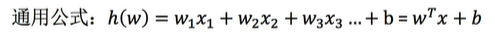

 ### 线性回归的特征与目标的关系分析

- 线性关系

  单变量线性关系

  多变量线性关系

  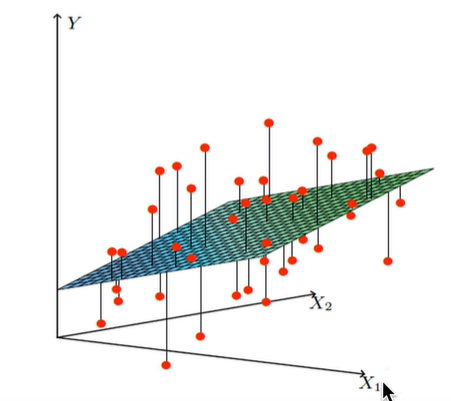

- 非线性关系

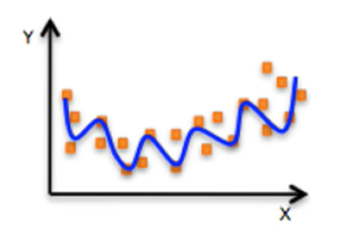

线性回归的“线性”是指模型对参数（即权重系数）是线性的，即每个权重参数都是一次的。

 ### 线性回归API

`sklearn.linear_model.LinearRegression()`

```py
from sklearn.linear_model import LinearRegression
```

​	`LinearRegression.coef_`：查看权重系数

### 求导

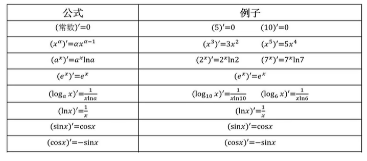

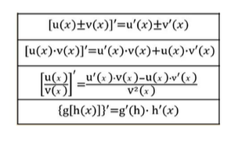

### 线性回归的损失和优化

#### 线性回归的损失函数

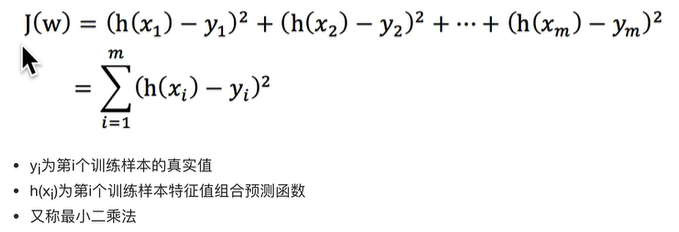

#### 使用正规方程对损失函数优化

- X为特征值矩阵，y为目标值矩阵。直接求到最好的结果
- 缺点：当特征过多过复杂的时候，求解速度慢且得不到结果

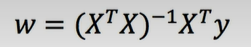

#### 使用梯度下降对损失函数优化

**梯度的概念：**

​	在单变量的函数中，**梯度是函数在某点切线的斜率**

​	在多变量的函数中，梯度是一个向量，向量有方向，梯度的方向指出了函数在给定点的**上升最快的方向**

**梯度下降法公式：**

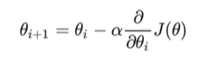

α表示学习率或者叫步长，θ是权重参数

**单变量梯度下降：**

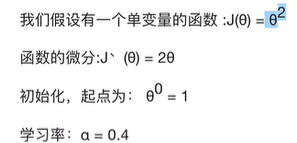

梯度下降的迭代计算过程：

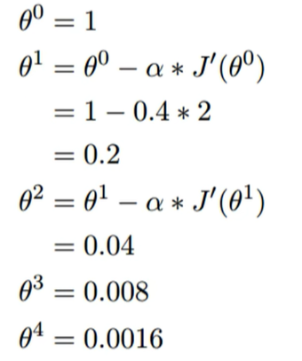

**多变量梯度下降：**

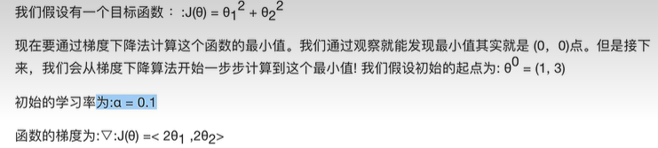

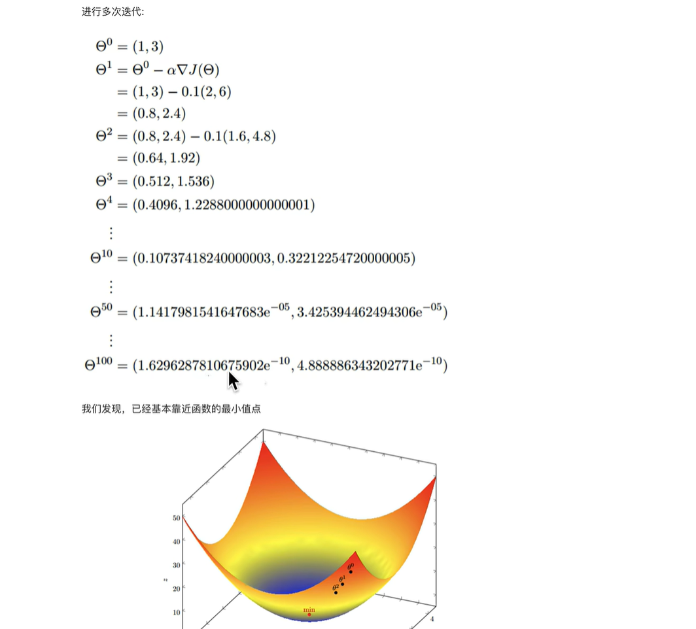


### 算法选择

小规模数据：

​	正规方程

​	岭回归

大规模数据：

​	梯度下降法