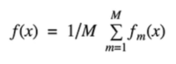
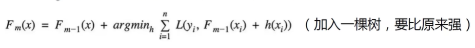

 集成算法

Bagging：训练多个分类器取平均（典型随机森林）

Boosting：从弱学习器开始加强，通过加权来进行训练

Stacking：聚合多个分类或回归模型（可以分阶段来做）

**Bagging模型**说白了就是并行训练一堆分类器

随机：数据采样随机，特征选择随机。

​	如果输入数据集一样，那产生的树都是一样的。所以**样本随机采样**，每个样本都有特征，把**特征也随机采样**

​	由于二重随机性，使得每个树基本上都不太一样，最终结果也会不一样

森林：很多个决策树并行放在一起

随机森林优势：

最大优势是可解释性非常强

可以处理一些高维特征，并且自动做了特征选择（特征好自动放前面了）

根据特征离根节点的距离，能得出featrue_important

树的个数

并不是越多越好，到了一定数目之后，性能就上下浮动了

**Boosting模型**

类似于串联

1000个东西，A树能预测到950，B树是要弥补A的不足，也就是目标是剩下的那50，加入B能预测到30，那C树目标就是剩下的那20

这种提升的感觉

相比于追求稳定的随机森林，这个更狠

加进来的如果性能下降，不允许加

典型代表：AdaBoost、XGBoost

AdaBoost会根据前一次分类的效果调整权重。如果某个数据在这次分错了，那么在下一次就给他更大的权重。每个分类器根据自身的准确性来确定各自的权重，再合体。目的是让他别再分错了

**Stacking模型**

