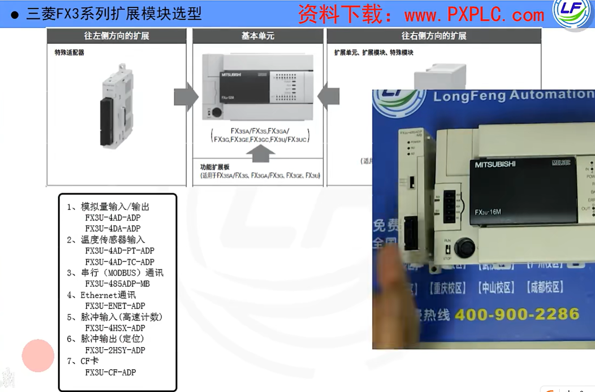

漏型：s/s接正

源型：s/s接负

FX3U继电器输出端子接线

FX3U晶体管漏型输出接线

常开：寄存器为1的时候，常开是闭合的

常闭：寄存器为1的时候，常闭是断开的

线圈：

​	线圈Y0前的回路接通，线圈Y0得电，对应的寄存器=1，接通对应的输出信号

​	线圈Y0前的回路断开，线圈Y0失电，对应的寄存器=0，断开对应的输出信号

常开触点按钮，未被按下时是开的，是0。按下时是闭的，是1.

常闭触点按钮，未被按下时是闭的，是1。按下时是开的，是0.

PLC编程就是把这些**逻辑开关**，根据控制要求，**串联**或者**并联**成控制电路，接通输出Y点

在控制过程中，需要对应功能时，增加额外功能(例如:需要采集压力时，增加模拟量模块，做定位时，增加定位模块)

而这些**逻辑开关**，就是整个控制的**主线**

置位指令、复位指令：

置位指令 在这里类似于自锁

置位指令一般用于当前只管通不管断的情况，在断的时候使用RST复位指令复位

INC为自加指令，程序执行一次D0自加1

上升沿（ldt x0) 脉冲是在按钮按下的时候执行一个扫描周期

下降沿（ldf x0）脉冲是在按钮弹起的时候执行一个扫描周期

除此之外还有 上升沿输出PLS和下降沿输出PLF

延时器：

延时5秒触动Y0，X0断了，就复位清零

累计型定时器：

当定时器回路断时，不会复位清零

计时是累计的

断了之后Y0不复位
