### 按钮脚本

双击按钮

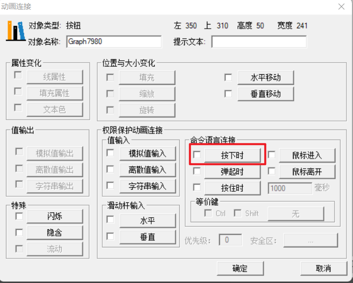

要实现的是点击之后跳转到另外一个画面，使用的是`ShowPicture`函数

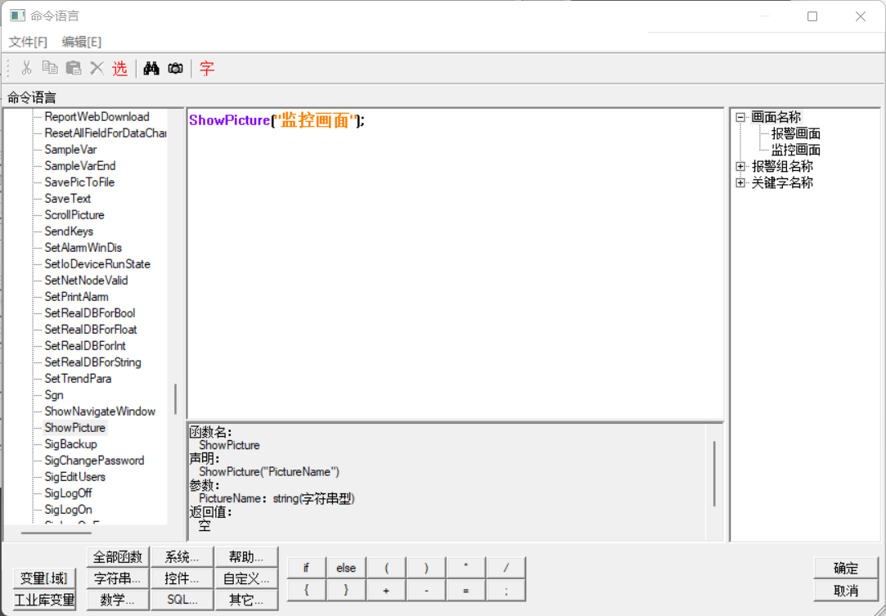

### 指示灯

#### 点动

先在数据词典里面添加“内存离散”型变量

在左下角”变量“中选择”一号灯“：

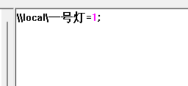

**这种在每个按钮里面写脚本的方法并不是最好的，工程变大之后修改起来很麻烦**

另外的方法：

新建一个变量 叫做“一号灯开关“

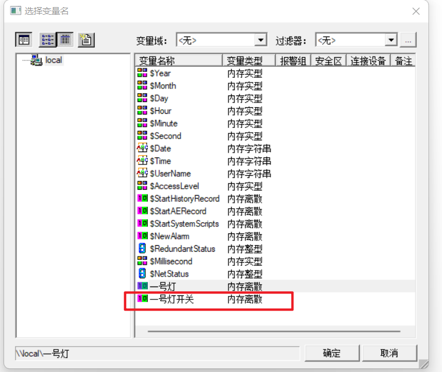

按下时：

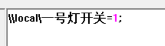

弹起时：

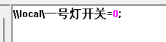

画面属性-命令语言：

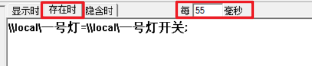

把“一号灯开关”的值赋值给“一号灯”

按下为1，松开为0

#### 长动

新建两个变量（还有“二号灯”变量）

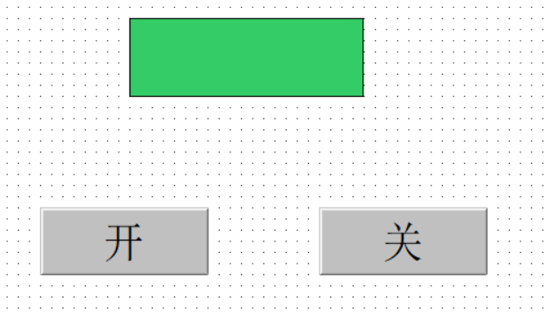

开按钮按下时：

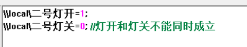

关按钮同理：

灯的填充属性：

页面的命令语言：

实现了：点击“开”，灯变成蓝色；点击“关”，灯变成红色

#### 字指示灯

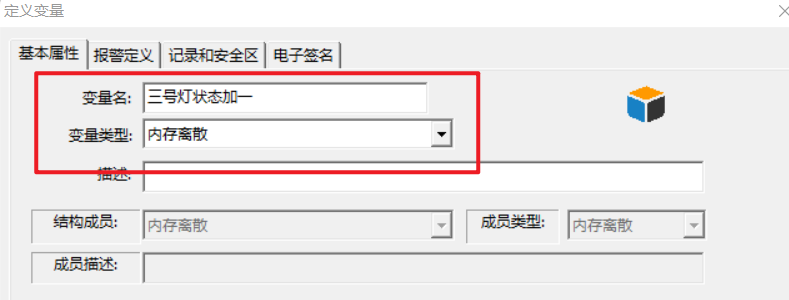

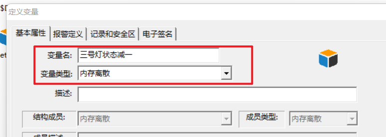

+按钮按下时：

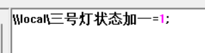

弹起时，三号灯状态加一=0；（不写这个的话，按下之后状态会一直加一）

-按钮按下时：

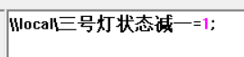

弹起时，三号灯状态减一=0；

灯的填充属性：

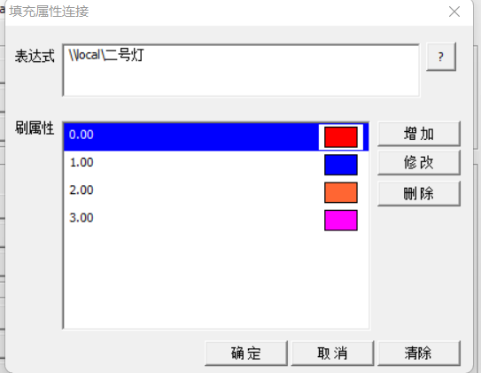

画面属性-命令语言：

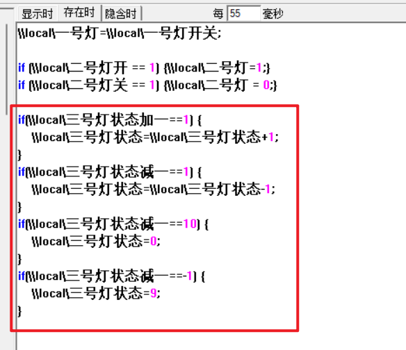