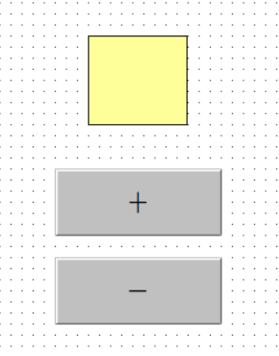

### 按钮脚本

双击按钮

要实现的是点击之后跳转到另外一个画面，使用的是`ShowPicture`函数

### 指示灯

#### 点动

先在数据词典里面添加“内存离散”型变量

在左下角”变量“中选择”一号灯“：

**这种在每个按钮里面写脚本的方法并不是最好的，工程变大之后修改起来很麻烦**

另外的方法：

新建一个变量 叫做“一号灯开关“

按下时：

弹起时：

画面属性-命令语言：

把“一号灯开关”的值赋值给“一号灯”

按下为1，松开为0

#### 长动

新建两个变量（还有“二号灯”变量）

开按钮按下时：

关按钮同理：

灯的填充属性：

页面的命令语言：

实现了：点击“开”，灯变成蓝色；点击“关”，灯变成红色

#### 字指示灯

+按钮按下时：

弹起时，三号灯状态加一=0；（不写这个的话，按下之后状态会一直加一）

-按钮按下时：

弹起时，三号灯状态减一=0；

灯的填充属性：

画面属性-命令语言：

### 旋转

#### 旋转 点动控制

创建变量：

1、电机正转 内存离散 绑定到电机

2、电机位置 内存整数 最小值设置为-1

放两个按钮：正转 反转

正转按钮，按住时 ：

扫描

反转按钮也是一样

#### 长动

定义变量：

正转按钮 内存离散

反转按钮 内存离散

正转输出 内存离散

反转输出 内存离散

停止按钮 内存离散

正转长动按下时：

弹起时：

其他按钮也是一样

画面命令语言：

按下正转按钮之后，正转输出保持为1，持续旋转

**控制速度**

创建变量：速度 内存整数

画面语言：

### 小车移动

新增变量：

小车位置 内存整数 最大值100

对应值和实际移动像素距离是不一样的：

对应值就是“小车位置”变量，从0-100

实际像素位置的计算需要创建一个变量“小车位置像素距离”

画面语言：

然后绑定

### 位传感器的模拟

创建变量：门位置 内存整数 最大值100

左边这扇门：

右边这扇门：

开按钮按住时：（关按钮同理）

**开限位模拟：**

门位置是100的时候变红：

### 

