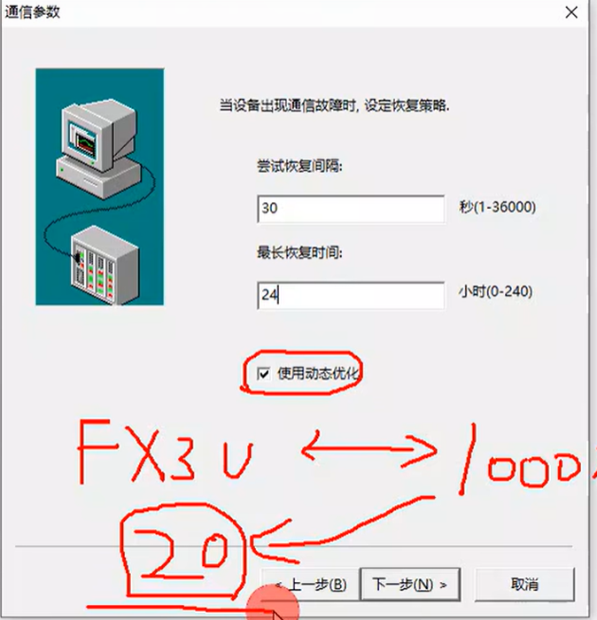
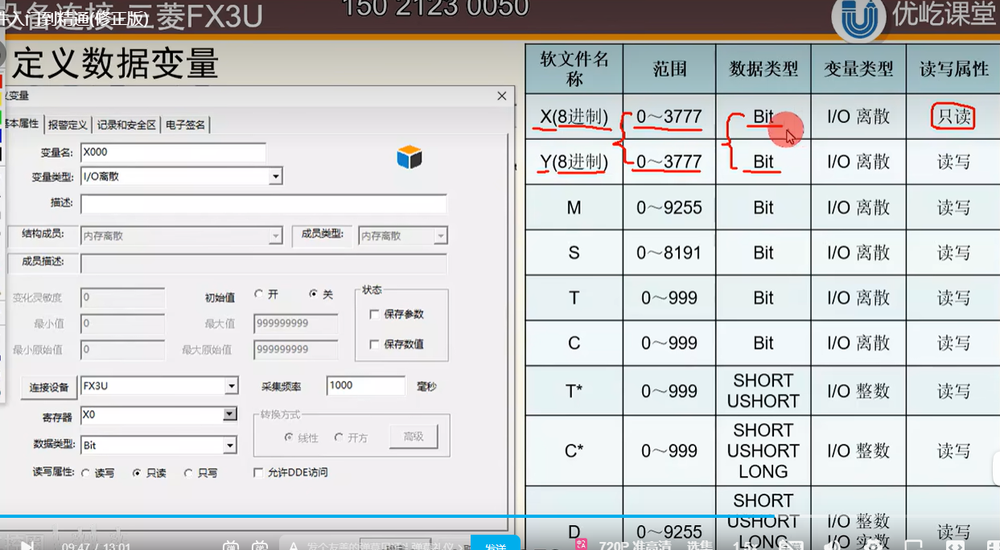

### 外部设备定义

如果是串行通信 设备地址就是0-255

如果是以太网通信端口，就要设置以太网的IP地址及通讯端口号

动态优化：如果只有20个变量发生变化，剩下的980个不发生变化，就只关注这20个

### 基本数据类型

IO变量：可以和外部的数据采集程序直接进行数据交换的变量，如PLC中的输入、输出、数据寄存器中的变量

内存变量：从PLC中获取到的数据，运算完之后，还是要存到PLC中去，但运算过程中产生的值可以存在组态王软件中的，通过组态王中的内存变量。

变量的数据类型：

​	实型变量：浮点数

​	离散变量：0/1 PLC中的位变量

​	字符串型变量：

​	整数变量：

​	结构变量：

short 16位 整数

ushort 16位 无符号整数

BCD BCD码 4位

LONG 32位

### 组态王与三菱PLC FX3U

使用FX3U的编程电缆连接PLC与PC机，在GX Works2软件中设置FX3U的编程口通讯参数，通讯下载项目程序

FX3U下载线：USB-SC09-FX

