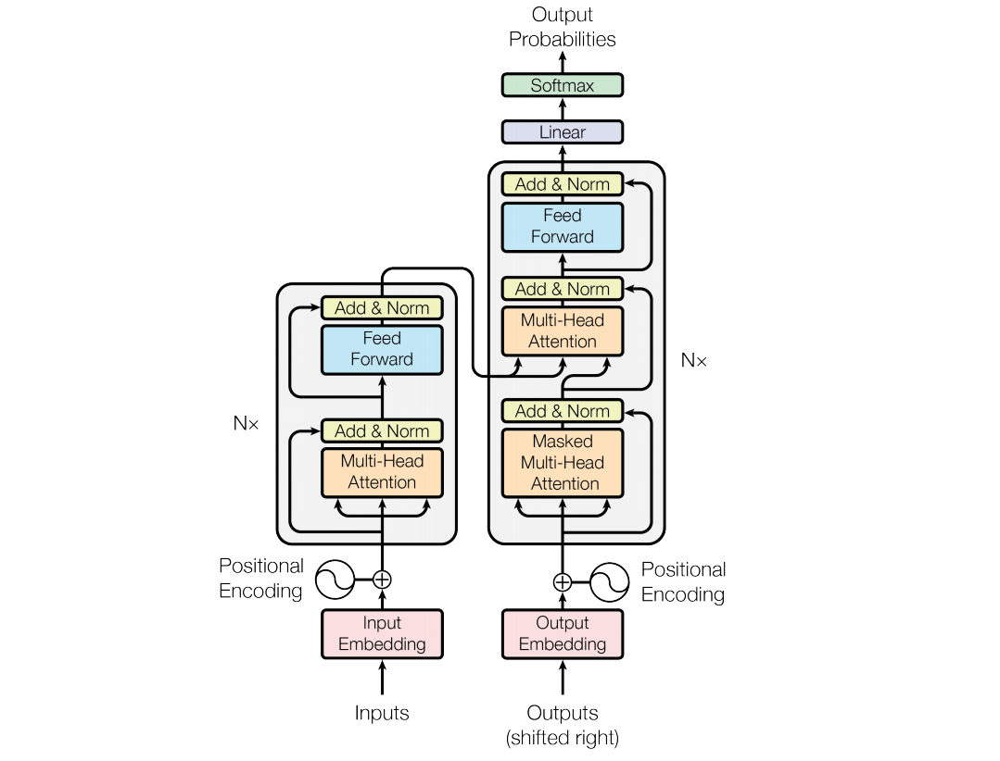
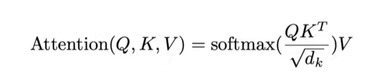
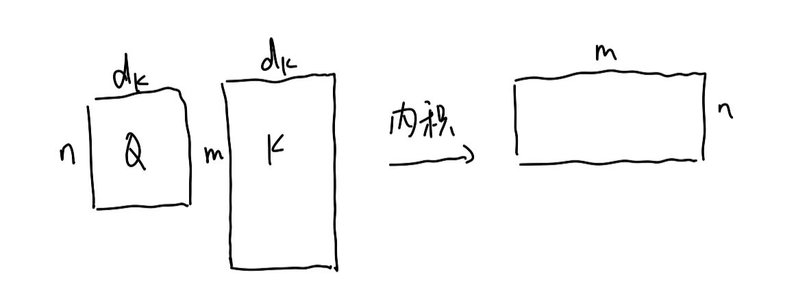

## Encoder：

编码器由6个完全相同的层构成，每层有两个子层。第一个是一个多头自注意力机制，第二个是一个全连接前馈网络。每两个子层之间有残差连接。每层的输出这样表示`LayerNorm(x + Sublayer(x))`。为促进残差连接，每个子层，包括embedding层的输出都是512维。

## Decoder：

解码器也由6个相同的层组成，每层除了有两个子层，不一样的是，解码器里面用了第三个子层，起多头自注意力机制的作用，每个子层之间残差连接，然后是layer norm。另外在解码器的时候它做的是自回归，也就是说当前的输出的输入集是之前时刻的输出，意味着在做预测的时候不能看到之后的那些时刻的输出。但是在注意力机制里面我们知道它每次能看到一个完整的输入，所以在这个地方要避免这种情况的发生，也就是在解码器训练的时候在预测第t个时刻的输出的时候不应该看到t时刻以后得输出。解码器这里的做法是通过一个带掩码的注意力机制，以此保证训练和预测时的行为是一致的。

## Transformer使用的Attention是：Scaled Dot-Product Attention

query和key维度都是d_k，value维度是d_v，计算dot product然后除以根号下d_k，softmax之后（对每一行做softmax）再乘以v

query的个数可能和你的key value的个数是不一样的，但是query和key的维度是一样的：

