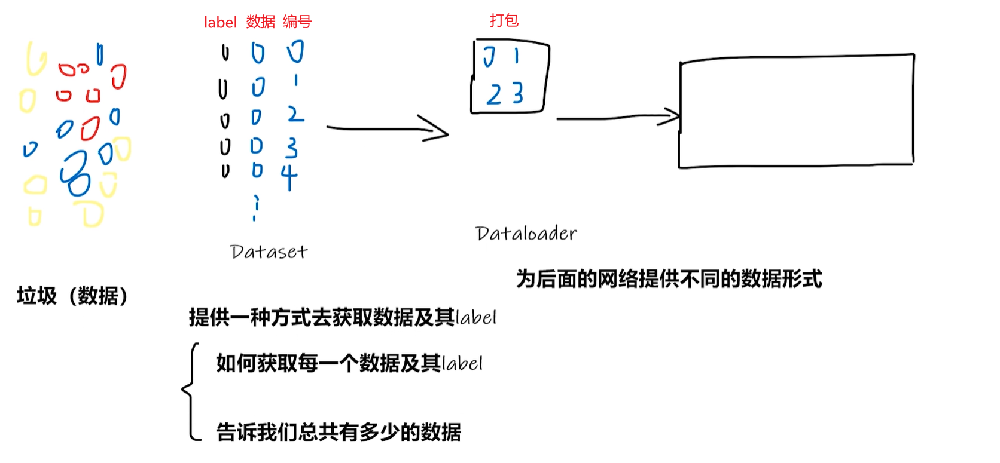

## dir()、help()

anaconda创建虚拟环境：

```
conda create -n pytorch python=3.6
conda activate pytorch
```

pytorch学习中两大法宝：dir()、help()


一个工具箱，这个工具箱叫做pytorch。里面有1/2/3/4 4个分区，1里面还有小箱子需要打开，而2分区可以直接拿出来工具使用

dir()：打开，看见 

help()：说明书

dir(pytorch) 输出：1 2 3 4 

dir(pytorch.3) 输出 a b c 

help(pytorch.3.a) 输出：将此扳手放在特定地方，然后拧动

## 加载数据初认识



```py
from torch.utils.data import Dataset
from PIL import Image
import os

class MyData(Dataset):
    def __init__(self, root_dir, label_dir):
        self.root_dir = root_dir
        self.label_dir = label_dir
        self.path = os.path.join(root_dir, label_dir)
        self.img_path = os.listdir(self.path)

    def __getitem__(self, idx):
        img_name = self.img_path[idx]
        img_item_path = os.path.join(self.root_dir, self.label_dir, img_name)
        img = Image.open(img_item_path)
        label = self.label_dir
        return img, label

    def __len__(self):
        return len(self.img_path)
        

```

