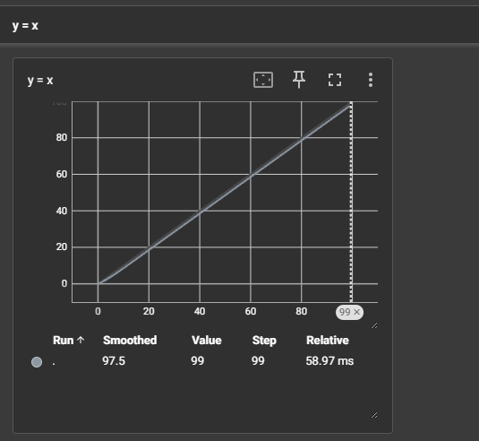
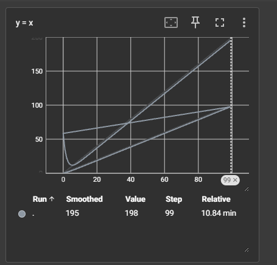
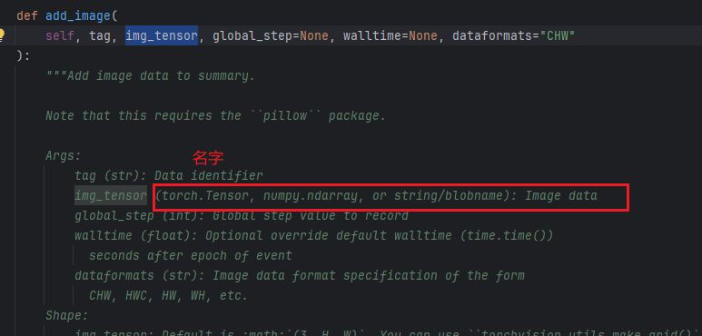
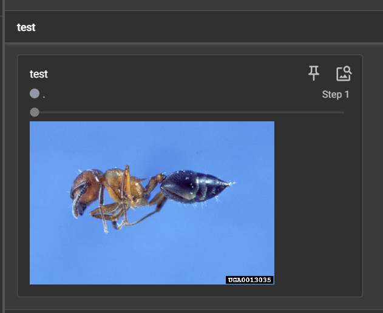

## tensorboard 绘制图表

```py
from torch.utils.tensorboard import SummaryWriter

writer = SummaryWriter("logs")
# writer.add_image()

# global_step 对应x轴， scalar_value对应y轴
for i in range(100):
    writer.add_scalar("y = x", i, i)
    # 如果是绘制y = 2x
    # write.add_scalar("y = 2x", 2*i, i)

writer.close()
```

运行之后项目文件夹中会出现一个logs文件夹，下有文件

打开tensorboard：` tensorboard --logdir=logs `等号前后不能有空格



当这样写时：（忘记修改y=x）

```py
for i in range(100):
    writer.add_scalar("y = x", 2*i, i)
```

图像会变成这样：



把y=x改成y=2x之后出现的新图会正常

___

## 向tensorboard添加图像

```
writer.add_image()
```

去看定义：



image支持这四种类型

```sh
img_path = "hymenoptera_data/train/ants/0013035.jpg"
from PIL import Image
img = Image.open(img_path)
print(type(img))
<class 'PIL.JpegImagePlugin.JpegImageFile'>
```

可以看到我们的图片并不是要求的那四种类型

转为numpy类型：

```sh
import numpy as np
img_array = np.array(img)
print(type(img_array))
<class 'numpy.ndarray'>
```

程序：

```py
from torch.utils.tensorboard import SummaryWriter
import numpy as np
from PIL import Image

writer = SummaryWriter("logs")
img_path = "hymenoptera_data/train/ants/0013035.jpg"
img_PIL = Image.open(img_path)
img_numpy = np.array(img_PIL)

writer.add_image("test", img_numpy, 1)

# global_step 对应x轴， scalar_value对应y轴
for i in range(100):
    writer.add_scalar("y = x", 2*i, i)

writer.close()
```

这样运行是报错的

add_image方法里面有说明：

```py
Shape:
            img_tensor: Default is :math:`(3, H, W)`. You can use ``torchvision.utils.make_grid()`` to
            convert a batch of tensor into 3xHxW format or call ``add_images`` and let us do the job.
            Tensor with :math:`(1, H, W)`, :math:`(H, W)`, :math:`(H, W, 3)` is also suitable as long as
            corresponding ``dataformats`` argument is passed, e.g. ``CHW``, ``HWC``, ``HW``.
```

我们的图像的shape是：(512, 768, 3) 即HWC

所以应该改成`writer.add_image("test", img_numpy, 1, dataformats='HWC')`

