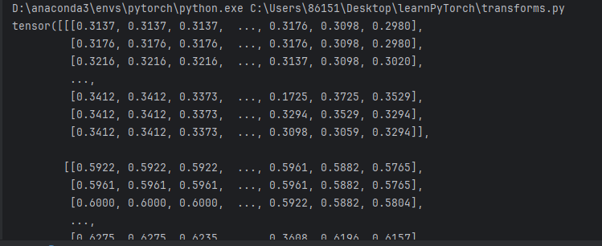
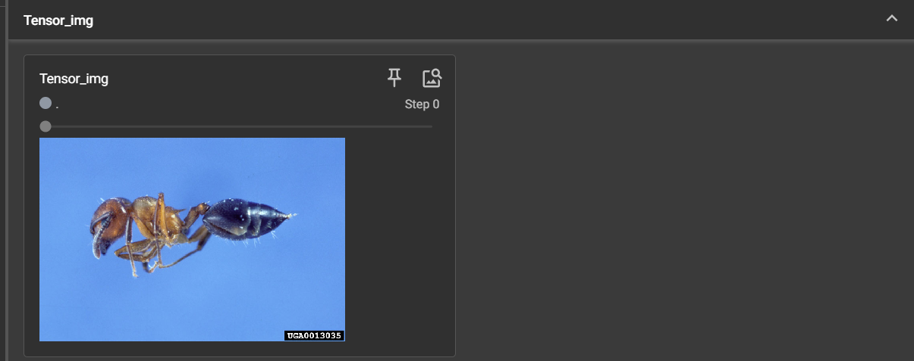
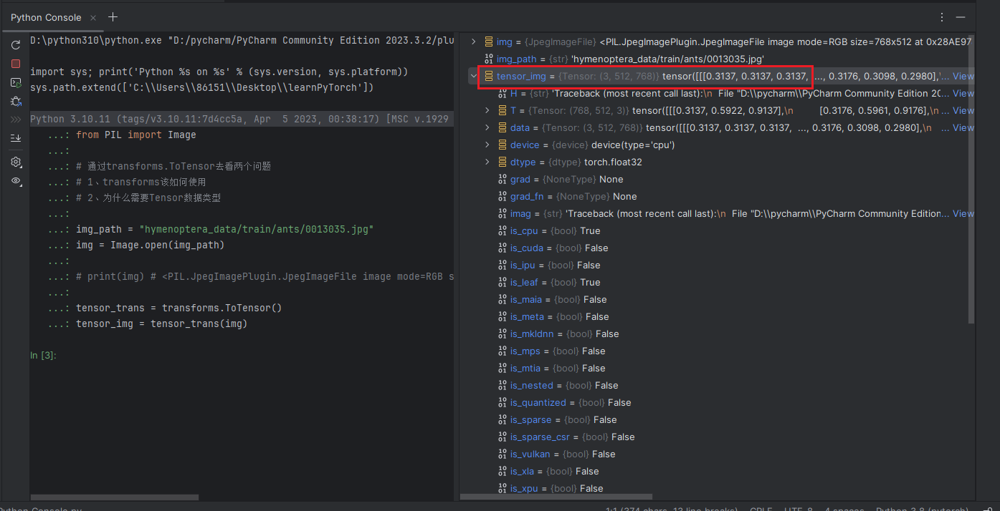
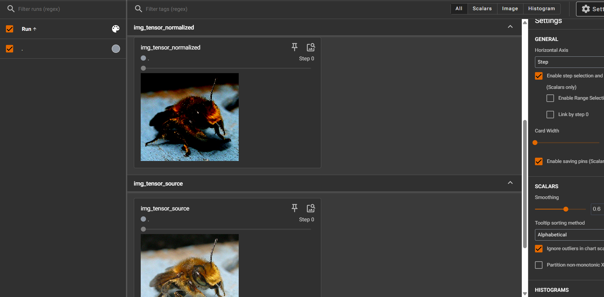

transforms：对图像进行变换

## transforms该如何使用

“Convert a PIL Image or ndarray to tensor and scale the values accordingly”

```python
from torchvision import transforms
from PIL import Image

img_path = "hymenoptera_data/train/ants/0013035.jpg"
img = Image.open(img_path)

# print(img) # <PIL.JpegImagePlugin.JpegImageFile image mode=RGB size=768x512 at 0x1F629ED1E80>

tensor_trans = transforms.ToTensor()
tensor_img = tensor_trans(img)
print(tensor_img)
```



opencv读图片是numpy类型：

用opencv的读法：

```py
import cv2
cv_img = cv2.imread(img_path)
```

把tensor类型的图片加入tensorboard：

```py
writer = SummaryWriter("logs")
writer.add_image("Tensor_img", tensor_img)
writer.close()
```



## 为什么需要Tensor数据类型



可以看出，图片转为tensor数据类型之后，它下面的属性都是和神经网络训练有关的。

## 常见的transforms

### 什么是内置函数`__call__`：

```py
class Person:
    def __call__(self,name):
        print("__call__"+name)

    def hello(self,name):
        print("hello"+name)
        
person = Person()
person("张三") # 通过__call__输出
person.hello("李四") # 通过hello()输出

__call__张三
hello李四
```

### Normalize(object)：

输入的是一个tensor的image，进行归一化

```py
from PIL import Image
from torch.utils.tensorboard import SummaryWriter

from torchvision import transforms

img = Image.open("hymenoptera_data/train/bees/16838648_415acd9e3f.jpg")
print(img) # <PIL.JpegImagePlugin.JpegImageFile image mode=RGB size=500x450 at 0x1F2F65B0760>

# 转换为tensor
trans_totensor = transforms.ToTensor()
img_tensor = trans_totensor(img)
# 加入tensorboard
writer = SummaryWriter("logs")
writer.add_image("img_tensor_source",img_tensor)

# normalize
trans_norm = transforms.Normalize([0.5,0.5,0.5], [0.5,0.5,0.5])# 第一个参数是均值，第二个参数是标准差
img_norm = trans_norm(img_tensor)
# 加入tensorboard
writer.add_image("img_tensor_normalized", img_norm)

writer.close()
```

可以看出归一化前后图片是有区别的：



归一化计算公式：

input[channel] = (input[channel] - mean[channel]) / std[channel]

如果input是[0,1]，均值是0.5，标准差是0.5，那么结果是[-1,1]

如果input是[0,1]，均值是0，标准差是1，那么结果是[0,1]

### Resize

Resize the input image to the given size

```py
from PIL import Image
from torch.utils.tensorboard import SummaryWriter

from torchvision import transforms

img = Image.open("hymenoptera_data/train/bees/16838648_415acd9e3f.jpg")

# normalize
trans_norm = transforms.Normalize([0.5,0.5,0.5], [0.5,0.5,0.5])
img_norm = trans_norm(img_tensor)
# 加入tensorboard
writer.add_image("img_tensor_normalized", img_norm)

输出：
(500, 450)
<PIL.Image.Image image mode=RGB size=512x512 at 0x1A0BE3421C0>
```

Resize之后还是PIL的数据类型，可以ToTensor之后加入tensorboard

```py
# 加入tensorboard
image_resize = trans_totensor(img_resize)
writer.add_image("image_resize", image_resize)
```

### compose

```py
# compose
trans_resize_2 = transforms.Resize(512) # 将图像缩放到短边为 512 像素，同时保持原始的宽高比
trans_compose = transforms.Compose([trans_resize_2, trans_totensor]) # 所有变换按列表中的顺序进行，先裁剪再totensor
img_resize_2 = trans_compose(img)
writer.add_image("img_resize_2", img_resize_2)
```

