## 自注意力机制

把每个句子拆分成最小的语义单位，也就是token

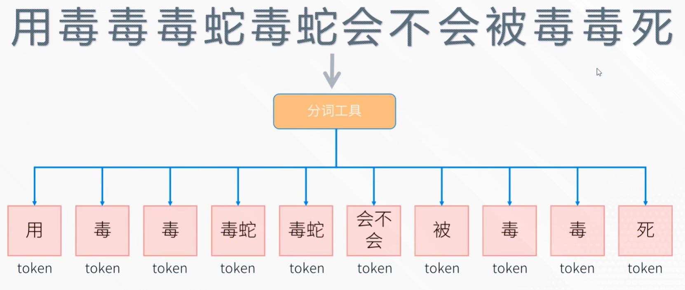

每一个token会被编码成一个512维(256 128)的向量（[1.2, 0.3, -0.6, ... , 1.8] 512维），因为这些词向量是同时输入给模型的，所以模型本身无法判断它们的先后顺序，因此还需要给每个词向量加上一个位置编码，以此告诉模型这些词在整个句子中的顺序

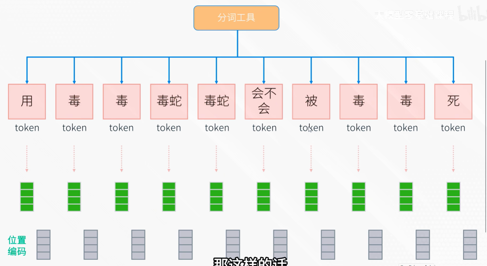

这样的话我们就可以得到一个10x512的词向量组，用变量X表示——词向量组X(10*512)

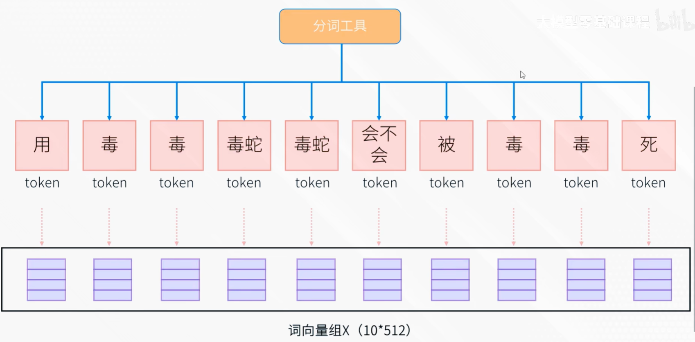

模型又应该怎么通过X找出每一个词之间的联系呢？答案就是让他们相互去进行计算，为了实现这一点，模型首先会用三个权重矩阵分别和每个词向量进行相乘，那么每个token就能够得到三个向量Q K V，

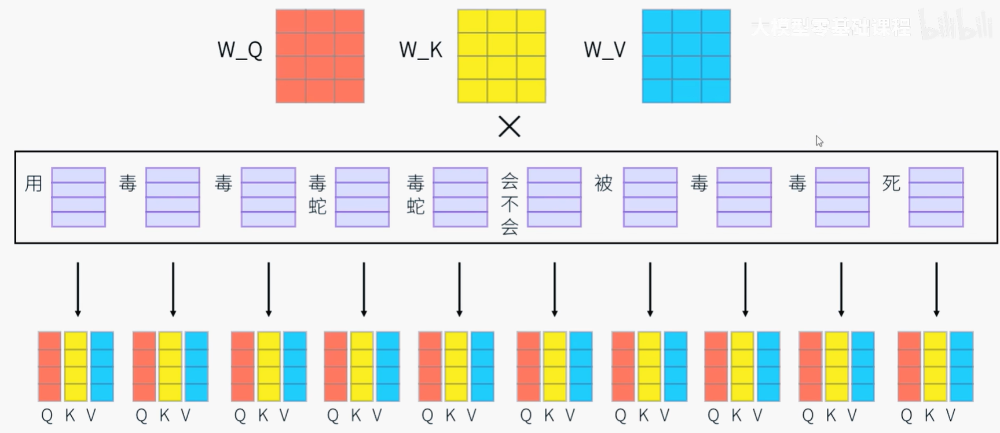

Q代表查询向量，代表当前这个词它想关注什么；K表示键向量，表示它能为其他词提供什么信息（类似于标签或索引）；V是值向量，代表这个词实际包含的信息内容，它是真正被检索和聚合的信息本身 

接下来模型将每个词的Q向量分别和这个句子中每个词的K向量进行相乘（点积），为了使结果显得更合理，会把结果除以一个常数D_k，它代表向量的维度，用来防止梯度爆炸。这样的话我们就能得到一组注意力分数：

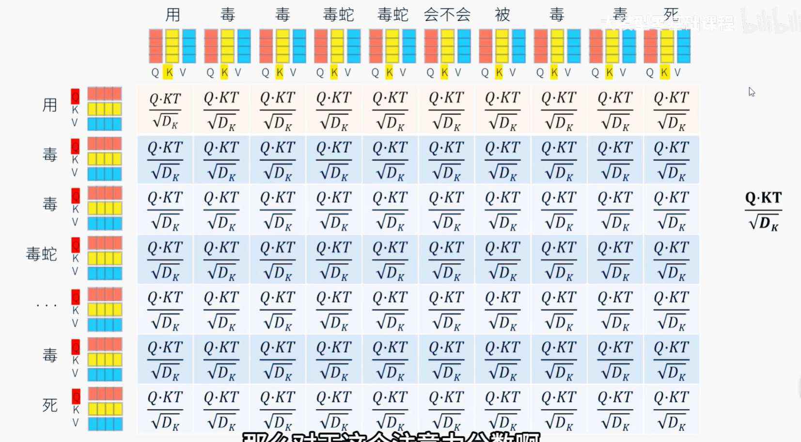

再套上一层softmax函数，就能得到一组注意力权重：

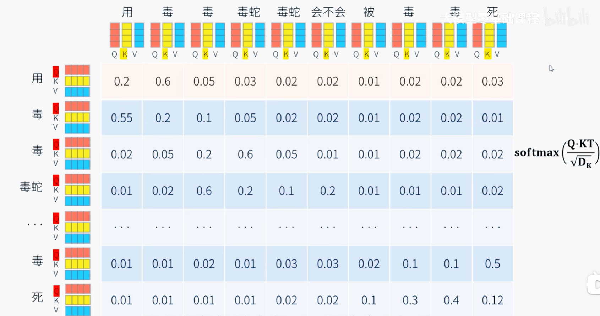

权重代表当前词和其他每一个词的关联程度，例如第一个“用”字和第一个“毒”字的权重更高，而和第二个“毒”字的权重较低

接下来会把每个词的V向量和它对应的注意力权重进行相乘，再进行加权求和，得到一组新向量

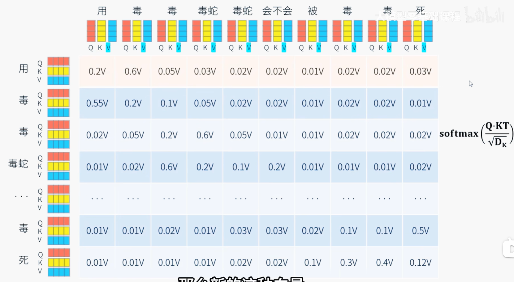

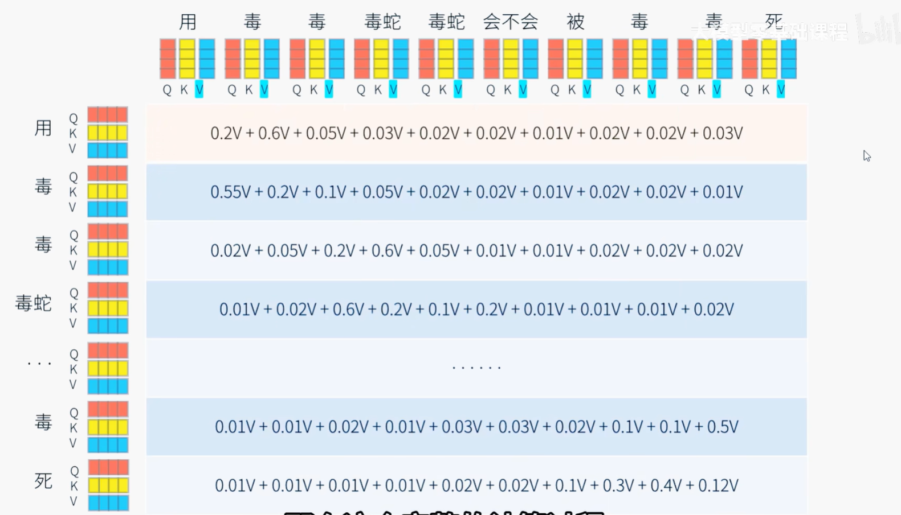

这个新向量就能去包含句子当中的每一个词对其他词含义的理解

整个完整的计算过程称之为自注意力机制——自己和自己产生注意力，什么含义？

## 多头自注意力机制

举个例子：

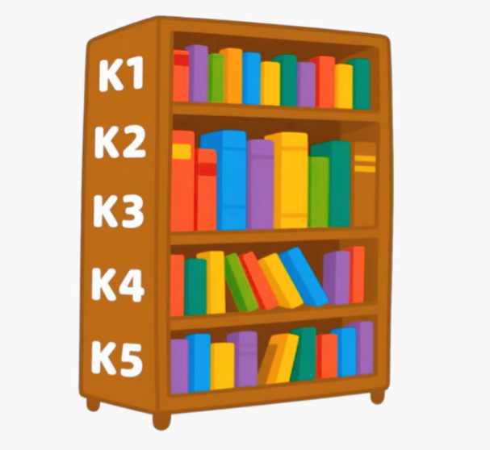

你带着问题Q进入图书馆，然后去和图书馆里的所有图书标签K进行匹配，匹配度最高的书说明它的内容最可能解决我们的问题，那对它的关注度就是最高的，于是开始花更多时间阅读它的内容V，而对于关注度较低的书，则花较少的时间进行阅读。当阅读完走出图书馆的时候，就完成了对知识的整合，你带走的新的知识就已经包含了你对这些书的理解

同理，自注意力计算之后每个token都会产生对其他token的抽象理解，这种理解其实就藏在了经过了加权的向量当中（暂时称为向量Z）。然而这种理解仍然不够深入，因为自注意力机制往往只能让一个词对其他词产生单一的关注和理解，但在现实中一个句子里的词语往往会具有多方面的语义信息，例如：

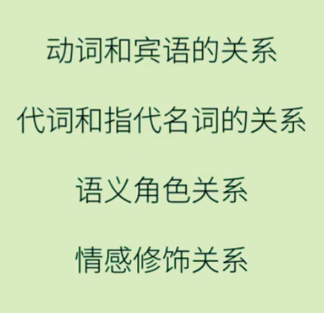

因此只进行一次自注意力计算会显得有些局限，于是Transformer干脆将最初的输入向量X拆分成8个头，那么原本512维的X向量就被拆分成8个64维向量

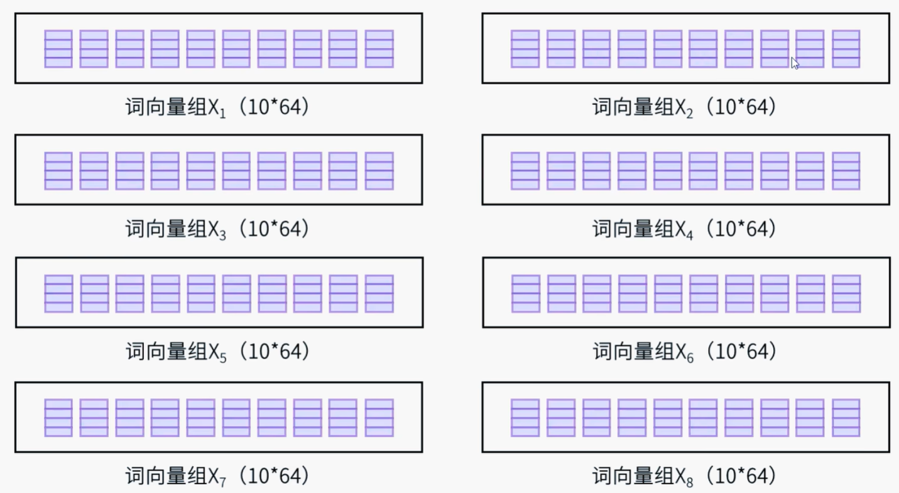

自注意计算也由这8个头独立进行，最后再将这8个计算的结果拼接起来

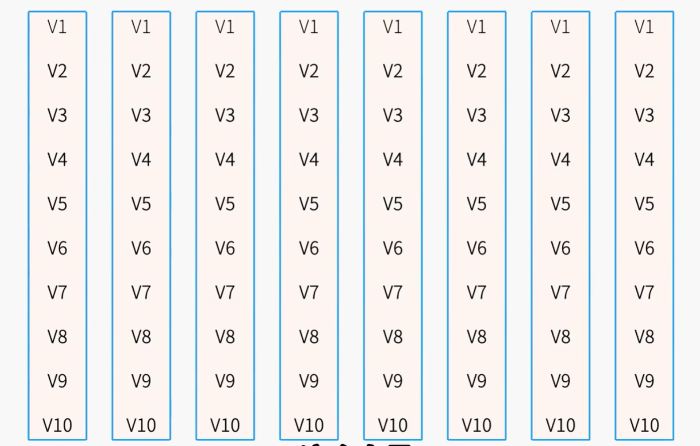

这是向量Z就包含了8个头独立计算的结果，能从多个角度整合复杂的语义信息

这是多头自注意力机制

但这也不够，一个多头自注意力机制理解一个句子还可以，理解一段话或者一篇文章就不行了，因此一般多层：

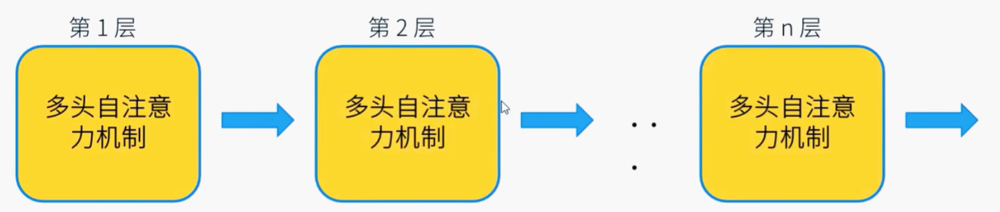

## 编码器

多层神经网络必然会带来一个问题：梯度消失

在深层网络里，某一层的最优变换若是“恒等映射”（即希望输出≈输入），传统结构必须让 F(x) 强行学到 x 本身。当 F(x) 近似 0 时，前向信息被阻断，反向梯度也因链式连乘而指数衰减，出现梯度消失，看上去只有靠后的层在更新。残差网络把这一层的输出改成 F(x)+x：前向多了一条“捷径”，即使 F(x)=0 也能无损传递 x；反向时梯度至少保留“+1”项，使前端层总能收到更新信号。于是网络只需把 F(x) 学成 0 即可完成恒等映射，既避免了信息丢失，又提供了不经过权重矩阵的梯度高速通道，这就是 ResNet 的核心思想。

因此我们在多头自注意力层后面加上残差网络，用来保证深层网络的训练稳定性，然后我们还需要对每一层输出的值进行归一化，让向量中的数值保持在一个合理的范围内

归一化后的输出向量，我们称之为A，

接下来还需要在每一层加入一个前馈神经网络，他会对A向量中的每一个元素使用激活函数去进行非线性变换（因为在之前的计算当中，无论多复杂，函数的输出结果本质上还是线性的）

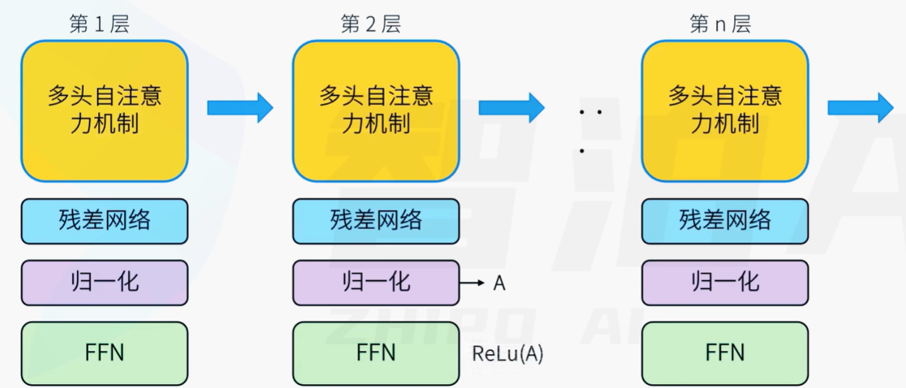

在经过FFN之后，出于同样的目的（稳定训练），再加一个残差网络和归一化层，经过N层这样的结果之后，最终输出一个向量X_out

 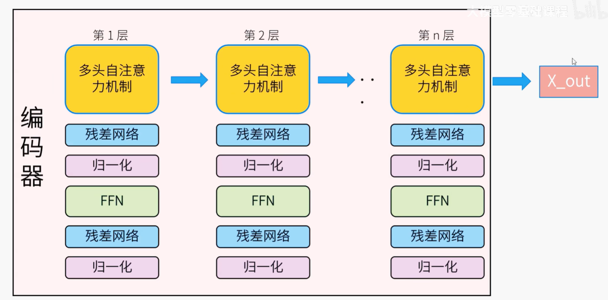

编码器的主要功能是 负责去理解我们输入的语言。现在我们已经理解了输入的句子了，接下来就要根据我们的理解来生成对应的翻译，负责生成的模块就叫做解码器

## 解码器

解码器会接受两个输入，第一个是用于“瞻前”的内容，也就是编码器的输出X_out，第二个是用于“顾后”的，已生成的单词序列。

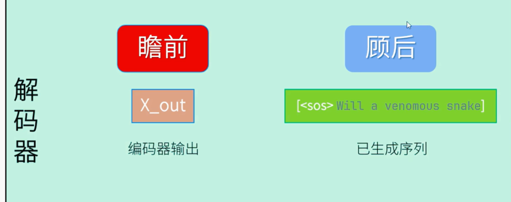

模型是逐个生成单词的，每生成一个新的单词，都要把之前已经生成的整个序列重新输入解码器，以此来预测下一个token。如果模型还没有生成任何的token，那就先把一个起始符`[<sos>]`输入进去。然后输入的向量首先会进入掩码多头自注意力机制层，

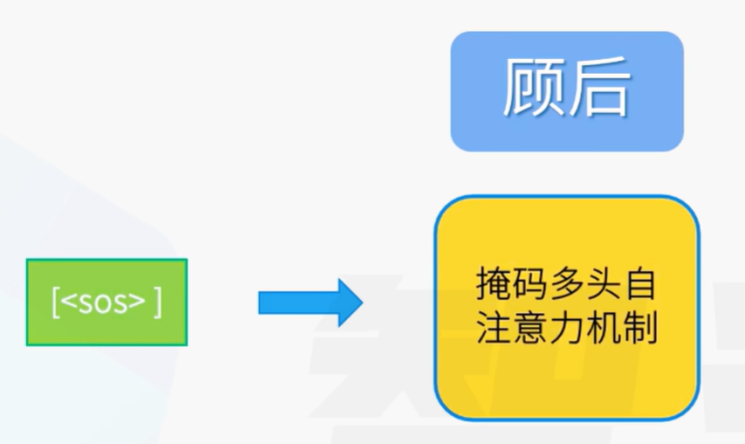

这个掩码多头自注意力机制的计算的之前的多头自注意力基本是一致的，都是对输入的每一个token计算他们之间的注意力权重

**掩码：**

