## 基础RNN介绍

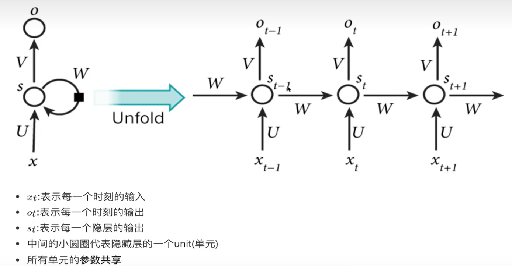 

s_{t} 是隐层的输出，传递到不同的时刻当中

U、V、W 是参数，共享于所有的cell

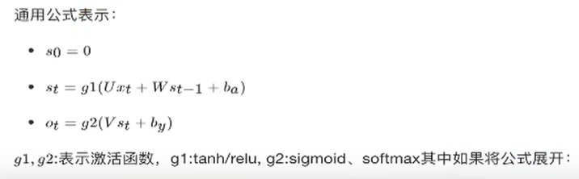

每一个cell有两个输入：**前一个cell的状态**和**当前序列的输入**

每一个cell有两个输出：**当前cell的状态**和**cell的预测输出**

输出受到前面隐层状态影响

## 序列生成案例

通常对于整个序列，给一个开始和结束标志，中间加上你整个文字序列

```
start 我 昨天 上学 迟到 了 end
```

分好词之后，我把它输入到网络当中，每一个时刻代表每一个词的输入，那么输入到网络当中的是每一个分词的结果

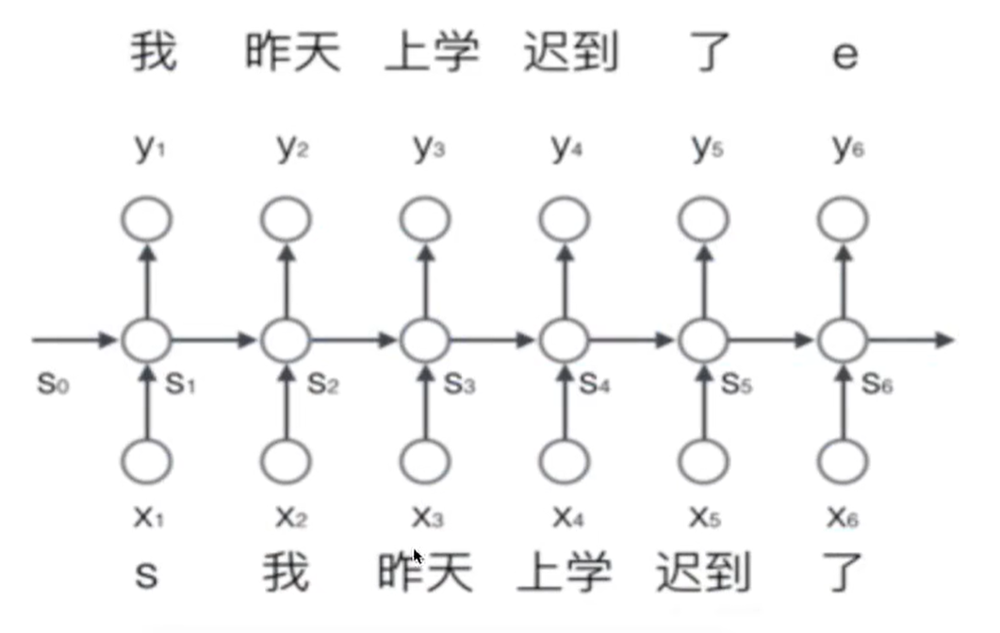

即，“S”输入进去之后，会输出一个“我”，“我”输入进去之后，会输出一个“昨天”

当然输入的并不是一个词进去，输入的是词的向量表示

### 词的表示

建立一个包含所有序列词的词典（包含开始和结束两个标志的特殊词，以及没有出现过的词等），每一个词都用一个N维的one-hot编码表示，N是词典中包含的词的个数

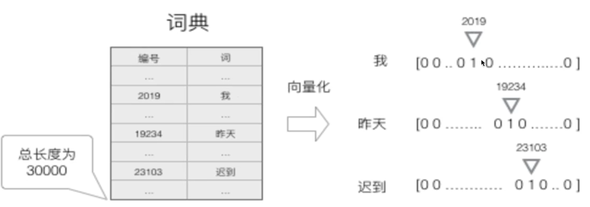

那么网络训练到底训练的是什么呢？一个词输入进去，包括前面的状态输入，然后输出一个结果，这个结果是什么呢？其实就是结果预测，我这个词输入进去到底能得到哪个词呢？输出其实输出的就是预测结果的概率

### 输出的表示——softmax

RNN这种模型，每一个时刻的输出是下一个最可能的词，可以用概率表示，总长度为词的总数长度


输入了我之后，计算下一个词是昨天的概率是多少，下一个词是上学的概率是多少，是迟到的概率是多少，是了的概率是多少

P(昨天, 上学, 迟到, 了 | 我)

如果“昨天”的概率最大，那这里就输出的是昨天

后面输入的是“昨天”，那就是计算P(上学, 迟到, 了, 我|昨天)

后面也是，每一个时刻的输入都会预测下一个时刻的输出结果

如果是有30000个词，那结果的长度就是30000，即：每一个时刻的输出是所有词的概率组成的向量

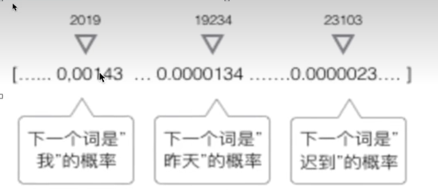

使用softmax来计算概率

### 矩阵运算表示


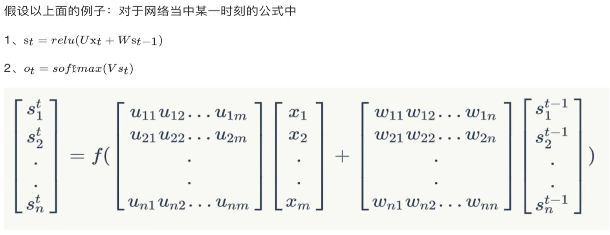

假如有m个词，那x_{t}就是m长度，每一个时刻输入进入的x长度都是m，也就是说假如有3000个词，那每一次输入进去的向量的长度就是3000

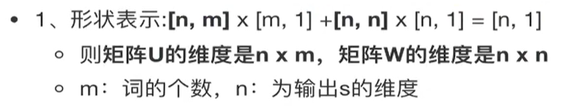

m是词库中词语的个数，这样one-hot编码之后就是个m维的向量，然后n其实是隐藏层神经元的个数

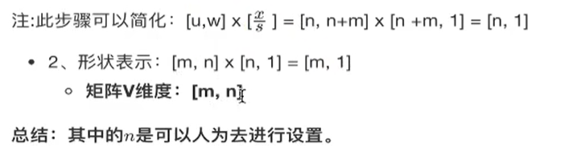

V 是 [m,n]，

s_{t} 是 [n,1]，

o_{t} 是 [m,1]

n是认为指定的一个长度，通常用来指定cell的状态输出大小

### 交叉熵损失

一整个序列（一个句子）作为一个训练实例，总误差就是各个时刻词的误差之和

对一个词，它的交叉熵损失：

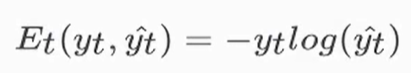

`y_{t}`是时刻t上真实值（正确的词）， `y_{t^}`是预测出来的词（概率值）

如果是t个时刻，有t个词：

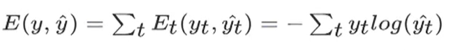

___

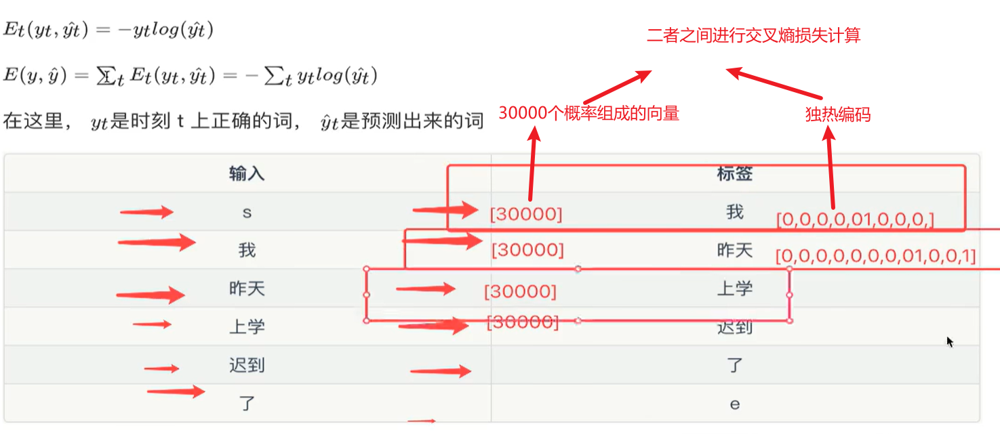

6个交叉熵损失求和

## 时序反向传播算法（BPTT）

我们的目标是计算误差关于参数U、V和W以及两个偏置bx, by的梯度，随后使用梯度下降法学习出好的参数，由于这三组参数是共享的，我们需要将一个训练实例在每个时刻的梯度**相加**。