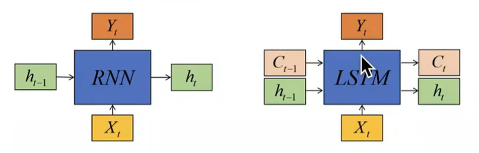
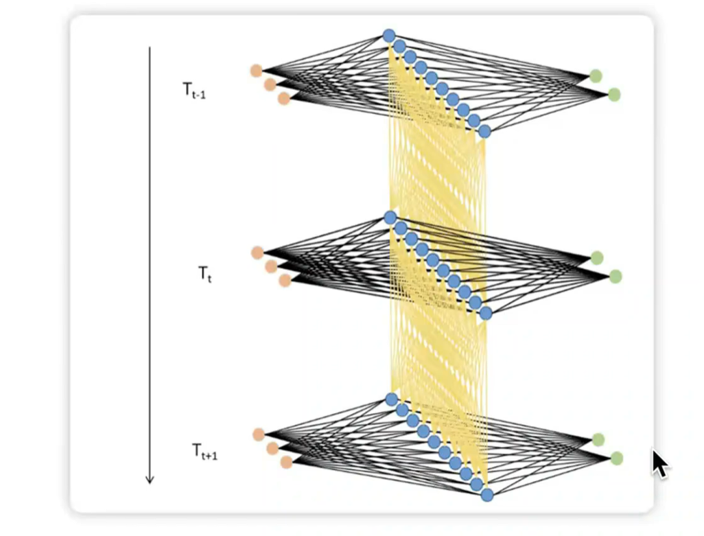
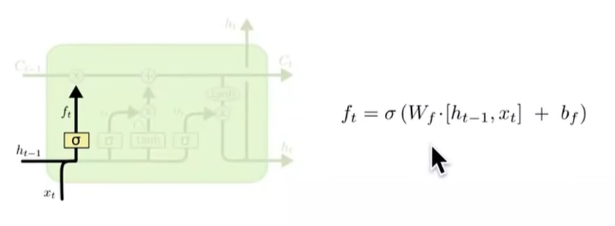
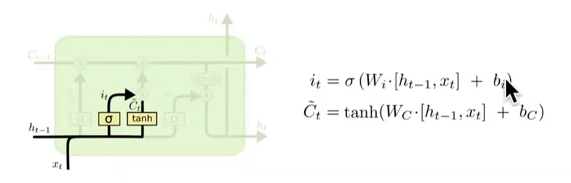
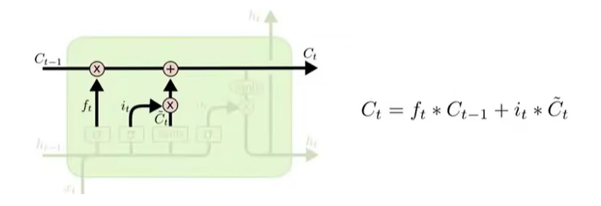
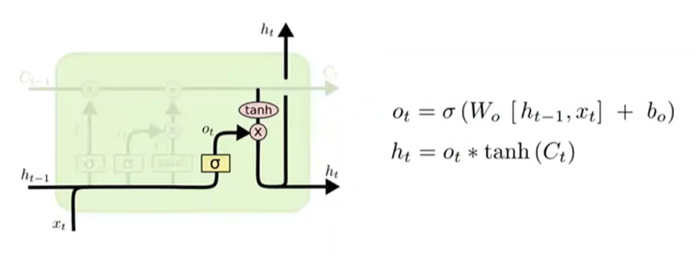
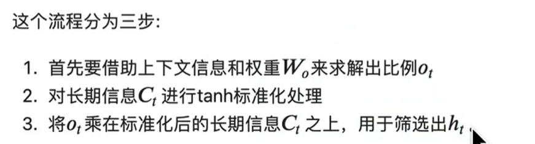
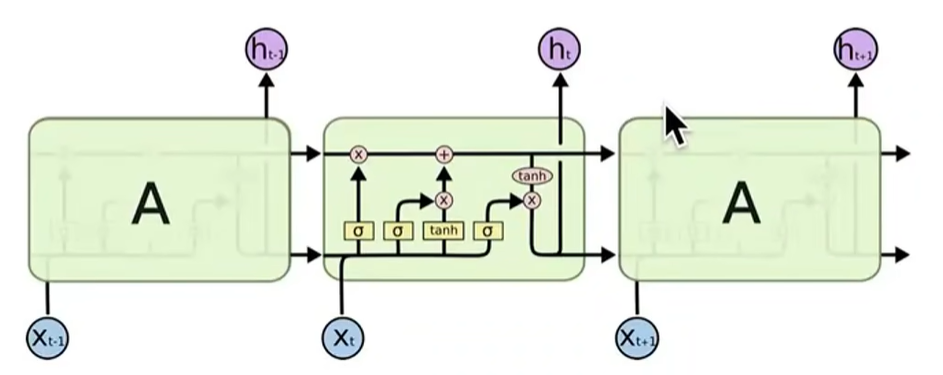
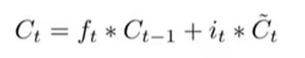
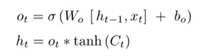

## RNN问题：

- 无法辨别不同时间点上的信息对未来的不同影响
- 无法辨别不同时间步上的标签最重要的信息是哪些
- 虽然理论上最后一个时间步中包含了所有时间点上的信息，但是真正有影响力的只有非常接近最后一个时间步的几个时间步而已，大部分信息被RNN以往，导致难处理长序列

## LSTM：为循环神经网络赋予选择性记忆和选择性传递信息的能力

- 循环网络必须自行选择吸纳多少新信息，
- 循环网络必须自行选择遗忘多少历史信息，
- 循环网络必须自行判断、对当前时间步的预测来说最重要的信息是哪些，并将该信息输出给当前时间步，这样既可以保证当前时间步上的预测是最高效的，也不会影响向下一个时间步传递的信息。

记忆细胞是LSTM特有的结构

记忆细胞是LSTM的基本计算单元，在记忆细胞中，我们分割长期信息与短期信息，同时赋予循环网络对信息做选择的能力。在之前我们提到，循环网络必须自行决定哪些长期信息会被传递下去，哪些短期信息对当前的预测最为有效，因此在记忆细胞当中，LSTM设置了两个关键变量：

- 隐藏状态h：主要负责记忆短期信息、尤其是当前时间步信息
- 细胞状态C：主要负责长期记忆

横向上可以分割为C的传递和h的传递，纵向上可以分为三个路径：

1. 帮助循环网络**选择吸纳多少新信息的输入门**
2. 帮助循环网络**选择遗忘多少历史信息的遗忘门**
3. 帮助循环网络**选择出对当前时间步的预测来说最重要的信息、并将该信息输出给当前时间步的输出门**

循环神经网络结构：

模型预测的标签是在每一个时间步进行输出还是在最后一个时间步的输出层输出？

和任务有关，假如是情感分类任务，对一句话的每一个单词做情感分类的话（对每一个样本进行分析），那么就是在每一个时间步的输出层进行输出；如果是生成式任务，需要看完输入才给输出，那么就是在最后一个时间步的输出层输出

如果是对每一个样本进行分析，那么每一个时间步的输出都应该尽量准确，梯度的迭代应该向这个方向迭代，但同时模型还是要向下一步传播的，还要兼顾对后面时间步最佳信息的传输，这两者可能是矛盾的，因为对当前时间步最好的信息不一定是最适合传递下去的信息，RNN无法处理这一点，因此LSTM才改进至**“帮助循环网络选择出对当前时间步的预测来说最重要的信息、并将该信息输出给当前时间步的输出门”**，至于哪些信息传递给未来最好，在LSTM当中是单独计算的。所以才要分隔长期和短期

输入门和遗忘门是为了构建长期传递的信息，而输出门主要是为了输出当前时间步最重要的信息

## 三个门如何工作

### 遗忘门

**遗忘门是决定要留下多少长期信息C的关键计算单元**，其数学本质是令上一个时间步传入的`C_{t-1}`乘以一个[0,1]之间的比例，以此筛选掉部分旧信息。在这个计算过程中，假设遗忘门令`C_{t-1}`乘以0.7，那就是说遗忘门决定了要保留70%的历史信息，遗忘30%的历史信息，这30%的信息空间就可以留给全新的信息来使用。

那这个比例是如何被计算出来的呢？如图所示，遗忘门会参考当前时间步的信息`X_t`,与上一个时间步的短时信息`h_t-1` 来计算该比例，其中 σ是sigmoid函数，`W_f`是动态影响最终权重大小的参数，`f_t`就是[0,1]之间的、用于影响`C_t-1`的比例。

在LSTM的设计逻辑之中，考虑X和`h_t-1`实际是在考虑离当前时间步最近的上下文信息，而权重`w_f`会受到损失函数和算法整体表现的影响，不断调节遗忘门中计算出的比例f的大小，因此遗忘门能够结合上下文信息、损失函数传来的梯度信息、以及历史信息共同计算出全新的、被留下的长期记忆`C_t`。这个流程在实践中被证明是十分有效的。

### 输入门

**输入门是决定要吸纳多少新信息来融入长期记忆C的计算单元**，其数学本质是在当前时间步传入的所有信息乘以一个[0，1]之间的比例，以筛选掉部分新信息，将剩余的新信息融入长期记忆C。

在这个计算过程中，我们**首先要计算出当前时间步总共吸收了多少全新的信息C_t~**,这个计算全新信息的方式就与RNN中计算h_t的方式高度相似，因此也会包含用于影响新信息传递的参数W_C和RNN中常见的tanh函数。然后，我们要依据上下文信息（依然是X_t和h_t-1)以及参数W_i来**生成筛选新信息的比例i_t**。最后我们将二者相乘，并加入到长期记忆C当中。

可以看到，相比起RNN的数据输入过程，LSTM的输入过程灵活了非常多——在输入门当中，我们不仅对输入数据加上了一个比例i_t，还分别使用了两个受损失函数影响的权重W_i和W_c来控制新信息聚合和比例计算的流程。在这一比例和两大参数的作用下，输入数据可以被高度灵活地调节，以便满足最佳的损失函数需求。

#### 更新细胞状态

当遗忘门决定了哪些信息要被遗忘，输入门决定了哪些信息要被加入到长期记忆后，就可以更新用于控制长期记忆的细胞状态了。如下图所示，上一个时间步的长期记忆将乘以遗忘门给出的比例f_t，再加上新信息C_t~，乘以新信息筛选的比例i_t，同时考虑放弃过去的信息、容纳新信息，以此来构成传递给下一个时间步的长期信息C_t。

### 输出门

最后我们来到了输出门。**输出门是从全新的长期信息C_t中筛选出最适合当前时间步的短期信息h_t**的计算单元，其数学本质是令已经计算好的长期信息C_t乘以一个[0,1]之间的比例，以此筛选出对当前时间步最有效的信息用于当前时间步的预测。具体流程如下所示：

为什么要对长期信息C_t做标准化处理呢？在LSTM的论文中如此写到：Tanh标准化可以限制有效长期信息C_t，的数字范围，避免历史信息在传递过程中变得越来越大，同时还能为输出门赋予一定的非线性性质，这个过程被实践证明有助于保持训练稳定、还能够强化算法学习能力，因此在LSTM最终的设计中被保留下来。

___

## LSTM各数学流程如何各司其职

### 为什么是C负责长期记忆，h负责短期记忆？

更新细胞状态时的公式：

`C_t`是在`C_t-1`基础上直接迭代更新得到的，所以`C_t`，整合了`[1,t]`所有时间步的历史信息，并负责将这些信息不断传递下去。

但是，`h_t`和`h_t-1`之间没有直接的迭代关系，虽然两者有一定的联系，但是`h_t-1`不是构成`h_t`的核心。在记忆细胞中，`h_t-1`只是用来辅助C进行迭代的变量之一，而`h_t`是为了在当前时间步上生成y而计算出来的全新变量，影响`h_t`具体取值的核心不是上个时间步的信息`h_t-1`，而是当前时间步上的输入信息和预测标签的需求，因此`h_t`是一个主要承载短期信息、尤其是当前时间步上信息的变量，它是为了在当前时间步预测出最准确的标签而存在的

可以看到，`h_t`是从`C_t`中提取出来的，决定`h_t`实际等于多少的更多取决于权重`W_o`，这个`W_o`值是反向传播决定的，所以影响`h_t`取值的是当前时间步的输出和实际标签之间的差值

___

## 梯度问题

### 为什么RNN容易梯度消失和梯度爆炸

### LSTM容易解决梯度消失和梯度爆炸问题

____

## 实现

 
