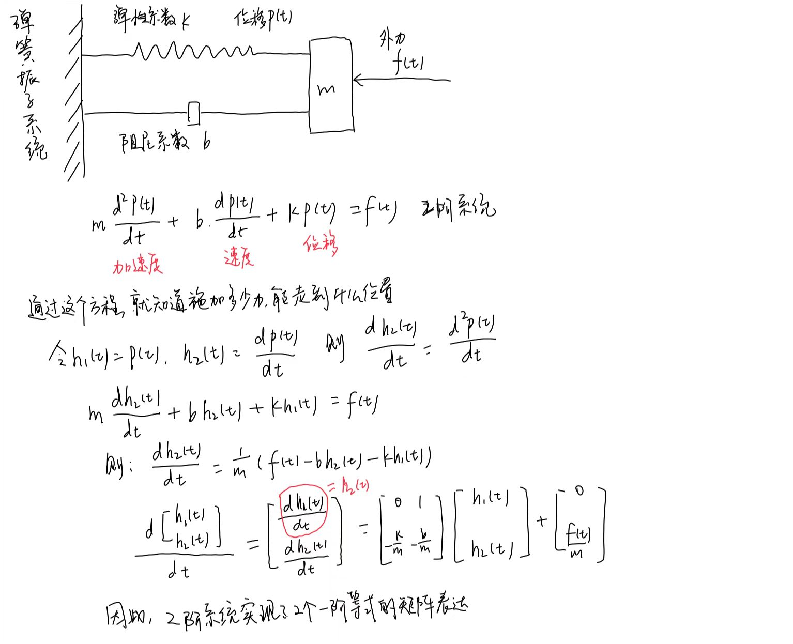
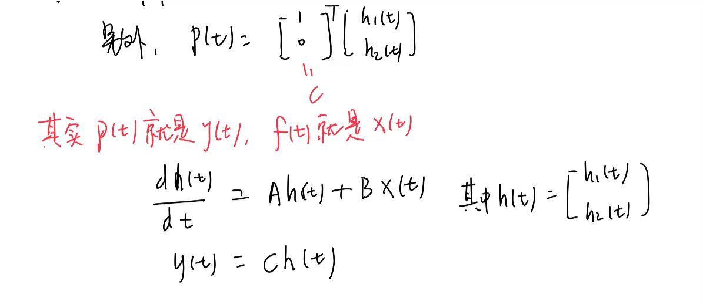
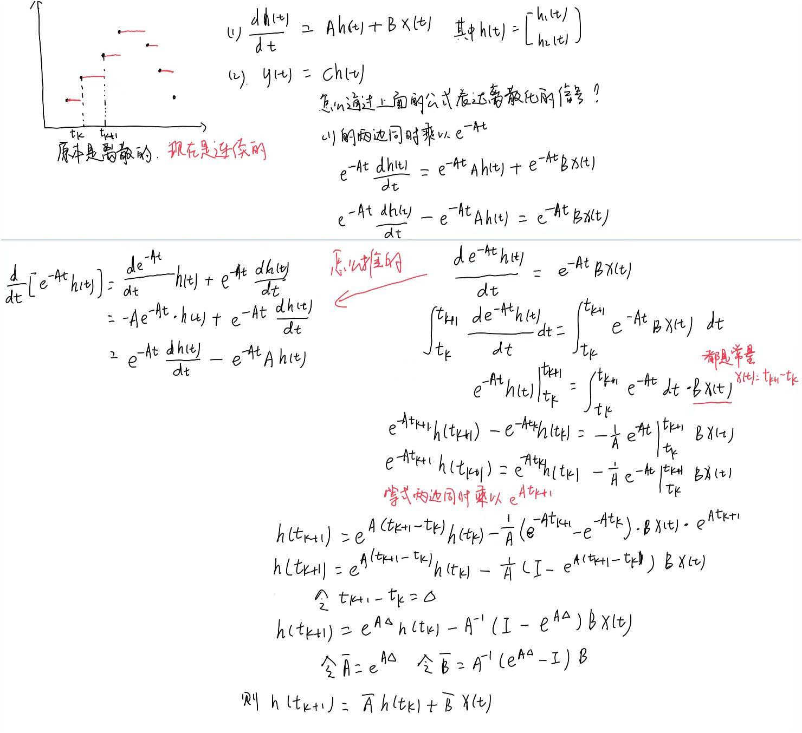
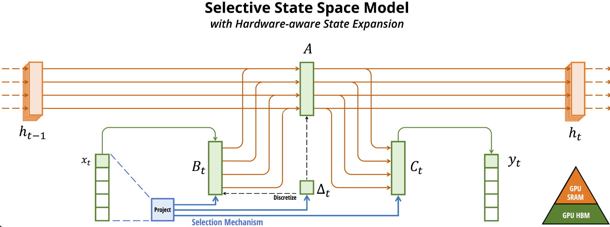
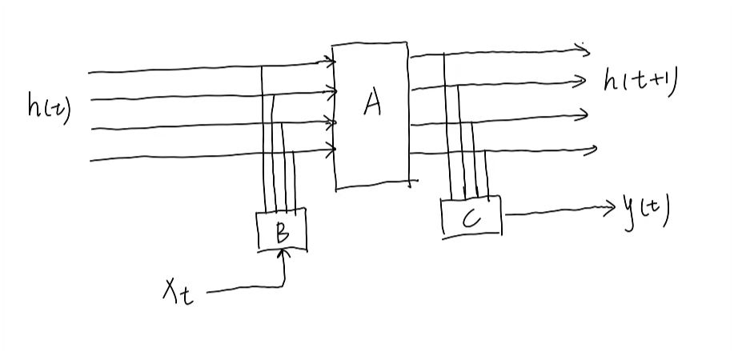
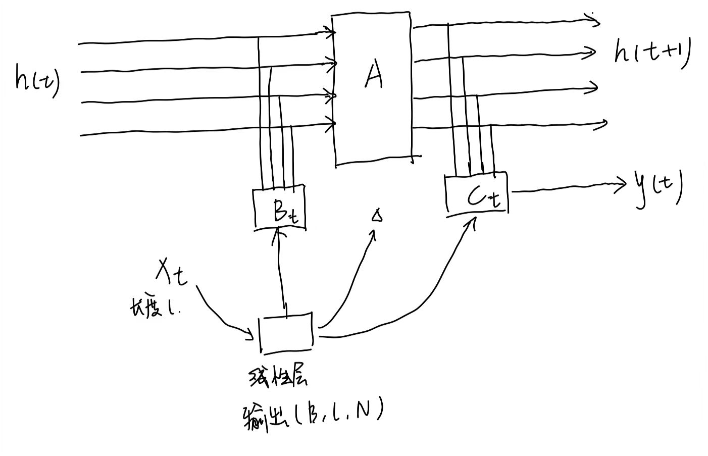

Mamba是基于结构化状态空间模型（SSM）的一种深度学习模型，Mamba在SSM的基础上加入了选择机制，确保其可以高效处理长序列，并且还可以达到与Transformer匹敌的模型能力。 

选择状态空间？Selective State Spaces

## 状态空间模型SSM：把一个n阶系统用n个一阶等式进行矩阵表达

这里面的h1(t)、h2(t)叫做状态

这就是mamba论文中的第一个公式 

但是这还是没办法在自然语言处理中使用，因为位移是连续的，自然语言处理中的输入是离散的。

第二件事：离散化——零阶保持

离散的东西转成连续的

这是mamba论文中的第二个公式

t_k+1可以说是下一个token，t_k是当前token，这就可以用在语言模型里了，我们就可以做下一个词的预测了

之前有人把SSM用在语言模型中，Mamba认为还是有些不合理：A拔和B拔是固定值，时不变，模型参数不随时间发生变化，

还有个特征是△，表示离散化的疏密程度，t_k+1 - t_k

mamba认为，abc都是不变的，且假如是上面的这种4阶系统，不管输入是多长，我就把它压缩到这4个隐藏状态上，这显然不合理，会忽略太多特征。

而Transformer是输入多少都接受，直接进行注意力计算

## mamba：一个折中的选择

 