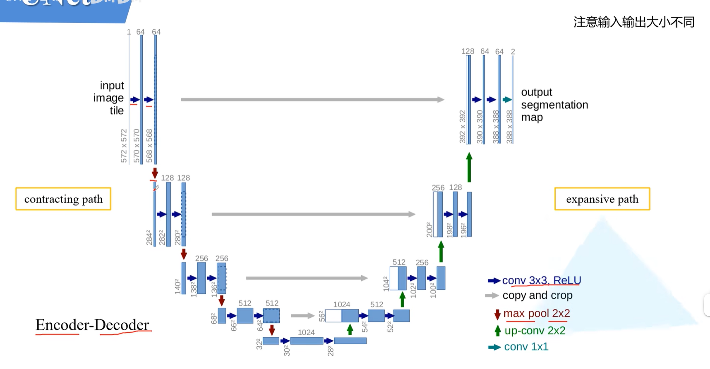
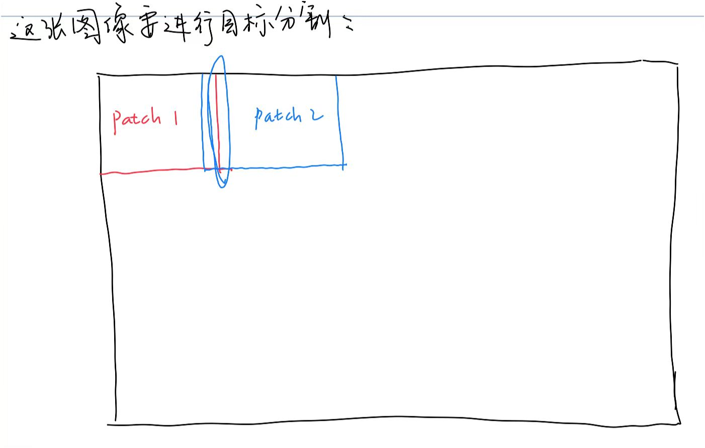
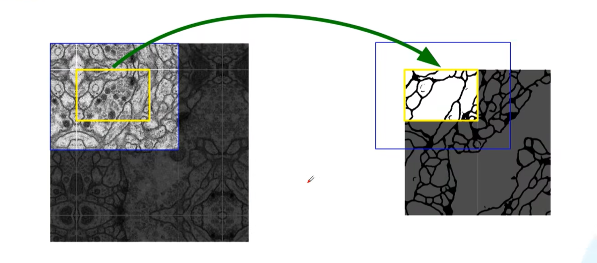
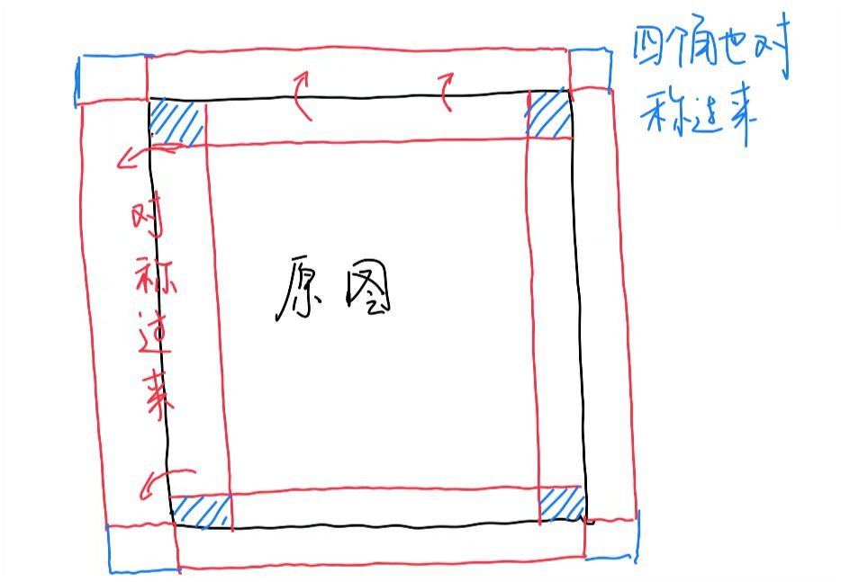

需要注意的是原始的UNet是没有padding的，所以每一次3x3卷积之后图像的尺寸都会减少。另外从图中可以看出，每次下采样，通道数会翻倍；每次上采样，通道数减半。正因为没有padding，所以每次copy and crop是裁剪出原来的一部分进行拼接。

原始的U-Net也没有Batch Norm，因为2015年BN还没出。现在的U-Net大多都是有BN，而且padding的了。

假如有一张大图像要进行目标分割，直接整张图像处理会使显存爆炸，一般是分成小块处理：

每个patch之间有重叠，这样可以照顾到每个patch的边界区域。

从上面的第一张图可以看到，输入的图是572x572x1，但是最终的输出是388x388x2，也就是原始的U-Net只是对图像中的一部分进行了目标分割：

用原文的话就是：对黄色部分做目标分割就要以蓝色部分做输入。为了把整张图都做目标分割，原文是这样做的：

现在的U-Net都加padding了，所以可能不再需要这样处理

## 为什么U-Net能做好图像分割

图像分割不等于分类也不等于检测，它的核心要求是给每一个像素给出类别，同时还要保证边界精确。

那么就需要**全局语义**，即这个像素属于什么整体结构，是属于孔隙还是属于基质，这**依赖层深、感受野大**。另外还需要**精确的局部定位**，即边界在哪里，这**需要浅层特征、空间分辨率高**。

但是普通的CNN：越深 → 语义越强 → 空间分辨率越差；越浅 → 位置越准 → 语义越弱

**U-Net核心：编码器负责理解是什么，解码器负责回答在哪里，跳跃连接保证两者不丢失。**

U-Net的Encoder部分能够扩大感受野，可以从像素 → 局部纹理 → 结构 → 整体语义

U-Net的跳跃连接很重要，如果只是图像 → 下采样 → 上采样 → 输出，那么空间信息会不可逆地丢失，因为池化会丢失边界，这就导致分割边界模糊且小结构消失。U-Net的跳跃连接把encoder的高分辨率特征concat到decoder的对应层。本质含义是**把“位置精确的浅层特征”直接送给“正在恢复空间分辨率的解码器”**。

总结：U-Net 通过编码器获取高层语义，通过解码器恢复空间分辨率，并利用跳跃连接在多尺度上融合语义与定位信息，从而实现精确的像素级预测，这使其天然适合图像分割任务。