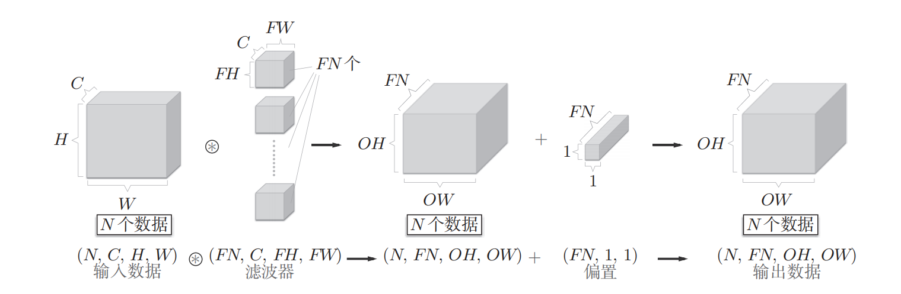
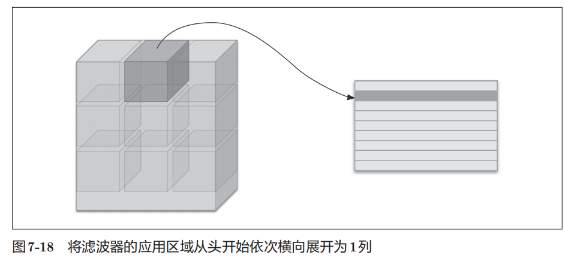
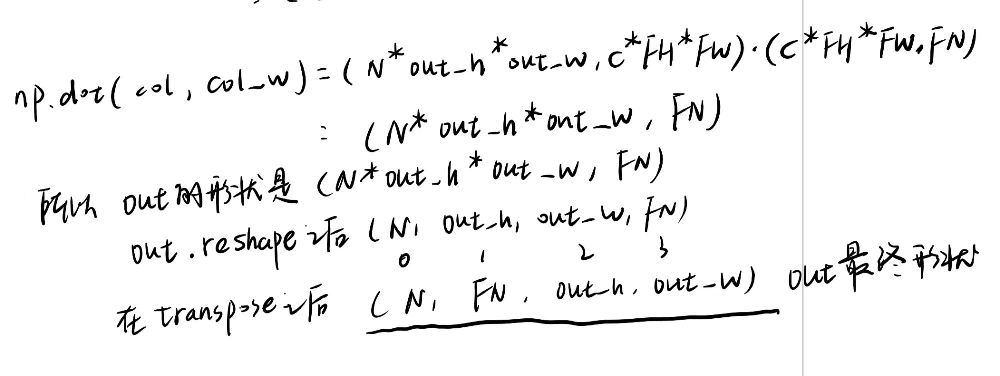
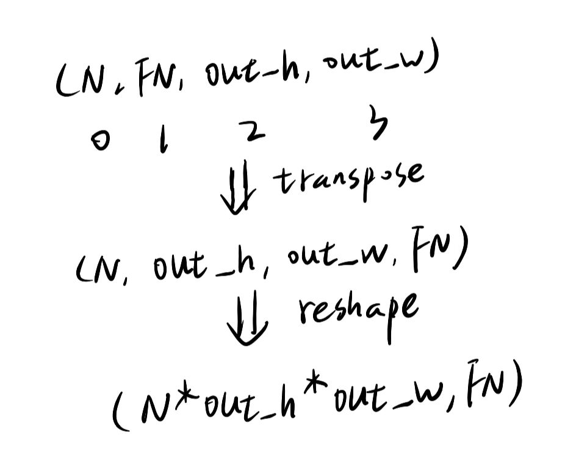
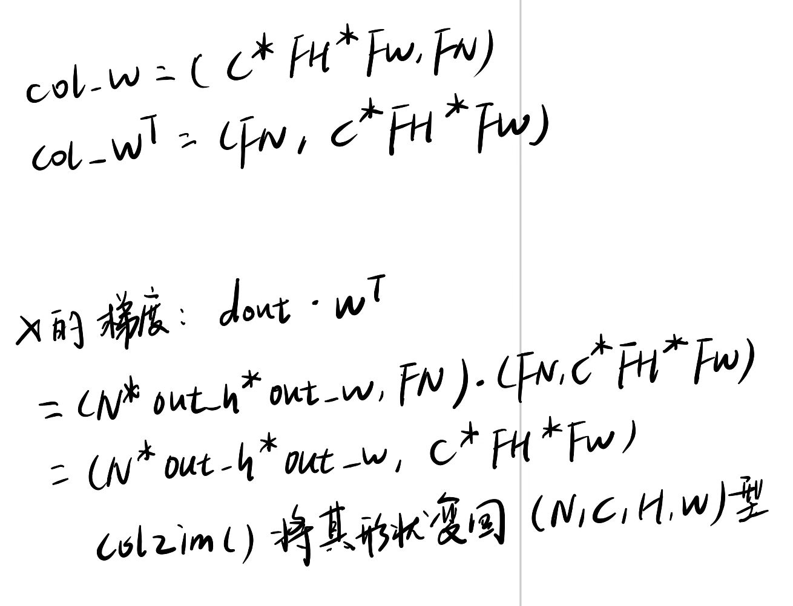

```py
class Convolution:
    def __init__(self, W, b, stride=1, pad=0):
        self.W = W
        self.b = b
        self.stride = stride # 步长
        self.pad = pad # 填充
        
        # 中间数据（backward时使用）
        self.x = None
        self.col = None
        self.col_W = None
        
        # 权重和偏置参数的梯度
        self.dW = None
        self.db = None
```

## 正向传播



N是批次

FN是filter数量

```py
    def forward(self, x):
        FN, C, FH, FW = self.W.shape # filter里面其实就是权重
        N, C, H, W = x.shape
        out_h = 1 + int((H + 2*self.pad - FH) / self.stride)
        out_w = 1 + int((W + 2*self.pad - FW) / self.stride)

        col = im2col(x, FH, FW, self.stride, self.pad)
        col_W = self.W.reshape(FN, -1).T

        out = np.dot(col, col_W) + self.b
        out = out.reshape(N, out_h, out_w, -1).transpose(0, 3, 1, 2)

        self.x = x
        self.col = col
        self.col_W = col_W

        return out
```

关于im2col()函数，标准的是把filter块覆盖的区域的所有像素值提取出来，存储为行向量，最后把所有这些行向量拼接成一个巨大的二维矩阵。



那么每一行都是`C * FH * FW`个元素，也就是有`C * FH * FW`列

行数的确认：im2col()函数的每一行，都对应着输入数据中一个独立的、需要进行卷积运算的位置，因此总行数就等于**所有批次中，所有卷积计算位置的总数**。即：`N * out_h * out_w`

所以col的形状为`(N*out_h*out_w ,c*FH*FW)`



所以out的最终的形状是(N, FN, out_h, out_w)

## 反向传播

```python
    def backward(self, dout):
        FN, C, FH, FW = self.W.shape
        dout = dout.transpose(0,2,3,1).reshape(-1, FN)

```

首先需要知道`dout`是从上一层传来的梯度，它的形状和前向传播的输出Y相同，因为`dout`的每一个元素都代表了损失函数`L`对前向传播输出`Y`中对应元素的偏导数（广播）

那么dout开始的形状也是：(N, FN, out_h, out_w)

然后经过变换之后：



```python

        self.db = np.sum(dout, axis=0) # 偏置的梯度
        self.dW = np.dot(self.col.T, dout)
        self.dW = self.dW.transpose(1, 0).reshape(FN, C, FH, FW)

        dcol = np.dot(dout, self.col_W.T) # x的梯度：dout点乘W^T
        dx = col2im(dcol, self.x.shape, FH, FW, self.stride, self.pad) # col2im是im2col的逆操作

        return dx
```


这并不是我们想要的(FN, C, FH, FW)的形式，所以经过一步变换:`self.dW = self.dW.transpose(1, 0).reshape(FN, C, FH, FW)`，将其恢复为权重W的最初原始形状



最后return dx，dx要向上传递，dx是关于输入x的梯度，而x是上一层产生的，所以计算dx的目的是为了把梯度信号继续向网络源头回传，因此它必须被return

但是dw和db没有被return，是因为它们只属于当前层，当前层需要它们更新自己的权重