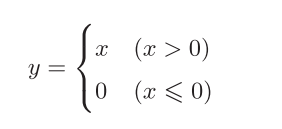
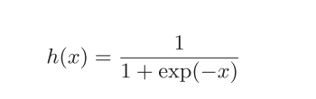
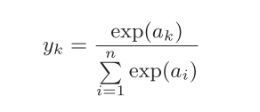
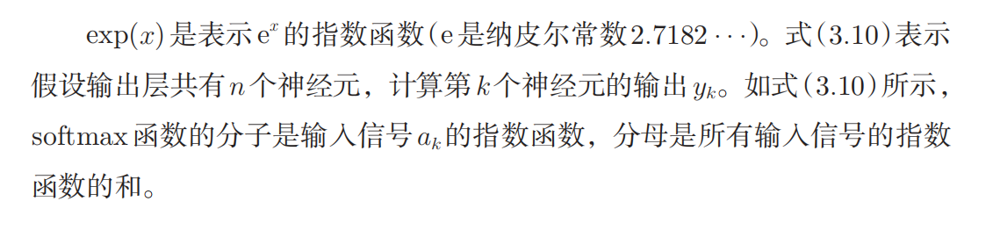
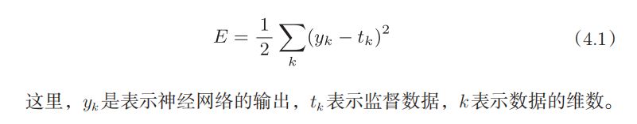
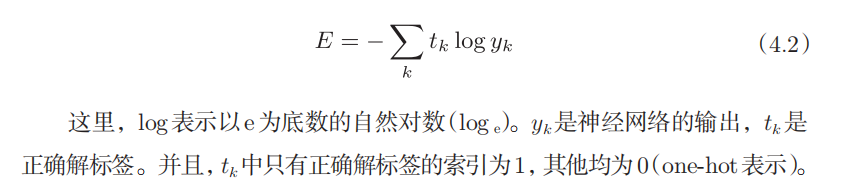
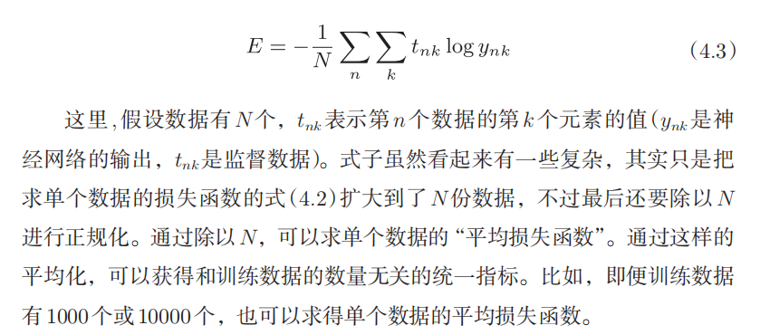

## 激活函数

输出层所用的激活函数，要根据求解问题的性质决定。一般地，回归问题可以使用恒等函数，二元分类问题可以使用sigmoid函数，多元分类问题可以使用softmax函数。

ReLU函数：



sigmoid函数：



softmax函数：





```py
def softmax(a):
    c = np.max(a)  # 防止溢出
    exp_a = np.exp(a - c)
    sum_exp_a = np.sum(exp_a)
    y = exp_a / sum_exp_a
    return y
```

softmax函数的输出是0*.*0到1*.*0之间的实数。并且，softmax函数的输出值的总和是1。

## 损失函数

MSE 均方误差：



```py
def mean_squared_error(y, t):
    return 0.5 * np.sum((y - t)**2)
```

```py
t = [0, 0, 1, 0, 0, 0, 0, 0, 0, 0] # 正确解的one-hot表示
y = [0.1, 0.05, 0.6, 0.0, 0.05, 0.1, 0.0, 0.1, 0.0, 0.0] # 神经网络的输出
mean_squared_error(np.array(y), np.array(t))
```

交叉熵误差：



```py
def cross_entropy_error(y, t):
    delta = 1e-7
    return -np.sum(t * np.log(y + delta))
```

函数内部在计算np.log时，加上了一个微小值delta。这是因为，当出现np.log(0)时，np.log(0)会变为负无限大的-inf，这样一来就会导致后续计算无法进行。作为保护性对策，添加一个微小值可以防止负无限大的发生。

```py
t = [0, 0, 1, 0, 0, 0, 0, 0, 0, 0] # 正确解的one-hot表示
y = [0.1, 0.05, 0.6, 0.0, 0.05, 0.1, 0.0, 0.1, 0.0, 0.0] # 神经网络的输出
cross_entropy_error(np.array(y), np.array(t))
```

以上都是针对单个数据的损失函数，如果要求所有训练数据的损失函数的总和：



梯度指示的方向是各点处的函数值减小最多的方向

