## 激活函数

激活函数：将输入信号的总和转换为输出信号，如“激活”一词所示，激活函数的作用在于决定如何来激活输入信号的总和。

**ReLU函数主要用在隐藏层**

### ReLU函数：


**输出层**所用的激活函数，要根据求解问题的性质决定。**一般地，回归问题可以使用恒等函数，二元分类问题可以使用sigmoid函数，多元分类问题可以使用softmax函数**。

### sigmoid函数：


图形：

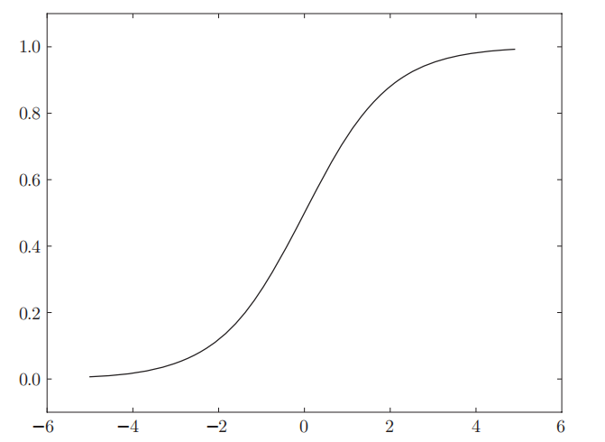

是非线性函数，**神经网络的激活函数必须使用非线性函数**

### softmax函数：


```py
def softmax(a):
    c = np.max(a)  # 防止溢出
    exp_a = np.exp(a - c)
    sum_exp_a = np.sum(exp_a)
    y = exp_a / sum_exp_a
    return y
```

softmax函数的输出是0*.*0到1*.*0之间的实数。并且，softmax函数的输出值的总和是1。所以才把softmax函数的输出解释为“概率”

一般而言，神经网络只把输出值最大的神经元所对应的类别作为识别结果。并且，即便使用softmax函数，输出值最大的神经元的位置也不会变。因此，**神经网络在进行分类时，输出层的softmax函数可以省略**。在实际的问题中，由于指数函数的运算需要一定的计算机运算量，因此输出层的softmax函数一般会被省略。

## 损失函数

MSE 均方误差：


```py
def mean_squared_error(y, t):
    return 0.5 * np.sum((y - t)**2)
```

```py
t = [0, 0, 1, 0, 0, 0, 0, 0, 0, 0] # 正确解的one-hot表示
y = [0.1, 0.05, 0.6, 0.0, 0.05, 0.1, 0.0, 0.1, 0.0, 0.0] # 神经网络的输出
mean_squared_error(np.array(y), np.array(t))
```

交叉熵误差：


```py
def cross_entropy_error(y, t):
    delta = 1e-7
    return -np.sum(t * np.log(y + delta))
```

函数内部在计算np.log时，加上了一个微小值delta。这是因为，当出现np.log(0)时，np.log(0)会变为负无限大的-inf，这样一来就会导致后续计算无法进行。作为保护性对策，添加一个微小值可以防止负无限大的发生。

```py
t = [0, 0, 1, 0, 0, 0, 0, 0, 0, 0] # 正确解的one-hot表示
y = [0.1, 0.05, 0.6, 0.0, 0.05, 0.1, 0.0, 0.1, 0.0, 0.0] # 神经网络的输出
cross_entropy_error(np.array(y), np.array(t))
```

以上都是针对单个数据的损失函数，如果要求所有训练数据的损失函数的总和：


## mini-batch

从训练数据中随机选出一部分数据，这部分数据称为mini-batch。我们的目标是减小mini-batch的损失函数的值

## 关于梯度

当关注神经网络中某一个权重参数，此时，对该权重中参数的损失函数求导，表示的的是“如果稍微改变这个权重参数的值，损失函数的值会如何变化”。如果导数的值为负，通过使该权重参数向正方向改变，可以减小损失函数的值；反过来，如果导数的值为正，则通过使该权重参数向负方向改变，可以减小损失函数的值

**梯度：**由全部变量的偏导数汇总而成的向量称为梯度，梯度指示的方向是各点处的函数值减小最多的方向

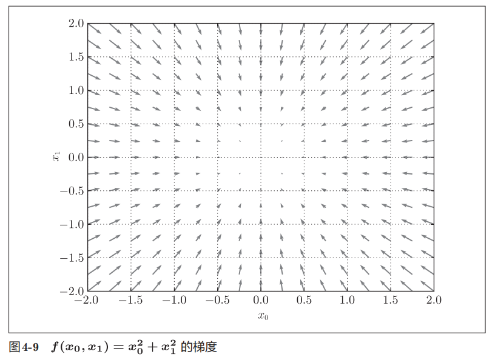

神经网络必须在学习中找到最优参数（权重和梯度），最优参数是指损失函数取最小值时的参数。

**梯度法：** 函数的取值从当前位置沿着梯度方向前进一定距离，然后在新的地方重新求梯度，再沿着新梯度方向前进，如此反复，不断地沿梯度方向前进。像这样，通过不断地沿梯度方向前进，逐渐减小函数值的过程就是梯度法

用数学式表示梯度法：

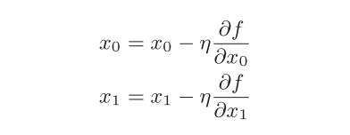

**神经网络的梯度：**损失函数关于权重参数的梯度

神经网络的学习：mini-batch --> 计算梯度（求出各个权重参数的梯度，梯度表示损失函数的值减小最多的方向） --> 更新参数 --> 重复前面三个步骤

## 权重参数初始化

权重使用符合高斯分布的随机数进行初始化，偏置使用0进行初始化

---

遍历完一次所有数据，就称为一个epoch

## 误差反向传播：高效计算权重参数的梯度的方法

反向传播的计算顺序：先将节点的输入信号乘以节点的局部导数（偏导数），然后再传递给下一个节点


加法节点的反向传播：将上游的值原封不动地输出到下游

乘法节点的反向传播：会将上游的值乘以正向传播时的输入信号的“翻转值“后传递给下游

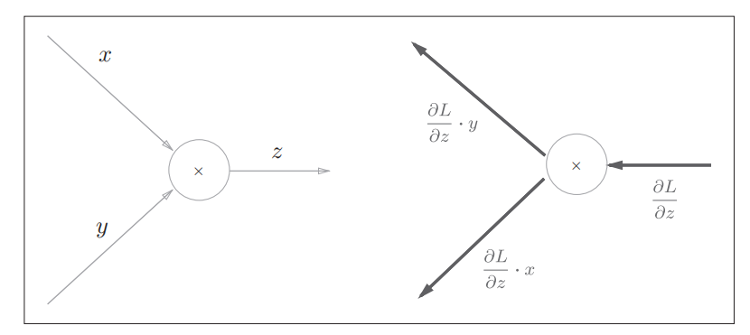

### ReLU层的反向传播

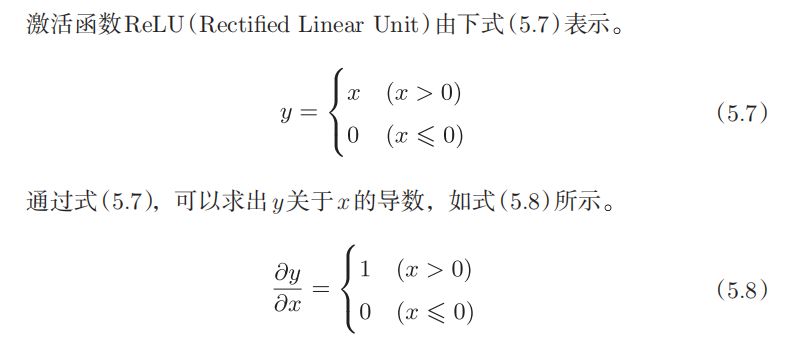

如果正向传播时的输入x大于0，则反向传播会将上游的值原封不动地传给下游。如果正向传播时的x小于等于0，则反向传播中传给下游的型号将停在此处。

### sigmoid层的反向传播

首先sigmoid函数：

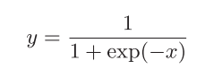

反向传播：

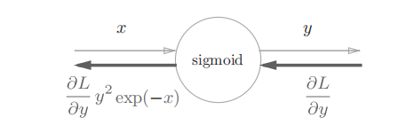

或者：

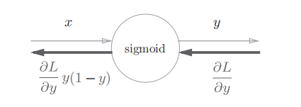

所以sigmoid层的反向传播只根据正向传播的输出就能计算出来

### Affine层的反向传播

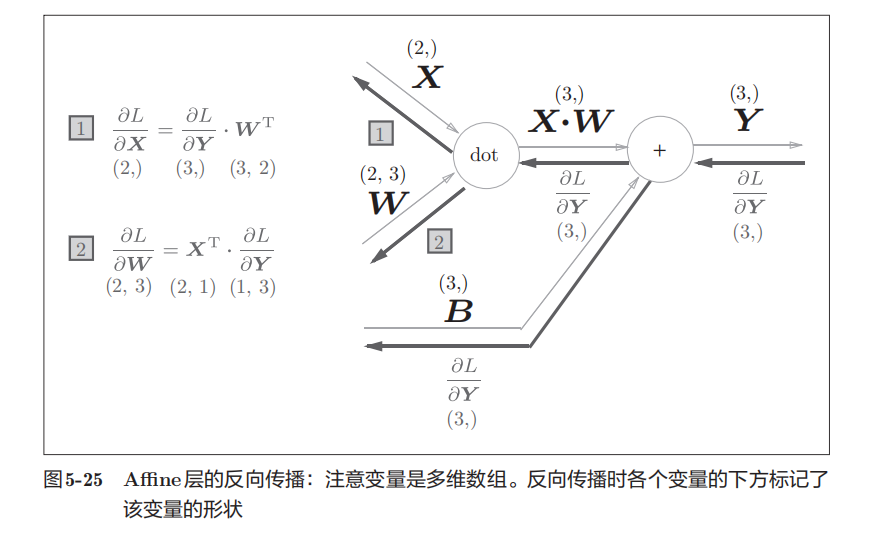

如果不知道两个矩阵相乘的顺序，可以通过对应维度的元素数推导

批版本的Affine：

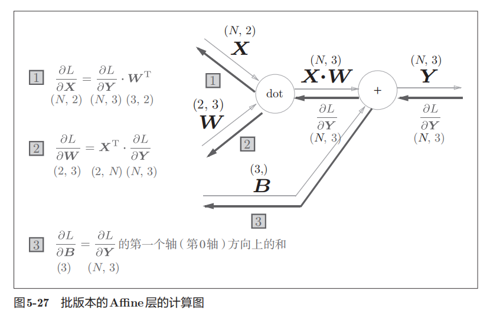

### Softmax-With-Loss层

这里假设要进行3类分类，从前面的层接收3个输入（得分）。Softmax层将输入（a1, a2, a3）正规化，输出（y1, y2, y3）。Cross Entropy Error层接收Softmax的输出（y1, y2, y3）和教师标签（t1, t2, t3），从这些数据中输出损失L。

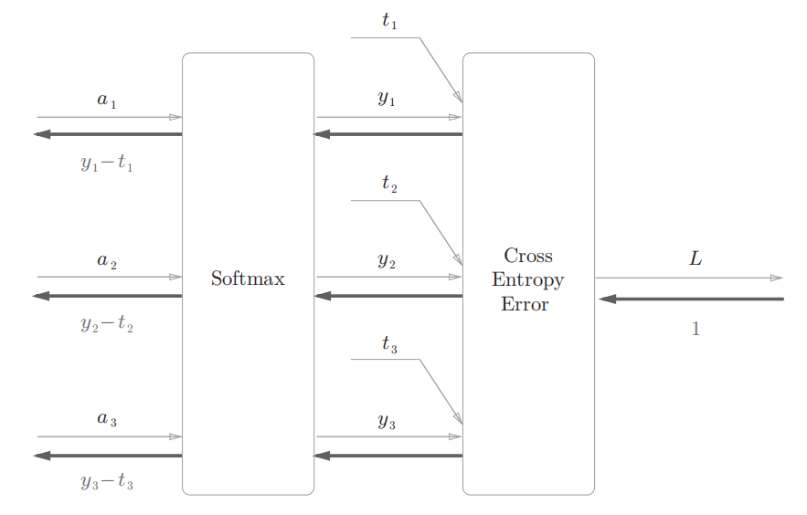

可以看到，softmax层反向传播得到了(y1-t1, y2-t2, y3-t3)这样的漂亮结果。由于(y1, y2, y3)是softmax层的输出，(t1, t2, t3)是监督数据，所以(y1-t1, y2-t2, y3-t3)是softmax层的输出与教师标签的差分，神经网络的反向传播会把这个差分表示的误差传递给前面的层。

神经网络学习的目的就是通过调整权重参数，使神经网络的输出（Softmax的输出）接近教师标签。因此，必须将神经网络的输出与教师标签的误差高效地传递给前面的层。刚刚的（y1 − t1, y2 − t2, y3 − t3）正是Softmax层的输出与教师标签的差，直截了当地表示了当前神经网络的输出与教师标签的误差。

这个漂亮的结果并不是偶然，而是为了得到这个结果特意设计了交叉熵损失函数。回归问题的输出层使用恒等函数，损失函数使用“平方和误差”也是同样的理由。

```python
def backward(self, dout=1):
        batch_size = self.t.shape[0]
        if self.t.size == self.y.size: # 监督数据是one-hot-vector的情况
            dx = (self.y - self.t) / batch_size
        else:
            dx = self.y.copy()
            dx[np.arange(batch_size), self.t] -= 1
            dx = dx / batch_size
        
        return dx
```

请注意反向传播时，将要传播的值除以批的大小（batchsize）后，传递给前面的层的是单个数据的误差。
