## 最优化方法

### 1、随机梯度下降 SGD

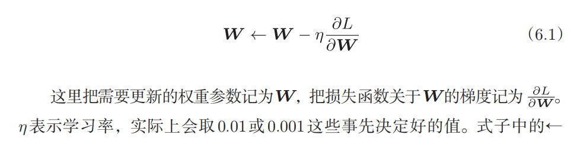

SGD的缺点：

这个函数

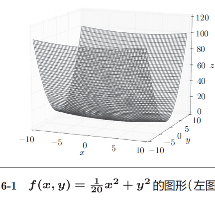

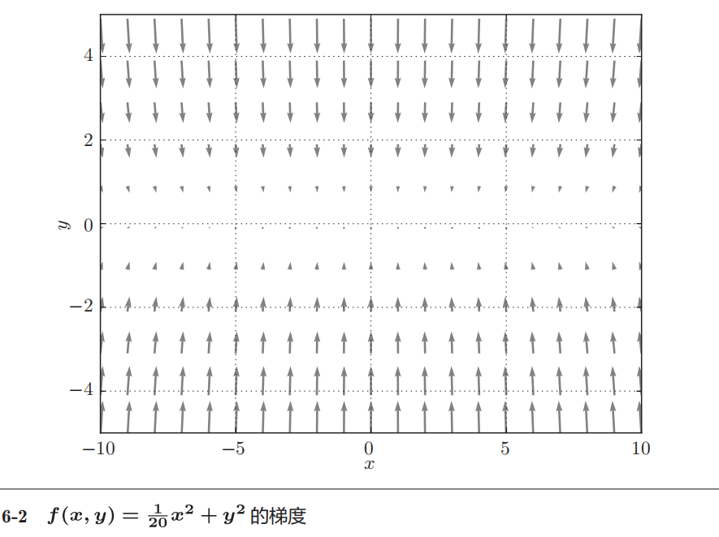

基于SGD的最优化更新路径：之字型 效率低

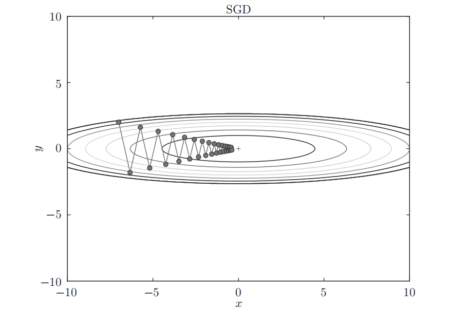

根本原因是**梯度方向没有指向最小值方向**，梯度在很多地方没有指向(0, 0)，y轴方向的坡度大，x轴方向的坡度小

### 2、Momentum 动量法

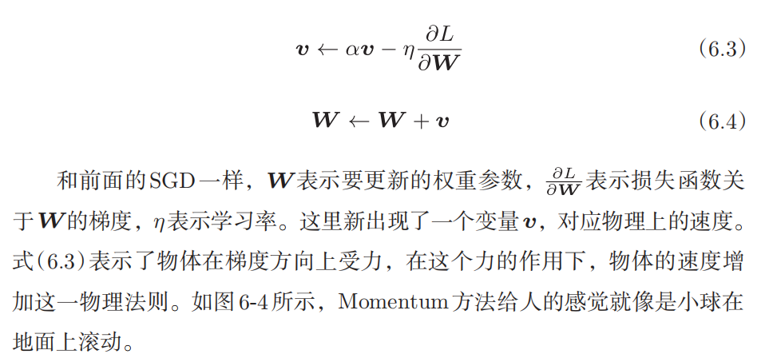

```python
class Momentum:

    """Momentum SGD"""

    def __init__(self, lr=0.01, momentum=0.9):
        self.lr = lr
        self.momentum = momentum
        self.v = None
        
    def update(self, params, grads):
        if self.v is None:
            self.v = {}
            for key, val in params.items():                                
                self.v[key] = np.zeros_like(val)
                
        for key in params.keys():
            self.v[key] = self.momentum*self.v[key] - self.lr*grads[key] 
            params[key] += self.v[key]
```

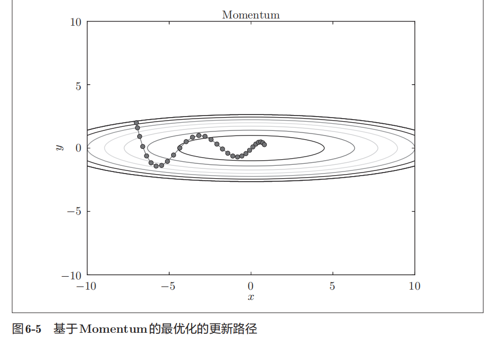

之字形程度减轻，这是因为虽然x轴方向上受到的力非常小，但是一直在同一方向上受力，所以朝同一个方向会有一定的加速。反过来，虽然y轴方向上受到的力很大，但是因为交互地受到正方向和反方向的力，它们会互相抵消，所以*y*轴方向上的速度不稳定。

### 3、AdaGrad

针对“一个一个”的参数，赋予其“定制”的值。AdaGrad会为每个元素适当地调整学习率

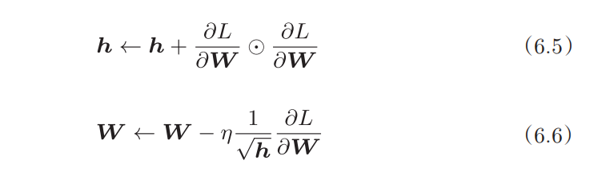

h保存了以前所有梯度值的平方和，这个符号表示对应矩阵元素的乘法

这是一个梯度的平方和，越大说明当该权重变化的时候引起的Loss的变动越大。又因为h放在分母，所以参数的元素中变动较大的元素的学习率将变小。也就是说可以按照参数的元素进行学习率衰减，使变动大的参数的学习率逐减小


### 4、Adam

Momentum参照小球在碗中滚动的物理规则进行移动，AdaGrad为参数的每个元素适当地调整更新步伐。Adam融合两种思路

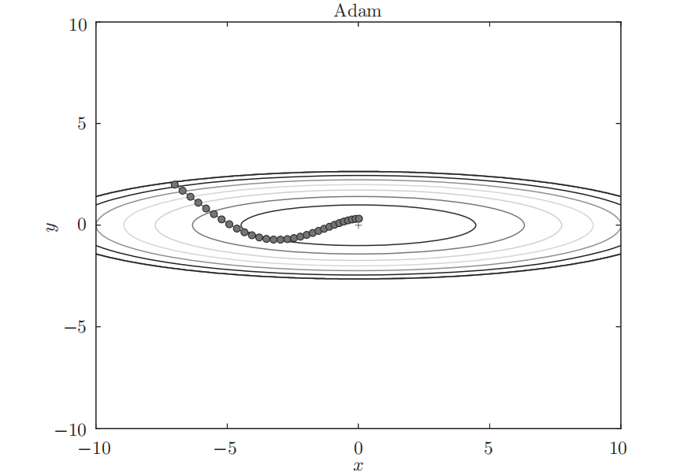

Adam会设置 3个超参数。一个是学习率（论文中以*α*出现），另外两个是一次momentum系数*β*1和二次momentum系数*β*2。根据论文，标准的设定值是*β*1为 0.9，*β*2 为 0.999。设置了这些值后，大多数情况下都能顺利运行。

## 权重的初始值

权重初始值不能为0

### 关于梯度消失

向一个5层神经网络（激活函数使用sigmoid）传入随机生成的输入数据，观察激活函数输出的分布如何变化，观察权重初始值是如何影响隐藏层的激活函数输出分布的

y = sigmoid 则 y' = y(1-y)

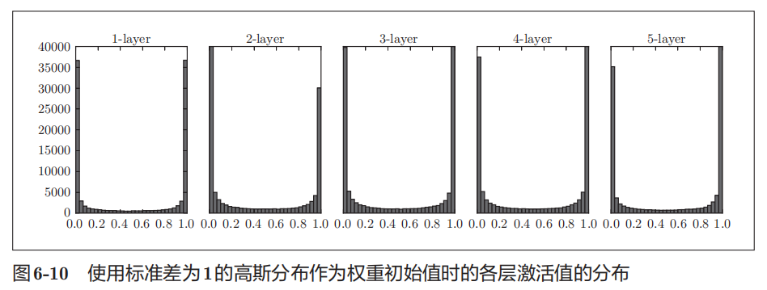

由图可知，各层的激活函数输出偏向0和1分布。随着输出不断地靠近0（或者靠近1），它的导数的值逐渐接近0。因此，偏向0和1的数据分布会造成反向传播中梯度的值不断变小，最后消失。这个问题称为梯度消失

### Xavier初始值

为了使各层的激活值呈现出具有相同广度的分布，如果前一层的节点数为*n*，则初始值使用标准差为 1/根号下n 的分布

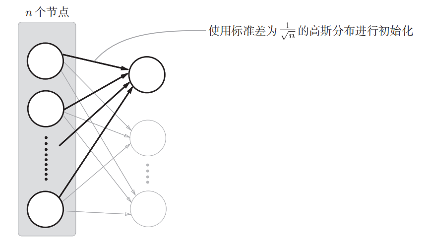

激活函数最好关于原点对称。tanh函数（双曲线函数）、sigmoid函数等S型函数适合使用Xavier初始值

### ReLU初始值

当激活函数使用ReLU时，推荐使用ReLU专用的初始值

He初始值当前一层的节点数为*n*时，He初始值使用标准差为 根号下2/n 的高斯分布。

## Batch Normalization

前面观察了各层的激活值分布，了解到如果设定了合适的权重初始值，则各层的激活值分布会有适当地广度，从而可以顺利地进行学习。那么，为了使各层拥有适当地广度，“强制性”地调整激活值的分布会怎样？Batch Normalization方法基于此想法产生。batch norm就是以进行学习的mini-batch为单位，按mini-batch进行正规化（使数据分布的均值为0，方差为1的正规化）。

batch norm的优点：

- 可以使学习快速进行（可以增大学习率）
- 不那么依赖初始值
- 抑制过拟合

Batch Norm的思路是调整各层的激活值分布使其拥有适当的广度。为此，要向神经网络中插入对数据分布进行正规化的层，即Batch 

Normalization层

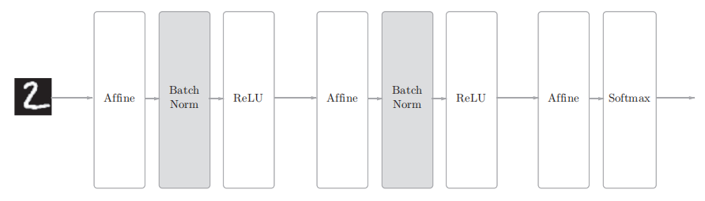

## 正则化

过拟合的两个主要原因：

- 模型拥有大量参数，表现力强
- 训练数据少

### 权值衰减

权值衰减是一直以来经常被使用的一种抑制过拟合的方法。该方法通过在学习的过程中对大的权重进行惩罚，来抑制过拟合。很多过拟合原本就是因为权重参数取值过大才发生的。

复习一下，神经网络的学习目的是减小损失函数的值。这时，例如为损失函数加上权重的平方范数(L2范数)。这样一来，就可以抑制权重变大。用符号表示的话，如果将权重记为W，L2范数的权值衰减就是`λW²`，然后将这个`λW²`加到损失函数上。这里，`λ`是控制正则化强度的超参数。`λ`设置得越大，对大的权重施加的惩罚就越重。此外，`λW²`开头的是用于将`λW²`的求导结果变成`λW`的调整用常量。

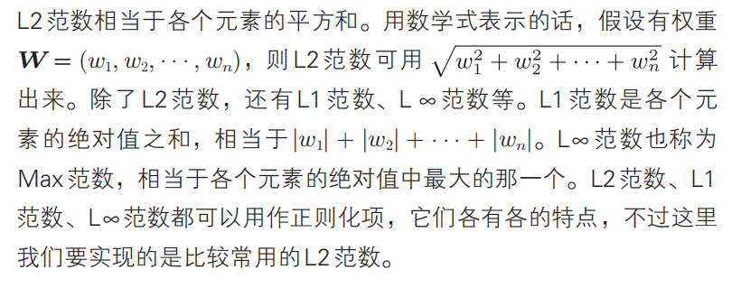

### Dropout

如果网络的模型变得很复杂，只用权值衰减就难以应对了。在这种情况下，我们经常会使用Dropout方法。

Dropout是一种在学习的过程中随机删除神经元的方法。训练时，随机选出隐藏层的神经元，然后将其删除。被删除的神经元不再进行信号的传递，训练时，每传递一次数据，就会随机选择要删除的神经元。然后，测试时，虽然会传递所有的神经元信号，但是对于各个神经元的输出，要乘上训练时的删除比例后再输出。

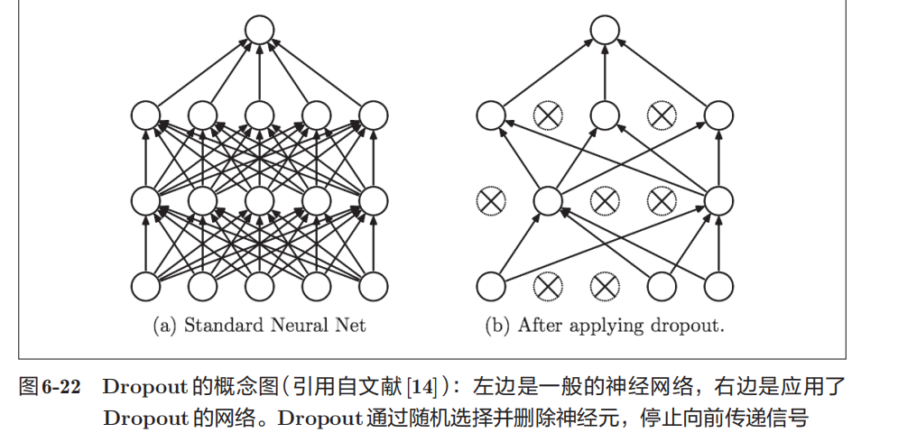

反向传播时的行为和ReLU相同，即正向传播时传递了信号的神经元，反向传播时按原样传递信号；正向传播时没有传递信号的神经元，反向传播时信号将停在那里

