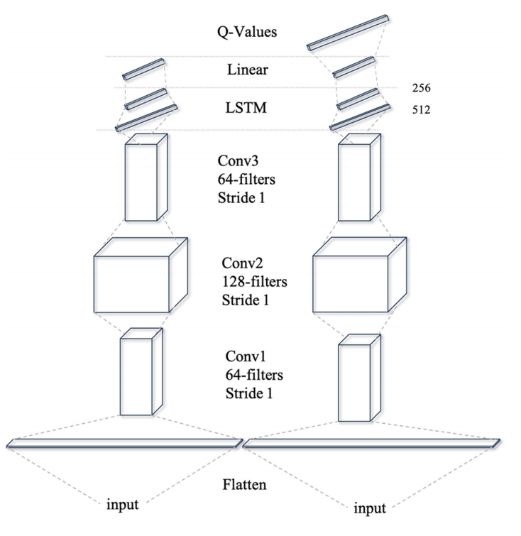
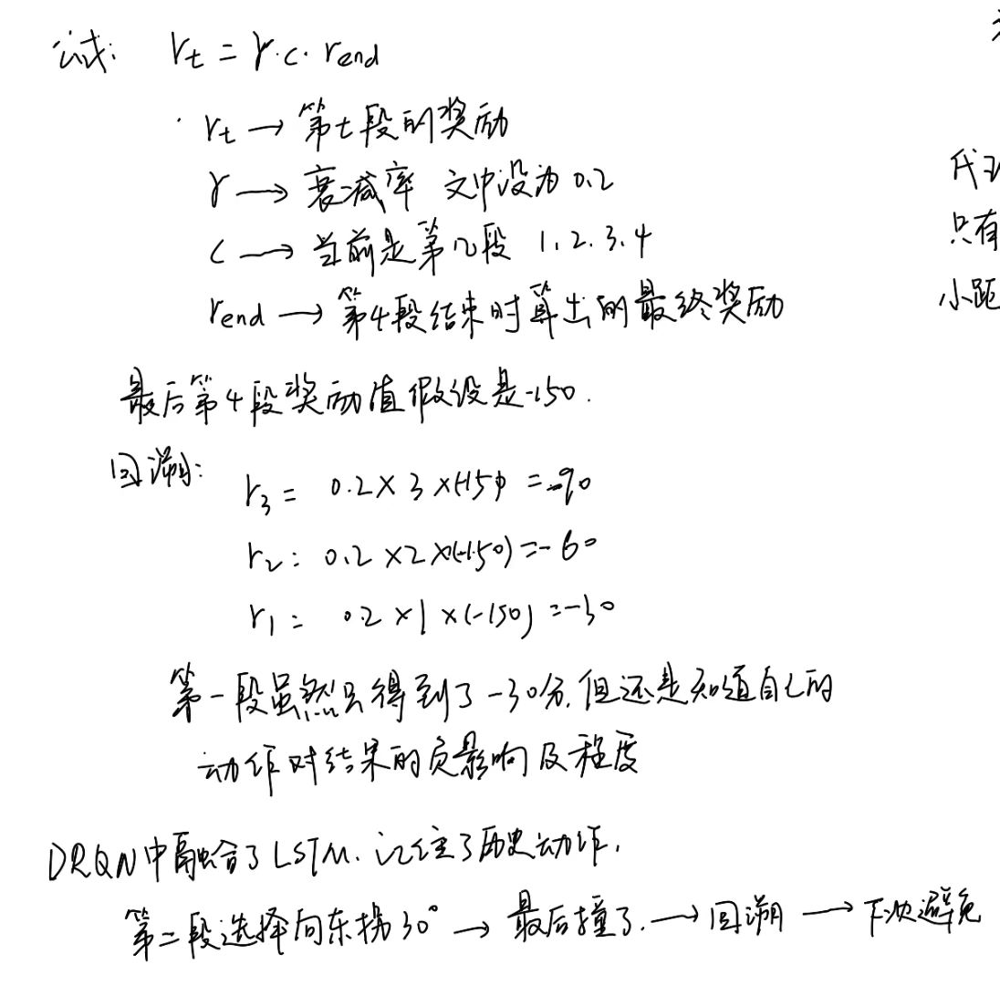

## 基于对抗自编码器和 Transformer 的测井重建

AAE：adversarial autoencoder 对抗自编码器

在本研究中，我们提出了一种基于域适应方法的具有对抗式自编码器(AAE-Transformer)的Transformer框架。以声波（AC）测井曲线的重建为例来验证模型的有效性。首先，使用传统的双向长短期记忆(Bi-LSTM)模型来验证AAE模型的有效性。通过井之间的MMD（maximum mean discrepancy）来评估域差异。为了进一步提高预测性能，开发了一种Transformer结构作为回归器，利用其高效处理长序列数据的能力。通过测试井中重建的AC曲线的评估，验证了AAE-Transformer模型的可靠性。

MMD：最大均值误差，是一种衡量分布的统计方法，通过测量其在高维特征空间中的均值之间的距离来实现。它在迁移学习中杯广泛用作损失函数，尤其是在域适应领域，这是因为其在衡量源域和目标域的概率分布差异方面具有有效性

AAE 通过将训练井数据分布作为目标域，将测试井数据分布作为源域，并通过对抗训练来对齐这两个域的特征，从而减少域差异。

AAE 的编码器将源域数据映射到潜在空间，Transformer 则利用潜在空间中的特征进行重建。

## 基于双向循环神经网络和非支配排序遗传算法 II 的钻井参数多目标优化模型

随着石油和天然气勘探目标向更深的地层推进，钻井深度的增加以及钻井的复杂性降低了作业效率，并延长了钻井周期。传统的优化方法（依赖于钻进速度（ROP）和**机械比能（MSE）**）在复杂的井下条件中往往会出现显著的预测误差。因此，更准确且适应性强的优化方法对于高效进行深井和超深井作业至关重要。在本文中，我们提出了一种基于双向循环神经网络（Bi-RNN）的井下钻井参数预测模型。该模型捕捉了表面参数和井下参数之间的双向时间相关性。通过这种方法，它能够准确预测钻进速度并计算机械比能。实验结果在测试数据集上表现出了卓越的性能。从预测值计算得出的钻进速度平均相对误差仅为2.99%，机械比能平均相对误差仅为3.45%。为了提高实时适用性，该模型整合了非支配排序遗传算法Ⅱ（NSGAll），创建了一个动态优化系统，为地面钻井参数提供了帕累托最优解。在一口深井的5521-5859-m区段进行的现场测试表明，该模型使钻速提高了57.52%，而平均井眼轨迹误差仅增加了2.78%，有效地平衡了钻井速度和能源效率。该优化模型为钻井工程师提供了一种实用工具，有助于实时做出决策，以降低钻井成本并提高深井和超深井作业的钻井效率。

钻井参数优化主要关注三个可控的表面参数：钻压（WOB）、转速（RPM）和泵流量（Q）

使用双向循环神经网络（Bi-RNN）预测计算钻进速度（ROP）和机械比能（MSE），预测更准确

在钻井参数优化过程中，增加钻压（WOB）和转速（RPM）能够提高钻进速度ROP，然而，也可能导致更高的MSE。因此最大钻进速度ROP和最小MSE之间存在冲突，需要在这些目标之间取得平衡，使用NSGA-II进行多目标优化。

目标：优化可控的表层钻井参数，实现最大化ROP并最小化MSE

钻井操作通常会涉及表层参数的突然变化，这些变化会对井下条件产生延迟的非线性影响。为了解决这一挑战，Bi-RNN框架引入了自注意力机制，该机制根据不同的时间步与当前预测的相关性动态地权衡其重要性，从而显著提高模型的准确性和泛化能力。

## 用于防碰的井眼轨迹设计的深度强化学习方法

（Deep Reinforcement Learning for Well Trajectory Design with Collision Avoidance 期刊：SPE Journal）

什么是井眼轨迹设计：设计在钻井过程中井在地下空间中的实际路径或几何形状，即从地表井口到地下目标点之间井眼中心线的空间曲线。

摘要：

在本研究中，我们探讨了在地下约束条件下优化井眼轨迹的问题，其中包括避开已有的井。传统的优化技术，如元启发式算法和基于梯度的方法，在直接处理碰撞规避方面能力有限，并且通常需要针对每个新设计进行反复的计算，从而导致计算量增加。强化学习(RL)提供了一种替代方法，通过与环境的交互实现自适应策略学习。我们提出了一种**基于深度循环Q网络(DRQN)**的框架，在该框架中，**工程约束被纳入奖励函数，以支持多段井眼轨迹规划。**该框架考虑了诸如碰撞规避、狗腿程度(DLS)限制和目标进入参数等因素，能够在无需明确定义优化方程或重复重新规划的情况下进行多目标设计。卷积层和长短期记忆(LSTM)层用于支持跨轨迹段的学习。在离线训练中， DRQN模型的表现比标准的深度Q网络(DQN)更稳定，后者在相同条件下表现不稳定。而在在线测试场景中，DQN未能收敛，也无法生成有效的轨迹，而DRQN则成功地生成了可行的解决方案。与粒子群优化(PSO)方法相比，DRQN得到了相似的轨迹结果，但所需的计算时间要少得多。这些结果表明，所提出的基于DRQN的框架适用于井位设计中的自适应和约束感知轨迹规划任务。

工程约束：

- 目标进入精度（入靶精度）
- 狗腿严重度（DLS 衡量井眼弯曲程度的指标）
- 倾斜控制
- 与附近井筒的防碰撞要求

传统方法的局限：

​	1、难以处理非连续性的约束条件，例如碰撞风险和高风险区域，这些情况通常会导致目标函数突然出现拜年话，使得常规算法难以有效地寻找可行解。

​	2、将每个设计任务视为纯粹基于数学建模的孤立的一次性计算，每次轨迹优化都从头开始，没有利用之前迭代的经验或者结果

强化学习基于奖惩优化决策 特别适合钻井轨迹设计中发现的空间和时间依赖性，每个钻井段的设计都会影响下一个，强化学习不是孤立地评估这些设计，而是将其作为整个轨迹的一部分

### DRQN算法简述：

1、初始化经验池、DRQN模型参数θ、目标网络θ'

2、对于每一个episode（一轮轨迹设计）：

- 重置环境，获取初始状态s1
- 对于每一个时间步t（对应轨迹点）：
  - 用epsilon-greedy策略选动作at（大部分时间选Q值最高的动作，偶尔随机探索。Q值表示在状态下执行动作的预期总奖励）。
  - 执行at，得到新状态s_{t+1}、奖励rt
  - 存储 (s_t, a_t, r_t, s_{t+1})到经验池
  - 如果段结束或碰撞，计算延迟奖励并更新
- 从经验池采样小批量，计算损失，更新θ（梯度下降）
- 定期更新目标网络θ' = θ

3、重复直到收敛（奖励稳定）

### DRQN结构：

卷积是对状态表示进行卷积，状态st是当前轨迹点的离散化表示，包括位置坐标(x, y, z)、倾角、方位角、DLS值、附近井距离等信息，这些状态又被组织成一个序列{s_{t-n}, ..., s_t}），因为轨迹是时序的。卷积的公式为ft = Conv1D(st)，目的是提取空间特征，忽略冗余信息，提高模型效率。

先对输入状态应用Conv1D，提取空间特征ft = Conv1D(st)，输入 → Conv1 (64 filters, stride 1) → Conv2 (128 filters) → Conv3 (64 filters) → Flatten（展平多维特征图成1D向量）

然后，输入LSTM，更新隐藏状态ht = LSTM(ft, ht-1)（公式4）。LSTM处理时序依赖，记忆过去段/步的状态，确保决策考虑历史（如前段的弯曲影响当前碰撞）

卷积输出ft作为LSTM的当前输入，LSTM结合ht-1生成ht，用于计算Q值，Q值用于计算Loss

### 延迟奖励是什么：

井轨迹设计

- **第1段（垂直段）**：你只是在往下打直井，**完全看不出有没有撞到邻井**。
- **第2段（造斜段）**：你开始拐弯，**还是不知道最终能不能命中目标**。
- **第3段（稳斜段）**：你在斜着走，**距离目标还很远**。
- **第4段（入靶段）**：终于接近目标，**这时候才知道**：轨迹总长度、最后一点离目标多远、有没有在第二段就悄悄撞到临井

奖励旨在第4段结束才能算出来

代理做了很多动作，但是只有最后才知道这些动作是好是坏，前三段的奖励一直是0

如何让前三段也得到奖励，以让代理判断自己采取的动作是对是错？——这里采用延迟奖励

### 4个段的规则：

智能代理在进行每一次选择动作的时候，都有1000种选择，这1000种是人工提前定义的，可能是这样（举例）：

| 动作参数             | 取值范围（工程约束）    | 离散化方式         | 数量     |
| -------------------- | ----------------------- | ------------------ | -------- |
| **Δα（倾角变化）**   | 0° ~ 6°（DLS ≤ 6°/30m） | 每 0.2° 一个格子   | 30 个    |
| **Δβ（方位角变化）** | -180° ~ +180°           | 每 12° 一个格子    | 30 个    |
| **组合**             | 30 × 30 = **900**       | 网格组合           | 900      |
| **特殊动作**         | 直走、微调、紧急校正等  | 手动补充           | ~100     |
| **总计**             | —                       | **截取前 1000 个** | **1000** |

但是1000太多了，根本无法计算，于是根据每个段的实际情况对每个段进行了约束

垂直段：x和y坐标固定（井口位置），只沿z轴向下（深度变化）。规则：DLS≈0（几乎直线），动作限于垂直微调。

建斜段：从垂直过渡到斜，DLS限2°-4°/30m，确保与前段连续（切线连续）。只选DLS范围内的离散点。

稳斜段：恒倾角，无弯曲。从前段末点B切线延伸，方向固定，限于直线延伸，无转向。

降斜/入靶段：重复建斜段规则，微调到目标。

因此每个分段的动作空间都受到限制，每个段的实际可用动作可能只有几十个或小几百个

### 输入--处理流程--输出：

#### 1、输入

**环境参数：**

井口位置：如网格坐标 [x, y, 9]（z=9表示地面，1单位=100m）。

目标点：如 [x, y, 0]（z=0表示地下目标）。

现有井轨迹：3条预设井路径，用黑点表示（离散网格点），模拟碰撞风险。

网格环境：10×10×10离散网格，每个单元100m，支持离散动作/状态。

工程约束：DLS上限（2°-4°/30m）、倾角范围、段间连续性（几何连续、可微分）。

**模型参数：**

DRQN网络参数：θ（评价网络）和θ'（目标网络），初始化随机。

经验池容量：N（固定大小，用于存储transition）。

超参数：γ=0.2（奖励衰减）、ε（epsilon-greedy探索率）、学习率、batch size等

#### 2、处理流程：

一个循环迭代的过程：分为初始化、episode循环（和环境交互交互+存储）、经验回放（训练）和更新。每个episode对应一轮轨迹尝试，轨迹分为4段，每段内部有多步决策（每30m一步）。

1、初始化：初始化环境、初始化代理、初始化经验池

2、episode循环（一轮轨迹尝试，循环直到收敛，如2000epochs）：

​	4个段，每个段都有独立的规则

​	对于每个步骤t，输入当前状态st到DRQN，计算Q值（公式5），用epsilon-greedy选动作at。执行动作生成新的状态s_t+1（即新的坐标）。然后计算即时奖励rt。然后存储(at, st, rt, s_t+1)入经验池，如果段末碰撞或超限，直接施加大惩罚并终止episode。

​	Episode末检查：如果未完成4段或碰撞，标记失败，插入失败经验池部分。如果成功（完整4段、无碰撞），计算最终奖励rend（公式14）。

​	回溯奖励：用公式2分配到各段（γ=0.2，c=段号），更新存储的transition(at, st, rt, s_t+1)。早期段得到小奖励。

3、经验回放与更新

​	从经验池采样mini-batch（小批量transition）。

​	计算目标Q值（公式6）。

​	计算损失：Loss（公式7，均方误差）。

​	梯度下降更新θ（评价网络）。

​	定期软更新θ' = τθ + (1-τ)θ'（目标网络，稳定训练）。

​	经验池维护：保留成功经验，按奖励排序替换低价值经验。失败经验分开存。

4、重复循环，直到奖励曲线稳定

#### 3、输出：

优化的井轨迹设计，输出满足多目标：最小长度、目标精度、碰撞避免、DLS/倾角合规。

