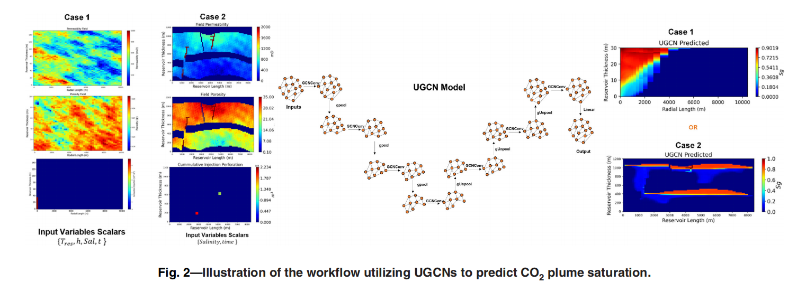
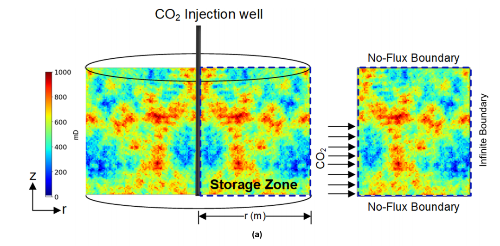
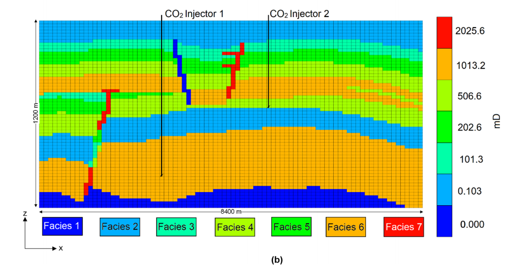
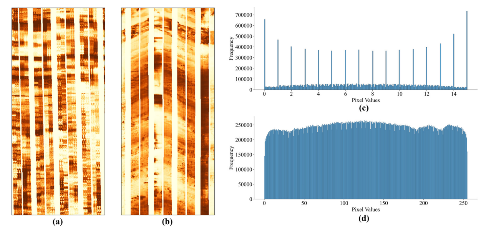
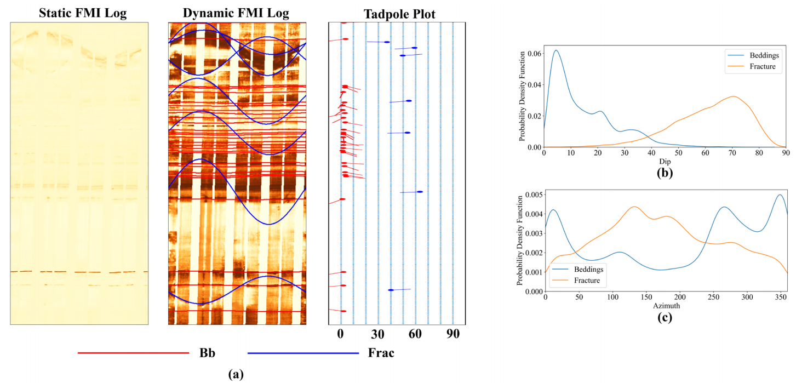
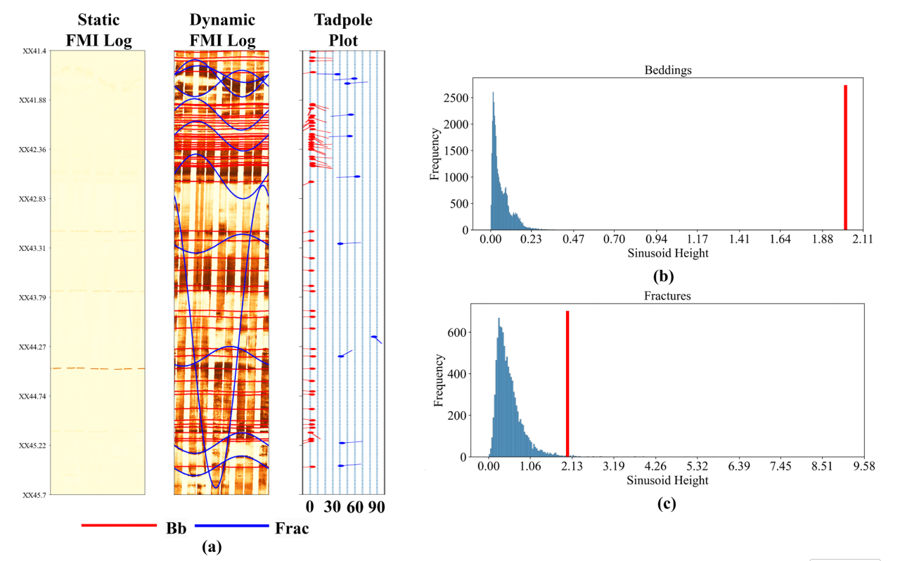
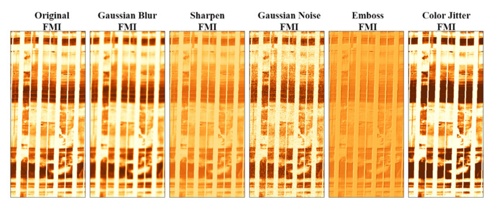
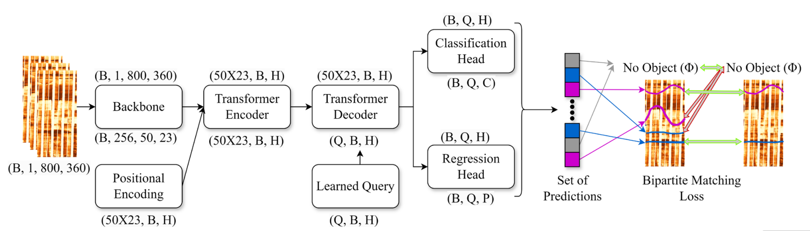

## 一种用于模拟地址碳封存的U-Net增强图神经网络

### 饱和羽流运动：

- 二氧化碳羽流是指注入地下的二氧化碳会在储层中形成一个不断扩展的“云团”或“舌状体”
- 二氧化碳饱和度 = CO₂ 占据的孔隙体积 / 总孔隙体积
- 饱和羽流运动是指二氧化碳饱和度的空间分布随时间的演化过程，空间上，CO₂ 从注入井出发，向四周（或沿高渗透带）迁移，在这个区域内 CO₂ 饱和度从高到低变化。时间上，随着持续注入，羽流逐渐扩大；停止注入后，羽流可能因浮力上升、毛细捕集、溶解或矿化而缓慢变化。

### 摘要：

监测二氧化碳（CO₂）饱和度羽流的运动和压力积聚对于确保地质碳封存（GCS）项目的环境安全性至关重要。高保真数值模拟能够准确建模 CO₂ 羽流的动力学行为，但通常计算成本较高。近年来，数据驱动模型的发展使得 CO₂ 羽流运动的快速预测成为可能。通过利用现有的模拟数据集，这些模型提供了一种高效且不牺牲精度的替代方案。在本研究中，我们采用一种基于 U-Net 架构增强的图卷积神经网络（UGCN），用于预测含水层中 CO₂ 饱和度羽流和压力积聚的时空演化过程。U-Net 架构引入了跳跃连接，使 UGCN 能够同时捕捉高层特征和精细细节。我们构建了基于物理的数值模拟模型，涵盖 CO₂ 注入期和注入后阶段。通过拉丁超立方采样方法，生成了多样化的储层参数和决策参数，从而建立了一个全面的模拟数据库。我们在两个不同的数据集上训练并测试了 UGCN 模型：一个二维径向储层模型（情景1）和一个真实的美国石油工程师学会（SPE 11b，情景2）对比方案模型，用于训练和验证 UGCN 模型。我们将 UGCN 模型的性能与其它标准图神经网络（如图卷积网络 GCN 和图注意力网络 GAT）进行了比较。值得注意的是，UGCN 模型在盲测数据集上表现出优异的性能，分别在情景1和情景2中实现了 0.993 和 0.989 的饱和度预测 R² 值；在压力积聚预测方面，其 R² 值分别为 0.989 和 0.999。这些预测结果表明，所训练模型在预测 CO₂ 饱和度和压力积聚的时空演化方面具有良好的有效性。此外，深度学习（DL）模型的中央处理器（CPU）预测时间显著低于基于物理的储层模拟器（平均每个案例仅需 0.02 秒，而传统模拟器需 10–15 分钟）。这凸显了所提出方法在保持与物理模拟相当精度的同时，大幅降低计算成本的能力。

### 为什么选图卷积神经网络

在图神经网络中，节点代表实体，边代表这些实体之间的关系或交互。在地质碳封存（GCS）过程中，地下地质构造可以被视为图结构，其中节点代表离散的空间位置（例如，网格单元），边则捕捉空间关系（例如，网格单元之间的连通性）和物理交互（例如，流体流动路径）。通过利用图卷积网络（GCN）的力量，可以有效地模拟表征地下环境的复杂空间依赖性和异质性。


### 地质碳封存传统做法：

用商用高保真数值模拟器来跑模型。一个稍微复杂一点的真实储层模型，跑一次完整50年注入+200年监测，可能要跑几小时到几天。要做风险评估、优化等，往往要跑几百到几千次这样的模拟

### 论文做的：

使用UGCN模型把原来要10-15分钟一次的模拟压缩到0.02秒，而且精度几乎一模一样（R² = 0.993–0.999）。好处是：1、可以实时监控，边打CO2边预测；2、做不确定性分析时跑10万次而不是100次；3、做注入策略优化时用蒙特卡洛跑几百万种方案都只要几分钟


### 输入：

- 储层的静态地质参数（每格的渗透率、孔隙度、初始压力、相对渗透率曲线参数等
- 注入方案（注入速率、注入时间、井的位置等）
- 当前时刻 t

### 输出：

- 下一时刻（或任意指定时刻）整个储层每一格的CO₂饱和度（Sg）和压力（P）的完整3D（或2D）分布图



### 数据集：

训练数据全是由CMG模拟器生成的，并不是真实的检测数据，因为真实碳封存项目全球目前真正大规模运行的没几个，因此监测数据极其稀缺，即使有数据，也不可能把整个储层每立方米都测一遍。所以行业里所有论文，几乎都是用高保真数值模拟器（CMG-GEM、Eclipse、Intersect等）生成“合成数据”来训练的。这些模拟器本身已经经过几十年、几千个油田/气田/碳封存项目的验证，和真实历史拟合误差通常在5–10%以内。

数据生成：

1、用Latin超立方采样在参数空间均匀、高效地采样 采样了：

- 渗透率场（随机异质场）

- 孔隙度场

- 相对渗透率曲线参数（λ、残余饱和度等）

- 注入速率（0.2–2.0 Mt/年）

- 储层厚度（25–150 m）

- 毛管压力曲线参数等 

  总共生了几百到上千个完全不同的储层实现

2、把每一个参数组合丢进CMG-GEM跑完整模拟（30年注入 + 170年监测，或SPE 11b的50年注入）

3、把每一步的时间步（比如每半年或每年）的压力场和CO₂饱和度场全部保存下来，就得到了一个超级大的数据集：

- 每个样本 = 一个完整的时空序列（时间步 × 网格数 × 2（P + Sg））
- 总数据量大概是几百个案例 × 200个时间步 × 几千到80万个网格 = 几十亿到上百亿个数据点

4、把这些数据喂给UGCN训练，模型学会了“给定地质+注入方案 → 未来任意时刻的压力和饱和度分布”这个超级复杂的非线性映射。


### 验证：通过两个模拟案例来验证

案例一：径向模型：



- 圆形储层，半径10公里，单口直井在正中心打CO₂
- 储层是异质的（渗透率、孔隙度随机分布），但整体是对称的
- 网格是径向网格（r, z），总网格数大概几千个
- 这个模型简单、跑得快，主要用来快速生成大量训练数据（用Latin超立方采样生了几百到上千个不同的渗透率场、注入速率、厚度等组合）

这个相当于“玩具模型”，用来证明最基本的情况下模型是准的、快的。

案例二：SPE 11b 模型

SPE 11b 是SPE 2023年公开的一个基准案例，专门设计来比谁的碳封存模拟器更准。模拟的是挪威大陆架真实地质情况：有多个断层、5种不同的岩相（facies、渗透率差异可达几个数量级、储层倾斜、两口斜井注入。网格86×160×60 = 806,400个网格，属于工业级真实规模。

R²达到0.989（饱和度）和0.999（压力）




## 利用深度学习自动检测地质特征——用于成像测井中层理与裂缝识别

### 摘要

地质构造中的裂缝和层理面在石油工业的油气勘探与开发中具有重要影响，在储层表征中发挥着关键作用。然而，从**井眼成像测井（BHI）**数据中手动识别这些特征耗时费力。本研究提出了一种自动化系统，以简化裂缝和层理面的识别与挑选过程。该模型旨在通过自动检测裂缝和层理面，加快结果输出速度，同时显著减少人工工作量。本方法基于来自阿曼14口井的BHI数据集（包括**成像测井仪FMI**和**紧凑型微成像仪CMI**）进行训练，提出了一种基于Transformer的模型——地质层理与裂缝检测Transformer（GeoBFDT），用于识别、定位并估计地质结构特征参数（如深度、倾角和方位角）。GeoBFDT采用二分匹配损失函数，以端到端的方式将预测的地质特征类型及其深度、倾角和方位角值与真实标签进行匹配。视觉分析、性能指标、敏感性测试以及对比图表均表明该模型具备识别地下地质特征的能力。在测试集上使用不同深度阈值验证结果显示：在3厘米深度阈值下，裂缝和层理的F1分数分别约为65%和63%；在5厘米阈值下则分别达到约75%和69%。在1.5°倾角阈值下，裂缝和层理的倾角准确率分别为约79%和65%；在3°阈值下两者均达到约90%。类似地，在7°方位角阈值下，裂缝和层理的方位角准确率分别约为83%和75%；在15°阈值下则分别达到约92%和84%。消融实验表明，在数据量相对较小的情况下，较轻量化的骨干网络能获得更优性能，且增加井数可进一步提升模型表现。此外，动态BHI日志的表现优于静态日志。模型对不同井斜角度的适应能力也通过评估其在五口水平井中裂缝检测与定位任务上的表现得到验证，在4厘米阈值下取得了约55%的得分。值得注意的是，所提出的方法超越了现有基于深度学习（DL）方法的目标，能够在单张图像中同时处理多种特征，识别复杂地质区域中的层理与裂缝，摆脱了对掩膜的依赖，并提供了一种端到端的解决方案。与依赖掩膜生成的YOLO或基于掩膜区域的卷积神经网络（R-CNN）等模型不同，本方法关注不同的目标，为特征拾取提供了替代性策略。尽管该模型是在有限数据上训练，并通过验证集和测试集进行验证，但GeoBFDT为实现从BHI数据中端到端自动化地质特征拾取工具提供了一条可行路径。我们期望未来能够进一步探索该方法，以实现整个特征拾取流程的端到端自动化。


### 其他的识别裂缝和层面的方法的问题：

由于测井图像（FMI）中的噪声，它们常常会产生误报，将噪声误认为是地质特征。此外，这些方法的运行时间也很长。

模型无法检测每张图像中的多个裂缝与现实情况不符。此外，它无法检索倾角方位信息，从而限制了对结构的分析。

它难以处理相交裂缝的干扰像素，且无法获取倾角和方位角信息。 缺乏对倾角和方位角的提取验证。

之前的基于分割的方法始终面临识别复杂地质结构的挑战，依赖资源密集且易出错的基于掩码的方法，未提取层理面，并且缺乏倾角和方位角的提取和验证。即使分割算法在预测无噪声掩码的准确性上有所提高，确定地质特征位置、倾角和方位的任务仍然需要手动操作。这些挑战凸显了将重点从特征分割转移到特征检测和参数估计的必要性。不仅需要识别层理和裂缝的位置，还需要自动提取层理和裂缝的倾角和方位值。

传统方法中有“基于掩码的方法”，“掩码”是一个与输入图像尺寸相同（或按比例缩放）的二值图，用于标记图像中某个目标对象所占据的像素区域。掩码中值为1的像素表示属于目标。**先生成一个或多个掩码来精确勾勒出裂缝或层理在图像中的形状和位置，再基于这些掩码进行后续分析**（如参数提取、分类等）。存在缺陷：

| 问题                   | 说明                                                         |
| ---------------------- | ------------------------------------------------------------ |
| **依赖高质量掩码标注** | 需要大量人工精细标注（逐像素），成本极高；地质专家标注一致性差。 |
| **后处理复杂**         | 从掩码到地质参数（如倾角）需额外算法（如霍夫变换、骨架化），易引入误差。 |
| **难以端到端优化**     | 掩码生成与参数估计是分离的两步，无法联合训练优化。           |
| **对噪声敏感**         | 成像测井常有伪影、井眼崩落、仪器条带噪声，影响掩码质量。     |
| **多特征耦合困难**     | 同时识别裂缝+层理时，掩码可能重叠或混淆，需复杂后处理区分。  |


为了解决上述问题并自动化识别和拾取裂缝与层理这一耗时的手动过程，本研究提出了一种基于深度学习架构的方法，称为 GeoBFDT。GeoBFDT 采用二分匹配损失函数（Shokoufandeh 和 Dickinson 1999；Kuhn 1956），并受到检测Transformer（DETR）模型（Carion 等，2020；Nasim 等，2024）的启发。该方法通过提供一个端到端系统，直接检测和定位地质特征，并同时估计其倾角和方位角值，从而克服了基于掩码方法的局限性。与**基于掩码的方法**不同，GeoBFDT 将地质特征检测建模为一个直接的集合预测任务（Liu 等，2016），利用基于 Transformer 的架构实现检测、定位以及倾角-方位角的联合估计（Carion 等，2020）。这使得本研究的根本目标与基于掩膜的方法有所不同，无需进行一对一的比较。本文提出了多种关键评估策略，以使用不同标准来评估这些端到端模型的性能。这些策略将有助于深入理解模型的表现和有效性。我们希望这种新颖的替代方法能够实现对裂缝和层理的倾角与方位角的检测、定位和估计，从而为地质特征分析提供一个高效、端到端的系统。

| 贡献         | 说明                                                         |
| ------------ | ------------------------------------------------------------ |
| 新型检测系统 | 开发了一种名为 GeoBFDT 的新型基于注意力的层面和裂缝检测系统，展示了地下特征的自动识别。 |
| 端到端方法   | 用端到端方法，无需手动创建掩码和后处理步骤，简化了检测过程，提高了效率。 |
| 解决复杂性   | 解决了图像中多重特征检测的挑战，包括识别裂缝和检测层面，增强了模型表征地下构造的能力。 |
| 评估策略     | 提出多种评估策略，包括自定义混淆矩阵、F1 分数、敏感性测试、基于倾角强度的性能评估和蝌蚪图，确保对结果进行公平评估。 |

### 质量控制QC和探索性数据分析EDA



a是一副FMI图像，显示了明显的异常条带（垂直方向上的突变或缺失），颜色变化剧烈。c是其对应的像素值分布直方图，像素值范围仅在 **0–15** 之间（正常应为 0–255）；出现多个尖锐的峰值，集中在整数点（如0, 1, ..., 15）；没有平滑过渡，说明信息丢失或量化严重。这类数据不能用于训练

b是正常的

___


横轴：深度；纵轴：相邻两个标注点之间的距离。每个点表示在某一深度处，两个连续地质特征之间的垂直间距。

但在约 1750 m、2000 m、2400 m深度处出现异常大的间隔，这些大间隔意味着：**在这个深度范围内，可能没有被专家标注任何层理或裂缝**；

___

倾角和方位角分析：



Bedding是层理、Fracture是裂缝 b和c中，dip是倾角，azimuth是方位角，纵轴是概率密度函数

可以看出，层理的倾角比裂缝的倾角小，层面的方位值主要位于分布图的两侧。相比之下，裂缝主要位于中间

___



大多数层理正弦波的高度较低，大约小于 0.25 米，而图 4a 和图 4c 显示的裂缝正弦波高度最高约为 9 米，相当于 3200 像素。然而，由于内存限制，这样的大块高度是不可行的。超过 95%的裂缝正弦波高度大约小于 2 米，因此**选择 2.2 米（800 像素）作为块高度**，在内存限制和裂缝高度考虑之间取得了平衡。

裂缝和层面在展开的BHI（井眼图像）平面上呈现正弦模式时，文中称为“正弦曲线”，后续也采用“正弦曲线检测模型”代替“层面和裂缝检测模型”，以简化表述并增强清晰度。

### 数据集构建

每口井的井眼成像（BHI）平均尺寸是690,000×360 像素，内存占用巨大，采用了图像分块（patch）策略，但某些小块中仅包含部分正弦波状特征，使得从中准确提取倾角（dip）和方位角（azimuth）值变得困难。为解决此问题，引入了**重叠分块**策略，不仅捕获了此前因不完整而被舍弃的正弦波片段，还进一步扩充了数据集规模。

首先，加载井眼成像（BHI）、深度、半径以及对应的标签数据。随后，将数据归一化到0到1之间

剔除了那些仅包含不完整可见正弦波的标签，仅保留图像块中完全覆盖的正弦波特征

倾角和方位角归一化到0-1之间

本研究聚焦于二分类任务——即识别层理与裂缝，暂时忽略裂缝的子类划分

数据增强：



### 模型结构  输入  输出

```
Input Image Patch
       ↓
CNN Backbone（提取特征，输出 feature map，通常是 (B, C, H/32, W/32)）
       ↓
1x1 Conv → 展平 + Positional Encoding → 输入 Transformer Encoder
       ↓
Transformer Encoder（多层 self-attention，得到增强的特征序列）
       ↓
N 个 Learnable Object Queries（N 通常设为 100~300，远大于每张图最大 sinusoid 数量）
       ↓
Transformer Decoder（queries 与 encoder 输出做 cross-attention，多头 self-attention + cross-attention）
       ↓
并行两个 Prediction Heads（共享 decoder 输出）
       ├─→ Classification Head → 输出 N × (C+1) logits  
       │     （C = 2：bedding、fracture，加上 1 个 "no-object" 类）
       └─→ Regression Head → 输出 N × 3（或 4）  
             （归一化的中心深度、dip、azimuth，有时候还会额外预测一个 amplitude/height）
       ↓
训练时：Bipartite Matching（匈牙利匹配）+ 复合损失
推理时：取 confidence ≥ threshold 的预测，或直接取 top-k
```



#### 输入

- 动态FMI/CMI 图像 patch
- 大小：高度 800 pixel ≈ 2.2 m（覆盖了 95% 以上 fracture 的高度），宽度通常是 360 或 384 pixel（展开一圈）
- 图像被归一化到 [0,1]
- 实际训练时还做了大量 augmentation（color jitter、gaussian noise、blur、emboss、sharpness 等），只在训练集做

#### 模型前向处理

和上面写的过程类似

```
1. 输入 patch (B, 3, 800, 360) 或 (B, 1, 800, 360)（单通道也行，论文里用了 RGB 三个通道重复）
2. 通过 CNN backbone（比如 ResNet-18/34，去掉最后全局池化和 FC 层）→ 得到 feature map，比如 (B, 2048, 25, 11)（H/32, W/32）
3. 1×1 卷积把通道降到 d=256 → (B, 256, 25, 11)
4. 展平空间维度 → (B, 256, 275) 或类似，再加 sinusoidal positional encoding
5. 送入 Transformer Encoder（通常 6 层）
6. Decoder 接收 N 个可学习 query（N×256），与 encoder 输出做 cross-attention，同时 query 之间 self-attention（也是 6 层）
7. Decoder 最后一层输出 N×256 的特征
8. 两个并行 FFN（Feed-Forward Network）头：
	分类头：Linear → LayerNorm → ReLU → Linear → 输出 N×3（bedding、fracture、no-object）
	回归头：Linear → LayerNorm → ReLU → Linear → 输出 N×3（depth_norm, dip_norm, azimuth_norm）
```

#### 训练过程

采用 DETR 式的 bipartite matching loss（一对一匈牙利匹配）：

```
1. 模型固定预测 N=100（或 200）个对象（远多于真实数量）
2. Ground truth 只有 K 个（K 通常 < 30），剩余的用 ∅（no-object）补齐到 N 个
3. 计算所有预测与所有 GT（含 ∅）之间的匹配代价（cost）：
	class cost：交叉熵
	参数 cost：L1 loss（depth、dip、azimuth 都用了 L1，有时再加一个 sinusoid amplitude 的 L1）

4. 用匈牙利算法找到一个最优的一对一匹配（最小总 cost）
5. 只在匹配上的那一对计算最终损失：
	分类损失：focal loss 或 cross-entropy（论文里用了 cross-entropy + label smoothing）
	回归损失：L1 loss + GIoU-like loss（有时还会加一个 sinusoid-specific 的曲线匹配 loss）
	总损失 = λ_cls × L_cls + λ_L1 × L_L1 + λ_giou × L_giou
```

这个训练过程几乎复刻了DETR模型（基于Transformer的，facebook提出的目标检测结构）的训练

训练中存在的问题是模型输出多但是真实标签少

**1. 前向传播**

模型固定输出 Q=100 个预测

每个预测包含：

- class logits（3维）：[p_bedding, p_fracture, p_no-object]
- regression（3维，已归一化到[0,1]）：[depth_center, dip, azimuth]

例子（假设一张 patch 里真实有 3 条 sinusoids）： 模型实际输出的前 6 个预测可能是（简化写法）：

```
Pred 0: class = fracture (prob 0.95), depth=0.48, dip=0.75, azimuth=0.35
Pred 1: class = bedding  (prob 0.88), depth=0.22, dip=0.08, azimuth=0.92
Pred 2: class = fracture (prob 0.91), depth=0.71, dip=0.68, azimuth=0.38
Pred 3: class = no-object (prob 0.99), …
Pred 4: class = no-object (prob 0.97), …
…
Pred 99: class = no-object (prob 0.88), …
```

**2. 真实标签**

真实标签只有3条

```
GT 0: class = fracture, depth=0.50, dip=0.73, azimuth=0.34
GT 1: class = bedding,  depth=0.20, dip=0.10, azimuth=0.94
GT 2: class = fracture, depth=0.70, dip=0.70, azimuth=0.37
我们把 GT 列表后面补 97 个 “∅（no-object）” → 总共也变成 100 个。
```

**3. 计算100x100的代价矩阵**

对每一个预测 i 和每一个 GT j 计算一个代价 C_ij，越小越好。

计算公式（论文里就是这个）： 如果 GT j 是 ∅（no-object）： C_ij = -log( p_no-object of pred i )   # 只看分类代价

如果 GT j 是真实 正弦曲线： 

C_ij = -log( p_correct_class of pred i ) + λ·L1(pred_params_i, gt_params_j)

λ 是超参（论文里 λ 一般取 5~10 左右，回归误差更重要）

继续上面的例子，cost matrix 里最小的几个值可能是：

```
C_{10,0} = 0.05 + 5×0.03 = 0.20   ← 预测10 和 GT 0 很像
C_{56,1} = 0.12 + 5×0.04 = 0.32   ← 预测56 和 GT 1
C_{77,2} = 0.09 + 5×0.02 = 0.19   ← 预测77 和 GT 2
剩下的都很小（因为都是 ∅，大概 0.01~0.12）
```

**4. 匈牙利算法（Hungarian Algorithm）找最优一对一匹配**

匈牙利算法在 100×100 的 cost matrix 里找一个排列（permutation σ），让总代价 ∑C_i,σ(i) 最小，且每个预测和每个 GT 最多只能匹配一次。

结果大概是： 

```
预测10 - GT 0（fracture） 
预测56 - GT 1（bedding） 
预测77 - GT 2（fracture） 
剩余的预测 - 剩余的 97 个 ∅
```

**5. 计算最终损失（只在匹配对上算）**

分类损失（对所有 100 对都算，包括 ∅）： L_cls = cross_entropy( pred_class_i , matched_gt_class_σ(i) )

回归损失（只对非 ∅ 的匹配算，上面例子只有 3 对）： L_reg = L1(depth) + L1(dip) + L1(azimuth) （论文里可能还加了额外的 sinusoid amplitude 的 L1，辅助收敛更快）

总损失 = `L_cls + λ_reg × L_reg`   （λ_reg 一般 5~10）

**L1是MAE**

#### 输出

每张 patch 的最终输出是一个列表set，每个元素包含：

- class：bedding 或 fracture（推理时会 softmax 后取概率最高的类，confidence 低于阈值（如 0.5~0.7）就丢弃）
- depth：patch 内归一化的中心深度（再乘以 patch 高度换算回实际深度，单位 m 或 cm）
- dip：0~90°
- azimuth：0~360°

```json
[
  {"class": "fracture", "depth": 1.23 m, "dip": 68.4°, "azimuth": 127.3°, "confidence": 0.96},
  {"class": "bedding",  "depth": 0.87 m, "dip": 12.1°, "azimuth": 345.8°, "confidence": 0.89},
  ...
]
```


**GeoBFDT 就是把 DETR 的 box 回归头改成了“地质正弦曲线参数回归头”，加上小 backbone + 大量 数据增强+ 仔细的 QC 和 patch 策略，在小样本地质图像上实现了真正可用的端到端 层理 / 裂缝 自动分类。**


### 评估体系

该评估体系在此论文中反复被强调是核心贡献之一，这是因为此方法和之前的基于掩码的方法不同，无法沿用他们的评价指标。

首先先用“二分匹配”把预测和真实标签匹配上，匹配条件是深度误差 + dip + azimuth L1 综合 cost 最小

多阈值 F1-score：

```
然后用不同深度阈值（depth tolerance）判断定位是否准确：
    3 cm 深度阈值 → fractures F1 ≈ 65%，beddings F1 ≈ 63%
    5 cm 深度阈值 → fractures F1 ≈ 75%，beddings F1 ≈ 69%
    横井（5口）上用 4 cm 阈值 → F1 ≈ 55%（证明模型对井斜变化有一定鲁棒性）
```

Dip 和 Azimuth 回归准确率（多阈值误差统计）：

```
Dip accuracy

 ±1.5° 阈值：fractures ≈ 79%，beddings ≈ 65%
 ±3° 阈值：fractures & beddings 都 ≈ 90%

Azimuth accuracy

 ±7° 阈值：fractures ≈ 83%，beddings ≈ 75%
 ±15° 阈值：fractures ≈ 92%，beddings ≈ 84%
```

作者特意用了两个阈值（宽松+严格），让读者能直观看出模型在实际生产中能达到什么水平（地质上一般±3° dip、±15° azimuth 已经可用）。

