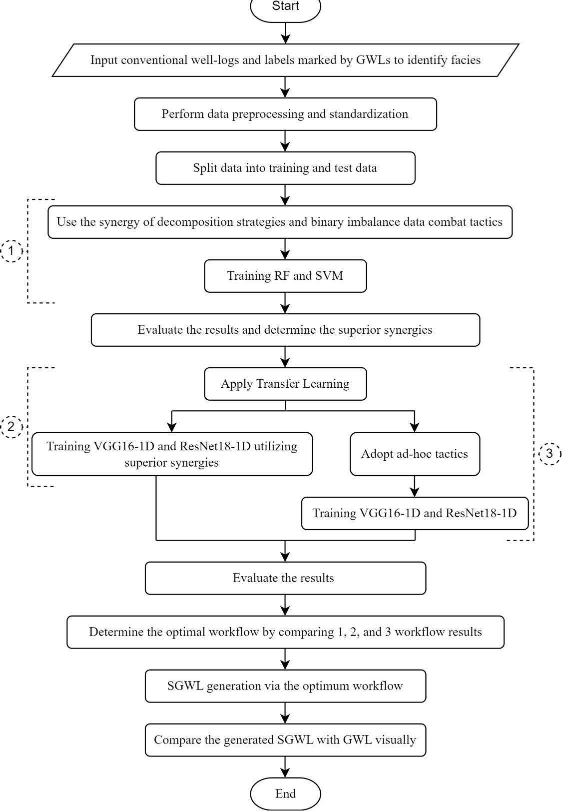
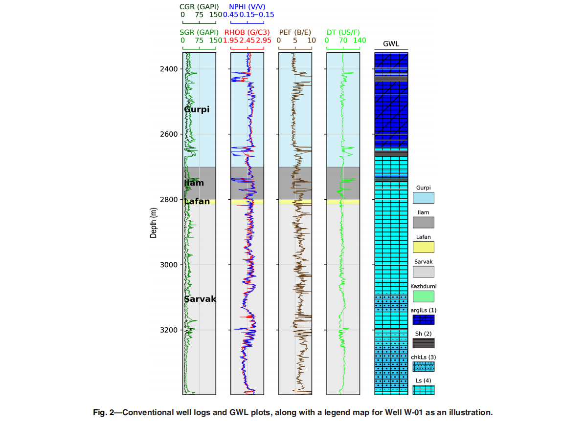
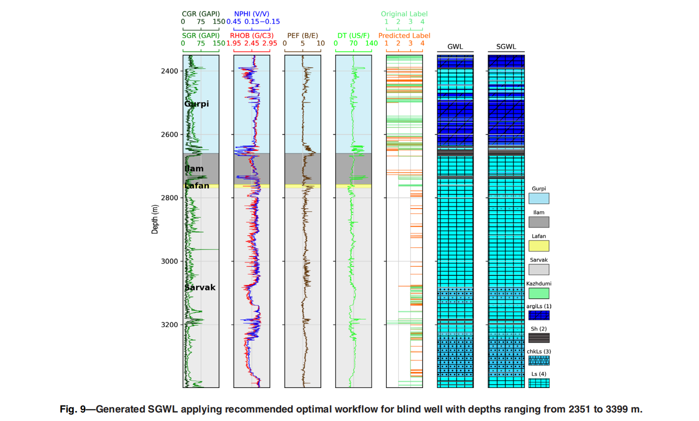
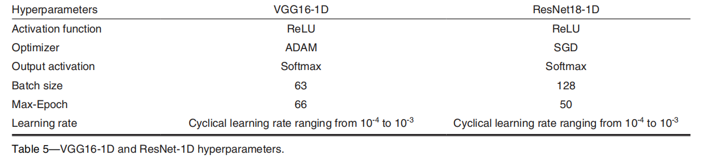
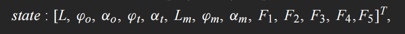
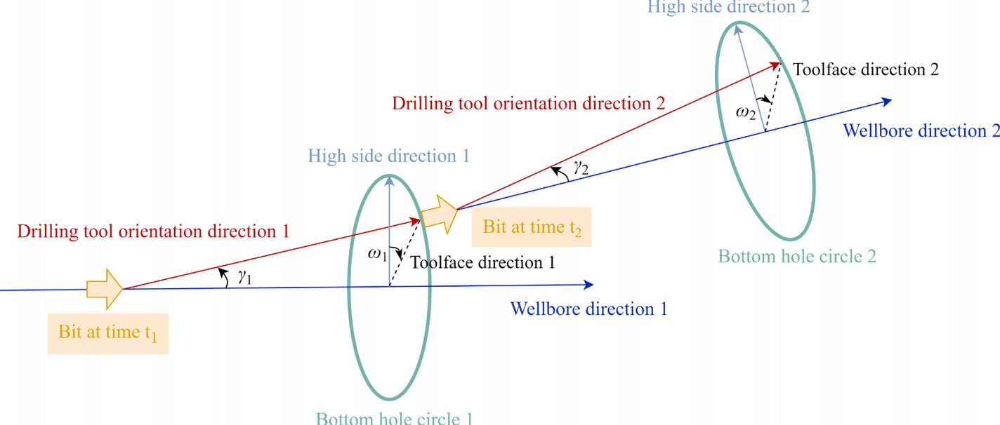
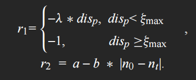
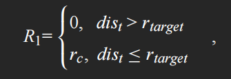

## 使用增强深度学习工作流生成合成图形测井曲线：不平衡多类数据、样本量和可扩展性挑战

### 摘要：

本研究提出了一种基于迁移学习（TL）的增强型深度学习（DL）工作流程，用于生成高分辨率的合成图形测井（SGWL）。为检验所提出工作流程的可扩展性，选择了一个具有高度地质非均质性的碳酸盐岩储层作为案例研究，并在未见数据（即盲井）上对所开发的工作流程进行了评估。数据来源包括邻井的常规测井和图形测井（GWL）。在钻井作业期间，GWL是采集数据的标准做法。GWL提供了地下岩相的快速可视化表示，以建立地质关联。

本研究调查了伊朗西南部某油田的五口井。由于地下地质的非均质性，**本研究的主要挑战在于解决不平衡的岩相分布问题**。处理不平衡数据的传统人工智能策略[例如，改进的合成少数类过采样技术和Tomek link]主要设计用于解决二分类问题。然而，为使这些方法适应即将面临的不平衡多类情况，采用了"一对一"和"一对多"分解策略以及特定技术。采用众所周知的VGG16-1D和ResNet18-1D作为自适应深度算法。此外，为突显这些算法的鲁棒性和效率，还使用了支持向量机和随机森林这两种浅层学习方法作为常规的岩相分类方法。

另一个主要挑战是需要足够的数据点来训练深度算法，这通过迁移学习得以解决。在确定一口盲井后，将其他四口井的数据输入模型进行训练。采用平均Kappa统计量和F-measure作为适当的不平衡数据评估指标，来评估所设计工作流程的性能。

数值和可视化对比分析表明，当与OVA方案（作为分解技术）和TKL（作为二元不平衡数据应对策略）结合时，VGG16-1D TL模型在盲井数据集上表现更好。平均Kappa统计量达到86.33%，平均F-measure达到92.09%，证明了所设计工作流程的优越性。考虑到不同不平衡岩相分布的普遍性，所开发的可扩展工作流程对于生成SGWL而言是高效且富有成效的。

### 结论

本文报告了一项旨在利用深度学习（DL）算法生成高分辨率沉积相图（SGWL）的实验结果。在分析之前，原始数据（包括常规岩性数据和地质解释图GWL）经过了预处理，尽可能通过线性判别分析解决了重叠、偏移和不一致等问题。本研究面临四个主要挑战：样本量小、多分类数据集不平衡、所提流程的可扩展性以及深度学习模型的适应性。研究通过逐步设计一种可扩展的最优工作流程来应对这些挑战，即采用“一对一”（OVA）策略作为分解技术，并结合TKL（一种用于处理二分类不平衡数据的战术）与VGG16-1D迁移学习（TL）模型。TKL与OVA协同作用，有效解决了高度不平衡的多分类数据集问题；而样本量有限的挑战则通过迁移学习得以缓解。深度学习的可扩展性通过预设的VGG16-1D模型实现，该模型广为人知且具备良好的可扩展性。

此外，为评估所提出工作流程在盲井数据上的表现并验证其可扩展性，选取了一个具有高度地质非均质性的碳酸盐岩储层作为案例研究。在盲井数据评估中，最优工作流程实现了86.33%的平均Kappa统计值和92.09%的平均F分数。同时，VGG16-1D模型在鲁棒性方面优于传统的支持向量机（SVM）和随机森林（RF）等常规岩相分类模型。混淆矩阵的评估结果也表明，该最优流程在argiLs、Sh、chkLs和Ls岩相类型上表现出最佳性能。

此外，对最优流程生成的SWGL进行视觉检查显示，其与GWL之间匹配度良好，尤其在少数类（如Sh）方面表现突出。本研究首次系统探讨了VGG16、ResNet18和迁移学习模型在该任务中的性能，并提出了处理不平衡多分类数据以生成SGWL的有效策略。所提出的分析方法核心在于综合运用多分类不平衡数据处理技术、成熟深度学习架构及迁移学习。该最优工作流程已证明其在生成SWGL方面的高效性，不仅快速易用，还能有效处理高度不平衡和受限的数据集。综上所述，所提出的工作流程在生成的SGWL与GWL之间取得了令人满意的关联性。此外，实验结果证实，可训练参数的数量、超参数调优以及迁移学习均能显著影响深度学习算法的效果。然而，增加模型复杂性和深度有时也能带来性能提升。

___

作者认为已有的 基于深度学习的岩相分类 存在三个缺点：

1. 为特定案例研究设计
2. 未考虑多类不平衡分布（不同岩层的岩石岩性分布不同）
3. 忽略了样本量

本文目标解决4个关键挑战：

1. 多分类数据集不平衡问题 --> 将分解策略与专门应对二元不平衡问题的方法相结合
2. 样本量偏小问题 --> 迁移学习
3. 深度学习模型的适应性问题 --> 采用自适应且预先设计的超深层算法（ResNet18和VGG16的1D变体）
4. 所涉及工作流程的可拓展性问题 --> 找了盲井数据测试

___

### 概念解释

SMA：浅层机器学习算法

PDA：预训练深度学习算法

GWL——地质测井解释图：由地质学家或测井解释专家基于常规测井曲线（如自然伽马、电阻率、声波时差、密度等）、岩心数据、录井资料等，人工解释并绘制出的**沉积相或岩相剖面图**。

SGWL——合成（或生成）高分辨率地质测井解释图：SGWL 是本文通过**深度学习模型**（如 VGG16-1D 迁移学习架构）自动生成的沉积相预测结果。与传统 GWL 相比，SGWL 具有**更高垂向分辨率**（可达到测井采样点级别，如每0.15米一个数据点），能够更精细地刻画岩相变化，尤其在缺乏岩心或专家解释的“盲井”中提供连续、客观的岩相预测。

地层单元：

- Gurpi
- Ilam
- Lafan
- Sarvak
- Kazhdumi

沉积岩相类型：

- argiLs：泥质灰岩
- Sh：页岩
- chmLs：含燧石灰岩
- Ls：灰岩

工作流程：

### 如何解决训练数据中的多类数据分布不平衡

本文采用两种技术来应对多类不平衡数据：1. 基于分解的方法 2. 临时调整的方法

岩石类型有多个类别，且有些类样本少

OVA（一对所有）和OVO（一对一）是分解策略，用来把复杂的多类分类问题“拆分成”多个简单的二元分类子问题。因为多类不平衡太乱，直接处理效率低，先拆成二元，就能用现成的二元不平衡工具了。

OVA：把每个类别单独拎出来，当成“正类”（少数或多数），其他所有类别合并成“负类”。比如：

- 子问题1：argiLs vs (Sh + chkLs + Ls)
- 子问题2：Sh vs (argiLs + chkLs + Ls)
- 以此类推，总共4个子问题（因为4类）。

OVO：两两配对，每个类别只和另一个类别比。比如：

- argiLs vs Sh
- argiLs vs chkLs
- argiLs vs Ls
- Sh vs chkLs
- 以此类推，总共6个子问题。

用OVA/OVO将多类拆成二元，然后在每个二元子问题上应用“二元不平衡应对战术”，平衡子问题数据，最后组合回多类结果

具体战术：

过采样：针对少数类“制造”更多样本，让它和多数类平衡。

- M-SMOTE：基于少数类邻居点，合成新样本（不是简单复制，避免过拟合）。
- ADASYN：类似，但优先给“难分”的少数样本多生成（自适应）。
- 联系：在 OVA/OVO 子问题中，如果正类是少数，就用这个增加它。

欠采样：针对多数类“删除”一些样本，减少它。

- TKL (Tomek Link)：找多数类和少数类“边界”上的点，删多数类的干扰点，让边界更清。
- ENN (Edited Nearest Neighbors)：删多数类中被少数类“包围”的噪声点。
- 联系：在子问题中，如果负类太大，就用这个瘦身。文章中 TKL + OVA 是最佳组合。

成本敏感学习 (Cost-Sensitive Learning, CSL)：不改样本数，而是“加权重”。给少数类错误更高的“罚分”，让模型更在意少数类（比如错分 Sh 罚 10 分，错分 Ls 只罚 1 分）。

- 联系：在子问题训练时，直接改模型的损失函数，适合 RF/SVM。

Workflow 1 通过组合测试（比如 OVA + TKL + RF），评估性能（用 kappa 和 F-measure），找出优胜者（如 OVA + TKL），然后传给 Workflow 2 的深度模型。

___

平均kappa系数  常被用于评估多类别不平衡分类场景

___

### 输出-->输出

#### 输入

来自伊朗西南部油田的5口井（W-01至W-05），总共205,464个有效数据点

输入数据是数值型井日志和类别标签（从GWL中手动提取）

**常规井日志（Conventional Well Logs）**：作为输入特征，包括：

- Computed gamma ray (CGR, 单位: GAPI)
- Spectral gamma ray (SGR, 单位: GAPI)
- Neutron porosity (NPHI, 单位: V/V)
- Density (RHOB, 单位: G/C3)
- Photoelectric (PE, 单位: B/E)
- Sonic (DT, 单位: US/F)

**图形井日志（GWLs）标签**：作为目标变量，手动基于GWL标注的岩相（facies）类别：

- argiLs (argillaceous limestone, 泥灰质石灰岩): 6,735样本 (19.66%)
- Sh (shale, 页岩): 1,879样本 (5.47%) —— 少数类
- chkLs (chalky limestone, 白垩质石灰岩): 6,046样本 (17.66%)
- Ls (limestone, 石灰岩): 19,584样本 (57.19%) —— 多数类
- 总目标样本: 34,244，高度不平衡（多类不平衡问题）。

#### 输出

高分辨率合成图形井日志（SGWL）

#### 中间步骤

1. 数据预处理

   检查并移除缺失值、出liers（异常点）、重复行/列、低信息列（单值列、低方差列）。

   相关性分析：移除高度相关的输入特征（避免多重共线性）。

   标准化：所有输入变量转换为零均值、单位方差。

   类分离：用线性判别分析（LDA）提高岩相间分离度，平均准确率97%。LDA投影数据到低维空间，最大化类间距离、最小化类内变异，帮助缓解钻井干扰（如泥浆问题导致的边界模糊）。

   数据分裂：用分层采样分成75%训练集、25%测试集。盲井（W-03）单独保留用于验证。

2. workflow1：分解策略+二元不平衡处理+浅层模型

   上面说过了，通过分解策略+二元不平衡处理之后，用随机森林RF和SVM训练每一个组合，用Avg. kappa和Avg. F-measure计算测试集和盲井结果（10次平均）。文中表6/7是结果

   OVA + TKL最佳

3. 迁移学习

   预训练VGG16-1D和ResNet18-1D（1D变体，适合井日志序列）

   超参数调优：

4. workflow2：迁移的深度模型+优选二元组合

   模型是迁移来的VGG16-1D和ResNet18-1D

   用OVA分解 + TKL/ENN平衡子问题

   交叉熵损失，Avg. kappa和F-measure（10次平均）评估

   结果：VGG16-1D + OVA + TKL最佳（盲井Avg. F 92.09%, kappa 86.33%）。VGG16-1D优于ResNet18-1D（深度不总是更好）。

5. workflow3：直接用多类不平衡工具（ad-hoc）测试，比较Workflow 2

   Ad-hoc方法（见Table 3）：Static-SMOTE（逐步过采样最小类）、MDO（基于马氏距离生成样本）、GCS（全局权重）。

   模型：同Workflow 2，+ TL。

   训练和评估：同上。

   结果：Ad-hoc不如Workflow 2。证明分解+二元工具更好。

workflow2最好，应用最优工作流生成输出，并验证。

### workflow1中已经确认了OVA + TKL最佳，在workflow2中为什么还要测试OVA + ENN？

在Workflow 1中，虽然OVA + TKL确实是整体表现最佳的组合,但ENN作为另一个欠采样战术，在相同测试中排名第2，仅次于TKL。这意味着ENN也是Workflow 1中表现优异的优选组合之一，在Workflow 2中继续测试ENN是为了进行全面比较和验证

## 基于迁移强化学习的靶标感知井眼轨迹控制方法

### 摘要

在实际的施工过程中，井眼轨迹控制是一项具有挑战性的任务，主要原因是地质因素导致的不可避免的井眼偏移以及钻头扩孔效应。大多数传统的井眼轨迹控制方法侧重于复杂的机理模型构建。这些方法通常基于某些约束条件或假设，反映出其在准确捕捉实际钻井过程方面能力有限、智能化水平低、抗干扰性能差以及适应能力弱等问题。为应对这些挑战，本文提出了一种融合强化学习与迁移学习的目标感知型井眼轨迹控制方法。该方法采用基于优先经验回放机制的深度确定性策略梯度模型，并利用迁移学习加速模型训练，从而实现具备强抗干扰能力的目标感知型自适应控制系统。所提出的基于强化学习和迁移学习的目标感知控制方法能够在多样化的地质环境中精确跟踪预设轨迹，高精度到达目标区域，并在测量随钻（MWD）过程中即使目标轨迹与储层实际分布不一致时，仍能做出合理的轨迹优化决策。该方法表现出优异的抗干扰能力和自适应能力。

___

### 名词解释

DDPG：深度确定性策略梯度

MWD：随钻测量

BHA：井底钻具组合

___

### 强化学习的设置

为通过强化学习解决井眼轨迹控制问题，问题形式化：定义智能体状态空间、动作空间、奖励函数

定义智能体状态空间：

动作空间：

w: 0~pi/2  γ：0~2pi

奖励函数：

约束要求：

	1. 必须精确跟踪预设轨迹，遇见不确定因素干扰而导致轨迹偏移时，应尽快做出轨迹控制策略
	1. 轨迹必须精准命中目标
	1. 充分考虑钻井环境的多样性，充分发挥随钻数据在地层识别中的作用，当预设轨迹偏离实际目标储层时，应自适应调整轨迹跟踪策略，以确保实际钻井轨迹始终朝着目标方向前进。

**奖励函数R = R1 + R2**，R1是一个单步奖励，R2是回合奖励

R1 = r1 + λ*r2，r1表示跟踪预设轨迹的奖励，r2表示朝向目标储层行进的奖励，λ为用于调整两种奖励权重的系数。

在奖励r2中，a和b为常数，n0和nt分别为当前油层序列和目标油层序列。该奖励旨在激励智能体向目标油藏钻井。当当前油层序列与目标油层序列一致时，奖励达到最大值。

R2是一个回合奖励，用于鼓励智能体抵达目标区域。

其中，dis_t为当前钻井位置与目标之间的距离，r_target为目标区域的半径。当当前钻井位置与目标之间的距离小于或等于目标区域的半径时，即认为井眼轨迹成功命中目标。此时，将给予显著奖励r_c，并终止当前回合。

___

### 输入

输入主要来自钻井过程的实时数据和预设规划，用于描述当前钻井状态和目标。

**当前钻井位置**：如当前井深、当前方位角和当前倾角。这些数据通过测量工具实时获取。

**预设钻井路线**：专家预先设计的轨迹数据，包括目标储层的方位角、倾角，以及目标点的井深、方位角和倾角。这作为基准，帮助模型知道“应该去哪里”。

**实时测量数据**（仅在复杂任务中使用）：地质特征，如电阻率、伽马射线等（论文中标记为F1到F5）。这些帮助模型感知地下变化，比如判断是否到达目标储层或需要调整路径。

这些输入组合成一个“状态空间”，源任务（简单版）是5个数据点，目标任务（复杂版）扩展到13个

### 迁移学习 + 强化学习的预训练和训练

#### 预训练（源任务）

- 在基本场景下训练DDPG模型，只用位置和预设路线数据。
- 模型在模拟环境中反复尝试：从当前位置选择方向调整（动作），执行后看结果，得到奖励。
- 它记住经验（存储在缓冲区），优先回放有价值的经验（比如大错误的教训），逐步更新两个网络（DDPG由演员网络和评论家网络组成）：一个选动作（Actor），一个评估好坏（Critic）。
- 迭代很多次，直到模型学会基本跟踪预设路线。目的是打好基础

#### 迁移学习（知识转移）

把源任务学到的技巧“映射”到复杂任务：用神经网络将复杂输入（13个数据）简化成简单输入（5个），并将简单动作映射回复杂动作。

#### 训练（目标任务，复杂版，有实时测量数据）

- 基于源任务基础，继续在模拟环境中试错，但现在输入包括实时地质数据。
- 代理结合源任务的映射动作和自己的新动作，执行调整，获取奖励。
- 还是用DDPG：存储经验、优先回放、更新Actor和Critic网络。但现在更注重自适应，比如如果实时数据显示预设路线错位，模型会自动优化路径。
- 迭代次数少一些，因为有迁移加速。整个过程确保模型在干扰下鲁棒，比如地质变化时还能保持精度。

### 处理输入

- 在目标任务中，先用迁移映射将复杂输入转为简单形式，源网络给出初步动作建议；目标网络再加自己的调整，组合成最终动作。
- 模型输出动作，模拟环境执行，产生新状态和奖励；反馈回模型，更新参数（如果在训练中）或直接用（如果在预测中）。
- 重复这个过程，模型逐步学会：如果偏离，快速校正；如果地质变，基于实时数据调整，不死跟预设路线。

___

## 2025 A Review of AI Applications in Unconventional Oil and Gas Exploration and Development

非常规油气勘探中人工智能应用的综述

文中讲了AI应用于地质勘探、油藏工程、生产预测、水力压裂、提高采收率（EOR）以及健康、安全与环境（HSE）管理

3.1 人工智能在地质勘探中的应用

- 3.1.1 储层气概率预测
- 3.1.2 岩性分类
- 3.1.3 脆性指数估计
- 3.1.4 总有机碳含量预测
- 3.1.5 地质力学参数预测

文中表1对类别、模型、输入参数、输出参数做了汇总

___

3.2 人工智能在储层工程中的应用

- 3.2.1 储层表征和渗透率预测
- 3.2.2 非常规储层的渗透率预测
- 3.2.3 储层模拟和历史拟合

文中表2对类别、模型、输入参数、输出参数做了汇总

___

3.3 人工智能在非常规油气生产预测中的应用

- 3.3.1 LSTM
- 3.3.2 ANN/DNN
- 3.3.3 Random Forest
- 3.3.4 混合CNN-RNN
- 3.3.5 其他模型

文中表3对类别、模型、输入参数、输出参数做了汇总

___

3.4 人工智能在非常规油气水力压裂中的应用

表4

___

3.5 人工智能在非常规油气强化采油（EOR）方法中的应用

CO2驱替

表5

___

3.6 人工智能在非常规油气项目 HSE 管理中的应用

3.7 人工智能在非常规油气领域的工业应用

___

局限性：

- 1、数据质量和可用性限制 
- 2、模型泛化能力有限
- 3、模型可解释性差及缺乏物理意义
- 4、领域知识与物理约束的整合不足
- 5、计算成本与实时需求之间的冲突
- 6、技术集成与应用的实际障碍

___

前景：

- 1、建立高质量的数据共享和标准化系统
- 2、将领域知识和物理约束相结合以开发物理驱动的 AI 模型
- 3、增强模型泛化能力和适应性
- 4、提升模型可解释性和透明度
- 5、优化计算资源和模型效率
- 6、为油气田构建集成智能管理系统