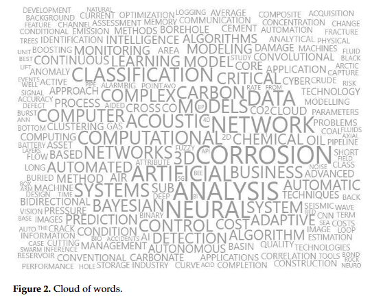
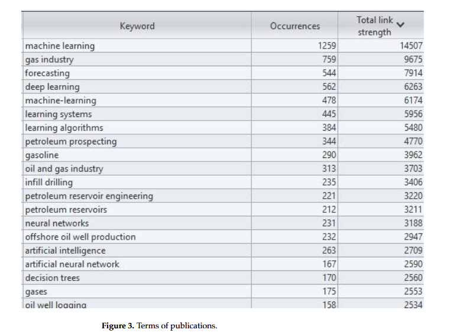
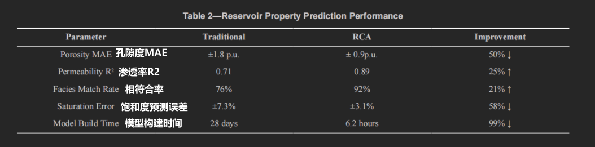
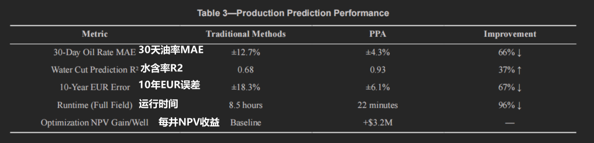
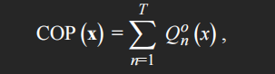
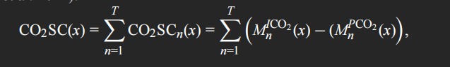
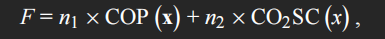

## 石油和天然气工业中的人工智能：应用、挑战和未来方向

2025年3区 Artificial Intelligence in the Oil and Gas Industry: Applications, Challenges, and Future Directions

对于地震解释，卷积神经网络（CNNs）等监督方法在检测空间模式方面非常有效。相比之下，无监督方法（如长短期记忆（LSTM）网络）更适合识别与岩石变化或储层压力相关的时序序列。

### 1. Introduction

简单介绍了AI在和石油天然气工业中的各种应用

### 2. Mateirals and Methods

1、说明了使用 Scopus 数据库检索文献的关键词、出版时间

2、更具体：通过使用“生产系统”、“机器学习”和“神经网络”等关键词，探索了石油工程研究的关键资源——OnePetro 数据库。这一步旨在将更广泛的 AI 应用与生产优化和钻井的实际用例联系起来。

### 3. Results

3.1 Oil and Gas Industry and AI 

首先说了随着人工智能的发展，传统石油天然气领域正获得更多动力，预测故障和优化流程、实时分析大量数据并给出解决方案，机器学习技术被用于提高运营效率并预测设备的使用寿命。地震处理、储层模拟和井口自动化，正提高准确性和安全性。

钻井服务涉及生产性、非生产性和浪费时间的活动，在钻井中导致延误的主要问题包括：重新开钻、井眼改道和重新钻进、井漏、井涌和井喷、打捞。最常见的生产问题包括：固体沉积物、井完整性故障、储层问题。

人工智能技术在石油和天然气行业的应用对于优化生产以及预测故障以避免重大问题至关重要。

3.2 Bibliometric Analysis 文献计量分析

说了：图2有助于理解该领域内不同领域和技术之间的联系，说明了深度学习、神经网络和预测等概念之间的战略交互。图 3 通过详细说明特定应用的相关主题，腐蚀、声学、分类和计算系统等术语突出了机器学习可以解决的具体挑战，表明其在工程、医疗保健、能源和材料科学等领域的适用性。

对图3中出现的关键词进行了分析，例如，“石油勘探”等关键词突出了人工智能技术在提升自然资源勘探过程、提高运营效率以及降低成本方面的重要性。“神经网络”等关键词……

**然后开始了具体的文献介绍**

### 4. Discussion

___

## 石油和天然气勘探中的机器学习：综述

2023_12 Machine Learning in Oil and Gas Exploration: A Review, IEEE Access

本文详细概述了机器学习在**地震数据处理、岩相分类和储层性质预测**中的参与情况。此外，该综述确定了阻碍机器学习在勘探中广泛应用的一些独特障碍，包括地下参数的不确定性、规模差异以及处理时空数据复杂性的问题。 

___

## GenAI 多智能体 检索增强生成 在石油和天然气中的应用

本文的创新主要是应用领域的创新，做了两个实验，实验设置如下：

### 数据集：

向量数据库中存的数据更多一些，但是用于评估的少：

12个公开的完井和钻井报告PDF，总计874页（包含547张图像和1025个表格）

4个视频，描述井测井过程、解释和岩石物理学介绍，总时长83分钟。

### 问题集：

总共43个问题，按模态分类：13个文本型、11个表格型、2个图像型、2个视频型、15个混合型（需要多模态信息合成答案）。

### 评估指标：

检索级指标（评估检索到的上下文质量）：

- Contextual Precision：检查答案是否基于提供的上下文，不超出范围。
- Contextual Recall：检查答案是否覆盖上下文中的最大有用信息。
- Contextual Relevancy：评估检索上下文与答案的相关性。

响应级指标（评估生成的答案质量）：

- LLM-as-Evaluator：另一个LLM模型评估响应质量（参考引导的成对比较）。
- Answer Relevancy：检查答案是否直接准确回应查询（基于原问题与基于答案生成的子问题的余弦相似度均值）。
- Faithfulness：检查答案与检索上下文的一致性（是否虚构信息）。
- Answer Semantic Similarity：预期答案与实际答案的余弦相似度（仅用于第一个实验）。

### 评估方法：

使用Langfuse和DeepEval，每个问题运行评估脚本三次，确保一致性。

### 实验1：传统RAG vs. mRAG

- 传统RAG的 知识库是纯文本模态，用户查询也只支持纯文本查询；
- mRAG的知识库支持多种模态，使用OCR、布局分析等技术从 PDF/图片中提取文本，对非文本元素，保留原始多模态数据，并用多模态嵌入模型（如 CLIP）直接向量化，存入多模态向量库。检索时在文本库+多模态库中联合检索

文中对43个问题运行评估

结果：mRAG在回答语义相似度上对所有模态都更高，表明mRAG更鲁棒，尤其在多模态任务中，提高了答案的上下文准确性和可靠性。

### 实验2：LLM模型比较

- GPT-4.1
- Llama-4-Maverik
- Mistral-Large
- GPT-OSS-120B
- GPT5

使用相同数据集和43个问题，按模态（所有、文本、表格、图像、视频）评估。

目的是：**在mRAG pipeline 中使用5个不同大小的LLM模型进行基准测试，评估它们在多模态查询处理中的性能。**

结果：mRAG有效统一多模态嵌入，GPT-4.1、GPT5和GPT-OSS-120B最可靠。GPT5几乎最好，视频模态最难

### 创新点/本文工作

设计了一个端到端系统，处理钻井/完井特有的多模态数据

用的pipeline是自己开发的吧：PDF-Based Retriever、Video-Based Retriever

LLM模型确实是现有的，文章用它们基准测试，创新在于管道优化和O&G数据集上的评估。

___

## 探索多智能体模型在油藏表征和产量预测中的潜力

Exploring The Potential of Multi-Agent Models for Reservoir Characterization & Production Prediction

提出一个多代理（multi-agent）人工智能框架，旨在解决成熟油田（特别是高含水率油田）中的储层管理复杂挑战

该框架中有4个agent：

- 数据处理代理（Data Processing Agent, DPA）
- 剩余油分析代理（Remaining Oil Analysis Agent, ROAA）
- 储层表征代理（Reservoir Characterization Agent, RCA）
- 生产预测代理（Production Prediction Agent, PPA）

### 数据处理代理 DPA

作用：提取、验证、转换和路由异质数据，包括检测异常值、提取元数据、验证完整性，并将数据分块，为下游代理提供结构化数据。

输入：多模态数据，如岩石物理表格（孔隙度-渗透率-饱和度）、汞注入毛细压力曲线（MICP）、地震属性和文本报告。

手动处理和DPA处理进行比较：

### 剩余油分析agent ROAA

作用：量化剩余烃分布，整合地质、岩石物理和动态生产数据，识别旁路油区，增强采收规划

输入：从**DPA验证的数据**，包括MICP曲线、地质障碍、注入-生产不匹配和裂缝网络数据。

训练方法：整合汞注入毛细压力（MICP）曲线和深度学习模型（如LSTM网络），用于建模饱和度滞回和捕获油动态。采用混合方法捕捉孔喉效应，通过模式识别算法检测未扫及区域。

效果：在长庆油田试验中，与传统方法比较，量化未扫及区饱和度预测错误±4.1% MAE，较传统方法改善22%（±4.3% MAE）。在长庆油田识别12个先前忽略的支付区，总估算体积3.2百万吨。

### 储层表征agent RCA

作用：生成高分辨率3D储层模型，捕捉沉积特征和流体分布。整合多代理能力进行整体属性分析。

输入：测井、岩心数据、地震属性。长庆三叠系致密砂岩油田数据：12,873个岩心样本、142个MICP曲线、3D地震属性。

训练方式：使用物理信息神经网络（PINN）和生成对抗网络（GANs），训练于岩心图像和数据。包含子代理：岩石物理代理（使用PINN将测井转换为孔隙度/渗透率）、相模式代理（GANs生成沉积模型）、流体分布代理（毛细压力-LSTM融合预测饱和度）。

效果：关键储层属性准确性提高50-58%、模型构建时间从28天降至6.2小时、饱和度错误从±7.3%降至±3.1%、不确定性减少60%

### 生产预测agent PPA

作用：进行短期（30天）和长期（10年）预测，优化生产策略，平衡经济目标（如最大化NPV）和操作约束

输入：动态储层数据，包括实时压力、生产和注入数据、历史趋势。从长庆超高含水（>90%）油田：47个生产井+21个注入井，5年历史数据。

训练方式：使用时间融合变换器（TFTs）进行短期预测、物理信息神经PDE求解器进行长期EUR估计、多目标强化学习（MORL）优化策略。

### 各agent之间配合方式

基于多代理强化学习（MARL），代理代表不同储层过程，通过集中奖励机制协作。

- 数据处理agent处理原始数据并传递验证数据给剩余油分析agent、储层表征agent和生产预测agent
- 剩余油分析agent接收DPA数据，量化剩余油分布，并将洞见（如旁路油区）传递给储层表征agent和生产预测agent
- 储层表征agent整合剩余油分析agent输出生成3D模型，传递给生产预测agent用于长期模拟
- 生产预测agent使用上游代理的模型和数据进行预测

协作示例：数据处理agent的元数据索引减少Monte Carlo迭代40%；剩余油分析agent的饱和度模型帮助储层表征agent校正相边界；

### 这篇文章中的一些名词:

**注入-生产不匹配：**

注水井与采油井之间的**流体流动关系未能有效建立或协调**，导致注入的驱替介质（通常是水）没有按预期路径波及到目标含油区域，从而造成部分油藏区域未被有效驱扫，形成“绕流油”或“死油区”。

**饱和度滞回：**

排水过程是油驱替水，例如原始油藏形成时油进入含水岩石。

吸水过程是水重新进入已被油占据的孔隙，例如注水开发时水驱油。

在毛管压力曲线上，排水曲线和吸水曲线不重合，形成一个**滞回环**，这意味着：**注水后残余油饱和度比原始含油饱和度更高**，部分油被“卡住”无法被驱出。导致**残余油饱和度升高**，降低最终采收率；

**孔喉效应：**

流体能否进入或离开某个孔隙，不仅取决于孔隙大小，更受控于连接它的喉道尺寸和形状。**流体通过这些极其狭窄的“喉道”时所遇到的困难，它控制了整个储层的渗流能力。**

**支付区：**

层中具有经济开采价值的含油气层段

**时间融合Transformer（TFTs）：**

Temporal Fusion Transformer 专为**多变量、长序列、具有已知静态/动态特征的时间序列预测**设计的深度学习架构，在保留 Transformer 强大建模能力的同时，**显式融合了时间结构、静态元数据和因果关系**，避免传统 Transformer 在时间序列中容易过拟合或忽略时序逻辑的问题。

**物理信息神经PDE求解器：**

这是一种将**偏微分方程**（PDE）嵌入神经网络训练过程的科学机器学习方法。典型代表是 **Physics-Informed Neural Networks **(PINNs)。其核心思想是：**让神经网络不仅拟合数据，还满足控制物理过程的守恒律**（如达西定律、物质平衡、扩散方程等）。

___

## 机器人现场开发团队：在石油工程中利用多智能体人工智能系统

Robot Field Development Teams: Harnessing Multi-Agent Artificial Intelligence Systems in Petroleum Engineering

探讨多agent系统在石油工程领域的应用潜力

两个核心问题：

- 多agent系统能否有效复制传统人类驱动的模拟研究和多学科油田工作流程？
- 与传统人类方法相比，这些AI系统在效率、准确性和决策质量上如何？

三个实际案例研究，展示了MAS如何模拟“机器人油田开发团队”，自动化重复任务、减少错误并提供高质量决策支持

### 案例一：油田数据仓库总结

针对油田开发项目初期的大量数据仓库，设计了一个多代理系统来生成结构化的油田总结大纲。模拟多专家团队

- 地质学家代理：分析地下地层、层序和沉积环境。
- 地球物理学家代理：解释地震数据和断层系统。
- 岩石物理学家代理：评估孔隙度、渗透率和流体饱和度。
- 储层工程师代理：总结PVT、SCAL和模拟报告。
- 生产技术员代理：评估完井、人工举升和增产报告。
- 研究者和撰写者代理：从AI搜索补充信息，并编译报告。

并行工作，相互委托任务，最终生成报告，显著减少手动处理时间，提高洞察准确性。

### 案例二：从PVT报告生成校正的黑油PVT表

PVT（压力-体积-温度）数据对储层建模至关重要，但报告常有错误和不一致。系统自动化分析和校正黑油PVT数据

- PVT数据分析器和提取器：读取原始PVT文件，识别错误，提取相关表（图 6）。
- 储层工程师：生成Python代码执行校正，输出原始 vs. 校正的图表（图 7）。
- 最终验证器和报告生成器：审查表和图并生成总结报告。

### 案例三：电缆测井岩石类型分类的自动化数据分析和机器学习

自动化从电缆测井数据（伽马射线、密度、中子测井）分类岩石类型（岩相）

- 数据提取专家：预处理数据，移除无关元数据，结构化输入/输出。
- 数据科学家代理：计算统计摘要、分布、外点检测（Z-score和IQR），分析相关性，并生成直方图、相关矩阵和散点图。
- 神经网络代理：构建并训练神经网络模型（一个简单的神经网络 隐藏层10个神经元），评估性能（混淆矩阵、ROC曲线）。
- 撰写者代理：合成报告，确保清晰一致（图9）。

作者使用crewAI这样的多代理框架，模型应该直接使用的是现有LLM产品，例如，在第一个案例中，明确提到了使用OpenAIEmbeddings来生成嵌入向量，而非作者自己微调或从头训练的模型。

___

## 时空稠密连接卷积网络：应用于CO2泄漏检测

Spatial-Temporal Densely Connected Convolutional Networks: An Application to CO2 Leakage Detection

可通过地震数据监测CO2监测，能用于羽流映射、注入体积量化及早期泄漏检测。传统检测依赖物理模型（如Gassmann流体替换），需要专家解释，准确性受应用条件限制。

**该方法直接学习地震数据与二氧化碳泄漏量之间的映射关系**。

为了**考虑地震数据的时空特性**，我们设计了一种新型网络架构，将一维和二维卷积神经网络相结合。为了**克服计算成本高的问题**，我们进一步在网络架构中应用密集连接策略来减少网络参数。我们使用 Kimberlina 模型对合成地震数据集应用了该检测方法。数值结果表明，我们的泄漏检测方法能够准确地检测出泄漏量。因此，我们提出的新型二氧化碳泄漏检测方法在二氧化碳封存监测方面具有巨大的应用潜力。

在数据生成阶段，首先通过流体和岩石模拟生成速度模型，然后从这些速度模型中获取模拟地震数据。下一阶段是模型训练。我们将大部分地震数据以及实际的泄漏质量数据拟合到我们的 ST-DenseNet 模型中，以学习地震数据与泄漏质量之间的合适映射关系。最后，我们将剩余的地震数据拟合到我们精细训练的模型中，以验证其性能。

___

## 机器学习在致密油油藏采收率及CO2封存优化中的应用

### 摘要

近年来，随着多级压裂和水平井钻探技术的发展，页岩和致密油藏已成为油气生产的重要来源。致密油藏虽拥有巨大的石油储量，但采收率较低。对于致密油藏，CO₂-水交替注入气（CO₂-WAG）是提高累积原油产量并同时封存大量注入CO₂的优选三次采油方法之一。然而，CO₂-WAG的效果评估高度依赖于注入参数，这使得数值模拟计算成本高昂。本研究提出了一种新方法，利用机器学习（ML）辅助的计算工作流程，优化低渗透油藏中CO₂-WAG项目，综合考虑油气采收率和CO₂封存效率。为增强预测模型的鲁棒性，构建了两种不同的代理模型——结合粒子群优化（PSO）和遗传算法（GA）的多层神经网络（MLNN）模型，并对它们进行训练与优化，以预测累积原油产量和CO₂封存量。随后，比较了两种算法的优化结果。优化后的工作流程用于最大化预设的目标函数。为此，建立了长庆黄3致密油藏的现场尺度数值模拟模型。截至2060年12月，基准方案预测累积产油量为0.368百万桶（MMbbl），而MLNN-PSO和MLNN-GA分别预测为0.389 MMbbl和0.385 MMbbl。与基准方案（价值1.505亿美元）相比，MLNN-PSO和MLNN-GA分别额外增加了1.592亿美元和1.576亿美元的原油采收价值。此外，基准方案预测CO₂封存量为1.09×10⁵吨，而MLNN-PSO和MLNN-GA的估算值分别为1.26×10⁵吨和1.21×10⁵吨。与基准方案相比，MLNN-PSO和MLNN-GA的CO₂封存量分别提高了15.5%和11%。在两种算法的性能分析方面，两者均表现出优异性能：基于PSO构建的代理模型比油藏模拟快16倍，而基于GA的代理模型快10倍，从而更高效地找到最优解。所开发的优化工作流程具有极高的效率和计算鲁棒性。这些经验和教训将为决策过程以及优化长庆黄3低渗透油藏提供宝贵的见解。

### 目的

CO₂-WAG（交替注入水和CO2，能提高驱油效率和CO2封存），但驱油效率也取决于一些参数的选择，比如最优注水/注气速率、WAG 比例、井底压力等，使用传统的数值模拟方法，一次模拟时间长，很难找到最优解，作者认为机器学习比较适合，能在大量的组合中搜索到最佳参数组合，而且训练完之后，做到快速预测

所以目的就是设计一个机器学习模型，替代数值模拟，且精度不能比数值模拟低，同时兼顾提高累积油产量和CO₂封存效率

### 数据集产生

长庆油田提供了济源区块真实的地址参数，包括孔隙度、渗透率、初始油藏压力、最小混相压力（MMP）等

根据长庆油田描绘的济源区块储层特性，使用CMG-GEM数值模拟软件建立了数值模拟模型：

作者通过数值模拟，选定了一套方案作为**base case**：

- CO₂注入速率和注水速率保持恒定，180 天的注水和 180 天的注气，对于三口注入井，最大注水速率设定为 167 桶/天，注气速率设定为 37.12 吨/天
- 六口生产井的井底压力设定为 1450 psi

进行了敏感性分析，确定哪些变量对预期输出（累计油产量和二氧化碳封存量）影响最大，选定了以下不确定参数并确定范围：

作者做了400次数值模拟，每次输入是上面的7个参数，每次取值在最小值和最大值之间随意取值，每次输出是油产量和CO2储存量

这就得到了400组数据，作为模型的训练数据，模型可以据此建立这7个输入和输出（油产量和CO2储存量）之间的关系

75%训练集，25测试集

### 模型

多层神经网络（MLNN），使用进化算法进行超参数调优：

优化目标：同时提升累积油产量和CO₂储存量

本是一个多目标优化，但最终用的是“加权加和”变成单目标（为了 PSO/GA 方便）。

累计产油量目标函数：

CO₂储存的目标函数：

总目标函数：

优化的变量：上面的7个参数，水注入速率、CO₂注入速率、生产井井底压力、水饱和度、油饱和度、平均储层压力和气油比

MLNN-PSO和MLNN-GA都找到最优解，在测试集上R²分别为0.97和0.96

### 实验结果

base case：累积油产量0.368 MMbbl（百万桶），CO₂储存1.09×10⁵吨，经济价值USD 150.5 million

MLNN-PSO：油产量+5.7%（0.389 MMbbl），CO₂储存+15.5%（1.26×10⁵吨），压力+19.98%（4809 psi），经济+USD 8.65 million（159.2 million）。

MLNN-GA：油产量+4.6%（0.385 MMbbl），CO₂储存+11%（1.21×10⁵吨），压力+15%（4610 psi），经济+USD 7.05 million（157.6 million）。

MLNN-PSO略胜一筹

### 总结

本文的MLNN-PSO能从大量参数组合中找到最优方案，例如减少水注入从245桶/天到226桶/天，略减CO2注入从35.42 吨/天。帮助油田避免多次花大量时间去进行数值模拟实验以寻找最优参数。经模型寻找出的参数组合可用于该油田的长期策略规划。

但是，本文并没有进行实地验证（实际也没条件验证），文中的模型是“数值模拟的代理模型”，不是直接模拟真实油藏。base case是基于油田给的储层特性，通过数值模拟得出的结果，MLNN-PSO和MLNN-GA都是对比base case的进步