## 利用物理信息神经网络（PINN）对多尺度裂隙多孔介质中的吸水流进行历史拟合

History-Matching of Imbibition Flow in Multiscale Fractured Porous Media Using Physics-Informed Neural Networks (PINNs)

### 摘要

本研究提出了一种基于物理信息神经网络(PINN)的工作流程，用于模拟裂隙多孔介质中的多相流体流动。在通过裂隙多孔介质流动合成问题的正演与反演模拟验证该工作流程后，我们将其应用于真实实验数据集——该实验以恒定压差向CO₂饱和的天然裂隙页岩岩心柱注入盐水，并采用CT扫描装置对天然裂缝精确空间位置及流体动态原位分布进行成像。为模拟目标系统，我们采用基质与裂缝的域分解方法，并构建多网络架构分别计算含水饱和度和压力，在训练过程中同步求解基质、裂缝及其相互作用的流动方程。

在全耦合模拟之前，我们建议对模型进行预训练，这有助于提升耦合系统训练的效率和成功率。针对合成与实验反演问题，我们确定了基质和裂缝内的流动参数，并通过多次随机初始化网络及系统参数以评估计算结果的确定性与唯一性。研究结果证实了反演计算参数在还原系统主要流动特征方面的精确性。现有工作流程常忽略多尺度基质-裂缝相互作用的影响，而本研究表明考虑该影响会使计算得到的流动特性产生数量级差异。

据我们所知，本研究提出的基于PINN的工作流程首次为裂隙多孔介质多相流反演模拟提供了可靠且计算高效的解决方案，该方案通过历史匹配含噪声及多保真度的实验测量数据实现突破性进展。

所研究的圆柱形沃尔夫坎普页岩岩芯长度为 5.8 厘米，直径为 2.5 厘米（见图 1a），平均渗透率为 1.97×10⁻¹⁷ m（0.020 mD），孔隙率为 0.102（见图 2a）。所报告的渗透率代表基质和裂缝的平均渗透率，基质渗透率预计会显著低于平均渗透率。岩芯最初用 CO₂饱和，然后在 700 psi 的约束压力下，以固定压降（注入压力 530 psi，回压 460 psi）注入盐水 311 小时。动态计算机断层扫描（CT）图像以一定间隔采集，记录了原位饱和度、相态恢复和注入流体体积随时间的变化。从 CT 扫描图像中识别出不同的裂缝[31]，提取的坐标如图 1b 所示

岩芯水平放置，裂缝以不同方向分布于岩芯中。岩芯径向表面 ris 处封闭（无流动边界）。入口和出口面分别位于 y = 0 和 y = L 处（图 1a）。水和 CO₂ 分别被视为润湿相 (w) 和非润湿相 (nw)。根据实验条件（压力高且水已达到平衡），我们忽略了各相的压缩性和溶解度。系统初始状态为非润湿相饱和。此外，由于邦德数（重力与毛细力之比）值较低，即 Bo << 1，因此忽略了重力的影响。

___

## 基于深度学习的垂直井水力压裂过程中动态裂缝扩展预测方法，用于地热能开发

Deep learning-based prediction method for dynamic fracture propagation during hydraulic fracturing in vertical wells for geo-energy exploitation

https://sdkr.66557.net/science/article/pii/S294989102500613X#sec3

### 摘要

水力压裂是提高地热、油气和天然气水合物等多种地热能源产量的关键技术。为了精确优化水力压裂设计，高效、精确地模拟裂缝扩展至关重要。然而，用于求解耦合微分方程的传统数值方法计算量巨大，且输入参数（例如岩石力学和流体性质）的不确定性可能会影响模拟精度。为了克服这些挑战，本研究提出了一种新方法，该方法结合了前馈神经网络（FNN）和卷积长短期记忆（ConvLSTM）图像预测网络，用于预测垂直井的裂缝扩展。在初始阶段，我们精心构建了一个包含 2000 个水力压裂实例的样本数据集。该数据集是通过使用精细网格模型模拟水力压裂过程并生成关键数据（包括裂缝扩展图像、井眼示意图、天然裂缝图像和泵送计划）而创建的。模拟涵盖了广泛的地质和运行参数设置，确保了数据集的多样性和代表性。随后，所提出的模型采用均方误差（MSE）损失、结构相似性指数（SSIM）和帧平均绝对误差（FMAE）等评估指标来量化预测帧与相应真实帧之间的差异。这些评估指标能够有效地捕捉差异并准确评估模型性能。 经过 500 次迭代训练，该模型取得了令人满意的结果，均方误差（MSE）低于 15 × 10⁻⁵，最大结构相似性指数（SSIM）为 0.90，平均模型预测误差（FMAE）低于 50。通过这项研究，我们提供了一种快速预测地下油藏水力压裂过程中裂缝扩展的方法。结合先进的神经网络架构和精心整理的数据集，我们的方法显著提高了压裂模拟模型的效率和可靠性，从而有助于优化目标地层的压裂性能和产能。

它有望成为数值模拟的辅助甚至替代技术，为智能压裂技术的发展提供新的思路。

有效预测裂缝总长度和预测裂缝扩展过程。

### 数据集产生

本研究从中国四川省页岩储层 20 套测井和泥浆录井解释数据中采集了数据样本。参考这些数据确定了储层物理性质范围表：

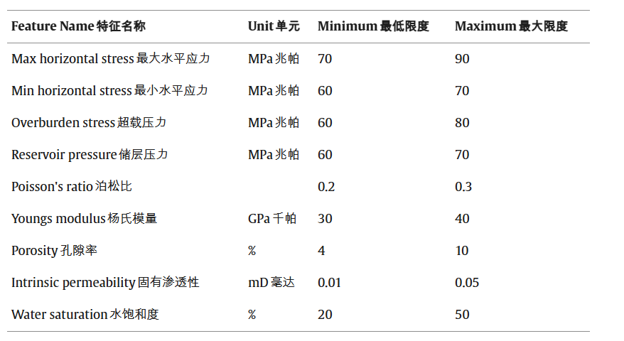

每个模型均采用 30 × 15 × 10 的网格尺寸构建，其中每个网格单元的尺寸为 10m × 10m × 4m。每个油藏均配备一口井，并在每个模型中纳入了 5 种不同的天然裂缝分布。为模拟压裂过程，使用了三种支撑剂，分别为 Sand-80/100、Ceramic-30/50 和 Ceramic-40/70。此外，还使用了两种压裂液，分别为 Slickwater 和 YF140FlexD。随后，针对每个油藏实施了 20 种不同的泵送方案，以评估其对压裂作业的影响。在整个综合研究中，共进行了 2000 次压裂作业

**产生2000个MP4水力压裂视频，使用python提取帧，最终获得1.0x10^6张裂缝扩展图像**

对所有2000个压裂视频，初始状态定义为第1帧。该初始状态图像包含了井筒图像、天然裂缝图像以及压裂裂缝未生成时的状态。这些组成部分被组合成一幅复合图像。

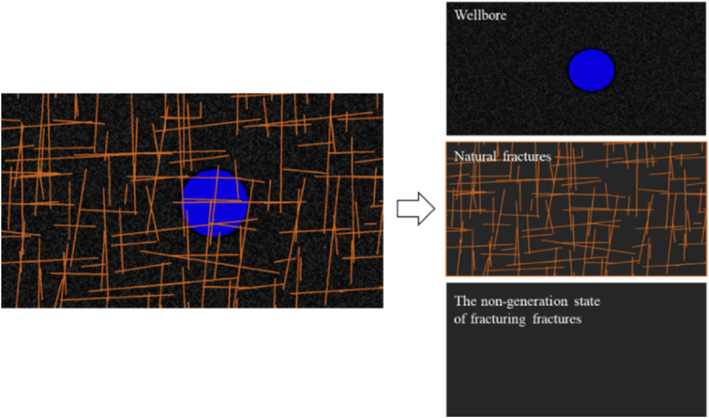

此外，收集并整理了 20 个压裂垂直井储层和 2000 个泵送计划的详细信息，并以 CSV 格式保存。

### 数据预处理

首先，将每次水力压裂作业获得的井眼图像、天然裂缝图像和裂缝扩展图像**转换为灰度图像**，得到单通道灰度图像。随后，将这三幅灰度图像融合，形成**三维矩阵**。之后，对该三维矩阵进行**图像裁剪**，使其尺寸符合模型的输入数据要求，具体尺寸为 **256×256**。此外，应用归一化函数将像素值限制在(0, 1)范围内

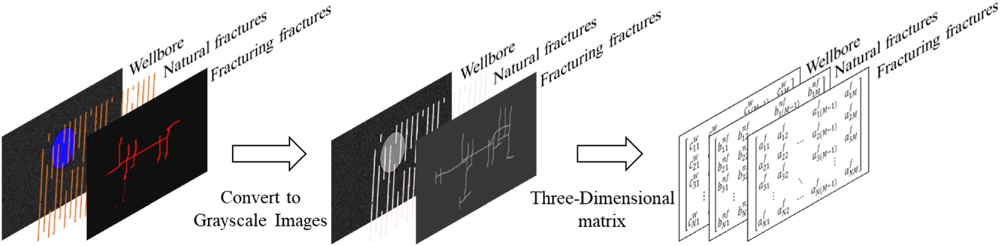

考虑到储层性质和泵送方案对水力压裂过程的显著影响，**以 Excel 格式存储的数据使用 StandScaler 函数进行了预处理**。该预处理步骤解决了量纲不一致的问题，从而提高了后续分析的精度。此外，还采用了一种称为**独热编码**的技术，根据具体分类将各种类型的压裂液和支撑剂转换为数值表示。

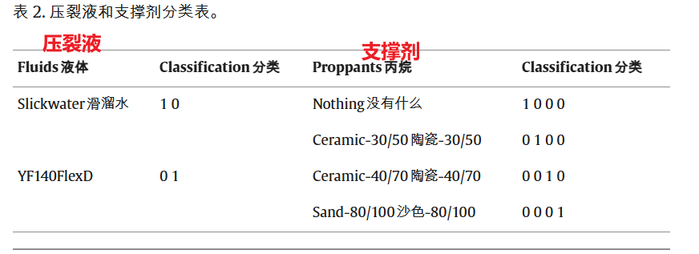

按9:1比例分割为训练集（1800个实例，来自18口井）和测试集（200个实例，来自2口井）

### 模型训练

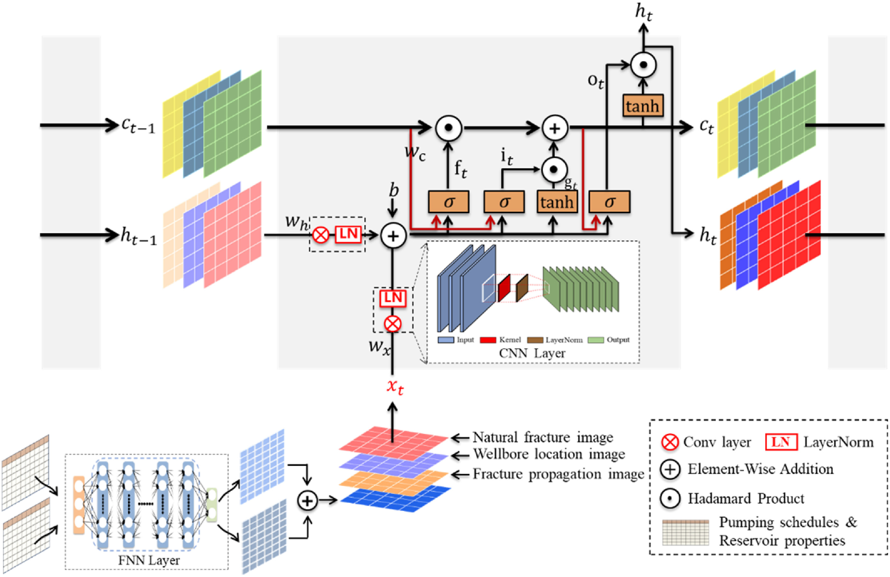

#### 输入

- **裂缝传播图像（Fracture propagation images）**：时间序列图像，记录裂缝在不同时间点的时空演化。
- **井筒示意图（Wellbore location images）**：表示井筒配置的图像。
- **自然裂缝图像（Natural fracture images）**：地下预存自然裂缝的分布图像。
- **泵送计划（Pumping schedules）**：结构化数据，包括操作参数如注入速率（discharge rate）、砂浓度（sand concentration）等泵送程序变量。
- **其他辅助数据**：如储层属性（reservoir properties，例如渗透率porosity、孔隙度permeability）。

这些输入被拼接成一个统一的输入张量，供FNN-ConvLSTM网络处理。其中，结构化数据（如泵送计划）由FNN处理，图像序列（如裂缝传播图像）由ConvLSTM处理。

#### 架构

FNN处理非图像数据（如泵送计划、储层属性）| 输出的两个蓝色的是什么？

ConvLSTM：专为时间序列图像设计，捕捉裂缝传播的时空动态，包括方向变化、与自然裂缝的交互等。

FNN-ConvLSTM 模型包含 3 个 ConvLSTM 单元，卷积层采用 5×5 的卷积核。批大小设置为 10，学习率为 0.0001。模型训练过程采用基于第一帧图像预测接下来 5 帧的方法。模型进行了 500 次迭代训练，前 100 次迭代采用定时采样。也就是说，定时采样设置为在 100 次迭代后停止。

#### 训练步骤

前向传播，模型训练过程采用基于第一帧图像预测接下来 5 帧的方法。

计算损失：均方误差MSE作为损失函数，量化预测帧与真实帧（ground truth）的差异

反向传播：Adam优化器，训练迭代500次直至收敛

#### 评估指标

MSE、SSIM（结构性相似指数）、FMAE（帧平均绝对误差）

#### 输出

预测的裂缝传播图像序列

### 模型评估

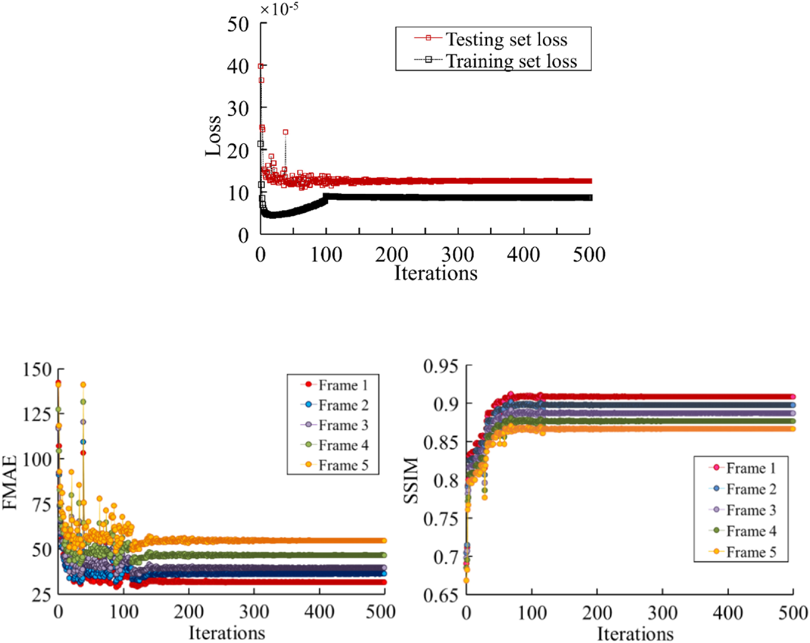

对垂直井压裂测试集上的模型权重进行了全面评估，方法是利用这些权重，基于前一帧图像预测接下来的 5 帧图像。为了更清晰地展示裂缝扩展的预测结果，下图中去除了井筒射孔和天然裂缝部分，仅显示裂缝形态：

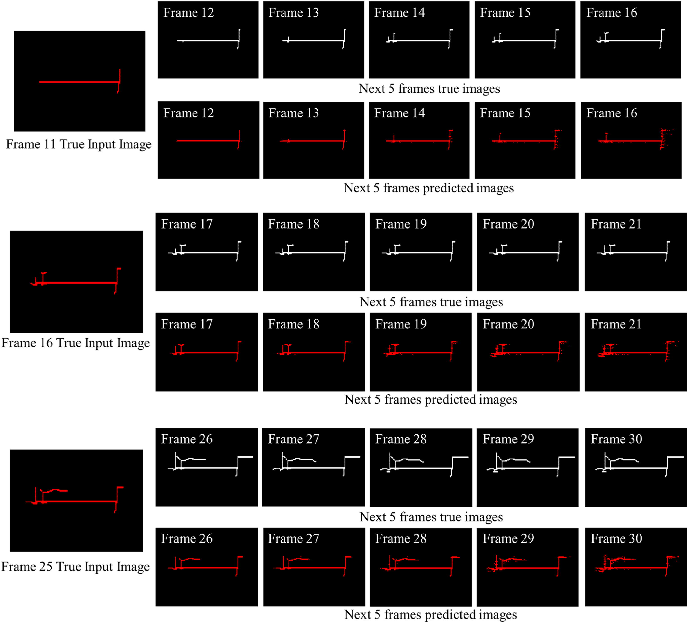

同一口井在不同泵送方案下水力压裂裂缝扩展的数值模拟结果（红线）与 FNN-ConvLSTM 预测结果（白线）对比：

我们将井眼图像、天然裂缝分布图和裂缝扩展预测图像进行融合，并将其与数值模拟结果进行比较。值得注意的是，两组结果的结构相似度超过 0.89，表明预测的裂缝模式与模拟的裂缝模式具有较高的一致性：

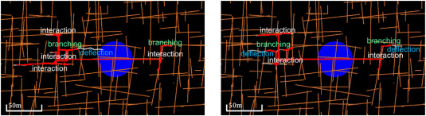

数据驱动模型完成整个数据处理流程（包括数据预处理、输入、输出和后处理）仅需不到 5 分钟。从数据输入到结果输出的预测阶段耗时不到 6 秒。相比之下，UFM 数值模型在计算前需要进行油藏建模、抽水计划设置和材料选择等操作，总运行时间超过 20 分钟。仅计算阶段就需要 4 分钟以上，对于精细网格和大规模油藏，运行时间会显著延长。

___

## 基于深度学习的煤层气储层时空压力预测代理模型

A novel surrogate model with deep learning for predicting spacial-temporal pressure in coalbed methane reservoirs

预测地下储层流体流动的传统方法包括数值模拟、**预测分析(PA)**和**瞬态速率分析(RTA)**，PA和RTA常用于气藏的一维数据分析，是储量估算、井诊断和生产性能评估的成熟方法。然而，这两种方法的致命缺陷在于它们**无法处理高维数据**，例如二维和三维数据，因此不适用于当前煤层气储层流体分布演化的研究。

surrogate model 代理模型：在机器学习中，代理模型是指通过使用已有数据集来近似或替代复杂的计算模型。代理模型可以用于加速计算过程、降低计算成本或简化问题的复杂性。

我们的研究重点在于各种影响因素的不确定性对煤层气储层压力演化的影响。

我们提出了一种具有可变井距的二维煤层气储层模型，并构建了一个基于深度学习的高效代理模型。该模型融合了改进的编码和回归预测过程，以更好地捕捉全局时空信息并处理时间依赖性。我们利用 AxialAttention Vision Transformer (ViT)  从高维空间数据中提取特征，并采用卷积长短期记忆网络 (ConvLSTM) 进行时空预测

我们详细介绍了针对**多尺寸非均质二维煤层气储层渗流问题**提出的代理模型

___

## 一种基于 Transformer 的新型深度神经网络用于预测油井压裂后产量

数据来源：

数据包括1983-2020年的历史产量（月度或每日），总计191口井（134口生产井）。训练使用滑动窗口方法（T=7，即用前7个观测点预测下一个），数据集分为训练集（80%）和测试集（20%）

模型基础：

基于Transformer编码器，嵌入维度d=64，多头注意力（heads=4，最终优化后），编码层=3，FFN层，残差连接和层归一化。优化器未指定，但学习率初始为0.01，epoch=5000。

### 长时历史生产拟合和预测实验

- 单井（J001）的长期数据（1983-2020，442个月产量），验证模型在36年跨度上的性能。
- 训练集：1983年7月-2012年12月（354个月）。
- 测试集：2012年12月-2020年4月（88个月）。
- 使用滑动窗口构建序列（l=7）

#### 初步训练

使用NLP默认参数：序列长度l=7，嵌入维度d=512，注意力头h=8，块迭代N=6，FFN单元2048。初始学习率0.01。

模型性能差，损失不收敛，表明NLP默认参数不适合小样本时间序列，需要细调以避免过拟合和梯度问题。

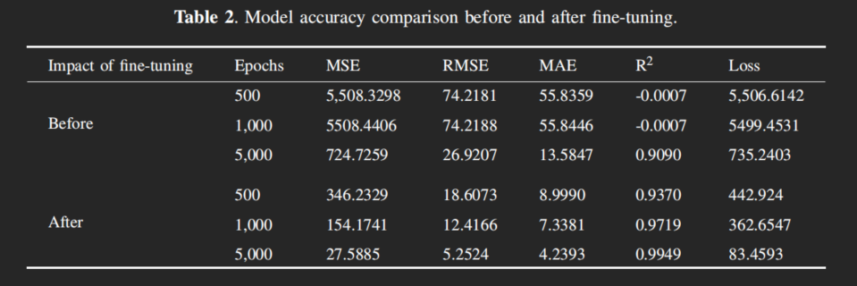

#### 微调

初步训练效果不好，可能因为学习率高、模型复杂或初始化不当。针对时间序列调整参数，避免NLP的高复杂度（d=512太高）。

维度-编码层-注意力头 固定epoch=500

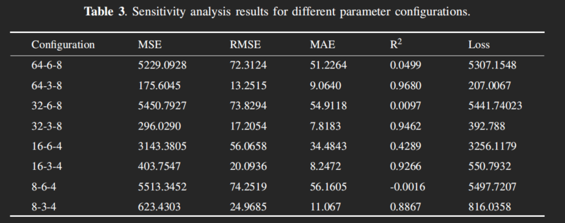

高复杂度（如64-6-8）导致波动大，低复杂度（如8-3-4）不收敛。编码层数影响最大

最佳配置：维度16、编码层3、头4

#### 使用优化后的模型：

重新训练5000 epoch

结果在上面table2中，损失曲线和预测结果：

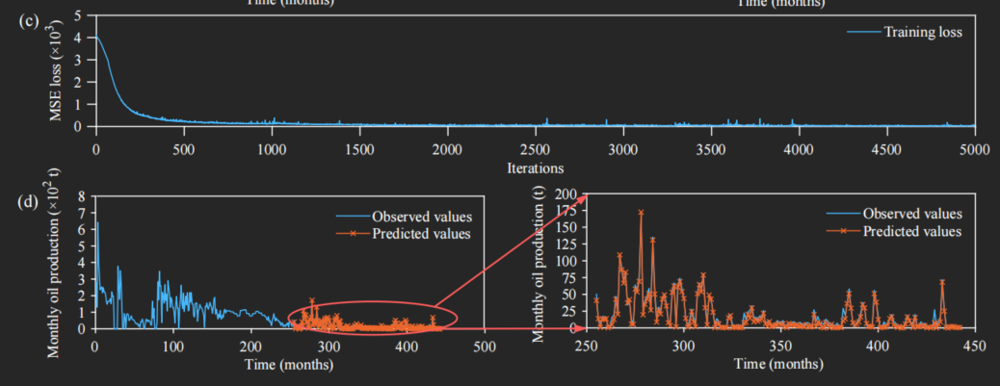

#### 与RNN和LSTM准确性比较

| Model       | MSE    | RMSE  | MAE    | R²    |
| ----------- | ------ | ----- | ------ | ----- |
| RNN         | 275.85 | 5.224 | 4.293  | 0.994 |
| LSTM        | 436.44 | 20.89 | 10.465 | 0.920 |
| Transformer | 0.202  | 0.475 | 0.346  | 0.948 |

### 短期历史生产拟合和预测实验

这一节转向短期（1年每日数据），验证模型泛化能力。随机选9口井（J002-J010），数据点200-300。使用最近1年每日数据，拟合和预测。

| Model       | RMSE  | R²    |
| ----------- | ----- | ----- |
| RNN         | 1.105 | 0.794 |
| LSTM        | 0.881 | 0.850 |
| Transformer | 0.448 | 0.948 |

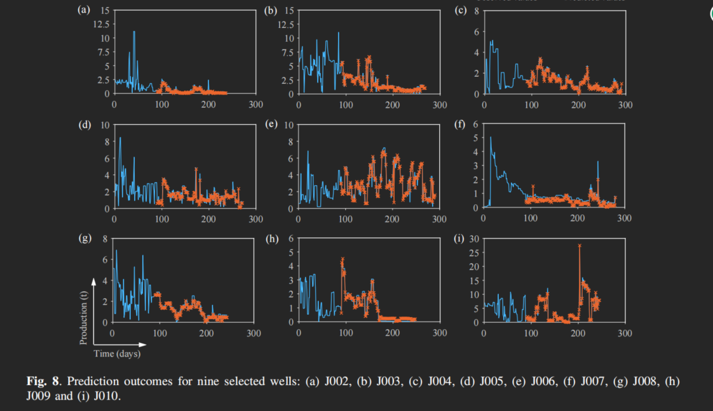

### 新再压裂井实测生产数据实验

应用到2023年6-7月新再压裂的6口井（5D001-5D006），数据200-300点，验证工业适用性。

| No.   | 90天预测 | 90天实际 | 准确率 | 180天预测 | 180天实际 | 准确率 |
| ----- | -------- | -------- | ------ | --------- | --------- | ------ |
| 5D001 | 65.56    | 70.89    | 92.48% | 191.19    | 194.46    | 98.31% |
| 5D002 | 272.11   | 267.08   | 98.11% | 531.68    | 526.4     | 98.99% |
| 5D003 | 168.76   | 180.05   | 93.72% | 254.4     | 276.92    | 91.86% |
| 5D004 | 182.49   | 185.78   | 98.22% | 364.58    | 369.03    | 98.79% |
| 5D005 | 149.51   | 161.39   | 92.63% | 386.33    | 400.31    | 96.50% |
| 5D006 | 353.81   | 359.09   | 98.52% | 461.42    | 476.96    | 96.74% |

___

## 将地质模型与多模态机器学习方法相结合应用于页岩气产量预测

Integrating geological model via A multimodal machine learning approach in shale gas production forecast 

#### 多模态如何体现？

答：表格数据和图片，表格数据从钻井、完井、生产、地质数据中收集，“图片”是指从属性分布图中通过本文提出的地理修补方法（geo-patch）提取出的400x400像素的单口井属性图

#### 对来自三维地质模型的非结构化数据进行预处理的geo-patch方法，这个可视化方法具体讲讲？

背景：表格数据仅提供点测量值（例如，井底或起始点的单个孔隙度值）。然而，水平井的跨度可达 2-5 公里，孔隙度等属性可能会沿该路径降低、升高或波动，从而影响产量。忽略这种空间分布会导致预测精度降低。

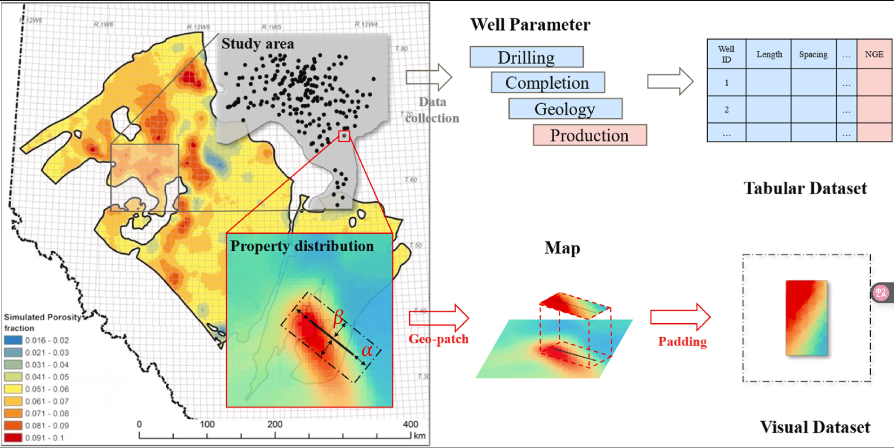

该过程首先使用三维地质模型（例如，如论文中提到的，阿尔伯塔能源监管机构提供的孔隙度模型，该模型包含超过100万个网格）。对于每口井，该方法提取一个相关的子集。论文中的图1对此进行了直观的说明：它显示了一张大型属性图（例如，整个油田的孔隙度分布），然后放大到一口井的轨迹，提取一个矩形区域，并将其填充为统一大小。

长度扩展因子 (α) ：将井眼轨迹上的压裂区域在两端 （井跟和井趾）各延伸 α 米。宽度扩展因子 (β) ：垂直于井眼轨迹， 两侧各扩展 β 米。

提取 孔隙率、厚度和压力 作为3张“图”

#### 表格数据都包括什么，作为补充的“图像”数据又包括什么？

表格数据是指从井现场收集的结构化数据，主要包括钻井、完井、地质和生产参数。这些数据以表格形式组织，**每一口井的每个参数只有一个单一数值**，作者对每口井的表格数据做了描述：

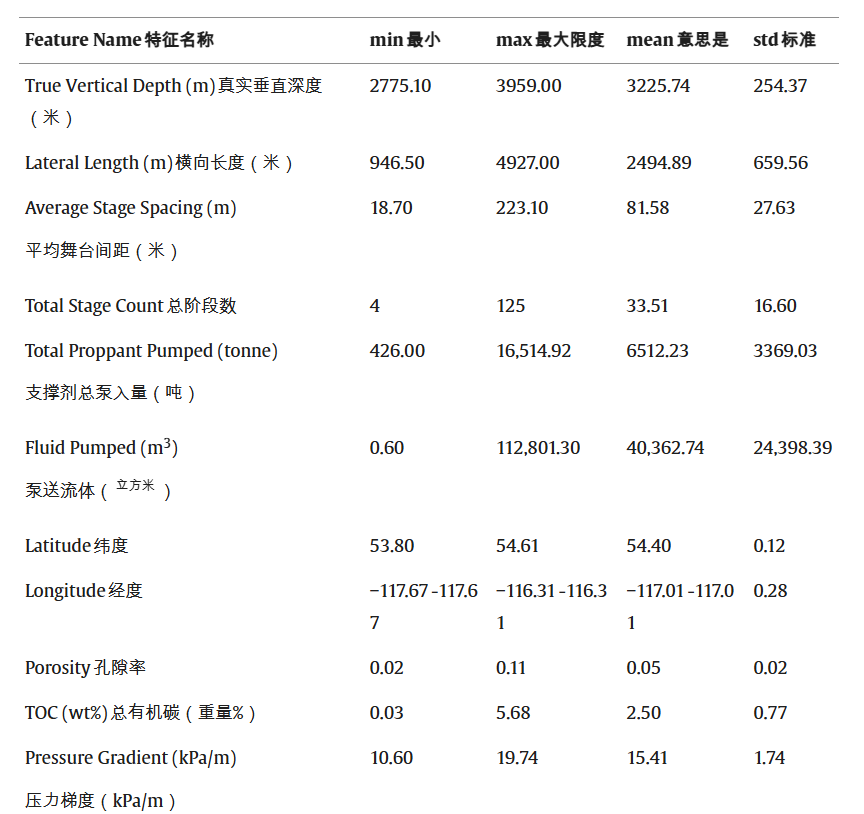

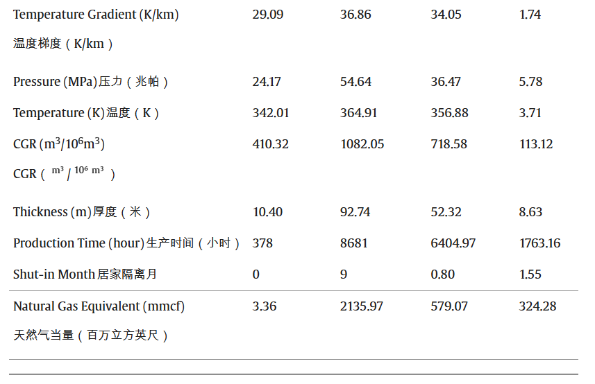

“图像”数据是从3D地质模型中提取的，用于捕捉井周围地层的空间变异性（而非单一值）。这些数据被预处理成图像格式（例如，400×400像素的地图），供CNN模块处理：

- Porosity maps：孔隙度分布图（论文中强调这是最关键的，单独加入即可显著提升准确率，从0.736提高到0.816）。
- Pressure maps：压力分布图。
- Thickness maps：厚度分布图。

#### 如何理解“而表格数据集中的每个井参数只有一个值，因此只有一个神经元”

表格数据是结构化的，每口井的每个参数（如孔隙度）只有一个数值（例如，从井跟部测量），所以在ANN模块的输入层中，每个参数只对应一个神经元。整个表格数据集的输入神经元总数等于特征数量（这里约18个，见上面的图）。

#### 融合机制是怎么融合的？

CNN 模块用于处理和提取可视化数据集中的高级信息，而 ANN 模块则用于学习传统的表格数据集。融合模块则将来自两种模态的数据进行融合和交互。CNN输入神经元是400x400，ANN输入神经元大概是18，融合模块如何处理整两个难以公平整合的模块？

融合部分是个两层的神经网络，64->32->1，文中的描述是：我们在融合模块的早期阶段，通过调整卷积神经网络（CNN）和人工神经网络（ANN）模块的输出神经元数量，来控制来自不同模态的信息。

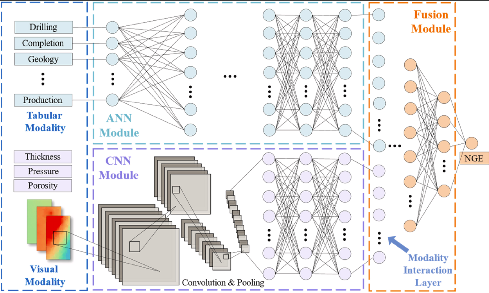

CNN部分：[batch_size, 3, 400, 400]，假设经过3层卷积+池化之后，假设变为[batch_size, 8, 50, 50]，扁平化输出：8×50×50=20,000维，可能接了个全连接层做投影，映射到较低维度。ANN输出后可能也接全连接层。如果直接融合，CNN的特征向量会远长于ANN，导致模型偏向视觉模态，忽略表格数据（如钻井参数），造成过拟合或低效率。

___

## 利用少样本学习预测裂缝性水平井的产能

Predicting the productivity of fractured horizontal wells using few-shot learning

### 摘要

预测多级压裂水平井的产能对于非常规资源的开发至关重要。近年来，机器学习（ML）模型作为一种新的研究方法应运而生。然而，由于缺乏足够的真实数据进行模型训练，即使使用真实数据训练的模型能够更好地表征地质和工程特征，预测结果往往仍然不够精确。为了解决这个问题，我们提出了一种即使在数据样本量较小的情况下也能获得可靠结果的机器学习模型。该模型融合了合成少数类过采样技术（SMOTE）以扩展数据量，采用支持向量机（SVM）进行模型训练，并利用粒子群优化（PSO）算法优化超参数。为了提高模型性能，我们进行了特征融合和降维处理。此外，我们还研究了不同样本量和机器学习模型对模型性能的影响。 与传统机器学习技术（R² 值为 0.13）相比，所提出的模型展现出更高的预测精度和泛化能力，在测试集上实现了高达 0.9 的预测 R² 值 。 即使在样本有限的情况下，该模型也能准确预测裂缝性水平井的产量，为优化非常规资源生产提供了一种有效的工具。更重要的是，该模型有望应用于解决其他受数据样本稀缺限制的领域中类似的挑战。

使用静态数据预测特定时间产量

### 收集现场数据

包括影响因素和目标产量

所有138口井的影响因素和产量数据，（以前 90 天的日均产油量作为模型预测的目标值。）：

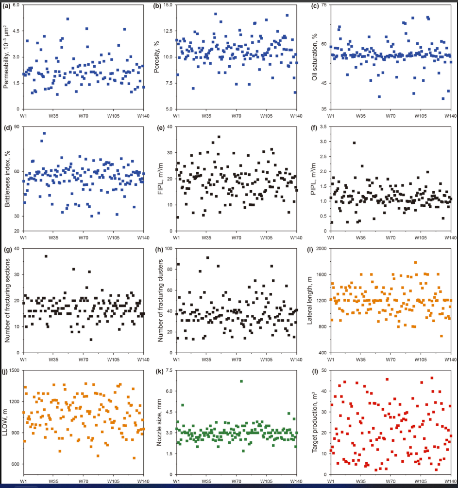

### 数据预处理

人工检查发现，138 口压裂水平井中有 23 口井缺少脆性指数信息。缺失值约占总样本的 15%，这一比例过高。使用均值填充法处理缺失值会显著降低数据集的准确性。因此移除了这23个样本。再使用孤立森林IF算法检测样本中的异常值，包含异常点的水平井被直接移除，导致数据集中剔除了 9 个样本。处理完缺失值和异常值之后，样本集中保留了 106 口压裂水平井的数据。

然后对数据进行归一化

皮尔逊相关系数 剩余7个因素：孔隙度、脆性指数 、LLOW、FIPL、 PIPL、压裂段数和喷嘴尺寸

采用综合特征选择模型计算各影响因素的综合重要性系数。此外，我们还评估了不同因素对目标产量的累积贡献，以确定主要控制因素。

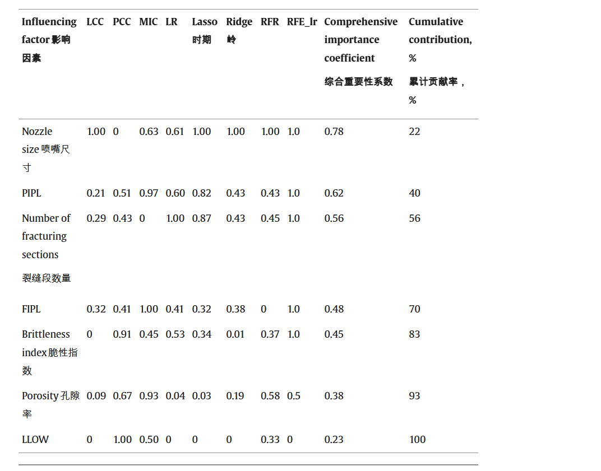

这 7 个因素与产量的综合重要性系数均大于 0.2，表明它们与产能具有高度相关性。

以 106 口压裂水平井的 7 个影响因素作为模型输入，井产能作为模型输出，构建了一个基础样本集。然后，我们利用 SMOTE 算法在基础样本集的基础上进行样本扩充。先聚类确定样本是否平衡，使用STOME算法对不平衡样本扩充。初始样本数是106，有将原始数据集扩充1~6倍的情况，通过比较不同方案下模型的训练效率和预测精度，我们确定了最合理的样本量。 然后，我们将原始样本和新样本整合起来，构建一个扩展的样本集，用于训练裂缝性水平井产能的预测模型。

完成样本集准备后，我们利用四种机器学习算法构建了裂缝性水平井的产量预测模型。我们使用粒子群优化算法优化模型超参数，并通过对比分析获得了性能最优的预测模型。此外，我们还基于该最优机器学习模型评估了不同的样本扩展方案，以确定合适的样本量和扩展方案，从而进一步提升模型性能。

### 实验

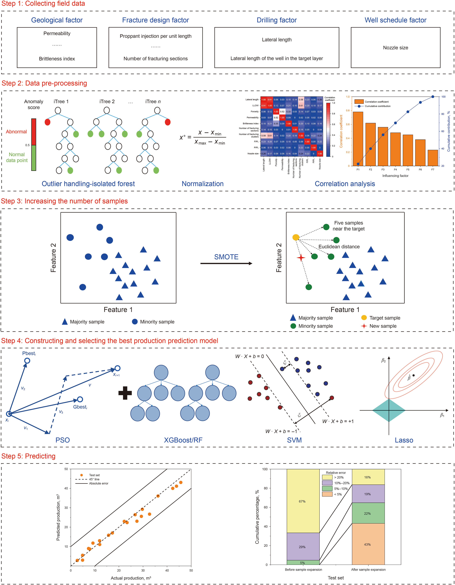

为了应对不平衡数据集对预测结果的影响，通常采用过采样和欠采样算法。欠采样算法通过丢弃多数类样本子集来实现。然而，这种方法不适用于样本量有限的数据集，因为它会导致关键信息的丢失。为了克服不平衡数据集和少量数据样本对预测模型精度的影响，我们在过采样过程中引入了 SMOTE 算法，以生成分布更加均衡的数据集。

SMOTE过采样过程

四种方法作比较：支持向量回归（SVR）、随机森林（RF）、极端梯度提升（XGBoost）和最小绝对收缩与选择算子 Lasso）

机器学习模型的两种参数：模型参数（神经网络中的权重、支持向量机中的支持向量以及线性回归中的系数）和超参数（神经网络中的学习率、支持向量机中的惩罚参数和核函数以及决策树模型中的树深度）。模型参数在模型训练过程中会自动优化，超参数需要手动配置。本文使用PSO算法优化超参数

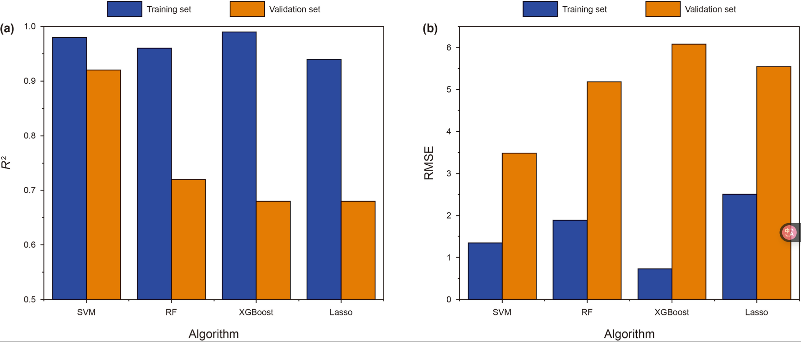

### 样本扩充前后性能对比：

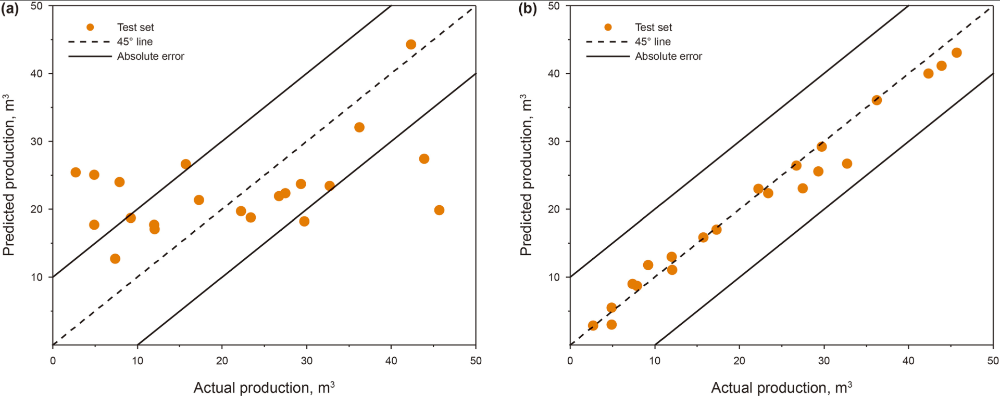

输入：每口井的 孔隙度、脆性指数 、LLOW、FIPL、 PIPL、压裂段数和喷嘴尺寸

输出：前90天日均产油量

一共106个样本，经扩充之后变多
