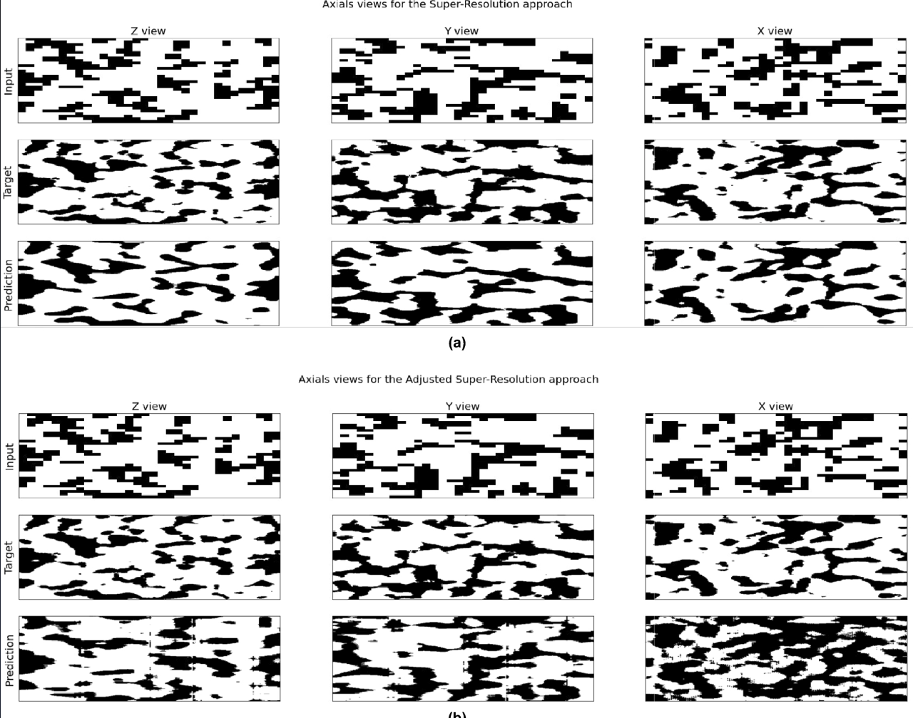
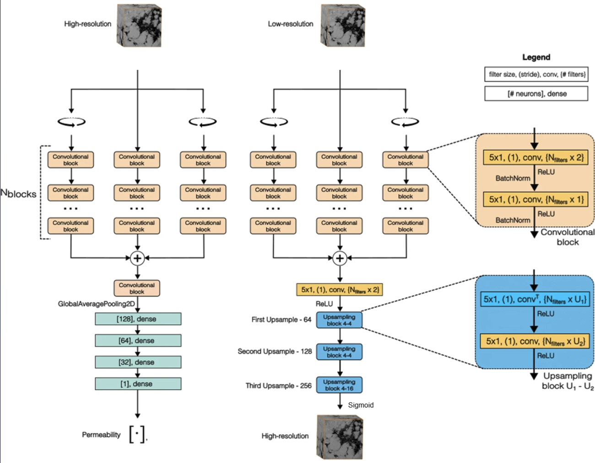
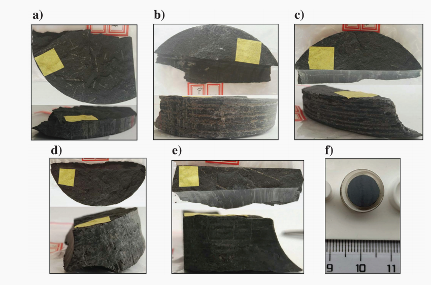
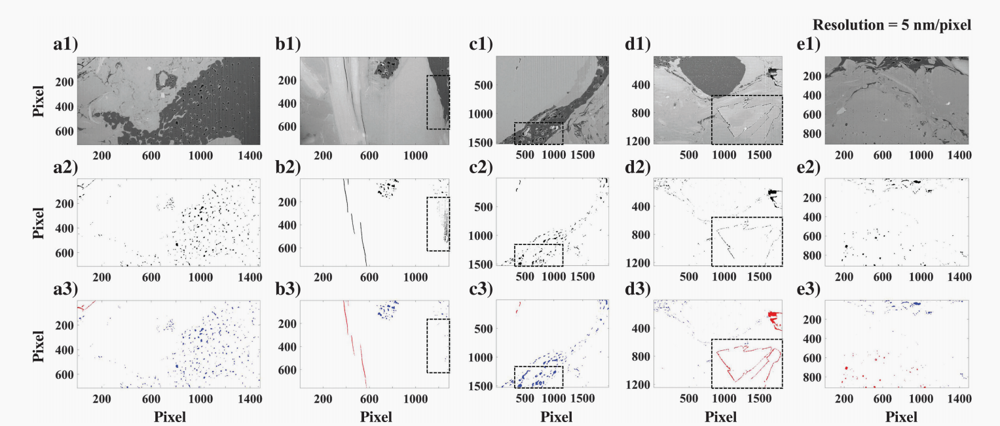
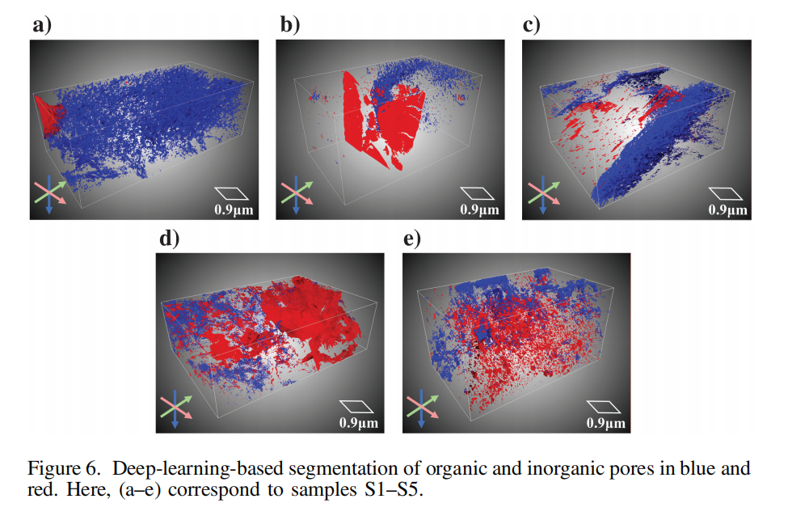
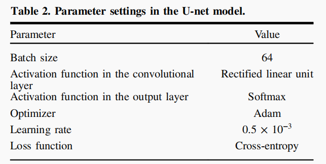
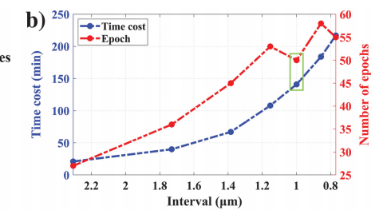

## 利用深度学习超分辨率和对抗微调技术，从微型断层扫描岩石图像中估计绝对渗透率

Absolute permeability estimation from microtomography rock images through deep learning super-resolution and adversarial fine tuning

### 摘要

在数字岩石物理学中， X 射线显微断层扫描（ X -CT）被用于表征储层岩石，从而能够更准确地分析孔隙度和渗透率等物理性质，进而更好地模拟多孔介质流动。通过数值模拟估算岩石物理性质通常需要高分辨率图像，而使用 X- CT 获取高分辨率图像成本高昂且耗时。为了解决这个问题，**我们提出使用两种深度学习模型：一种是超分辨率模型，用于提高低分辨率图像的质量；另一种是代理模型，用于替代数值模拟来估算目标岩石物理性质。**我们应用了一种受生成对抗网络（GAN）对抗训练启发的校正方法。在这种方法中，超分辨率模型充当生成器，生成高分辨率图像，而代理网络充当判别器。通过调整生成器，可以生成修正代理网络估计误差的图像。该方法已应用于 DeePore 数据集。结果表明，该方法总体上提高了渗透率估计的准确性。

传统方法使用X射线微断层扫描（μ-CT）生成岩石的数字图像，用于分析孔隙结构并模拟流体流动，从而估计渗透率等属性。然而，数值模拟需要高分辨率图像，这些图像获取成本高、时间长，且视场（FoV）小，无法代表整个岩石样品。相反，低分辨率图像覆盖范围大，但孔隙细节不足，无法准确模拟。**文章提出问题：如何从低分辨率图像中准确估计绝对渗透率？**

现有的工作分别处理渗透率或超分辨率，但未结合两者。本文创新在于使用GAN框架将超分辨率模型作为生成器，代理模型作为判别器，通过渗透率误差校正生成图像，提高估计精度。

**本文的目标不是生成高清完美的图像，而是生成能使模型更准确估计绝对渗透率的图像，即使它导致了图像中出现了一些噪声，伪影**

本文贡献点：

- 超分辨率模型，从32³低分辨率图像 --> 256³高分辨率图像

- 渗透率代理模型：256³高分辨率图像 --> 渗透率估计值

- **关键创新**：用“渗透率误差”反向微调 超分辨率模型

- 三个2D卷积分支处理3D图像的不同视图（xy、xz、yz），然后求和+回归层

  

### 数据集

开源DeePore数据集，包括17,700个半真实3D图像（256³体素，分辨率1μm），由砂岩、碳酸盐岩和沙包岩组合生成。数据集包含30个物理属性（如渗透率、喉道半径）

### 方法

**训练代理模型**：输入256³高分辨率图像，输出渗透率标量。用于替代非可微的数值模拟，便于误差反向传播。

**训练超分辨率模型**：输入32³低分辨率图像（通过下采样获得），输出256³高分辨率图像。解决分辨率与视场问题。

**对抗微调校正：将超分辨率模型作为生成器，代理模型作为冻结的判别器。生成高分辨率图像输入代理模型，计算渗透率误差（MSE），反向传播调整超分辨率模型参数，使生成的图像校正代理模型的误差，提高渗透率估计精度。

**与其说是使用GAN框架，不如说是从GAN中得到灵感，本文的方法和GAN是有区别的。那么详细说说本文的对抗微调校正：**

本来代理模型D和超分辨率模型G是分别训练的，在对抗微调阶段创建一个新模型，将二者串联：f(s(x))。代理模型参数冻结，只更新超分辨率模型的参数。

过程：

1. 输入低分辨率x到G，生成高分辨率y = s(x)。
2. 将y输入到D，得到渗透率估计k^ = f(y)。
3. 计算损失：MSE，数据集中有真实渗透率。
4. 反向传播：误差从D回传到G，调整G的参数，使生成的y能“校正”D的估计误差（即让k^更接近k，即MSE更小）。
5. 优化器：Adam，学习率1e-4。
6. 早停：patience=30 epochs。

疑问：

1、这只是通过误差反向传播强制让超分辨率模型生成利于代理模型预测的图，其实中间放的是不是所谓的超分辨率模型都可以，都会最后强制地使预测MSE更小，这样的模型结构是否有意义？

答：是的，这种结构本质上是端到端优化，通过渗透率MSE损失反向传播调整生成器，使其输出更适合下游代理模型的预测。任何可微的图像变换模块都能通过微调强制MSE减小，然而这种模型结构有意义：1、超分辨率模型为误差反向传播提供了一个合适的起点。2、保留图像的结构真实性很重要，仅用任意模块可能生成无物理意义的图像，导致泛化差。3、文章结果显示，微调后r²提升到0.972，但引入伪影，证明了这种权衡的有效性。如果换成非超分辨率模块，MSE可能小但图像不可解释，丧失工程价值。

2、超分辨率模型生成的是三维的结构吗，但是为了避免参数过多，本文三个2D卷积分支处理3D图像的不同视图（xy、xz、yz），然后求和+回归层预测渗透率，是这样吗？

答：是的

3、代理模型和超分辨率模型一开始是分别训练的吗，在对抗微调校正阶段才连接？如果是，两个模型分别训练时是怎么训练的

答：是的，训练方式：

- (a) 代理模型：输入高分辨率图像（256³），标签为真实渗透率（从DeePore数据集的PNM模拟获得），用MSE损失训练CNN，目标是学习近似数值模拟；
- (b) 超分辨率模型：输入低分辨率图像（32³，由高分辨率下采样获得），标签为对应高分辨率图像，用MSE损失（像素级）训练，目标是学习低到高的映射。

4、超分辨率模型接收大小为 32^3 的低分辨率样本作为输入；需要注意的是，该样本是通过对 256^3 样本进行下采样得到的。下采样是指卷积吗，如果是卷积，那能对吗 目标是根据低分辨率图像生成高分辨率图像

答：文章没有明确指定下采样的精确方法，常见的标准图像缩放技术有：平均池化、双线性/双立方插值、最近邻

___

## 基于深度学习的页岩中有机和无机孔隙的定量表征

Quantitative characterization of organic and inorganic pores in shale based on deep learning

### 摘要

有机质（OM）成熟度与有机孔隙密切相关。对页岩中有机和无机孔隙进行定量表征，对于岩石物理建模以及储层孔隙度和渗透率评价至关重要。聚焦离子束-扫描电镜（FIB-SEM）可获取高精度的三维（3D）图像，并直接描述页岩气储层中孔隙的类型、形状和空间分布。然而，由于扫描成本高、三维视场宽以及FIB-SEM图像复杂的微观结构，大规模三维数据集的精细分割极具挑战性。为此，**本文构建了一种多阶段分割工作流程，基于U-net开发了一种模型，能够在整个3D图像堆栈中同时从基质中分割出孔隙，并区分有机孔与无机孔。**该工作流程在具有不同特征的富含有机质页岩的FIB-SEM数据集上重复应用。分析重点在于优化工作流程的效率和相关性，即在确保准确性和最小化训练切片数量的同时，进一步结合特征维度（FD）和连通性，以研究一种简单且客观的孔隙选择方法。与此同时，还讨论了2D U-net模型在计算效率、准确性及鲁棒性方面的表现。**在所有以人工标注为基准的数据集中，自动分割结果与人工标注的一致性可达80%-95%。**此外，**通过将FIB-SEM多相分割结果与有机质丰度相结合，可以定量评估有机质成熟度水平。**基于深度学习的分割方法在刻画页岩孔隙结构和量化有机质成熟度方面展现出巨大潜力。

**本文提出了一种基于深度学习的页岩有机孔隙和无机孔隙识别与表征方法，用于将 FIBSEM 图像分割成三维空间中的有机孔隙、无机孔隙、无机矿物和有机质（OM）等多组分。**

### 贡献：

- 选择原始 FIB-SEM 图像的几个切片进行强度标准化，然后进行局部 Otsu 分割（Otsu，1979）和手动校正。
- 在所有孔隙区域中，通过人工区分有机孔隙和无机孔隙，生成多类训练标签（真实标签），这些标签将进一步用作训练、测试和验证数据集。
- 上述训练和测试数据集被用作输入，并送入基于 Keras 的二维 U-Net 模型。在此阶段，对训练参数进行调优以优化模型性能。最后，将训练好的 U-Net 模型应用于 FIB-SEM 数据集的整个图像堆栈。此外，由于岩石成分的复杂性、内部形态的多样性以及 FIB-SEM 成像条件等因素，我们需要为每个样本训练一个专属的 U-Net 网络。

### 数据集：

FIB-SEM技术通过连续扫描岩石样品，生成一个沿深度方向（z轴）堆叠的3D图像数据集，每个**“切片”**就是一个横截面的2D灰度图像，类似于CT扫描中的层析图像。这些切片的分辨率通常为5-10 nm/像素，厚度为10 nm，用于捕捉页岩中的纳米级孔隙结构。整个数据集是一个图像栈（image stack），由数百到数千个切片组成。文中样本S2有692个切片，总厚度约6.92μm。

#### 数据集的准备与划分：

a-e是样本S1-S5，都来自下志留统龙马溪组（中国四川盆地南部）。f是用于 FIB-SEM 扫描的样品制备示例。

训练集和测试集都来自S2样本的整个图像栈，共692个切片，由于FIB-SEM切片间相似性高，只需少量切片（结合数据增强）即可训练模型。整个过程先从692切片中**选取少量切片**进行手动标注，形成ground truth。

选切片的过程其实就是划分数据集的过程：

训练集：从S2的692个切片中等间隔选取6个，间隔 = 总厚度 / (训练切片数 + 1)。训练切片数=6的话，间隔大概是0.989μm。6是实验测试出来的。

测试集：从整个切片序列（S2的692个切片）中，用1D Halton序列随机均匀选取4-5个（避免大间隔，确保代表性），且这些切片不同于训练集和验证集选择的那些（无重叠）

验证集：固定选取2个切片：位于图像栈z轴的1/3和2/3处

假如以上面的方式选取的话，总共选取的切片数就是6+5+2= 13。测试集约占40%。

然后对这些切片进行手工标注，形成ground truth

用以下方式进行标注：

1. **图像标准化：**在 FIB-SEM 的连续扫描过程中，成像环境中可能会出现一些微小的扰动，这些扰动会影响某些切片的整体灰度。图像标准化可以快速消除这些潜在影响。**对原始切片进行灰度标准化，使每个切片的灰度均值为0，标准差为1。**
2. **局部 Otsu 算法**：该方法在滑动窗口内计算最佳阈值，能更好地处理成像缺陷导致的灰度不均匀问题。通过将局部 Otsu 算法应用于 FIB-SEM 数据集，可以获得更完整、更精确的孔隙空间分布。
3. **手动校正和标注**：Otsu结果可能有 artifact（如垂直条纹或点放电），需手动修正（平均修改像素占总孔隙的5.68%）。然后，根据灰度和空间位置手动区分有机孔隙（分布在低灰度有机质区，蓝色标注）和无机孔隙（红色标注），生成多类标签（ground truth，包括岩石基质、有机孔隙、无机孔隙）。为增强数据，使用翻转、旋转、扭曲等数据增强策略。**在 FIB-SEM 切片上，有机质（OM）和无机矿物的灰度分布存在显著差异（图 2a1–2e1）。OM 的灰度分布较低，对应于切片中的暗区，有机孔隙分布于这些区域。因此，人工识别的主要参考点是孔隙周围的像素灰度。**

(a1–e1) S1–S5 的代表性 FIB-SEM 切片，(a2–e2) 由局部 Otsu 算法识别的相应孔隙，以及(a3–e3) 经人工校正和识别后得到的相应真实值。**红色**和蓝色区域分别代表**无机孔隙**和有机孔隙，其他区域则被视为固相背景。虚线框标记的区域受成像环境影响较大，因此人工校正后标签发生了明显变化。

### 用U-net模型处理

U-net是一种卷积神经网络（CNN），具有对称U形结构，包括编码器（特征提取）和解码器（分割输出），特别适合像素级图像分割任务，如区分页岩中的有机孔隙、无机孔隙和岩石基质。

输入的数据是标准化后的2D FIB-SEM切片图像（灰度图像，数组形式）。每个切片是3D图像栈中的一层，典型分辨率5-10 nm/像素，厚度10 nm。有对应标签（ground truth）：三类：岩石基质（白色）、有机孔隙（蓝色，分布在低灰度有机质区）、无机孔隙（红色）。

**训练参数：**

**训练步骤：**

- 输入训练集图像和标签，模型学习像素分类（基质/有机/无机）。
- 迭代：每个epoch遍历所有批次。S2实验中，epoch随训练切片增加而增（从初始阶段剧增到稳定，e.g., 间隔<1 µm时稳定）。
- 监控：验证集评估过拟合，损失不再显著下降时停止（总损失=训练损失+测试损失）。

效率优化：少量切片（覆盖特征，用分形维度FD和空隙度La评估多样性）。实验显示，训练切片>5个（间隔<1.153 µm）时性能稳定（IoU>90%）。

**应用阶段：**

训练后，将模型应用于整个FIB-SEM图像栈（所有切片）。输入单个标准化切片，模型通过编码器提取特征（卷积+池化），解码器恢复并分类像素。逐切片分割，堆叠成3D体积。

基于3D分割，计算结构参数（如孔隙长宽比，用Watershed变换分离连通孔隙）和有机孔隙率OP（有机孔隙体积 / (OM + 无机孔隙体积)），评估OM成熟度。

**输出：**

直接输出：像素级分割图像，每像素分类为三类（概率形式，经Softmax）

评估指标：IoU（80%-95%，有机孔隙>90%），混淆矩阵（准确率>90%）。错误主要来自噪声（如点放电导致的假阳性）和微孔（小体积相分割不准）。

最终应用：3D孔隙分布、总孔隙率（0.23%-8.29%）、有机/无机比例、OM含量（2.7%-62.8%）、OP（0.03%-20.31%）。高OP表示高成熟度。

### 文中是怎么确定最佳间隔的，即怎么确定最佳切片数的？

训练切片数n从2到8变化，对应间隔从2.308 µm减到0.769 µm。每个n训练一个U-net模型，使用固定5个额外测试切片（1D Halton序列随机选取）。

终止条件是训练损失+测试损失不再显著下降时停止。模型收敛得越快，需要的Epoch越少。一开始是上升的，说明模型学习到的特征不足，训练切片越多需要的epoch越多。但是在interval=1附近出现了震荡，根据文中的描述，这是因为训练集的总切片数固定不变，当间隔变化时（例如从1.153 µm到1 µm，以及从0.856 µm到0.769 µm），训练集中的具体切片会随之调整。这些特定间隔下的切片特征（有机孔隙、无机孔隙和岩石基质）更容易被模型区分和学习，因此模型能更快收敛，需要更少的Epoch。论文认为，这反映了训练集特征的差异对模型学习效率的影响。

更多真实切片提升准确性，但需权衡成本。最佳间隔设为0.998 µm（绿色框），对应n=6（平衡准确性和成本）。
