## FFSwinNet：基于 CNN-Transformer 和 FFT 的页岩岩心 SEM 图像分割组合网络

FFSwinNet: CNN-Transformer Combined Network With FFT for Shale Core SEM Image Segmentation

### 摘要

本文提出一种用于页岩SEM图像裂缝孔隙分割的视觉基础模型。为抑制图像高频噪声，在特征提取网络中引入快速傅里叶变换（FFT）模块。基于91张页岩SEM图像的实验表明，本方法在多项指标上优于七种经典分割模型，且在添加噪声及像素丢失后仍保持较高分割精度，为页岩勘探图像分析提供了新方案。

### Conclusion

本文提出一种结合快速傅里叶变换的CNN-Transformer网络用于页岩SEM图像分割。该方法利用频率特性抑制干扰，并通过Swin Transformer模块恢复特征。在两个数据集上验证了其优异性能与泛化能力。目前对复杂背景或边缘模糊区域的分割精度仍有不足，未来将进一步研究页岩SEM图像的有效区域提取与成分自动分类方法。

**目标：开发一种自动化的语义分割网络，提取页岩SEM图像中的裂隙和孔隙，同时抑制噪声，提高标注准确性和效率。**

本文利用山西太原海陆过渡相页岩和四川龙马溪海相页岩的扫描电镜图像进行研究。

价值：

首先钻取、采集，然后送至实验室进行相关分析。提取的岩芯样品用于裂缝提取、识别和建模，这是后续页岩气含量评估的基础。这一步骤至关重要，因为页岩气储存在岩芯样品的微米级裂缝和孔隙中，并依靠这些孔隙和裂缝吸附在岩石上。这些微米级孔隙和裂缝的形状对页岩的含气量有重要影响。

裂缝和孔隙的几何形态直接反映了页岩的应力状态。结合图像中不同裂缝模式的统计分析，可以进一步揭示页岩裂缝与储层之间的关系。此外，还可以评估页岩裂缝的形成机制以及该区域的总有机碳（TOC）含量。由此可见，页岩裂缝的提取和评价对页岩气相关研究具有积极的指导作用，也是页岩油气资源勘探开发的重要组成部分。

电子显微镜的分辨率和亮度优于光学显微镜，有效提高了成像质量和分辨率。但是，目前仍然存在一些极具**挑战性的问题**：

- 页岩中填充的有机物或硬度不同的矿物质造成的干扰
- 扫描电子显微镜在成像过程中容易产生噪声，这会影响成像质量。
- 裂缝的标记和提取只能依靠专业人员，效率低下且难以保证准确性。

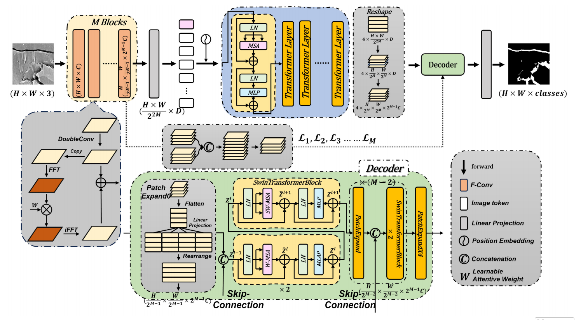

**本文的借鉴/启发：**TransUNet: Transformers make strong encoders for medical image segmentation

### 数据集

本文所用原始图像对应的岩心样品取自四川盆地重庆市涪陵地区海相页岩，分别来自龙马溪-五峰组的 AY-1、AY-3 和 AY-4 井，牛竹塘组的 CY-1 井和龙马溪组的 YY-1 井，井深分别为 1332 m、1379 m、2104 m、2332 m 和 3428 m。岩心样品开采后密封保存于密封区域，送至实验室后，采用扫描电镜（SEM）成像获取原始数据。五个样品共获得 159 张原始图像，从中选取 43 张作为原始输入图像，并通过人工标定标注裂缝和孔隙的位置及形态。裁剪过程中保留 20%的重叠区域，将图像处理成 256×256 像素的图像块，并进行随机翻转、高斯模糊、对比度调整和随机像素丢弃等处理，得到 1709 对带标签的原始图像。随机选取 92 张图像作为测试集，剩余数据分为两部分：90%（1455 张图像）用于训练，10%（162 张图像）用于训练过程中的性能验证。

山西太原海陆过渡相页岩数据集包含 48 张分辨率为 1280×960 的扫描电镜图像。裁剪时保留 20%的重叠区域，将图像处理成 256×256 的图像块，并进行随机翻转、高斯模糊、对比度调整和随机像素丢弃等处理，得到 3440 对带标签的原始图像。随机选取 200 张图像作为测试集，剩余数据分为两部分：90%（2916 张图像）用于训练，10%（324 张图像）用于训练过程中的性能验证。

### 实验环境

batch_size = 8, 优化器Adam，动量是0.999，权重衰减是1e-8，损失函数是混合损失函数：

交叉熵损失主要用于评估预测概率分布与真实分布之间的差异，并对每个类别的预测概率进行显式惩罚。因此，**交叉熵损失主要是确保模型准确预测每个像素点的类别**。Dice损失更关注模型预测与真实标签之间的重叠程度。在语义分割中，Dice 损失衡量预测分割区域与真实分割区域之间的重叠程度。这种损失函数对于处理正负样本数量不平衡的情况尤为有效，因为它更侧重于正样本（即目标类别）的预测准确率。因此，**Dice 损失主要负责优化模型对目标区域的分割效果，确保模型能够更准确地捕捉目标区域的边界和形状**。

### 实验

#### 评估指标

本文选择 Dice 相似系数（DSC↑）(13)、交并比（IoU↑）(14)和 Hausdorff 距离（HD↓）(15)来评估分割性能。其中，Dice 系数用于表征预测输出与标签之间的相似程度，IoU 用于表征预测区域与标签中目标区域重叠区域的百分比，而 Hausdorff 距离主要用于语义分割中，用于评估两组像素之间的相似性或距离

不同方法对海洋页岩SEM图像数据集的分割精度：

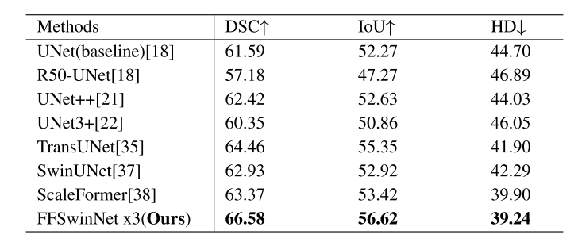

不同方法对海洋-陆地过渡页岩SEM图像数据集的分割精度：

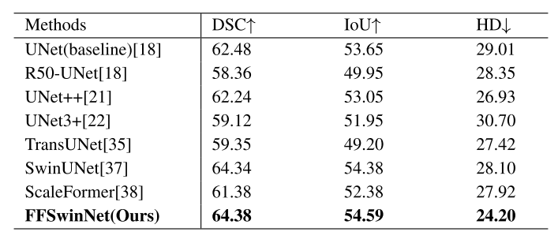

#### 消融实验

讨论CNN层数、模型尺度、输入尺寸、傅里叶变换器

**CNN层数**：

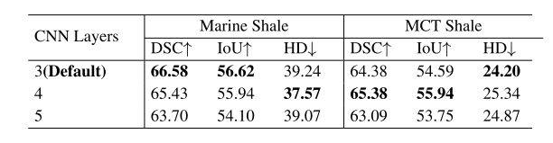

所以选择3层

**模型尺度**：

Tiny：编码器中有6个Transformer层，每个解码器模块中有1个swin Transformer模块

base：编码器中有12个Transformer层，每个解码器模块中有2个swin Transformer模块

large：编码器中有18个Transformer层，每个解码器模块中有3个swin Transformer模块

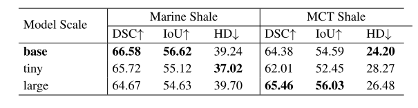

选base

**傅里叶变换器**：

需要加上

**输入尺寸**：

256x256和384x384，结果表明256x256更好

#### 实验结果图：

不同网络对海洋页岩 SEM 数据集的分割结果：

不同网络对海洋-陆地过渡页岩 SEM 数据集的分割结果：

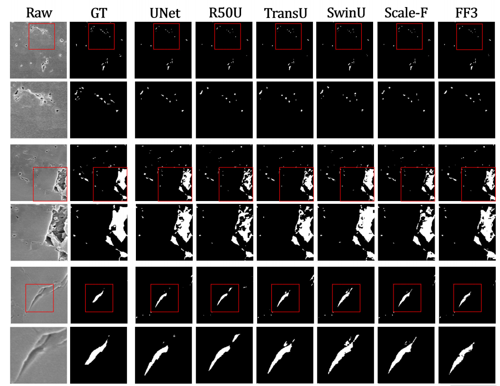

___

## 基于 Transformer 的深度学习模型用于预测多孔介质的渗透率

Transformer-based deep learning models for predicting permeability of porous media

### 摘要

通过数字图像直接获取多孔介质的渗透率有助于加深我们对地下流体流动问题的理解，并促进相关研究。复杂的孔隙空间使得采用数值模拟方法计算渗透率非常耗时。由三维卷积神经网络（3D CNNs）表示的深度学习模型，作为一种有望提高计算效率的方法，在预测多孔介质渗透率方面取得了显著进展。然而，由于3D CNNs具有大量参数，需要巨大的计算资源，这限制了其在小尺寸多孔介质上的应用，且其泛化能力尚未得到充分探索。为解决这些挑战，我们提出了一种新颖的CNN-Transformer混合神经网络，将二维卷积神经网络（2D CNN）与自注意力机制相结合。此外，我们将物理信息融入数字图像中，构建了一个PhyCNN-Transformer模型，以反映物理特性对渗透率预测的影响。在数据准备方面，我们采用了公开可用的DeepPore多孔介质数据集，样本大小为256³个体素，并使用孔隙网络建模（PNM）计算了标注的渗透率。我们从参数数量、训练效率、预测性能和泛化能力等方面将两种基于Transformer的模型与3D CNN进行了比较，结果表明性能有显著提升。通过迁移学习，经过良好训练的基于Transformer的模型表现出对不同尺寸多孔介质的适应能力（在300个训练样本下达到0.9563的R²分数），而3D CNN则缺乏这种迁移能力。

### 结论

……未来的研究应采用先进且复杂的神经网络架构，并利用优化算法进行超参数调优（Alzubaidi et al., 2021; Lin et al., 2022; Ramos et al., 2023）。此外，还应改进多孔介质数字图像中嵌入的物理参数及其引入方式，以提升模型性能（Pan et al., 2021）。

### Introduction

测量多孔介质渗透率的重要性 --> 传统渗透率测量的方法 --> 近几十年的方法 (是存在局限的) --> 近年来，许多研究人员利用神经网络模型来提高多孔介质渗透率的计算效率和精度，从而加速了数值模拟过程。CNN、3D CNN --> 3D CNN局限：参数量大、局限于小尺寸、泛化性未得到充分研究 --> 针对这些局限，本文提出CNN-Transformer，参数量小且预测尺寸更大，结合迁移学习，泛化性更好 --> 介绍CNN-Transformer的灵感来源，介绍Transformer --> 介绍本研究提出的CNN-Transformer是一个混合神经网络，将物理特征融入网络。

### PhyCNN-Transformer

#### 物理参数矩阵的形成

物理参数矩阵的融入旨在解决卷积核难以从输入图像中隐式提取全局影响因素的问题。矩阵基于Kozeny-Carman方程，该方程用于估计渗透率K，涉及孔隙度φ（porosity）和比表面积σ（specific surface）：

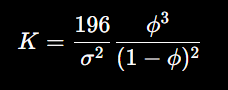

作者对该方程进行了调整，选择两个全局物理参数：孔隙度φ和比表面积`σ_v`（定义为每单位孔隙体积的比表面积，而不是通常的每单位体体积σ）。`σ_v`在3D状态下的定义为：

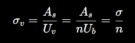

其中，A_s是颗粒总表面积，U_s是孔隙体积，U_b是体体积，n是孔隙度。

**矩阵实际形成过程**：

对于每个2D切片图像（128x128，经过预处理），计算其局部物理参数：

- 孔隙度：切片中孔隙像素占总像素的比例（一个标量值）
- 比表面积：切片中所有颗粒的总周长除以孔隙面积（一个标量值）

创建一个与切片图像大小相同的2D矩阵（128x128）。矩阵分为上下两半，上64行全部填充为该切片的孔隙度值，下64行全填充为该切片的比表面积值。

这种设计确保了物理参数以空间形式嵌入，而不是简单附加标量，从而允许卷积操作捕捉其全局影响。这种方法借鉴了Tang et al. (2022)的3D矩阵嵌入，但适应为2D序列以匹配模型架构。

#### 拼接到模型当中

矩阵的拼接发生在输入预处理阶段，目的是将物理信息与原始数字图像融合，形成增强的输入张量。

3D多孔介质图像被切分为**沿z方向的256个2D切片序列**。每个切片是单通道灰度图像（通道数=1）。原始张量大小为**256 × 1 × 256 × 256**（序列长度 × 通道 × 高度 × 宽度）。为节省GPU内存，使用PyTorch将图像下采样到128×128大小，张量变为**256 × 1 × 128 × 128**。对于每个切片，将对应的物理参数矩阵**作为第二个通道**添加到原始图像通道。--> 每个切片变成2通道图像，张量变为256 x 2 x 128 x 128

### 模型架构

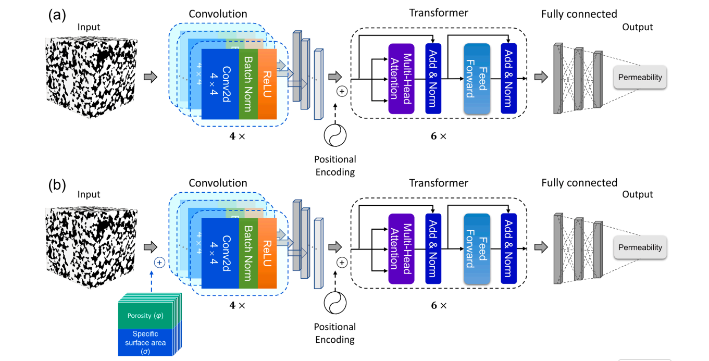

a是CNN-Transformer，b是PhyCNN-Transformer

#### CNN/PhyCNN架构

负责处理每个切片图像，4层2D卷积网络，具体参数：

每个卷积核大小4x4，步长2，填充1。每层后接BN层，激活函数ReLU。输出通道数逐层增加：8 --> 16 --> 32 --> 64。

经4层卷积后得到64通道的8*8特征图。然后通过一个全连接层将特征图展平为256维特征向量。整个序列有256个切片，**因此CNN处理后得到一个长度为256的序列，每个元素是256维向量（无论是否添加物理信息，都压缩到相同维度，以比较PhyCNN的提升）**。

这种设计避免了传统池化层，而是用步长为2的卷积来下采样，目的是扩展感受野，捕捉更大尺度特征，同时保留更多信息（引用Elmorsy et al., 2022; Ruderman et al., 2018; Springenberg et al., 2014）。

#### Transformer架构

Transformer部分参考Vaswani et al. (2017)的编码器栈框架，用于处理CNN输出的序列，捕捉切片间的长期依赖和全局相关性。

编码器输入/输出均为256维，编码器输出序列沿序列长度维度平均，然后输入四个全连接层，维度依次为512、1024、512、1（最终输出渗透率值）

#### 超参数

**epoch：**100，保存最佳epoch的模型。**学习率：**初始10^{-4}，使用Adam优化器。在epoch 30、60、90时分别降为0.1、0.05、0.025倍。**Batch Size**：测试8、16、32、64，以观察对性能影响。

损失函数：RMSE。评估指标：R2, RMSE, 中位绝对相对误差MedARE

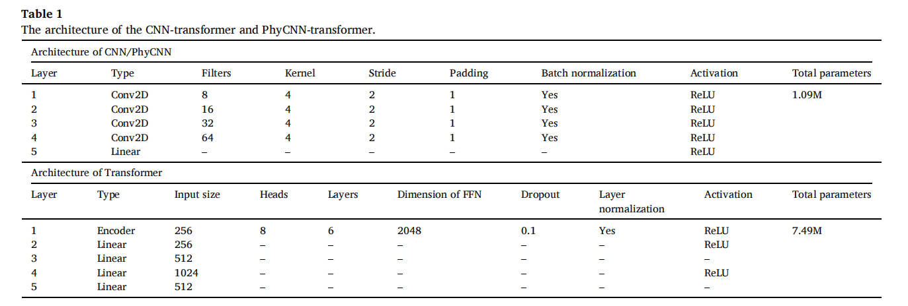

### 数据集

DeePore数据集，来源于60个真实多孔介质样本，经数据增强后变成17700个图像。中选取了 6250 个样本，并按 8:2 的比例将其分为训练集和测试集。然后，训练集又按 7:3 的比例进一步分为训练子集和验证子集。

此外，我们选取了七个立方体形状的枫丹白露砂岩（Berg，2014），其体积为 480 × 480 × 480 个立方体体素，空间分辨率为 5.4 μm/体素。并采用沉积生成法（Batchelor，1972；Jiang 和 Wu，2013；Pilotti，1998；Vold，1960）模拟生成了 1000 个填充有球形颗粒的立方体多孔介质，作为外部测试集。与 DeePore 数据集相比，这些样本具有不同的孔隙结构，以研究模型的泛化性能。

#### 标准化处理

由于原始样本的大小和分辨率不一致，会导致模型输入不兼容，因此进行标准化处理：调整大小和裁剪，将所有原始样本大小和空间分辨率标准化，最终生成图像统一为256x256x256立方体体素（voxels），分辨率为5μm/voxel。

#### 数据增强

对**每对图像**内的**距离图**进行规范化 --> 通过插值成对真实图像生成混合图像，使用随机选择的插值权重和孔隙度分数（孔隙度分数在0.1~0.45） --> 对插值图像应用**随机方向移位**，移位产生的空隙使用剩余结构的镜像图像填充，以保持图像纹理 --> 最终生成17700个图像（C60 2 x 10）

**具体：**

**每对图像**：从60个真实的多孔介质图像样本中，任意选择两个不同的图像作为一对。这操作会系统地遍历，即C60 2 = （60*59）/2 = 1770对图像对。

**插值成对真实图像生成混合图像（这是基于“距离图”的图像融合过程）**：

预处理：

1. 对每个图像计算“距离图”：每个像素到最近固体边界的距离，这捕捉了孔隙结构的几何特征（孔隙大小、形状）
2. 使用局部自适应Otsu算法二值化图像（确保孔隙/固体清晰区分）
3. 归一化距离图：将值缩放到0-1范围，防止大孔隙主导小孔隙

插值：

每一对图像生成10个混合图像，混合公式：

hybrid_distance = w x `normalized_distance_A` + (1-w) x `normalized_distance_B`，其中，w为随机插值权重。

选择随机孔隙度分数，然后阈值化混合距离图：使最终图像的孔隙度匹配选定的分数（例如，如果目标孔隙度是0.3，就调整阈值让30%的像素为孔隙）

每个图像对生成10个新图像，这些新图像是A和B的“加权平均”，但调整了孔隙度，模拟不同地质条件下的变异。

**随机方向移位**：

对每个插值生成的混合图像，进行随机方向的平移。移位量限制在图像宽度的1/3以内（以避免过度扭曲），因为部分内容移出边界，这会造成图像边缘出现“空隙”。用剩余结构的“镜像图像”填充这些空隙

### 实验结果与讨论

这是在验证集上，CNN-Transformer在批次大小为16时，R2最大且RMSE最小，分别为 0.9857 和 0.0732。PhyCNN-Transformer对批次大小的变化并不敏感。PhyCNN-Transformer在验证集上性能更好。

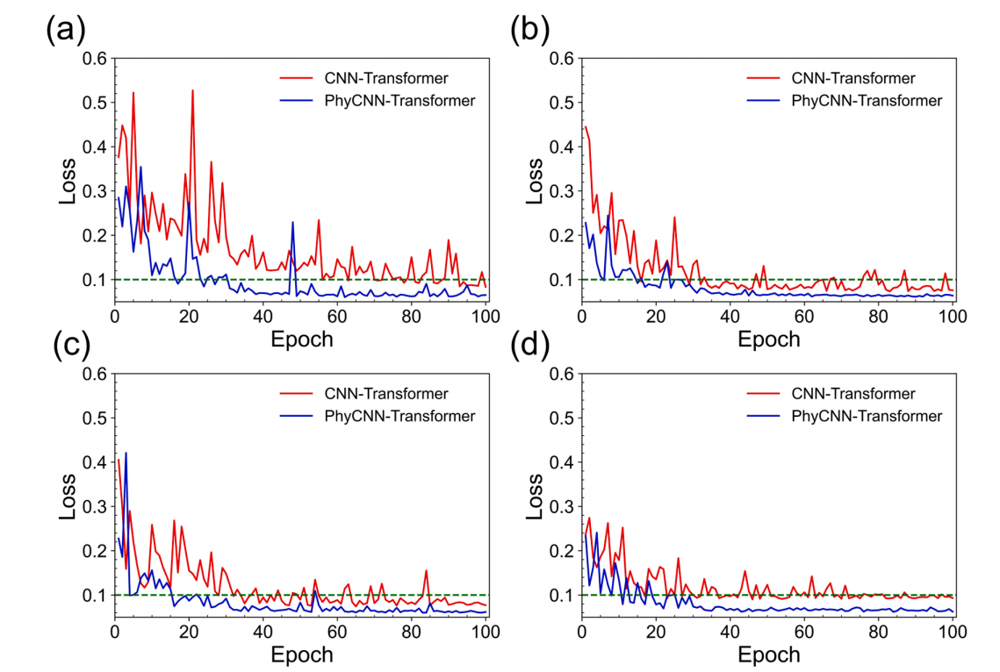

这是在验证集上，不同的batch size对同一个模型会导致不同的收敛情况，对CNN-Transformer来说，当BS为8时，不易收敛，当bs为16时，RMSE曲线未能完全收敛，但损失值在第83个epoch达到最小值，当bs为32且训练轮数大于90时，CNN-Transformer模型的RMSE损失曲线逐渐收敛至0.08，而当批大小为 64 且训练轮数大于 72 时，RMSE 损失曲线逐渐收敛至 0.09。这些结果表明，增加批大小可以加快 CNN-Transformer 模型的收敛速度

PhyCNN-Transformer的损失曲线对批次大小不敏感，它在训练稳定性上更好。

**作者建议选择bs=16的CNN-Transformer和bs=32的PhyCNN-Transformer**，并分析了原因。选择这两个模型在测试集上进行评估，观察到PhyCNN-Transformer在测试集上优势有所减弱，作者认为是测试集数据分布超出训练集数据范围，引入物理参数无法充分表征这些复杂的孔隙介质结构，从而降低了模型性能。

#### 与3D CNN的比较

3D CNN在验证集和测试集上预测性能略逊于CNN-Transformer和PhyCNN-Transformer，CNN-Transformer 和 PhyCNN-Transformer 的训练参数为 859 万，而 3D CNN 模型的训练参数为 2020 万，是这两个基于 Transformer 的模型的 2.35 倍。在训练效率方面，3D CNN 平均每个 epoch 耗时 29.6 分钟，分别比 CNN-Transformer 和 PhyCNN-Transformer 增加了 8.82% 和 2.09%。

为测试在未见过的样本上的性能：

使用之前说的七个枫丹白露砂岩样本，经过预处理。结果表明，基于 Transformer 的模型的泛化性能远优于 3D CNN。尽管 3D CNN 在包含 1250 个样本的测试集上取得了不错的成绩，但其对之前未见过的样本的性能并不理想。

**迁移学习：**

本文的模型首先在DeePore数据集（样本大小为256³立方体素，渗透率标签由孔隙网络建模PNM计算）上进行训练，通过迁移学习，将预训练权重转移到**不同大小的多孔介质数据集**（例如380^3立方体素）上，仅用少量目标样本（300个）进行微调。

使用迁移学习后，Transformer模型在大小不同的多孔介质上表现出色，R2分数为0.9563。3D CNN无法有效迁移。

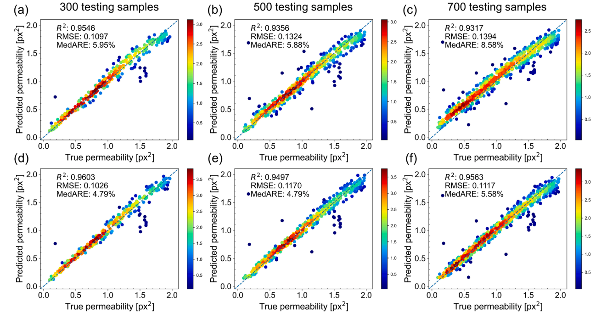

a、b、c是CNN-Transformer的，下面是PhyCNN-Transformer的，从左到右分别是700 train samples/ 300 testing samples，500 train samples/ 500 testing samples，300 train samples/ 700 testing samples，即使是300 train samples/ 700 testing samples，性能也不错

3D CNN为什么不能有效迁移？

它参数量众多，3D卷积操作对输入体积高度敏感，如果目标数据集尺寸不同（如从256³迁移到512³），需要调整网络架构（如改变卷积核、池化层），这会破坏预训练权重，导致从零训练或性能急剧下降。计算成本高也使微调大尺寸数据集不切实际

___

## Vision Mamba 用于多孔介质渗透率预测

Vision Mamba for Permeability Prediction of Porous Media

### Conclusion

本文提出了一种基于 Vision Mamba 的神经网络，用于预测三维多孔介质的渗透率。我们使用决定系数、均方误差以及最大和最小相对误差等评估指标验证了所提出模型的有效性。我们讨论了 Vision Mamba 相较于卷积神经网络 (CNN) 和 ViTs 在渗透率预测方面的优势。特别地，我们证明了与 CNN 相比，Vision Mamba 所需的训练参数更少，却能达到更优异的性能。此外，我们还证明 Vision Mamba 的 GPU 内存使用量与图像块大小呈线性关系，而 ViTs 的 GPU 内存使用量则呈二次方关系。因此，在 GPU 资源有限的情况下，Vision Mamba 能够更好地利用 GPU 内存。在内存方面，Vision Mamba 能够成功地使用较小的图像块大小执行机器学习实验，而 ViTs 在使用相同的较小批次大小时由于内存不足而无法进行训练。最后，我们探讨了关键超参数的影响，包括 Vision Mamba 的块数、每个块内的图像块大小以及批次大小，以突出它们对模型性能的影响。

在本文中，我们使用了 Vision Mamba 的分类分支，其中神经网络的输入代表多孔介质的几何形状，输出是渗透率的标量值。作为未来项目的思路之一，可以使用 Vision Mamba 的分割分支，这样，尽管输入仍然是描述多孔介质几何形状的三维立方体，但输出是孔隙空间内的预测速度场。当然，获得速度场后，也可以计算渗透率。然而，获取完整的速度场可以提供更多信息。这可以通过完全监督的深度学习或弱监督的深度学习来实现，如果只有速度场的稀疏观测值可用，则可以通过强制执行控制方程（例如，方程 1、2） 作为 Vision Mamba 网络的损失函数来实现。

另一个有前景的研究方向是基于 Vision Mamba 而非 Transformer 架构，开发用于多孔介质的大型语言和视觉模型。此类基础模型能够处理可变尺寸和多矿物多孔介质，从而预测其物理和几何特征，并提供交互式环境，以便在一个统一的框架内集成图像、代码、文本和数学公式。
