## 基于测井解释和机器学习的压裂甜点预测方法

### 挖井过程中为什么要进行压裂

致密储层，即使我们把井打到了致密储层，里面的油气也几乎无法自己流到井里。水力压裂通过高压泵将大量的混合液体通过井筒注入到地下深处的致密岩层中，当压力足够大时，就会像用液压钳掰开一块石头一样，在岩层中制造出人工的裂缝网络。混合液体中的“支撑剂”（比如沙子）会随着液体进入这些裂缝，并像无数个小楔子一样卡在里面。当压力释放、液体回流后，这些沙子会**撑住**裂缝，不让它们重新闭合。最终，我们在致密的“砖头”里，制造出了许多条由沙子支撑的、高渗透性的通道。

### 什么是“压裂甜点” Fracturing Sweet Spot

在非常规油气藏（如页岩气、致密油/气等）中，**通过水力压裂作业能够获得最佳增产效果的储层区域**。这些区域通常具备以下有利地质和工程特征：

- 高储层品质（高孔隙度和渗透率，尽管在非常规储层中整体较低、高含油气饱和度、有机质含量高）、
- 高可压裂性
  - **脆性矿物含量高**（如石英、长石、碳酸盐岩），有利于形成复杂裂缝网络
  - **黏土矿物含量低**（黏土多易导致裂缝闭合或吸水膨胀，不利于压裂）
  - **天然裂缝发育**（有助于与人工裂缝连通，提升导流能力）
- 应力条件有限
  - **最小水平主应力较低**，易于压裂施工
  - **水平应力差适中**，既利于形成复杂缝网，又不至于导致裂缝单一扩展
- 具有经济开发价值

因此，基于测井解释与机器学习的压裂甜点预测方法，就是利用大量测井数据和已知产量/压裂效果数据，训练模型来识别哪些井段或区块最有可能成为高效压裂目标区，从而优化完井设计和开发部署。

### 什么叫水平井：

先垂直向下钻，到达一定深度（储层顶部）后，开始拐弯，最终以接近水平的姿态在储层（即含油的岩层）中穿行很长一段距离

- “精确描述**沿水平井轨迹**的地质工程特征” —— 意思是，我们知道这口水平井在钻进路径上，**每一米**的岩石力学性质（是否容易被压裂）、含油性（是不是“甜点”）等信息。
- “计算**沿水平井轨迹**的岩石力学参数” —— 即计算出这条路径上每一点的岩石硬度、脆性等参数。
- “实现**沿水平井轨迹**和整个储层区块的一体化甜点计算和可视化” —— 就是把整口水平井路径上识别出的“甜点”段（适合压裂的好层段）在三维模型上显示出来。

### 建立了基于测井数据的地质工程综合压裂模型：

使用测井解释数据计算水平井轨迹上的岩石力学参数，并建立了水平井和整个区块的集成压裂模型，实现地质工程特征的精细刻画。

收集107口井的测井数据，将处理后的数据导入fracman软件，建立每口水平井的**精细地质模型**。使用岩石力学公式+fracman内置模块，基于测井数据计算沿井轨迹的**岩石力学参数**，包括最小水平应力、杨氏模量、泊松比、破裂压力。计算完之后，通过fracman在**精细地质模型**上叠加**岩石力学参数**，形成**地质工程综合压裂模型**，可模拟裂缝扩展的 3D 模型，文中举例井BH1：

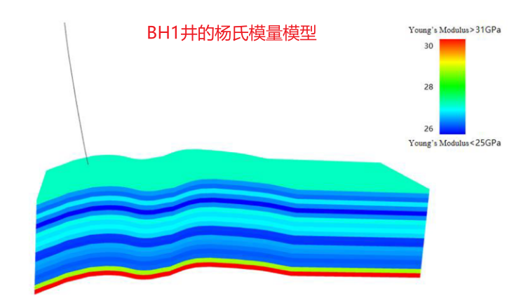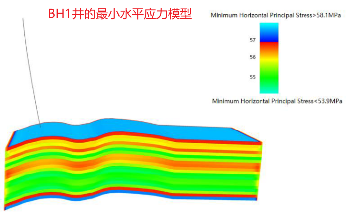

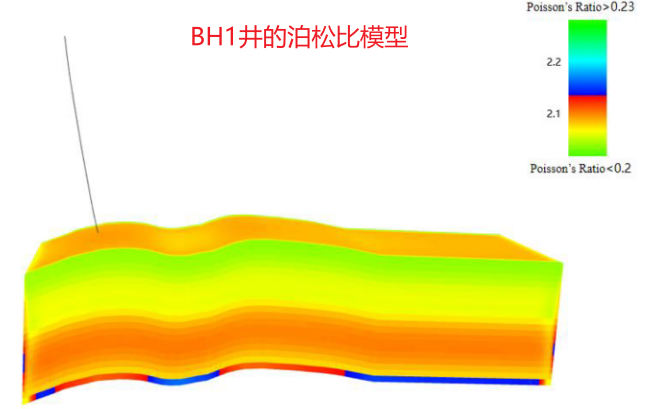

扩展到全区块，将107口井的模型网格化整合，形成全区块综合模型（含孔隙度、渗透率、应力场等）：

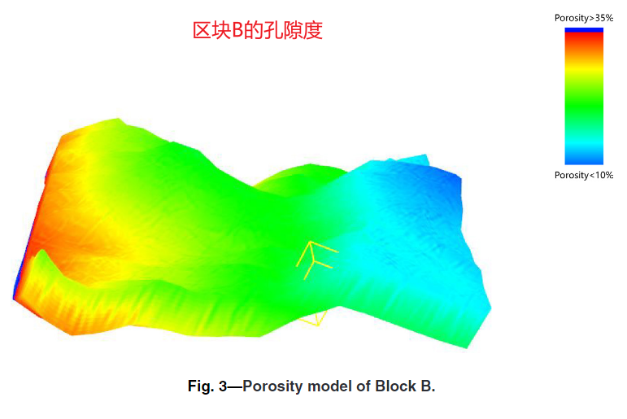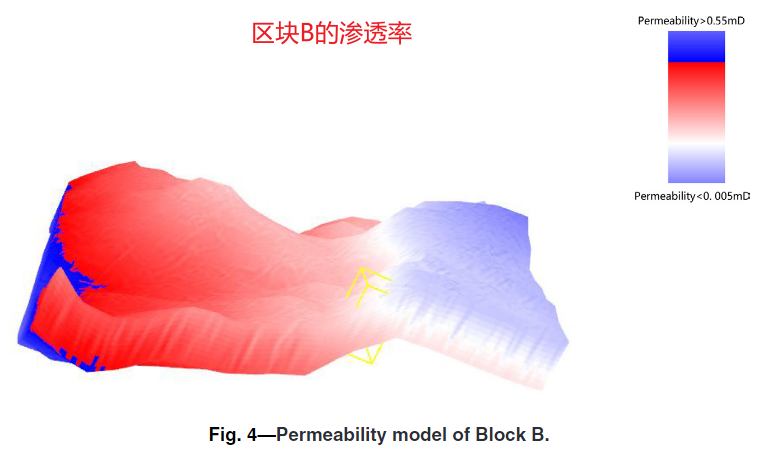

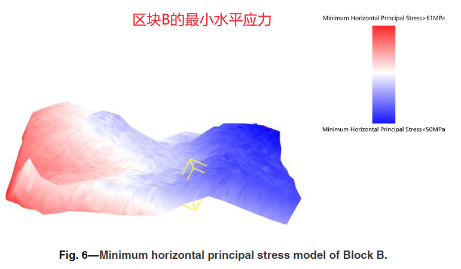

上面举例了在BH1水平井轨迹上建立了**地质工程综合压裂模型**，文中还预测了水平井轨迹上的压裂最佳位置（甜度大的点适合压裂），这个是如何预测的？——使用BPNN（反向传播神经网络），即使用BPNN预测沿水平井轨迹的每个点的甜度值，甜度大的那些点适合压裂

### BPNN

最佳压裂点值的特征为
$$
I_s = \frac{Q_s}{Q_d}
$$
其中，I_s为综合甜度值（无量纲）；Q_s为压裂井的生产容量（前30天的平均日产油量，单位：m³/d）；Q_d为理想井产能值（单位：m³/d）。理想井产能值是指当所有地质和岩石力学参数达到理想最优值时，压裂井段的产量。

“前30天”：从井投产（即开始生产或开采）时刻往后的30天平均日产油量（the average daily oil production in the first 30 days of production)

**BPNN模型的输入-->输出：**

输入特征是测井解释参数、地质参数、岩石力学参数、施工参数（施工参数在训练时统一固定，以消除其影响，只关注地质因素的影响），这些特征基于改进AHP-GRA方法计算权重后输入，总权重和为1，确保重要因素（如地质参数，权重0.2919）主导预测。

首先作者整理了这样的框架：

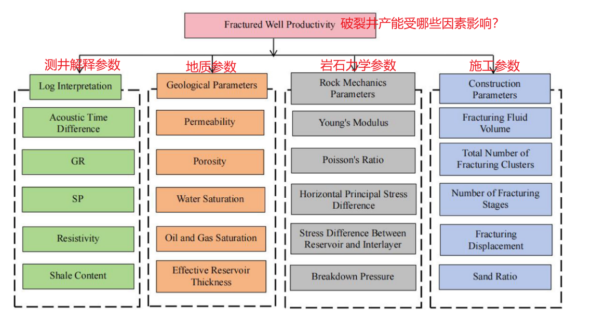

通过改进的AHP-GRA方法计算各参数对压裂井产能的影响权重，得出：

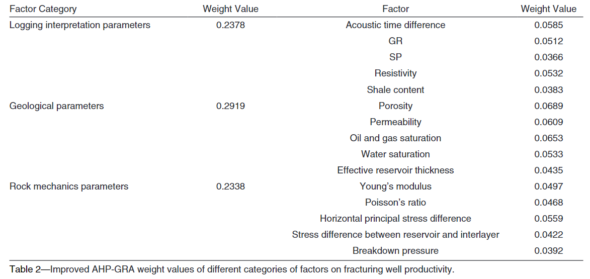

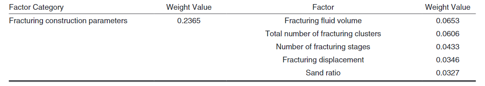

输入是多少维没有明确，但**BPNN的输入是加权后的标准化值**

BPNN就是正常地正向传播-->计算损失-->反向传播-->迭代训练直到收敛（终止条件：Loss < 阈值或固定epoch）

关于训练数据集，来自B区块107口井，训练75 测试32。features应该就是测井解释参数、地质参数、岩石力学参数、施工参数这些，label就是实际压裂井产量Q_s（m³/d，前30天平均日产油）

输出：Q_s（m³/d，从井投产（即开始生产或开采）时刻往后的30天平均日产油量）

文中给了一个例子：BH1井

BH1井的基本参数：（作为参数输入）

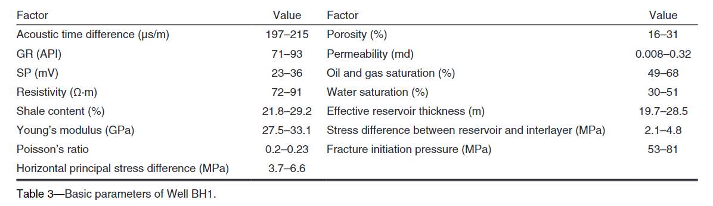

BH1井的甜度随深度变化预测曲线：（BPNN输出是Q_s，根据上面的公式计算出甜度）

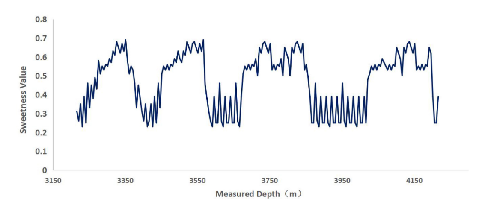

为了说明这个BPNN模型是对的，文中也给出了验证：（平均相对误差小于0.9%）

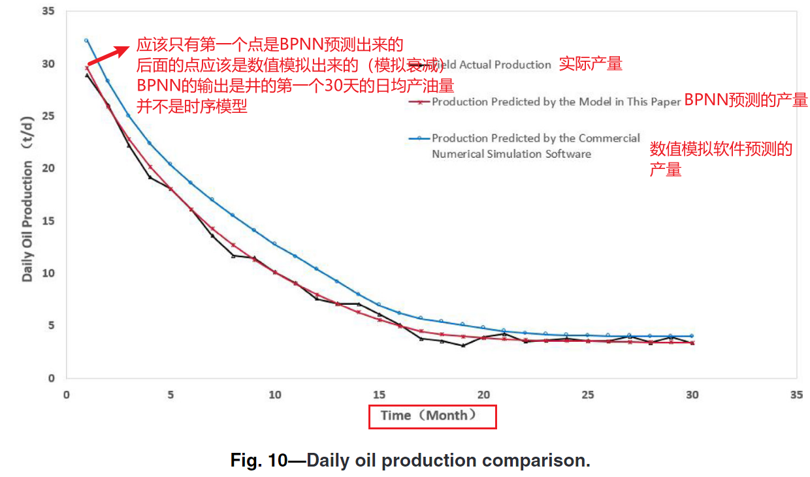

纵轴是这个月日均产油量 the average daily oil production of the month ，BPNN预测的这条随时间变化的曲线到底是怎么来的，存疑

甜点预测完整流程

| 步骤                  | 操作                                                         | 输入           | 输出                    |
| --------------------- | ------------------------------------------------------------ | -------------- | ----------------------- |
| 1. 统一施工参数       | 所有样本井的压裂参数**必须一致**（液量、段数、砂比等），**消除施工影响** | 107 口井数据   | 标准化样本集            |
| 2. 计算理想产量 Qd    | 假设所有地质+力学参数都达到**最优值**，计算理论最大产量      | 最优参数组合   | Qd（理想井产量）        |
| 3. 训练 BPNN 模型     | - 输入：测井+地质+力学参数 - 输出：实际阶段产量 Qs（前30天平均日产） - 75 口井训练，32 口井测试 | 107 口井数据   | 预测模型（准确率 >95%） |
| 4. 沿井轨迹网格化预测 | 对 Well BH1 每隔一定距离取一个点，输入其参数到 BPNN          | 沿轨迹参数网格 | 每个点的预测产量 Qs     |
| 5. 计算甜度值 Is      | Is=QsQd  I_s = \frac{Q_s}{Q_d}  Is=QdQs                      | Qs, Qd         | 甜度值（0~1 之间）      |
| 6. 绘图               | 沿水平井轨迹画出 Is 曲线                                     | Is 值序列      | **甜点分布图（Fig.9）** |

### 实际验证

BH6井的基本参数：

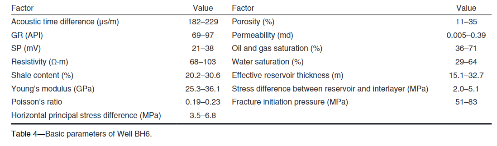

拿BH6井做验证，BH6井的实际方案是均匀布缝，20个stages，每个stages里面一个缝，但经本文方法优化后的方案是9个stages，每个stages里面1-3个缝：（也就是说优化方案的施工参数发生了变化）

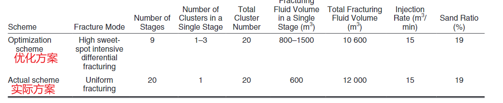

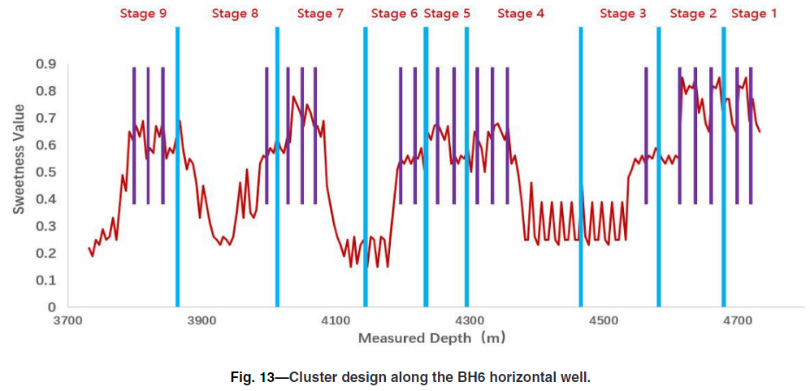

可以看出基本都是在甜度值高的地方布缝

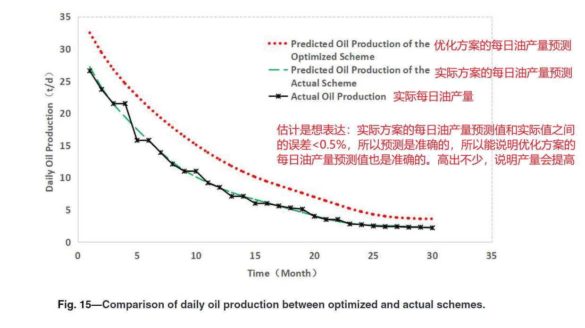

产生疑问：Q_s是根据输入的测井解释参数、地质参数、岩石力学参数、施工参数，通过BPNN输出出来的。BH6井的实际方案是勘探现场实施的方案，那么实际方案的测井解释参数、地质参数、岩石力学参数、施工参数都是有的，那么可以通过BPNN预测油产量，但是我们优化的方案并没有在现场实施，它应该是没有测井解释参数、地质参数、岩石力学参数、施工参数的吧，那是怎么得出它的预测油产量的呢？

答：

BH6井的优化方案它的施工参数是变了的（相比实际方案），但优化后的方案的Q_s不是通过BPNN算出来的，因为BPNN在训练和预测的时候施工参数是统一的，是为了避免施工问题带来的影响，因此BPNN只学习到了地质因素（测井解释参数、地质参数、岩石力学参数）对井的初始油产量的影响，没有学到施工参数对油产量的影响。因此如果把优化后的方案的参数（优化后之后施工参数变了）输入到BPNN，预测是不准的

因此优化后的产量极有可能是通过数值模拟算出来的，这也和上面图的曲线相符合，数值模拟如何算油产量？下面可以举个例子：

| 步骤                | 工具                              | 输入                                      | 输出                                                 |
| ------------------- | --------------------------------- | ----------------------------------------- | ---------------------------------------------------- |
| 1. 建立 3D 地质模型 | **Fracman**                       | 测井数据 → 孔隙度、渗透率、应力场（不变） | 区块3D网格（Fig.3–6）                                |
| 2. 模拟裂缝扩展     | **Fracman**                       | 施工参数（变！）+ 岩石力学                | 裂缝几何（长度、宽度、高度） → 刺激体积（SRV）↑59.3% |
| 3. 建立流动方程     | **储层模拟器**（如 CMG、Eclipse） | 裂缝 + 渗透率 + 饱和度 + 流体性质         | 每网格的压力、流量                                   |
| 4. 运行生产模拟     | **数值求解**                      | 时间步长（30天）                          | **前30天累计产量 → 平均日产 Qs**                     |

### BPNN预测甜点和综合压裂模型的配合（二者的关系）

BPNN输入测井解释参数、地质参数、岩石力学参数、施工参数，输出Qs，然后计算l_s，生成甜点分布图（甜点训练和预测时，施工参数是统一的）。识别高甜点段，在综合模型中调整施工参数（比如在BH6的优化方案中，施工参数都变了），反馈到压裂模型，用fracman模拟新裂缝形态（下图），通过数值模拟预测Qs

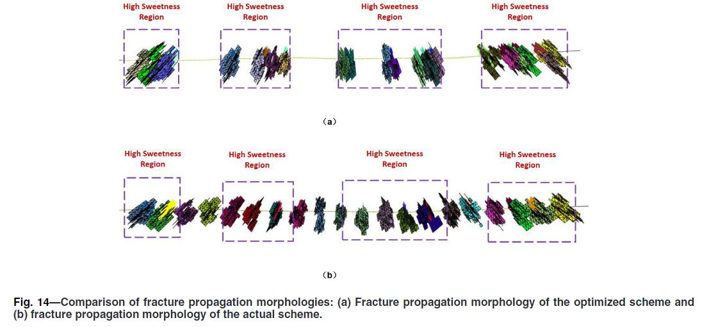

