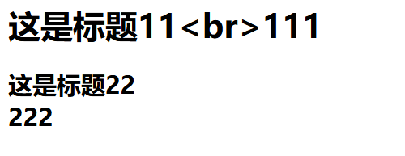
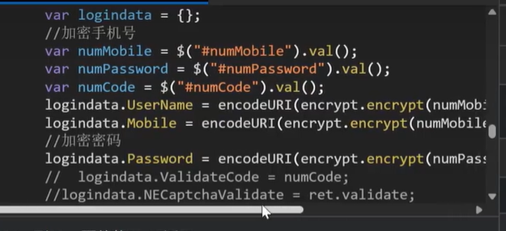
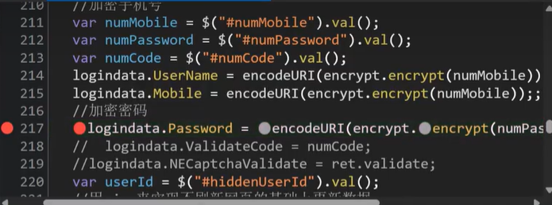
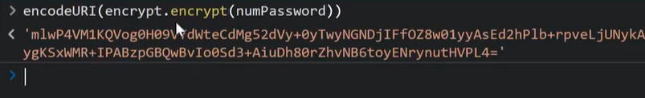
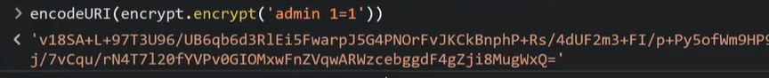

## DOM树

### 1、获取对象

标签：直接写
Class：加上符号.
id：加上符号#

```html
<h1 id="myHeader" onclick="getValue()">这是标题</h1>

document.querySelector('h1')
document.querySelector('.myHeader')
document.querySelector('#myHeader')
```

例子：

```html
<br>
<button onclick="update()">刷新</button>

<script>
    function update() {
        const src=document.querySelector('img');
        const s = document.
        console.log(src); //
        console.log(src.src);//file:///C:/Users/86151/Desktop/JS/11.jpg
    }
    
</script>
```


### 2、获取对象属性

```html
<h1 id="myHeader" onclick="update1()">这是标题</h1>

<script>
    function update1() {
        const src=document.querySelector('h1');
        console.log(src.innerText); //获取到 这是标题   
    } 
</script>
```


### 3、操作元素数据

```
innerHTML 解析后续代码
innerText 不解析后续代码
```

```html
<h1 id="myHeader" onclick="update1()">这是标题1</h1>
<h2 id="myHeader2" onclick="update2()">这是标题2</h2>

<script>
    function update1() {
        const src=document.querySelector('h1');
        src.innerText = '这是标题11<br>111';
    } 

    function update2() {
        const src=document.querySelector('h2');
        src.innerHTML = '这是标题22<br>222';
    } 
</script>
```

点击之后：



innerHTML会把字符串当做html来解析


### 4、操作元素属性

className src id等

```html


<br>
<button onclick="update()">刷新</button>

<script>
	function update(){
        const src = document.querySelector('img');
		src.src = 'huawei.png';//实现点击之后换图片
    }
</script>

```

这里是写死的huawei.png，如果这里由用户输入控制，就可能触发DOM XSS

src.src = "javascript:alert('xss')"; 浏览器可能拦截


**安全问题：本身的前端代码通过DOM技术实现代码的更新修改，但是如果修改的数据如果可以由用户指定，就会造成DOM-XSS**


## JS断点调试

1 32 45




如果直接在控制台执行`encodeURI(encrypt.encrypt(numPassword));`的话，会报错，因为本地环境没有定义encode、encrypt

等

断点调试：



执行到断点会停止，然后再控制台调用




