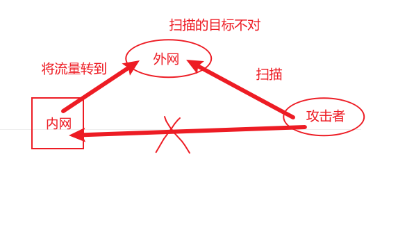
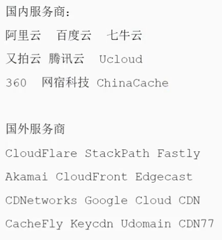
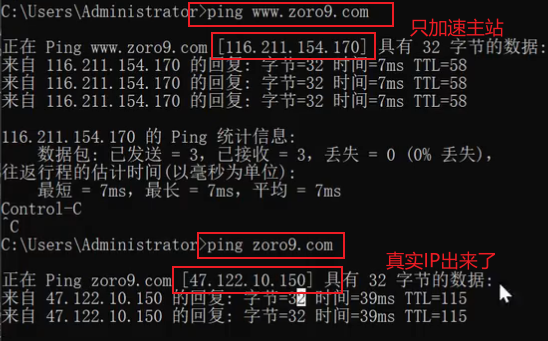
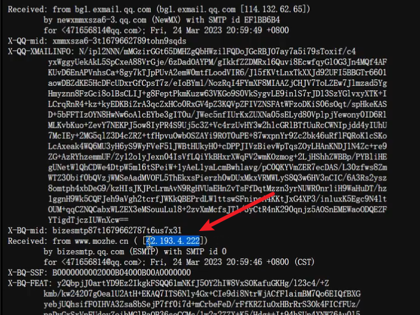
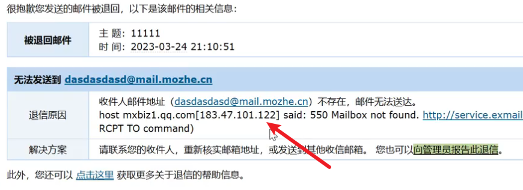

# 信息收集网站

| 标签       | 名称         | 地址                                 |
| ---------- | ------------ | ------------------------------------ |
| 企业信息   | 天眼查       | https://www.tianyancha.com/          |
| 企业信息   | 小蓝本       | https://www.xiaolanben.com/          |
| 企业信息   | 爱企查       | https://aiqicha.baidu.com/           |
| 企业信息   | 企查查       | https://www.qcc.com/                 |
| 企业信息   | 国外企查     | https://opencorporates.com/          |
| 企业信息   | 启信宝       | https://www.qixin.com/               |
| 备案信息   | 备案信息查询 | http://www.beianx.cn/                |
| 备案信息   | 备案管理系统 | https://beian.miit.gov.cn/           |
| 公众号信息 | 搜狗微信搜索 | https://weixin.sogou.com/            |
| 注册域名   | 域名注册查询 | https://buy.cloud.tencent.com/domain |
| IP 反查    | IP 反查域名  | https://x.threatbook.cn/             |
| IP 反查    | IP 反查域名  | http://dns.bugscaner.com/            |

| 标签     | 名称                   | 地址                                       |
| -------- | ---------------------- | ------------------------------------------ |
| DNS 数据 | dnsdumpster            | https://dnsdumpster.com/                   |
| 证书查询 | CertificateSearch      | https://crt.sh/                            |
| 网络空间 | FOFA                   | https://fofa.info/                         |
| 网络空间 | 鹰图                   | http://hunter.qianxin.com/                 |
| 网络空间 | 360                    | https://quake.360.cn/quake/                |
| 威胁情报 | 微步在线 情报社区      | https://x.threatbook.cn/                   |
| 威胁情报 | 奇安信 威胁情报中心    | https://ti.qianxin.com/                    |
| 威胁情报 | 360 威胁情报中心       | https://ti.360.cn/#/homepage               |
| 枚举解析 | 在线子域名查询         | http://tools.bugscaner.com/subdomain/      |
| 枚举解析 | DNSGrep 子域名查询     | https://www.dnsgrep.cn/subdomain           |
| 枚举解析 | 工具强大的子域名收集器 | https://github.com/shmilylty/OneForAll     |
| 指纹识别 | 指纹识别               | http://whatweb.bugscaner.com/look/         |
| 指纹识别 | Wappalyzer（插件）     | https://github.com/AliasIO/wappalyzer      |
| 指纹识别 | **TideFinger 潮汐**    | http://finger.tidesec.net/                 |
| 指纹识别 | **云悉指纹**           | https://www.yunsee.cn/                     |
| 指纹识别 | WhatWeb                | https://github.com/urbanadventurer/WhatWeb |
| 指纹识别 | 数字观星 Finger-P      | https://fp.shuziguanxing.com/#/            |
|          |                        |                                            |
|          |                        |                                            |

| 标签     | 名称                    | 地址                                  |
| -------- | ----------------------- | ------------------------------------- |
| 网络空间 | 钟馗之眼                | https://www.zoomeye.org/              |
| 网络空间 | 零零信安                | https://0.zone/                       |
| 网络空间 | Shodan                  | https://www.shodan.io/                |
| 网络空间 | Censys                  | https://censys.io/                    |
| 网络空间 | ONYPHE                  | https://www.onyphe.io/                |
| 网络空间 | FullHunt                | https://fullhunt.io/                  |
| 网络空间 | Soall Search Engine     | https://soall.org/                    |
| 网络空间 | Netlas                  | https://app.netlas.io/responses/      |
| 网络空间 | Leakix                  | https://leakix.net/                   |
| 网络空间 | DorkSearch              | https://dorksearch.com/               |
| 威胁情报 | VirusTotal 在线查杀平台 | https://www.virustotal.com/gui/       |
| 威胁情报 | VenusEye 威胁情报中心   | https://www.venuseye.com.cn/          |
| 威胁情报 | 绿盟科技 威胁情报云     | https://ti.nsfocus.com/               |
| 威胁情报 | IBM 情报中心            | https://exchange.xforce.ibmcloud.com/ |
| 威胁情报 | 天际友盟安全智能平台    | https://redqueen.tj-un.com            |
| 威胁情报 | 华为安全中心平台        | https://isecurity.huawei.com/sec      |
| 威胁情报 | 安恒威胁情报中心        | https://ti.dbappsecurity.com.cn/      |
| 威胁情报 | AlienVault              | https://otx.alienvault.com/           |
| 威胁情报 | 深信服                  | https://sec.sangfor.com.cn/           |
| 威胁情报 | 丁爸情报分析师的工具箱  | http://dingba.top/                    |
| 威胁情报 | 听风者情报源 start.me   | https://start.me/p/X20Apn             |
| 威胁情报 | GreyNoise Visualizer    | https://viz.greynoise.io/             |
| 威胁情报 | URLhaus 数据库          | https://urlhaus.abuse.ch/browse/      |
| 威胁情报 | Pithus                  | https://beta.pithus.org/              |
|          |                         |                                       |

OneForAll  https://github.com/shmilylty/OneForAll

OneForAll在默认参数正常执行完毕会在results目录生成相应结果


# 源码泄露

https://www.secpulse.com/archives/124398.html

## 网站备份文件

 

## git泄露

原因：网站根目录包含 `.git` 目录，并被 Web 服务器错误暴露。例如，将整个 Git 仓库上传到网站服务器，没有禁止访问 `.git` 目录。

利用工具 githack

防范：

配置 Web 服务器，禁止访问 `.git` 目录。例如，在 Nginx 配置：

	location ~ /.git/ {
	deny all;
	}
在 `.htaccess` 添加访问限制：

```
RewriteRule ^(.*/)?\.git/ - [F,L]
```


## SVN泄露

利用：SvnHack


php加密常是zend加密


## .DS_Store

.DS_Store是Mac下Finder用来保存如何展示 文件/文件夹 的数据文件，每个文件夹下对应一个。如果将.DS_Store上传部署到服务器，可能造成文件目录结构泄漏，特别是备份文件、源代码文件。

漏洞利用工具：

github项目地址：https://github.com/lijiejie/ds_store_exp

用法示例：

```
ds_store_exp.py http://hd.zj.qq.com/themes/galaxyw/.DS_Store
```

得到的是目录架构，并不能直接获取源码


## composer.json

开发完没把这个文件删掉，会造成泄露


## 特征关键文件搜索

F12找网站的脚本文件，然后去github搜这个脚本文件，以获得源码。邮箱也可以搜，例如开发过程中引用了其他资源，其他资源中留了邮箱方便联系


# JS框架

Javascript 和 JS框架浏览器能看到真实源代码

一般会在JS中寻找更多的url地址（接口地址），在JS代码逻辑（加密算法、APIKey配置、验证逻辑）进行后期安全测试


## 手工模式

 ctrl+shift+f 在源代码中快速获取信息：

src=

path=

method:"get"

http.get("

method:"post"

http.post("

$.ajax

http://service.httppost

http://service.httpget


## 半自动模式

Burpsuite + HaE


## 全自动模式

findsomething插件

JSFinder

URLFinder


**ffuf** fuzz工具

https://github.com/ffuf/ffuf


js项目很多会用到webpack打包器

工具：Packer-Fuzzer

从打包器里面提取js


# 端口扫描

nmap msscan 网络空间 插件

开放状态：close open filtered（不知道开没开）


对于反向代理的情况：



造成的假象：明明数据库端口开放，网站也可以正常打开，但是你对目标进行端口扫描，发现数据库端口没有开放（排除防火墙问题），即内网把一些端口带到了外网，扫的是外网主机而不是内网主机


## waf识别项目：
https://github.com/EnableSecurity/wafw00f


## 蜜罐

蜜罐识别插件：Heimdallr

https://github.com/360quake/quake_rs

人工识别：

1、端口多且有规律性

2、web访问协议就能下载

3、设备指纹分析


# CDN

传统：用户访问域名-》解析服务器IP-》访问目标主机

普通CDN：用户访问域名-》CDN节点-》真实服务器IP-》访问目标主机

带WAF的CDN：用户访问域名-》CDN节点（WAF）-》真实服务器IP-》访问目标主机




## CDN配置

配置 1：加速域名-需要启用加速的域名

如果加速域名是*.yaowenda.com，那么就无法通过子域名获取真实IP（所有域名都指向CDN节点）

如果加速域名是www.yaowenda.com，由于子域名和域名可能在同一IP，那么可能可以通过bbs.yaowenda.com来找到真实IP



配置 2：加速区域-需要启用加速的地区

如果只在国内加速，那么可以在国外访问以获取真实IP


配置 3：加速类型-需要启用加速的资源


## CDN识别

1、超级ping 出现多个IP就判断为加速

2、他的服务器主动请求我们的服务器的话，能发现他的真实IP


### 邮件系统查看真实ip

部署架设的邮件服务器如果向外部用户发送邮件的话，那么邮件头部的源码中会包含此邮件服务器的真实IP

常见邮件触发点：

1、RSS订阅

2、邮箱注册、激活

3、邮箱找回密码

4、产品更新的邮件推送

5、某业务执行后发送的邮件通知

6、员工邮箱、邮件管理平台等入口处的忘记密码


**他主动给你发**

找回密码，收到邮件，显示邮件全文：



但有些网站的邮件系统不是自己的，例如用163 qq 126


**你主动给他发**

需要邮件系统不是第三方

通过发送邮件给一个不存在的邮箱地址，因为该用户邮箱不存在，所以发送失败，并且还会收到一个包含发送该电子邮件给你的服务器的真实IP通知



这是个qq的ip


### 通过网站查看真实ip

get-site-ip.com

作为参考

FOFA可以查 【个人中心-增值服务】主要针对国外


### 判断CDN厂商

tools.ipip.net


# CMS识别

GoToScan工具


# 开发组件

## fastjson、jackson

在提交JSON数据包中修改测试：

​	fastjson会把01解析成1

​	jackson解析01会报错

​	https://forum.butian.net/share/1679

​	https://www.iculture.cc/forum-post/24115.html


## shiro

请求包cookie中存在rememberMe字段

返回包中存在set-Cookie: rememberMe=deleteMe

请求包存在rememberMe=x时，响应包中存在rememberMe=deleteMe

有时候服务器不会主动返回rememberMe=deleteMe，直接发包即可，将cookie内容改为rememberMe=1，若返回包中有rememberMe=deleteMe，则基本可以确认网站使用apache shiro


## Struts2

.action


# APP资产

## 查找APP

爱企查知识产权

七麦

点点查名称

小蓝本


url网站备案查企业、查APP


## 在APP中收集资产

1、抓包-动态表现

2、抓取-静态表现&动态调试

3、搜索-静态表现

静态表现出的东西不一定在用


1、抓包抓表现出来的数据

优点：没有误报

缺点：无法做到完整

2、反编译从源码中提取数据

优点：数据较为完整

缺点：误报


打开有登录界面，但是没有抓到登录页面的数据包，点击登录后才能抓到，这是因为登录页面是它的打包资源，并没有对外请求。**因此网站或工具在对apk进行静态分析的时候，并没有获取到登录页面的网址**

动态分析也不一定就能获取到登录页面url，代码决定 


### APP中提取信息-静态分析

1、MobSF https://github.com/MobSF/Mobile-Security-Framework-MobSF

​	安装教程：https://blog.csdn.net/ljh824144294/article/details/119181803

2、AppInfoScanner https://github.com/kelvinBen/AppInfoScanner 静态的

3、在线平台：

​	https://mogua.co

​	https://www.zhihuaspace.cn:8888/


​	

# 小程序

凡科网生成小程序

小程序反汇编工具：http://xcx.siqingw.top/ 15元/月


# 自动化项目 & 资产侦查

## 企业信息-ENScan

项目地址：https://github.com/wgpsec/ENScan_GO

剑指 HW/SRC，解决在 HW/SRC 场景下遇到的各种针对国内企业信息收集难题

首次使用需要 -v 生成配置文件，再去配置这个配置文件


例：enscan-v1.1.2-windows-amd64.exe -n 小米 -type aqc,tyc


## 网络空间-AsamF

AsamF是一款集成多个网络资产测绘平台的一站式企业信息资产收集工具。

地址：https://github.com/Kento-Sec/AsamF

配置：

AsamF会在~/.config/asamf/目录下生成config.json文件。如果你有多个key，按照json的格式录入即可，建议键值按照阿拉伯数字依次录入,方便以阿拉伯数字来切换key。

自动结果保存在~/asamf/目录下。

免积分导出


