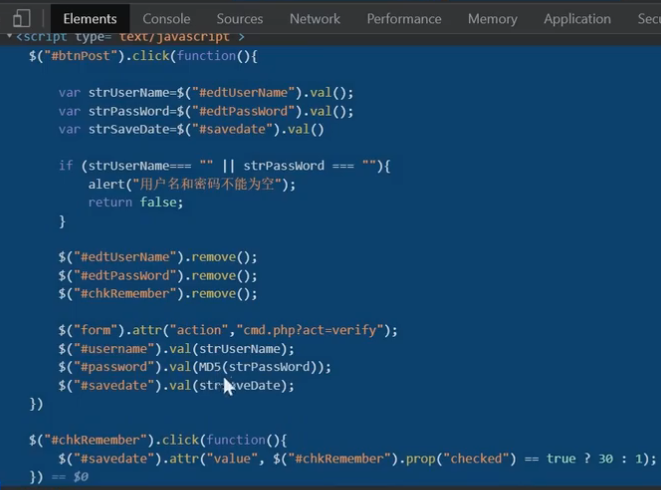

Captfencoder是一款开源的快速跨平台网络安全工具套件，提供网络安全相关的代码转换、经典密码、密码学、非对称加密等杂项工具，并聚合各类在线工具。

有源码直接分析源码分析算法

没有源码：

​	1、猜 识别

​	2、看前端JS（如果加密逻辑在前端）

### BASE64编码特点

大小写 = 等号结尾 明文越长秘文越长，密文一般不会有/

### 单向散列加密（代表：MD5）

常见的单向散列加密：MD5、SHA、MAC、CRC

缺点是存在暴力破解的可能，最好通过加盐提高安全性，此外存在散列冲突，例如MD5能被破解（碰撞解密）

**md5 固定16位或者32位 英文和数字**

 

### 对称加密 

AES DES RC4

发送方和接受方必须商定好秘钥，然后双方保管好

AES DES密文特点和base64基本类似，**但是会出现/ + 在密文里面**

解密需求：密文 模式 加密key 偏移量 要都知道 **最关键是知道key 偏移量**

 

### 非对称加密

RSA RSA2 PKCS

相比于对称加密，安全性更好，加密和解密需要不同的秘钥，公钥和私钥都可以相互加解密

缺点是解密和解密时间长、速度慢、只适合对少量数据进行加密

解密需求：1、密文，2、公钥和私钥有其中一个

若用公钥加密则需要用私钥解密，若用私钥加密则需要公钥解密，因为不知道加密用的是公钥还是私钥，所以最好公钥和私钥都知道

### 什么是加盐

明文：123456

salt：3946d5

md5(123456) = e10adc3949ba59abbe56e057f20f883e

加盐就是把salt加在后面：e10adc3949ba59abbe56e057f20f883e3946d5

若$password = md5(md5($password).$salt) 那就是再md5一次 ： d7192407bb4bfc83d28f374b6812fbcd

