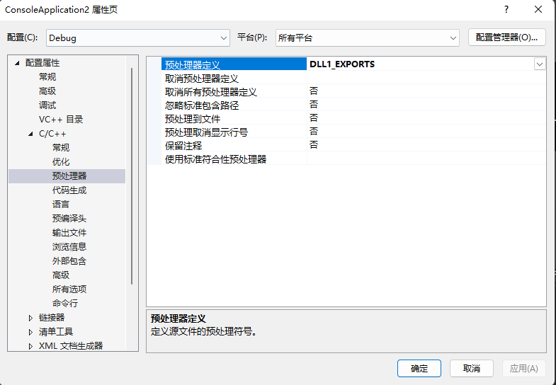
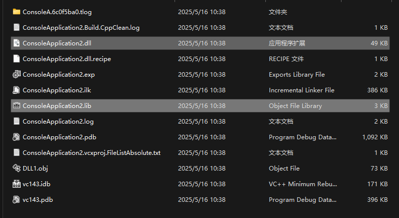
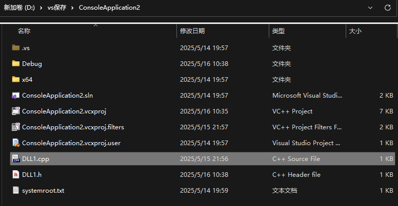
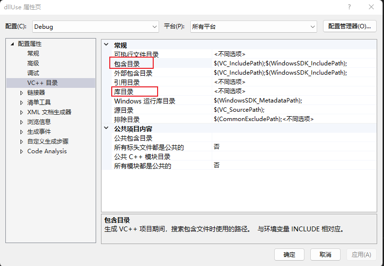
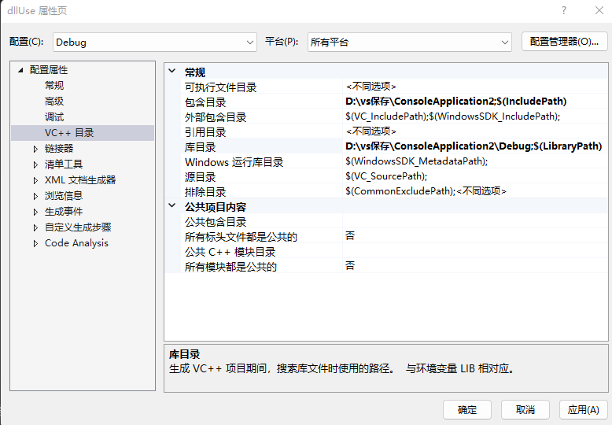
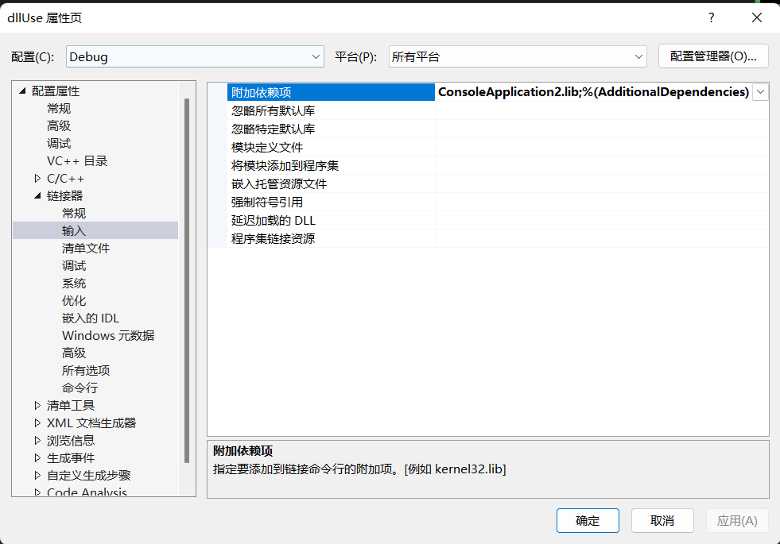
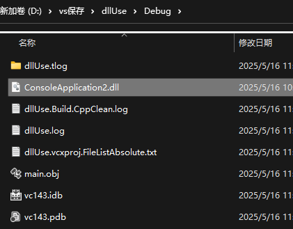
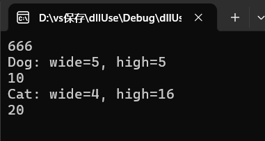

在头文件下创建DLL1.h：

```cpp
#pragma once
#ifdef DLL1_EXPORTS
    #define CREATEDLL_API_DU __declspec(dllexport)
#else
    #define CREATEDLL_API_DU __declspec(dllimport)
#endif                                    

class CREATEDLL_API_DU animal              //需要被外界调用的类（父类）
{
public:
    animal();//构造函数声明
    void getWide(int x);
    void getHigh(int y);
    virtual int outDate() = 0; // 纯虚函数，变成抽象类

protected:
    int wide;
    int high;
};


class CREATEDLL_API_DU cat :public animal      //需要被调用的类（子类cat）
{
public:
    cat();//构造函数声明
    virtual int outDate();
};


class  CREATEDLL_API_DU dog :public animal     //需要被调用的类（子类dog）
{
public:
    dog();//构造函数声明
    virtual int outDate();
};

int CREATEDLL_API_DU exportDate();             //需要被调用的函数（单独的一个函数，不属于任何一个类）
```

总体说明：

1. 有一个父类 `animal`（抽象的，不能直接用），有两个成员变量和一些接口。

2. 有两个子类 `cat` 和 `dog`，实现了抽象函数 `outDate()`。

3. 还有一个单独导出的函数 `exportDate()`。

4. 宏 `CREATEDELL_API_DU` 是为了在不同的项目中自动切换 DLL 的“导出”和“导入”。


分开解释：

```cpp
#pragma once
#ifdef DLL1_EXPORTS
    #define CREATEDLL_API_DU __declspec(dllexport)
#else
    #define CREATEDLL_API_DU __declspec(dllimport)
#endif         
```

如果你在编译 DLL 自己的时候，就让它是 `__declspec(dllexport)` —— 导出函数/类；

如果你是在外部使用 DLL（引用 DLL 的人），就把它变成 `__declspec(dllimport)` —— 导入函数/类。

`class CREATEDLL_API_DU animal`

​	在DLL工程里编译时，它变成：`__declspec(dllexport)`，把类导出出去，供别人使用

​	在别人使用这个DLL的程序中，变成：`class __declspec(dllimport) animal`，表示这个类来自DLL，导入使用就行


父类：animal

```cpp
class CREATEDLL_API_DU animal              //需要被外界调用的类（父类）
{
public:
    animal();//构造函数声明
    void getWide(int x);
    void getHigh(int y);
    virtual int outDate() = 0; // 纯虚函数，变成抽象类

protected:
    int wide;
    int high;
};
```

`CREATEDELL_API_DU animal`：这个类要导出/导入。

纯虚函数，表示这是一个抽象类，不能直接实例化，必须让子类实现这个函数。

`getWide`和`getHigh`是 设置类中两个成员变量wide和high的函数

protected表示只能被自己或子类访问


子类：cat 和 dog

```cpp
class CREATEDLL_API_DU cat :public animal      //需要被调用的类（子类cat）
{
public:
    cat();//构造函数声明
    virtual int outDate();
};


class  CREATEDLL_API_DU dog :public animal     //需要被调用的类（子类dog）
{
public:
    dog();//构造函数声明
    virtual int outDate();
};
```

这都是animal的子类，都实现了`outDate()`函数，也就是说它们是**具体类**，可以被实例化

`CREATEDELL_API_DU` 说明它们也可以被 DLL 导出或导入。


独立函数导出

```cpp
int CREATEDELL_API_DU exportDate();
```

这是一个和类无关的普通函数，它也会被导入/导出，用于 DLL 接口。


在源文件下创建DLL1.cpp：

```cpp
// DLL1.cpp
#include "DLL1.h"
#include <iostream>

using namespace std;


// 父类中函数实现
void animal::getWide(int x) {
    wide = x;
}

void animal::getHigh(int y) {
    high = y;
}

//构造函数实现
cat::cat() {
    // 构造函数体可以为空
}

dog::dog() {
    // 构造函数体可以为空
}

animal::animal() {
    wide = 0;
    high = 0;
}

// 子类cat中数据输出实现
int cat::outDate() {
    cout << "Cat: wide=" << wide << ", high=" << high << endl;
    return (wide + high);
}

// 子类dog中数据输出实现
int dog::outDate() {
    cout << "Dog: wide=" << wide << ", high=" << high << endl;
    return (wide + high);
}

// 函数的实现
int exportDate() {
    return 666;
}
```

因为写的是DLL项目，所以没有main函数，不能作为控制台应用程序来生成解决方案

应该把项目类型设置为DLL

右键项目-属性-配置属性-常规-将配置类型改为.dll

然后重新生成解决方案

生成时注意：




生成完之后，在项目的Debug文件夹下看到.dll文件和.lib文件



在项目文件夹下看到.cpp文件



至此，DLL完成


创建一个新项目：

包含目录：添加.h所在的文件夹

库目录：添加。lib所在的文件夹



添加之后如下：



最后在链接器——输入——附加依赖项中添加lib文件,并且确定。



最后将DLL文件放到新的工程项目的Debug目录下：



至此，添加库成功，现在去实现代码：

在源文件创建新的源文件main.cpp：

```cpp
#include <iostream>
#include "DLL1.h"
using namespace std;

int main() {
	cout << exportDate() << endl;

	dog dog;
	dog.getHigh(5);
	dog.getWide(5);
	cout << dog.outDate() << endl;

	cat cat;    //实例化cat对象、赋值、并输出
	cat.getHigh(16);
	cat.getWide(4);
	cout << cat.outDate() << endl;

	getchar();          //让程序处于等待输入状态下，而不是一闪而过

	return 0;
}
```

