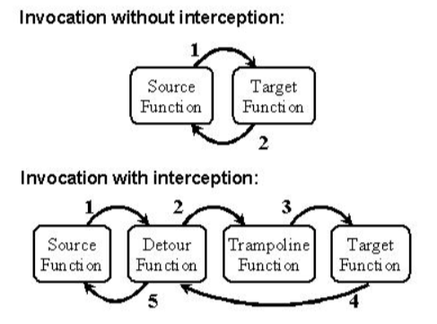

**Hook DLL**（钩子动态链接库）是一种常见的 **Windows API 拦截技术**，用于监视或修改某个进程对 API 函数的调用行为。它的原理是：通过将自定义的 DLL 注入目标进程中，**拦截原本的 API 调用，插入自己的逻辑**，比如记录、修改参数、阻止执行等。

**它在被注入到某个进程后，通过 Hook 技术修改该进程的函数调用流程。**

可以实现：

- 拦截 MessageBox、CreateFile、Send、RegSetValueEx 等函数
- 监控程序是否频繁弹窗、读写文件、访问注册表、开启 socket
- 判断是否存在“异常行为”或“潜在恶意代码”


Detours库可以拦截任意的API调用，拦截代码是在**动态运行时加载**的。Detours替换目标API最前面的几条指令，使其无条件的跳转到用

户提供的拦截函数。被替换的API函数的前几条指令被保存到trampoline 函数(就是内存中一个数据结构)中。trampoline保存了被替换的

目标API的前几条指令和一个无条件转移，转移到目标API余下的指令。

当执行到目标API时，直接跳到用户提供的拦截函数中执行，这时拦截函数就可以执行自己的代码了。当然拦截函数可以直接返回，也可

以调用trampoline(蹦床，跳床)函数，trampoline函数将调用被拦截的目标API，目标API调用结束后又会放回到拦截函数。下图就是

Detours API拦截的逻辑流程：



示例：

```cpp
#include <windows.h>  
#include <detours.h>  

// 声明函数指针，指向系统原始的Sleep函数，WINAPI是调用约定
//指针的用途是：保存原始的 Sleep 地址，以便我们在 hook 函数里还能“调用原来的”行为
static VOID(WINAPI* TrueSleep)(DWORD dwMilliseconds) = Sleep;

// 自己定义的钩子函数，  它将替代 Sleep 执行
VOID WINAPI TimedSleep(DWORD dwMilliseconds)
{
    TrueSleep(dwMilliseconds);//当前只是调用原始的Sleep函数，但是我们可以换成我们想要的逻辑
    //例如换为修改参数、记录日志、阻止调用等
}

// DLL 的入口函数，在 DLL 被加载或卸载时被调用。
BOOL WINAPI DllMain(HINSTANCE hinst, DWORD dwReason, LPVOID reserved)
    /*
        dwReason 表示 DLL 的行为原因，可能是DLL_PROCESS_ATTACH（DLL 被某个进程加载了（初始化阶段）），
        或者是DLL_PROCESS_DETACH（DLL 被卸载）
        hinst是当前DLL模块的实例句柄，通常用不到
        reserved一般为null，用不到
    */

{
    //hook安装过程，目的是在DLL被加载时，将 Sleep 指向改为我们自定义的 TimedSleep 函数
    if (dwReason == DLL_PROCESS_ATTACH) {
        DetourTransactionBegin(); //开始一个 detours 的 hook 事务
        DetourUpdateThread(GetCurrentThread()); //告诉detours要在哪个线程上下文中更新 hook（通常就是当前线程）
        DetourAttach(&(PVOID&)TrueSleep, TimedSleep); //将 TrueSleep 指向的原始地址 hook 掉，变成调用 TimedSleep
        DetourTransactionCommit(); //提交事务，真正使 hook 生效
    }
    //hook卸载过程，目的是在DLL被卸载时，将 Sleep 恢复为原始的函数
    else if (dwReason == DLL_PROCESS_DETACH) {
        //与 Hook 安装逻辑完全对称，只是调用 DetourDetach 代替 DetourAttach。
        DetourTransactionBegin();
        DetourUpdateThread(GetCurrentThread());
        DetourDetach(&(PVOID&)TrueSleep, TimedSleep);
        DetourTransactionCommit();
    }
    return TRUE;
}
```

如果是监控`Sleep`的Hook DLL：

把自定义的hook函数改为：

```cpp
#include <fstream>
#include <iostream>

// 自定义 Hook 函数：替代系统的 Sleep 函数
VOID WINAPI MySleep(DWORD dwMilliseconds)
{
    // 日志记录
    std::ofstream log("C:\\hook_log.txt", std::ios::app);
    log << "[Hook] Sleep called, duration: " << dwMilliseconds << " ms" << std::endl;
    log.close();

    // 调用原始 Sleep，保持功能不变
    TrueSleep(dwMilliseconds);
}
```

`std::ofstream`是c++标准库中用于写入文件的类

`std::ios::app`是表示以追加模式打开文件，每次写入时，新的内容会添加到文件的末尾

`dwMilliseconds`是sleep的参数，即睡眠的毫秒数