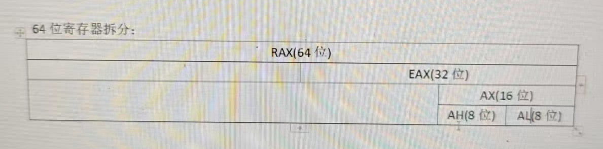

## 常用寄存器

32位通用寄存器：

EAX EBX ECX EDX

ESI：源操作寄存器

EDI：目的操作寄存器

ESP：栈顶指针寄存器

EBP：栈底指针寄存器


32位指令指针寄存器：

EIP：存储下一条要执行的指令


32位标志寄存器：

EFLAGS


64位通用寄存器：

RAX RBX RCX RDX RSI RDI RSP RBP R8 R9 R10 R11 R12 R13 R14 R15


64位指令指针寄存器：

RIP


64位标志寄存器：

RFLAGS





## x86汇编框架

```
:预处理
.586
.model flat,stdcall

:包含的连接库
includelib ucrt.lib
includelib legacy_stdio_definitions.lib
includelib kernel32.lib
includelib user32.lib

:外部函数声明
extern printf:proc
:数据段
.data
szHello db 'HelloWorld',0
:代码段
.code
:主函数
main proc
	lea eax,szHello
	push eax
	call printf
	add esp,4
main endp
	
end
```

