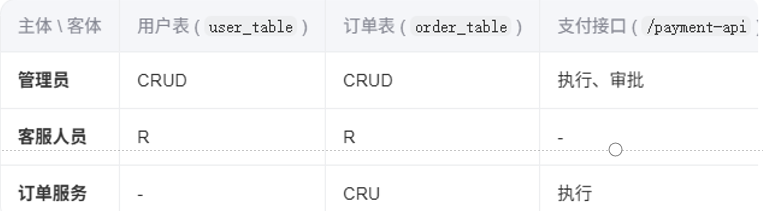
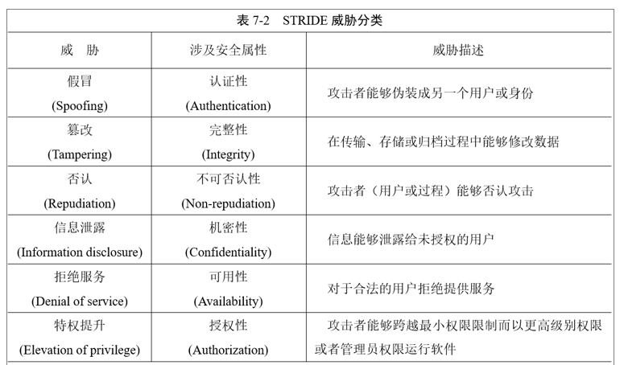

## 1、软件安全的属性

三个基本属性：

1、**保密性（机密性）**：系统根据用户的身份权限控制对不同密级信息的访问

2、**完整性**：不受任何有意的或者无意的非法错误所破坏

​	完整性实现：（考点）

​		预防：阻止未经授权的改写，如**加密，访问控制**

​		检测：分析行为来发现完整性是否被破坏，如**数字签名、哈希值计算**

3、**可用性**：备份与灾难恢复、应急响应、系统容侵等措施

其他安全属性：

4、**可认证性**：能对信息的发送实体和接收实体的真实身份 以及信息的内容进行认证

​	方法：数字签名、哈希函数、口令认证、生物特征等

5、**授权**：根据访问主体的身份和职能为其分配一定的权限

6、**可审计性**：确保一个实体（包括合法实体和实施攻击的实体）的行为可以被唯一地区别、跟踪和记录，从而能对出现的安全问题提供调查依据

7、**抗抵赖性**：**数字签名、可信第三方认证技术等，可审计性也是有效实现抗抵赖性的基础**（考点）

8、**可控性**：对于信息安全风险的控制能力

9、**可存活性**：计算机系统在面对各种攻击或错误的情况下继续提供核心的服务，而且能够及时地恢复全部服务的能力

​	系统容侵、灾备与恢复

## 2、如何确认不可否认性 完整性

不可否认性：数字签名 可信第三方认证技术

完整性：1）阻止未授权访问：加密、访问控制 2）分析是否被破坏：数字签名、哈希计算

## 4、软件安全需求获取的来源 7-21

### 软件安全需求的来源

一、软件安全需求的来源分类

**外部安全需求：**法律法规、安全技术与管理的标准等遵从性需求

​	网络安全等级保护制度将网络划分为5级。从第一级到第五级逐级增高。

​	等保流程：定级--》备案--》等级测评--》安全建设整改--》监督检查

**内部安全需求：**两个部分，一是**组织内部需要遵守的**政策、标准、指南和实践模式，另一部分是**与软件业务功能相关的**安全需求。

### 软件安全需求的获取

1、头脑风暴：无限制的自由讨论

2、问卷调查：调查的问题应当覆盖软件安全设计原则和安全配置文件的内容

3、策略分解：将组织需要遵守的内部和外部政策，包括外部法律法规、隐私和遵从性命令**分解成为详细的安全需求**。

4、根据数据的分类确定不同的安全需求：

​	1）根据数据生命周期：数据生成、使用、传输、存储，这一生命周期都应该采用适当的保护机制

​	2）根据数据的重要性：根据数据的敏感级，同时根据对数据泄露、变更或破坏的影响，确定数据资产的不同安全保护需求

5、主/客体关系矩阵：用于清晰定义系统中主体（如用户、进程）对客体（如文件、数据库、API）的权限关系

6、使用用例和滥用案例建模

7、软件安全需求跟踪矩阵：用来管理需求和验证需求是否已经实现的一个表格工具

## 5、Web漏洞 有什么 原理 sql xss csrf

## 6、web安全功能设计中关于身份认证的要求

1、应采用合适的身份认证方式，等级保护三级及以上系统应至少采用两种认证方式。认证方式如下。 

- 用户名、口令认证。 
- 一次性口令、动态口令认证。
- 证书认证。 

2、应设计密码的存储和传输安全策略。

- 禁止明文传输用户登录信息及身份凭证。 
- 禁止在数据库或文件系统中明文存储用户密码。 
- 禁止在Cookie 中保存用户密码。 
- 应在数据库中存储用户密码的哈希值，在生成哈希值的过程中加入随机值

3、应设计密码使用安全策略，包括密码长度、复杂度和更换周期等。

4、宜设计图形验证码，增强身份认证安全。 

5、应设计统一错误提示，避免认证错误提示泄露信息。 

6、应设计账号锁定功能，限制连续失败登录。 

7、应通过加密和安全的通信通道来保护验证凭证，并限制验证凭证的时效。 

8、应禁止同一账号同时多个地址在线。

## 7、软件安全漏洞最容易出现在（软件编码）阶段

## 8、中国国家信息安全漏洞库 CNNVD

## 9、堆溢出 Heap Spray 一般是和栈溢出结合

## 10、软件三要素

## 11、软件可信验证模型

软件可信验证模型FICE

#### 特征可信验证

- 1、特征码扫描
  - 病毒特征码是某个恶意软件样本常见的连续字节序列。这意味着含有特征码在恶意软件或受感染文件内，而在未受感染的文件里则不会找到。
  - 首先提取新恶意软件的独有特征指令序列，并将其更新至病毒特征码库，在检测时将当前文件与特征库进行对比，判断是否存在某一文件片段与已知样本相吻合
  - 优点是判断准确率高、误报率低。该验证方法无法检测未知的恶意代码
- 2、完整性验证
  - 首先计算正常文件的哈希值（校验和），并将其保存起来，当需要验证该文件的可信性时，再次计算其哈希值，并与之前保存起来的值比较
  - 不依赖外部信息，既可以用来检测已知病毒，也可以检测未知病毒。但缺点是**滞后性**，感染发生后才可以验证其可信性。另外文件内容变化原因多，容易误报。需要维护庞大的正常文件哈希值库。
- 污点跟踪技术
  - 用于识别和跟踪应用程序中的输入和输出数据，以及与其相关联的敏感信息，检测这些数据在整个处理过程中是否被篡改污染。

[关于污点跟踪](https://firmianay.gitbooks.io/ctf-all-in-one/content/doc/5.5_taint_analysis.html)

#### 身份（来源）可信验证

代码签名技术可以用来进行代码来源（身份）可信性的判断，即通过软件附带的数字证书进行合法性、完整性的验证，以免受恶意软件的侵害。

从用户角度，可以通过代码签名服务鉴别软件的发布者及软件在传输过程中是否被篡改。如果某软件在用户计算机上执行后造成恶性后果，由于代码签名服务的可审计性，用户可依法向软件发布者索取赔偿，将很好的制止软件开发者发布攻击性代码的行为。

#### 能力（行为）可信验证

1、静态行为分析

在程序加载前，首先利用反汇编工具扫描其代码，查看其模块组成和系统函数调用情况，然后与预先设置好的一系列恶意程序特征函数集作交集运算，这样可确定待验证软件的危险系统函数调用情况，并大致估计其功能和类型，从而判断出该软件的可信性

2、动态行为分析

（1）系统状态建模法

该方法的基本思想是首先在一个虚拟环境中运行待验证软件，记录软件运行时的系统资源消耗情况，建立系统状态模型，从中发现该软件的异常行为，进而验证其可信性。     

一般情况下，可采用程序运行时的系统资源消耗情况来衡量程序的性能状态，而CPU、 内存和磁盘输入/输出等是最关键的系统资源。

（2）系统关键位置监测法

系统关键位置监测法借助于虚拟环境，通过对系统的一些关键位置进行全方位、多角度的实时监测，捕获软件在安装、启动和运行时的多种行为特征，然后结合机器学习等方面的技术，利用程序行为样本库中的样本行为对训练模块进行训练，提取出规则、知识，从而使验证模块能够对检测到的软件行为做出自动化评定，区分出可信软件和危险软件。

（3）内核状态监测法

系统内核负责一切实际工作，包括CPU 任务调度、内存分配管理、设备管理和文件操作等，因此如果内核变得不可信，那么任何其他的信息都将不可信。

内核状态检测方法包括系统守护、内存扫描、查找钩子、基于行为的检测方法等。

#### 运行环境可信验证

虚拟化恶意软件是指，在支持虚拟化功能的CPU 上运行操作系统，即在目标系统和硬件层之间插入虚拟机监视器 (Virtual Machine Monitor,VMM),使目标系统运行在虚拟机监控器之上，并受其完全控制。

一种名为虚拟机Rootkit(Virtual-Machine Based Rootkit,VMBR) 的实验室恶意软件，对系统具有更高的控制程度，能够提供多方面的功能，并且其状态和活动对运行在原有系统中的安全检测程序来说是不可见的。 VMBR 在正在运行的操作系统下安装一个虚拟机监视器VMM, 并将这个原有操作系统迁移到虚拟机里，而原有系统中的软件无法访问到它们的状态，因此VMBR 很难被检测和移除。

 Blue pill是一个基于硬件虚拟化的rootkit。名字包含了黑客帝国里蓝色药丸的含义，生活在一个虚拟的世界里而不自知。Blue pill背后的思路：操作系统“吞下”Blue pill，在Blue pill控制的空间里（原文用的是Matrix）被唤醒。这个过程是即时的（不需要重启），没有性能损失，所有设备完全可以访问操作系统（实际在虚拟机中运行的）。

## 12、威胁建模模型STRIDE

## 13、软件安全设计原则（简答题 16分）

1、减少软件受攻击面原则

​	 软件受攻击面是指，攻击者都能够访问到的所有功能和代码的总和，它是一个混合体，不仅包括代码、接口、服务，也包括对所有用户提供服务的协议，尤其是那些未被验证的或远程用户都可以访问到的协议。减少软件受攻击面就是去除、禁止一切不需要使用的模块、协议和服务，其目的是减少攻击可以利用的漏洞。

2、最小授权原则

​	系统仅授予实体（用户、管理员、进程、应用和系统等）完成规定任务所必需的最小权限，并且该权限的持续时间也尽可能短

3、权限分离原则

​	将关键操作分解为由不同人员/角色执行，避免单点权力集中。在软件设计中，将软件功能设计为需要在两个或更多条件下才能实现，以防出现问题

4、纵深防御原则

​	又称分层防御，指在软件设计中加入层次化安全控制和风险缓解方法。例如，防御SQL注入要在使用预编译的同时对输入验证，防御XSS要禁止活动脚本的同时对输出编码、对输入验证。

5、完全控制原则

​	要求每一次访问受保护对象的行为都应当进行尽可能细粒度地检查。例如，Web应用完成身份验证之后会通过Cookie实现认证，这种做法并不绝对安全，违反完全控制原则。

6、默认安全配置原则

​	为系统提供默认的安全措施，包括默认权限、默认策略等，尽可能让用户不需要额外配置就可以安全地应用。例如，对任何请求默认加以拒绝、不经常使用的功能在默认情况下关闭

7、开放设计原则

​	软件的安全性不应该依赖于设计的保密。依赖设计保密性会导致系统脆弱性——一旦设计泄露，安全机制将彻底失效。软件安全应建立在‌可验证的机制‌（如公开算法、权限控制、分层防护）而非‌设计的保密性‌上

8、保护最弱一环原则

​	系统的整体安全性取决于其最薄弱的环节。该原则强调在安全规划中必须优先识别并加固脆弱点

9、最少共用机制原则

​	避免多个对象共享同一个资源。不同安全等级的数据流通过独立通道传输，不同安全级别的操作使用独立接口

10、安全机制的经济性原则

​	以较低的开发成本和资源消耗获得具有较高安全质量的软件产品

11、安全机制心理可接受原则

​	安全保护机制设计得要简单，要让用户易用，要确保用户对资源的可访问，以及安全机制对用户透明，用户才会使用这些保护机制。

12、平衡安全设计原则

​	将所有安全原则都设计到软件中是不可能的，因此有必要在这些安全原则间进行平衡

## 14、XSS漏洞防护措施 漏洞基本原理

防御方式：

1、输入验证

​	在客户端和服务器端都要进行验证，包括输入数据类型、数据格式或数据长度等。服务器端应当设置一个尽可能严密的`XSSFilter`来过滤和净化用户输入。

​	采用白名单对输入数据进行验证，例如在服务端仅允许字母数字字符

​	采用黑名单对输入数据进行过滤，例如在服务端针对非法的HTML代码包括单双引号等，应编写函数对其进行检查或过滤

2、不要用原始的方式直接把变量输出到网页中，因为这不安全。应该使用框架提供的标签输出方式，并开启 `escapeHtml="true"` 来自动对内容进行转义，防止 XSS 攻击。

3、输出的特殊字符转化为HTML实体

4、Cookie设置为HttpOnly，阻止客户端JavaScript直接访问Cookie

5、谨慎使用DOM操作：尽可能避免使用DOM 进行客户端重定向、文档操作或调用本地数据等敏感操作，转而将这些行为放到服务器端使用动态页面的方式来实现。

6、使用检测工具：XSS 漏洞自动化检测工具进行检测，如XSSDetect等

漏洞基本原理：

应用程序将用户输入的数据未经充分验证或转义就直接嵌入到输出内容中，并且这些数据被浏览器解析执行。攻击者可以通过注入恶意脚本来实施攻击

## 15、PE文件哪4个部分组成 

可选映像文件头 但是必须存在 sectionAlignment FileAlignment AddressOfEntryPoiny SizeOfImage(在内存中占的大小) BaseOfCode（代码段段首地址） word中的那些字段

## 16、PE文件中导入表 导出表 数据目录表 节表 有什么区别

## 17、ESP ESP EIP 寄存器是干什么的

## 18、栈溢出漏洞原理以及防护措施
