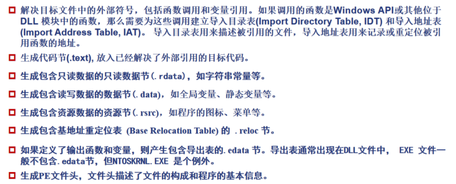
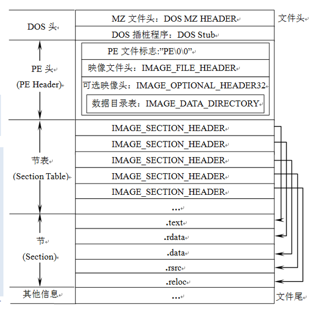
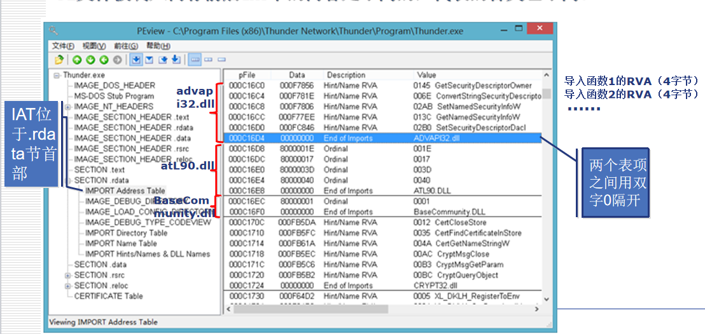

# 1、计算机启动过程

分为计算机初始化启动过程、操作系统启动过程

## 计算机初始化启动过程及其安全性分析

计算机上电 --》 BIOS代码进行加电后自检 --》 加载BIOS初始化代码 --》 BIOS代码选择启动盘 --》

安全问题：

CIH病毒修改BIOS代码破坏固件的初始化过程，向BIOS芯片执行写入操作，覆盖关键数据，导致硬件无法正常启动。

须通过BIOS重写恢复

## 操作系统启动过程及其安全性分析

读取指定启动顺序中的存储设备的主引导记录 --》 硬盘启动 --》 操作系统启动

**1、读取指定启动顺序中的存储设备的主引导记录**

BIOS根据设定将第一个可引导存储设备（硬盘）的MBR加载到内存，并跳转到引导程序的第一条指令。

主引导记录MBR：硬盘设备的第一个扇区的最前面的512字节。


主引导记录由3部分组成：

1）第1-446字节：主引导代码，即调用操作系统的机器码

2）第447-510字节：分区表，MBR中分区表的作用是将硬盘分成若干个区。分区表的长度只有64字节，里面分成4项，每项16字节。一个硬盘最多只能分4个一级分区，又称为“主分区”

3）第511-512字节：防止磁盘的有效标志。如果这两个字节是0x55和0xAA，表明这个设备可以启动。如果不是，控制权被转交给启动顺序中的下一个设备。


每个主分区的16个字节：


**硬盘启动**

4个主分区里面只有一个是被激活的，计算机会读取激活分区里的第一个扇区，称为**卷引导记录**，卷引导记录的主要作用是告诉计算机，操作系统在这个分区里的位置，然后计算机就会加载操作系统

### 安全问题

在操作系统的启动的过程中，病毒主要存在于主引导扇区、卷引导扇区和分区表，这种病毒被称为引导区病毒。由于**系统在引导时没有对主引导扇区和引导扇区内容进行正确性判断，而是直接执行，所以病毒程序只要占领其位置就可以获取控制权**。待病毒执行完之后再通过跳转方式调用已经被写到其他扇区的真正的引导区内容。

MBR病毒就是对系统磁盘的MBR进行修改，最终导致病毒程序在系统启动过程中优于操作系统及其他应用程序运行。


内核装载阶段病毒：内核装载阶段与Smss.exe Winlogon.exe等有关，病毒主要采用重写、替换、加载易于引起混淆的具有相似文件名的文件以达到加载和隐身的目的


# 2、程序的生成和运行

 C/C++程序生成可执行程序 直到在内存中加载的一般过程

1）编辑

2）编译：源程序经过**编译器**编译为等价的**汇编代码**，再经过**汇编器**产生出与目标平台CPU一致的**目标代码**（.obj），亦称**机器码**

3）链接：链接器把目标代码文件和其他一些库文件和资源文件连接起来，产生出符合目标平台上的操作系统所要求格式的**可执行程序**(.exe), 并保存在磁盘上

4）运行：Windows 操作系统的加载器会解读链接器记录在可执行程序中的格式信息，将程序中的代码和数据“布置”在内存中，成为真正可以运行的内存映像，开始运行。

## 程序的编译

编译器（含汇编器）的基本功能是，将使用一种高级语言编写的程序（源程序）翻译成目标代码（机器语言代码）

编译过程：

1、**预处理**：根据已放置在文件中的预处理指令来修改源文件的内容

2、**编译与优化**：编译程序将代码翻译成等价的中间表示或汇编代码

3、**目标代码生成**：将上面生成的中间表示或汇编代码翻译成目标机器指令

## 程序的链接

链接器的基本功能是，将编译器产生的多个目标文件合成为一个可以在目标平台下**执行的文件**。

静态链接库（.lib或.a）：在**程序生成时**被连接到目标代码中，生成的可执行文件包含了库的所有代码。

​	链接器将函数的代码从其所在地(目标文件或静态链接库中)复制到最终的可执行程序中，整个过程在程序生成时完成。

动态链接库（.dll或.so）：在**程序运行时**由系统动态加载，多个程序可以共享内存中同一个动态库实例。运行时调用即可节省内存

​	动态链接是在编译链接时只提供符号表和其他少量信息，用于保证所有符号引用都有定义，保证编译顺利通过。程序执行时，动态链接库的全部内容将被映射到运行时相应进程的虚地址空间，根据可执行文件中记录的信息找到相应的函数地址并调用执行。


链接器的目的是生成可执行文件，在Windows中就是PE格式文件



## 程序的加载与运行

程序源文件经过编译、链接后，生成可执行程序，产生的程序文件是存储在硬盘(外存)里的二进制数据。系统并非在硬盘上直接运行程序，而是通过PE加载器，将可执行程序从外存(如硬盘)加载到内存中，然后才让CPU 来处理。PE加载器根据程序PE格式文件中的各种信息，进行堆栈的申请和代码数据的映射装载，在完成所有的初始化工作后，程序从入口点地址进入，开始执行代码段的第一条指令。

# 3、PE文件

Portable Executable 可移植执行体

exe scr dll ocx drv sys vxd obj 等都采用PE文件格式

在程序被执行时，操作系统会按照PE文件格式的约定去相应的地方准确地定位各种类型的资源，并分别装入内存的不同区域。

## PE文件结构

### DOS头



DOS MZ文件头：64字节的**IMAGE_DOS_HEADER**类型的结构

DOS插桩程序：在DOS环境下执行，Windows直接跳过

**IMAGE_DOS_HEADER**结构：


DOS MZ头中只需关心两个重要成员 e_magic 和 e_lfanew，中间其他数据不是很重要

e_magic (WORD) 相当于一个标志，所有的PE文件都必须以MZ（4D 5A）开始。作用是标识一个合法的PE文件，为PE加载器提供PE文件头的入口地址

e_lfanew (LONG) 指示了**PE头（即PE签名“PE\0\0”）相对于文件起始位置的偏移位置**，不同文件拥有的值不同。可以计算得出。

```cpp
#include <stdio.h>
#include <stdlib.h>
#include <windows.h>

int main()
{
    FILE* pFile = NULL;
    char* buffer = NULL;
    int nFileLength = 0;

    // 使用宽字符字符串表示路径以配合 _wfopen_s
    const wchar_t* filePath = L"C:\\Users\\86151\\Desktop\\御剑2.exe";

    // 打开文件并检查是否成功
    errno_t err = _wfopen_s(&pFile, filePath, L"rb");
    if (err != 0 || pFile == NULL)
    {
        wprintf(L"Failed to open file: %d\n", err);
        return -1;
    }

    // 获取文件长度
    fseek(pFile, 0, SEEK_END);// 移动文件指针到文件末尾
    nFileLength = ftell(pFile); //返回文件指针位置
    if (nFileLength < 0)
    {
        perror("Failed to get file length");
        fclose(pFile);
        return -1;
    }
    rewind(pFile); // 移动文件指针到文件开头

    // 分配缓冲区并检查是否成功
    buffer = (char*)malloc(nFileLength);
    if (buffer == NULL)
    {
        perror("Failed to allocate memory");
        fclose(pFile);
        return -1;
    }

    // 读取文件内容到缓冲区
    size_t bytesRead = fread(buffer, 1, nFileLength, pFile);
    if (bytesRead != nFileLength)
    {
        perror("Failed to read file content");
        free(buffer);
        fclose(pFile);
        return -1;
    }

    fclose(pFile);

    // 解析 DOS 头部信息
    PIMAGE_DOS_HEADER ReadDosHeader = (PIMAGE_DOS_HEADER)buffer;
    printf("MS-DOS Info:\n");
    printf("MZ标志位: %x\n", ReadDosHeader->e_magic);
    printf("PE头偏移: %x\n", ReadDosHeader->e_lfanew);


    // 释放内存
    free(buffer);
    return 0;
}
```

运行结果：


### PE头（NT头）

标准PE头在PE文件中都有，扩展PE头可有可无


PE头 是 一 个**IMAGE_NT_HEADERS**类型的结构，用于对一个PE程序进行总体描述。该结构体包含3个部分：

- Signature (签名) 
  - 记录的是4个字节的PE文件标识符“PE\0\0”，通过分析DOS头的MZ和PE头的PE这两个标志，可以初步判断当前程序是一个合法的PE文件。
- FileHeader (映像文件头)
  - 是一个拥有20字节长度的IMAGE_FILE_HEADER类型的结构体，**描述PE文件物理分布的基本信息**。
- OptionalHeader (可选映像文件头)
  - 是一个224字节长度的IMAGE_OPTIONAL_HEADER32 类型的结构体，**描述PE文件逻辑分布的信息**。这里的“可选”是指结构体中的各字段可设置，并不是说这个结构体是否可用。

IMAGE_NT_HEADERS结构定义：

```cpp
typedef struct _IMAGE_NT_HEADERS {
    DWORD Signature; // 50 45 00 00 0x00004550
    IMAGE_FILE_HEADER FileHeader;
    IMAGE_OPTIONAL_HEADER32 OptionalHeader;
} IMAGE_NT_HEADERS32, *PIMAGE_NT_HEADERS32;
```

```cpp
typedef struct _IMAGE_FILE_HEADER {
    WORD    Machine;                    // 指定运行平台（CPU架构），如 x86(0x014C)、x64(0x8664)
    WORD    NumberOfSections;           // 节区（Section）数量，后续节表的项数由这个值决定
    DWORD   TimeDateStamp;              // 文件创建时间戳（自1970年1月1日以来的秒数）
    DWORD   PointerToSymbolTable;       // 符号表在文件中的偏移地址（COFF调试信息用，现代PE中通常为0）
    DWORD   NumberOfSymbols;            // 符号表中的符号数量（与上一字段配合使用，通常也为0）
    WORD    SizeOfOptionalHeader;       // 可选头 Optional Header 的大小，常见值：0xE0（32位）、0xF0（64位）
    WORD    Characteristics;            // 文件属性标志，例如是否是exe、dll、是否支持大地址等
} IMAGE_FILE_HEADER, *PIMAGE_FILE_HEADER;
```

```cpp
typedef struct _IMAGE_OPTIONAL_HEADER64 {
    WORD        Magic;                      // 魔数标识，表示是哪种可选头：0x10B 表示 PE32，0x20B 表示 PE32+（即64位PE）
    BYTE        MajorLinkerVersion;         // 链接器主版本号
    BYTE        MinorLinkerVersion;         // 链接器次版本号
    DWORD       SizeOfCode;                 // 所有含代码节的总大小（.text等）
    DWORD       SizeOfInitializedData;      // 已初始化数据的大小（.data等）
    DWORD       SizeOfUninitializedData;    // 未初始化数据的大小（.bss等）
    DWORD       AddressOfEntryPoint;        // 程序入口 RVA（相对虚拟地址），程序从这里开始执行
    DWORD       BaseOfCode;                 // 代码段起始 RVA（相对于ImageBase）
    
    ULONGLONG   ImageBase;                  // 程序默认加载基址（VA = ImageBase + RVA），64位系统下通常为 0x400000 或更高
    DWORD       SectionAlignment;           // 内存中节对齐粒度，通常为 0x1000（4KB）
    DWORD       FileAlignment;              // 文件中节对齐粒度，通常为 0x200 或 0x1000
    WORD        MajorOperatingSystemVersion;// 要求操作系统主版本号（如 Windows 10 对应 10）
    WORD        MinorOperatingSystemVersion;// 次版本号（如 Windows 10.0 对应 0）
    WORD        MajorImageVersion;          // 用户自定义镜像主版本号（由编译器设置）
    WORD        MinorImageVersion;          // 用户自定义镜像次版本号
    WORD        MajorSubsystemVersion;      // 子系统主版本号（如 GUI 程序所需子系统）
    WORD        MinorSubsystemVersion;      // 子系统次版本号
    DWORD       Win32VersionValue;          // 保留字段，必须为 0
    DWORD       SizeOfImage;                // 加载到内存后整个镜像所占大小（包括所有节和对齐空间）
    DWORD       SizeOfHeaders;              // 所有文件头（DOS头 + PE头 + 节表）的总大小
    DWORD       CheckSum;                   // 映像校验和（用于驱动或系统文件验证）
    WORD        Subsystem;                  // 运行所需的子系统类型，常见值：
                                            //  IMAGE_SUBSYSTEM_WINDOWS_GUI (2) — 图形界面程序
                                            //  IMAGE_SUBSYSTEM_WINDOWS_CUI (3) — 控制台程序
    WORD        DllCharacteristics;         // DLL 特性标志，如是否支持ASLR、DEP等
    ULONGLONG   SizeOfStackReserve;         // 为线程预留的堆栈大小（默认 1MB）
    ULONGLONG   SizeOfStackCommit;          // 初始提交的堆栈大小（实际分配）
    ULONGLONG   SizeOfHeapReserve;          // 默认堆预留大小（默认 1MB）
    ULONGLONG   SizeOfHeapCommit;           // 初始提交的堆大小
    DWORD       LoaderFlags;                // 加载器标志，通常为 0
    DWORD       NumberOfRvaAndSizes;        // 数据目录项的数量（通常为 16）
    IMAGE_DATA_DIRECTORY DataDirectory[IMAGE_NUMBEROF_DIRECTORY_ENTRIES];  // 数据目录数组，包含导入表、导出表、资源表等重要信息的位置和大小
} IMAGE_OPTIONAL_HEADER64, *PIMAGE_OPTIONAL_HEADER64;
```


```cpp
// 解析 DOS 头部信息
    PIMAGE_DOS_HEADER ReadDosHeader = (PIMAGE_DOS_HEADER)buffer;
    printf("MS-DOS Info:\n");
    printf("MZ标志位: %x\n", ReadDosHeader->e_magic);
    printf("PE头偏移: %x\n", ReadDosHeader->e_lfanew);
    printf("PE Header Info: \n");
    PIMAGE_NT_HEADERS ReadNTHeaders;
    ReadNTHeaders = (PIMAGE_NT_HEADERS)(buffer + ReadDosHeader->e_lfanew);
    printf("PE标志位: %x\n", ReadNTHeaders->Signature);
    printf("运行平台：%x\n", ReadNTHeaders->FileHeader.Machine);
    printf("Image Base: % x\n", ReadNTHeaders->OptionalHeader.ImageBase);

```


### 节表（区段表）

节表是由IMAGE_SECTION_HEADER **结构体组成的数组**，每一项40个字节，包含了**一个节的具体信息**。如每一节在磁盘文件中的起始位置和大小、应该被加载到内存的哪里、这一节是代码还是数据等


`IMAGE_SECTION_HEADER`结构定义：

```cpp
#define IMAGE_SIZEOF_SHORT_NAME              8

typedef struct _IMAGE_SECTION_HEADER {
    BYTE    Name[IMAGE_SIZEOF_SHORT_NAME]; //该节的名称，例如.text对应2E74657874000000
    union {
            DWORD   PhysicalAddress;
            DWORD   VirtualSize; // 节在内存中按内存对齐前的大小（可以不准确）
    } Misc;
    DWORD   VirtualAddress; // 节在内存中的偏移地址（RVA）
    DWORD   SizeOfRawData; // 节在文件中按照文件对齐后的大小
    DWORD   PointerToRawData; // 节在文件中的偏移地址（FOA）
    DWORD   PointerToRelocations; //.OBJ文件中使用，指向中定位表的指针
    DWORD   PointerToLinenumbers; //
    WORD    NumberOfRelocations;
    WORD    NumberOfLinenumbers;
    DWORD   Characteristics;
} IMAGE_SECTION_HEADER, *PIMAGE_SECTION_HEADER;
```

遍历PE文件各区段的信息：

```cpp
// 区段解析遍历
    printf("Section Header Info: \n");
    //IMAGE_FIRST_SECTION这个宏的作用是根据PE头的地址，计算出第一个节表的地址
	// 这里ReadSectionHeader是把所有区段表信息读出来了，后面直接用数组访问
    PIMAGE_SECTION_HEADER ReadSectionHeader = IMAGE_FIRST_SECTION(ReadNTHeaders);
    //获取 ReadNTHeaders 结构体中的 FileHeader 成员的地址
    PIMAGE_FILE_HEADER pFileHeader = &ReadNTHeaders->FileHeader;
    for (int i = 0; i < pFileHeader->NumberOfSections; i++) {
        printf("[%d] 区段名称: %s\n", i, ReadSectionHeader[i].Name);  // Name 是字符数组，可用 %s
        printf("VOffset(起始的相对虚拟地址): 0x%08X\n", ReadSectionHeader[i].VirtualAddress);
        printf("SizeOfRawData(虚拟大小): %u\n", ReadSectionHeader[i].SizeOfRawData);
        printf("PointerToRawData(节在文件中的偏移地址): 0x%08X\n", ReadSectionHeader[i].PointerToRawData);
        printf("VirtualSize(文件中的区段大小): %u\n", ReadSectionHeader[i].Misc.VirtualSize);
        printf("PointerToRelocations: 0x%08X\n", ReadSectionHeader[i].PointerToRelocations);
        printf("PointerToLinenumbers: 0x%08X\n", ReadSectionHeader[i].PointerToLinenumbers);
        printf("NumberOfRelocations: %u\n", ReadSectionHeader[i].NumberOfRelocations);
        printf("NumberOfLinenumbers: %u\n", ReadSectionHeader[i].NumberOfLinenumbers);
        printf("Characteristics(区段的属性): 0x%08X\n", ReadSectionHeader[i].Characteristics);
        printf("\n");
    }
```


LordPE加载出来的信息：


### 节（区段）

PE 文件格式的设计者把具有相似属性的数据统一保存在一个被称为“节”的地方，不同的资源被存放在不同的节中。

然后把各节属性记录在节表中

一个典型的PE文件包含的节：

- .text: 可执行代码节，由编译器产生，存放着二进制的机器代码，是反汇编和动态调试的对象。 
- .rdata(.idata): 只读数据节，包含了一些常量，如一些字符串信息等。在Release版本的PE文件中，导入表也在.rdata中，用于记录可执行文件所使用的动态链接库等外来函数与文件的信息，是分析恶意代码的重要区域。 
- .data: 可读写数据节，如宏定义、全局变量和静态变量等。
- .edata: 导出函数节，记录本文件向其他程序提供调用的函数列表。 
- .rsrc: 资源节，存放程序的图标、菜单等资源。  


### PE文件执行基本过程

- 1）当一个 PE 文件 被执行时，PE 装载器 首先检查 DOS header 里的 PE header 的偏移量。如果找到，则直接跳转到 PE header 的位置。（DOS MZ头中的e_lfanew指示了PE文件头（即PE签名“PE\0\0”）**相对于文件起始位置**的偏移）
- 2）当 PE装载器 跳转到 PE header 后，第二步要做的就是检查 PE header 是否有效。如果该 PE header 有效，就跳转到 PE header 的尾部。
- 3）紧跟 PE header 尾部的是节表。PE装载器执行完第二步后开始读取节表中的信息，并采用文件映射的方法将这些节段映射到内存，同时附上节表里指定节段的读写属性。
- 4）PE文件映射入内存后，PE装载器将继续处理PE文件中最重要的导入表，从导入表中获取函数字符串名称信息、 DLL 名称信息及导入函数地址表项起始偏移地址等。
- 5）加载器会执行PE文件的初始化代码，包括运行全局变量的初始化和执行静态构造函数等操作。
- 6）PE文件中定义了一个入口点（Entry Point）函数，通常命名为main或WinMain。加载器会跳转到入口点函数，开始执行程序的主逻辑。
- 7）程序会退出时，加载器负责释放相关资源并终止程序的执行。


## 地址映射

### 虚拟内存

虚拟内存是计算机系统内存管理的一种技术。它使得应用程序认为它拥有连续的可用的内存（一个连续完整的地址空间），而实际上，它通常是被分隔成多个物理内存碎片，还有部分暂时存储在外部磁盘存储器上，在需要时进行数据交换。

在用户模式下，用调试器看到的内存地址都是虚拟内存。Windows32让**所有的进程都认为自己拥有独立的4GB 内存空间**。进程所拥有的4GB虚拟内存中包含了程序运行时所必需的资源，如代码、栈空间、堆空间、资源区和动态链接库等。

### PE文件与虚拟内存之间的映射

- 1）**文件偏移地址** (File Offset Address, **FOA**)：**文件偏移表示文件在磁盘上存放时相对于文件开头的偏移（实质是一个值）**。文件偏移地址是线性的，即从PE文件的第一个字节开始计数，从0开始依次递增。
- 2）**映像基址** (Image Base Address)：**映像基址是指PE装入内存时的基地址**。在默认情况下， **EXE文件的0字节（FOA值）将映射到虚拟内存的0x00400000地址， DLL文件的0字节将映射到虚拟内存的0x10000000地址**(这些地址可以通过修改编译选项更改)。
- 3）**虚拟内存地址 **(Virtual Address, **VA**)：虚拟内存地址是指**PE文件中的指令被装入虚拟内存后的绝对地址**。 Windows32 系统中，各进程分配有4GB 的虚拟内存，因此VA 值的范围是00000000～FFFFFFFF。
- 4）**相对虚拟地址** (Relative Virtual Address, **RVA**)：相对虚拟地址RVA是**虚拟内存地址 相对于映像基址（Image Base）的偏移量**。


磁盘或内存均按字节编址，即每个字节一个地址号。


在PE文件中，每个节在**磁盘文件**的起始位置是`FileAlignment`（通常是**200H** 即512字节）的整数倍，未使用的空间填零

当PE文件被加载到**内存**时，每个节在内存中的起始地址是**1000H**的整数倍。如果原始数据不足一个对齐单位，则会用零填充。


****

### 地址映射的计算

（1）虚拟内存地址VA = Image Base （映像基址）+ RVA（相对虚拟地址）


（2）文件偏移地址（FOA）

因为数据在节内的偏移量是相同的（无论是内存中还是文件中）

文件偏移地址 - 节起始文件偏移地址 = RVA - 节起始RVA

=> 文件偏移地址 = RVA - 节起始RVA + 节起始文件偏移地址

=> 文件偏移地址 = RVA - （节起始RVA - 节起始文件偏移地址）


**FOA = RVA - 节偏移（某个节在内存中的起始虚拟地址与其在文件中的起始偏移地址之间的差值）**

文件在磁盘上存放时相对于文件开头的偏移 = 在内存中相对于映像基址（Image Base PE文件装入内存时的基地址）的偏移 - 某个节在内存中的起始虚拟地址与其在文件中的起始偏移地址之间的差值


这样更好理解：**节偏移 = RVA - FOA**

即：节偏移 = 在内存中相对于映像基址的偏移 - 文件在磁盘上存放时相对于文件开头的偏移


PE 文件中的很多结构都以 **RVA** 给出，比如：

- 导入表 
- 导出表
- 资源表
- 函数地址等

但你在读文件时只能按 **文件偏移（Offset）** 来访问，所以你必须把 RVA 转换成 File Offset。

PETest.h中：

```cpp
#pragma once
#include <stdio.h>
#include <Windows.h>

DWORD RvaToOffset(DWORD dwRva, char* buffer);
```

PETest.cpp中：

```cpp
// dwRva是某个数据目录表的VirtualAddress
// buffer是读取到的PE文件缓冲区
// 函数目的：将给定的RVA转换为它在PE文件中的字节偏移
DWORD RvaToOffset(DWORD dwRva, char* buffer)
{
    // DOS头
    PIMAGE_DOS_HEADER pDOS = (PIMAGE_DOS_HEADER)buffer;
    // PE头
    PIMAGE_NT_HEADERS pNT = (PIMAGE_NT_HEADERS)(buffer + pDOS->e_lfanew);
    // 区段表
    // pSection是获取到所有区段表的第一个区段的首地址，可以通过pSection[i]访问所有区段表
    PIMAGE_SECTION_HEADER pSection = IMAGE_FIRST_SECTION(pNT); //它是通过一个宏来定位的
    // 判断是否落在了头部当中
    if (dwRva < pSection[0].VirtualAddress) {
        return dwRva;
    }
    for (int i = 0; i < pNT->FileHeader.NumberOfSections; i++) {
        // 判断是否落在了某个区段当中
        if (dwRva >= pSection[i].VirtualAddress && dwRva < pSection[i].VirtualAddress + pSection[i].Misc.VirtualSize)
        {   
            // dwRva - pSection[i].VirtualAddress是数据目录表起始地址到区段起始地址的偏移量
            // pSection[i].PointerToRawData是区段起始地址到文件起始地址的偏移量
            // 返回的是数据目录表起始地址到文件起始地址的偏移
            return dwRva - pSection[i].VirtualAddress + pSection[i].PointerToRawData;
        }
    }
    
    return 0;
}
// VirtualAddress 起始地址
// Size 长度
// VirtualAddress + Size 结束地址
```


## 导入函数地址表和导入表

### 导入函数地址表（Import Address Table，IAT）

**IAT是导入表IT的一部分，用于程序运行时存放导入函数的真实地址**。

IAT用来记录当前PE文件所使用的**动态链接库等外来函数与文件的信息**。在PE文件被调入内存前后IAT的内容是不同的。




### 导入函数目录表（Import Directory Table，IT）简称导入表

导入表是一个`IMAGE_IMPORT_DESCRIPTOR`结构体数组，其中**记录着PE文件要导入的库文件及函数的信息**。


`IMAGE_IMPORT_DESCRIPTOR`结构体：

```cpp
typedef struct _IMAGE_IMPORT_DESCRIPTOR {
    union {
        DWORD   Characteristics;            // 0 for terminating null import descriptor
        DWORD   OriginalFirstThunk;         // 指向导入名称表（INT，Import Name Table）RVA，记录要导入的函数名或序号
    } DUMMYUNIONNAME;
    DWORD   TimeDateStamp;                  // 0 if not bound,
                                            // -1 if bound, and real date\time stamp
                                            //     in IMAGE_DIRECTORY_ENTRY_BOUND_IMPORT (new BIND)
                                            // O.W. date/time stamp of DLL bound to (Old BIND)

    DWORD   ForwarderChain;                 // -1 if no forwarders
    DWORD   Name;							// DLL 名称的 RVA
    DWORD   FirstThunk;                     // 指向导入地址表（IAT，Import Address Table）RVA，运行时系统填充真实地址
} IMAGE_IMPORT_DESCRIPTOR;
```

（1）由数据目录表找到导入表的位置

数据目录表 (Data Directory) 是由`NumberOfRvaAndSize` 个`IMAGE_DATA_DESCRIPTOR`结构体组成的数组。该数组包含了导出表、导入表、资源、重定位和导入函数地址表等数据目录项的RVA和大小 (Size) 。

- DataDirectory [0] 记录的是导出表的RVA 和大小
- DataDirectory [1] 记录的是导入表（IT）的RVA 和大小
- DataDirectory [12] 记录的是导入函数地址表 (IAT)的RVA 和大小


一个节的起始`RVA`和`FOA`可以从节表`IMAGE_SESSION_HEADER`的`VirtualAddress`和`PointerToRawdata`查到

导入表位于.rdata节，该节起始位置的RVA=C3000H，该数据所在节的起始文件偏移地址=C1600H。

根据节偏移 = RVA - FOA，节偏移 = C3000H - C1600H = 1A00H

导入表的RVA可从图中得出是 000F49BC，那么导入表的FOA = RVA - 节偏移 = 000F49BC - 00001A00 = 000F2FBC


（2）导入表的内容


在Windows中可执行文件（如exe、dll）通常会调用其他DLL文件中的函数，例如调用MessageBoxA实际上来自user32.dll。PE文件并不会直接把这些函数拷贝到自己的代码中，而是使用**导入表**来描述：它引用了哪些DLL、它引用了DLL中的哪些函数。

IMAGE_NT_HEADERS（NT头）包含文件头（IMAGE_FILE_HEADER）和可选头（IMAGE_OPTIONAL_HEADER），在可选头结构体中包含DataDirectory[16]，这个数组中包含 16 个重要结构的位置（比如导入表、导出表等）

DataDirectory是IMAGE_DATA_DIRECTORY类型，这个结构体如下：

```cpp
typedef struct _IMAGE_DATA_DIRECTORY {
    DWORD   VirtualAddress; // RVA
    DWORD   Size; // 大小
} IMAGE_DATA_DIRECTORY, *PIMAGE_DATA_DIRECTORY;
```

我们要访问的是

```cpp
#define IMAGE_DIRECTORY_ENTRY_IMPORT          1   // Import Directory

DataDirectory[IMAGE_DIRECTORY_ENTRY_IMPORT]
```

`IMAGE_IMPORT_DESCRIPTOR`是导入表中每一个“导入模块（DLL）”对应的结构体：

```cpp
typedef struct _IMAGE_IMPORT_DESCRIPTOR {
    DWORD OriginalFirstThunk; // 指向导入名称表（INT，Import Name Table）RVA，记录要导入的函数名或序号
    DWORD TimeDateStamp;
    DWORD ForwarderChain;
    DWORD Name;               // DLL 名称的 RVA
    DWORD FirstThunk;         // 指向导入地址表（IAT，Import Address Table）RVA，运行时系统填充真实地址
} IMAGE_IMPORT_DESCRIPTOR;

```

每个 DLL 占据一个结构，数组结尾以全 0 表示。

```cpp
void ImportTable(char* buffer)
{
    //DOS
    PIMAGE_DOS_HEADER pDos = (PIMAGE_DOS_HEADER)buffer;
    //PE
    PIMAGE_NT_HEADERS pNt = (PIMAGE_NT_HEADERS)(pDos->e_lfanew + buffer);
    //定位导入表
    PIMAGE_DATA_DIRECTORY pImportDir = (PIMAGE_DATA_DIRECTORY)(pNt->OptionalHeader.DataDirectory + IMAGE_DIRECTORY_ENTRY_IMPORT); // 相当于&(pNt->OptionalHeader.DataDirectory[IMAGE_DIRECTORY_ENTRY_IMPORT])
    // 填充结构
    PIMAGE_IMPORT_DESCRIPTOR pImport = (PIMAGE_IMPORT_DESCRIPTOR)(RvaToOffset(pImportDir->VirtualAddress, buffer) + buffer);
    while (pImport->Name != NULL) 
    {
        char* szDllName = (char*)(RvaToOffset(pImport->Name, buffer) + buffer);//注意是char* 后面是一个地址
        printf("DLL名称：%s\n", szDllName);
        printf("日期时间标志：%08x\n", pImport->TimeDateStamp);
        printf("ForwarderChain: %08x\n", pImport->ForwarderChain);
        printf("名称offset: %08x\n", pImport->Name);
        printf("FirstThunk: %08x\n", pImport->FirstThunk);
        printf("OriginalFirstThunk: %08x\n", pImport->OriginalFirstThunk);
        printf("\n");
        pImport++;// 遍历下一个IMAGE_IMPORT_DESCRIPTOR
    }
}
```

随后在主函数中调用`ImportTable(buffer)`


IMAGE_THUNK_DATA64结构体：

```cpp
typedef struct _IMAGE_THUNK_DATA64 {
    union {
        ULONGLONG ForwarderString;  // PBYTE 
        ULONGLONG Function;         // 指向函数的地址（IAT 用）
        ULONGLONG Ordinal;			// 按序号导入时，u1.Ordinal 的最高位为 1（0x80000000）
        ULONGLONG AddressOfData;    // 如果按函数名导入，使用u1.AddressOfData → 指向 IMAGE_IMPORT_BY_NAME
    } u1;
} IMAGE_THUNK_DATA64;
```

IMAGE_IMPORT_BY_NAME结构体：

```cpp
typedef struct _IMAGE_IMPORT_BY_NAME {
    WORD    Hint; // 序号
    CHAR   Name[1];
} IMAGE_IMPORT_BY_NAME, *PIMAGE_IMPORT_BY_NAME;

```

一个`IMAGE_THUNK_DATA`结构占用4字节，如果四字节的最高位为0，则这四个字节的值为`IMAGE_IMPORT_BY_NAME`的`RVA`。但如果这四字节的最高位为1，则不需要（不能）用该值去索引`IMAGE_IMPORT_BY_NAME`，而是直接去掉最高位，剩下31位的值便是dll函数在导出表中的导出序号。


**Thunk是什么：用于指向将来实际要调用的 DLL 函数地址的结构**

解析PE文件中导入函数名称：

```cpp
		// 指向导入函数地址表的RVA
        PIMAGE_THUNK_DATA pIat = (PIMAGE_THUNK_DATA)(RvaToOffset(pImport->OriginalFirstThunk, buffer) + buffer);//找到导入名称表的起始地址并用pIat指向他
        DWORD index = 0;//每次循环+4 用于打印当前thunk的偏移
        DWORD ImportOffset = 0;//用于记录thunk的文件偏移地址
        //被导入函数的序号
        while (pIat->u1.Ordinal != 0)
        {	//index 是第几个 thunk（乘以4是偏移量），加上基地址就是当前 thunk 的 RVA。
            printf("ThunkRva: %08x\n", pImport->OriginalFirstThunk + index); //打印当前 thunk 的 RVA
            //打印当前thunk的文件偏移地址
            ImportOffset = RvaToOffset(pImport->OriginalFirstThunk, buffer);
            printf("ThunkOffset: %08x\n", ImportOffset + index);
            //thunk是4字节
            index += 4;
            // 如果按序号导入，u1.Ordinal的最高位是1，,0x80000000是 32 位中最高位设置为 1 的掩码
            if ((pIat->u1.Ordinal & 0x80000000) != 1) //所以当不是按序号导入时才会执行下面的按名字导入逻辑
            {
                PIMAGE_IMPORT_BY_NAME pName = (PIMAGE_IMPORT_BY_NAME)(RvaToOffset(pIat->u1.AddressOfData, buffer) + buffer);
                printf("API名称：%s\n", pName->Name);
                printf("序号Hint：%04x\n", pName->Hint);
                printf("ThunkValue: %08x\n", pIat->u1.Function);

            }
            pIat++;
        }
```

继续回到课程PPT


#### PE装载器把导入函数输入至IAT的顺序

1、读取`IMAGE_IMPORT_DESCRIPTOR`的`Name`成员，获取库名称字符串（eg：kernel32.dll）

2、装载相应库：`LoadLibrary("kernel32.dll")`

3、读取`IMAGE_IMPORT_DESCRIPTOR`的`OriginalFirstThunk`成员，获取INT地址

4、逐一读取`INT`中数组的值，获取相应`IMAGE_IMPORT_BY_NAME`地址（RVA）

5、使用`IMAGE_IMPORT_BY_NAME`的`Hint（ordinal）`或`Name`项，获取相应函数的起始地址：`GetProcAddress("GetCurrentThreadld")`

6、读取`IMAGE_IMPORT_DESCRIPTOR`的`FirstThunk（IAT）`成员，获得IAT地址

7、将上面获得的函数地址输入相应IAT数组值

8、重复以上步骤4～7，知道INT结束（遇到NULL）


### IAT和IT的关系

**IAT是导入表IT的一部分，用于程序运行时存放导入函数的真实地址**。

你程序写了 `MessageBoxA` 函数，编译时，PE 文件中会记录：MessageBoxA 来自于 `user32.dll`，编译器会在 `INT` 中写下函数名地址；

系统加载程序时：

- 查到 `user32.dll` 中的 `MessageBoxA` 真实地址
- 把这个地址写入 `IAT` 中（`FirstThunk` 指向的区域）

当程序运行到 `MessageBoxA()`，实际上是跳到 `IAT` 的那个地址执行！


**导入表（IT）负责描述导入项**

**导入地址表（IAT）负责运行时实际调用函数**

它们都通过 `IMAGE_IMPORT_DESCRIPTOR` 中的两个字段关联在一起：

- `OriginalFirstThunk` → INT → 函数名
- `FirstThunk` → IAT → 函数地址


