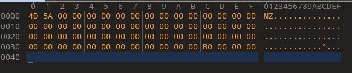

要求：

使用WinHex 工具构造一个PE格式的可执行文件(以.exe为扩展名),要求该.exe文件运行时弹出一个对话框，显示PE file，如图所示


## 1、DOS头填充

### DOS MZ 头填充

PE文件以DOS MZ头开始，它是一个64字节长度的IMAGE_DOS_HEADER 类型的结构。每行16个字节，正好是4行，偏移地址从00000000H(0D)到0000003F(63D)H。 因此，在填充文件之前，选择WinHex 菜单功能“十六进制插入/删除”,让文件尺寸 增加为64个字节，全部赋成0。

DOSMZ头中只需关心头尾两个重要成员：e_magic和e_lfanew

e_magic 是 00005A4D，e_lfanew是PE头的偏移位置，本例中，因为DOS MZ头后面的DOS 插桩程序还要占用112字节，因此PE头起始偏移地址为000000BOH (176D)。



DOS 插桩程序的偏移地址从00000040H (64D)到000000AFH (175D), 总共112字节。


## 2、PE头填充

PE头的偏移地址从000000BOH (176D) 到0000001A7H (423D), 总共248字节。

 PE头 是 一 个IMAGE_NT_HEADERS类型的结构

```cpp
typedef struct _IMAGE_NT_HEADERS {
    DWORD Signature; //签名 50 45 00 00
    IMAGE_FILE_HEADER FileHeader; //映像文件头
    IMAGE_OPTIONAL_HEADER32 OptionalHeader; //可选映像文件头
} IMAGE_NT_HEADERS32, *PIMAGE_NT_HEADERS32;
```

Signature(签名) 中记录的是4个字节的PE文件标识符 “PE\0\0”，对应的值是50450000H，所以在B0H～B3H中填入“50 45 00 00”


```cpp
typedef struct _IMAGE_FILE_HEADER {
    WORD    Machine; //4C 01
    WORD    NumberOfSections; // 03 00
    DWORD   TimeDateStamp; 
    DWORD   PointerToSymbolTable;
    DWORD   NumberOfSymbols; 
    WORD    SizeOfOptionalHeader;// E0 00 
    WORD    Characteristics;// 0F 01
} IMAGE_FILE_HEADER, *PIMAGE_FILE_HEADER;
```


```cpp
typedef struct _IMAGE_OPTIONAL_HEADER {
    //
    // Standard fields.
    //

    WORD    Magic; // 0B 01
    BYTE    MajorLinkerVersion;  // 00
    BYTE    MinorLinkerVersion; // 00
    DWORD   SizeOfCode; // AA AA AA AA
    DWORD   SizeOfInitializedData; // 00 00 00 00
    DWORD   SizeOfUninitializedData; // 00 00 00 00
    DWORD   AddressOfEntryPoint; // AA AA AA AA
    DWORD   BaseOfCode; // AA AA AA AA
    DWORD   BaseOfData;

    //
    // NT additional fields.
    //

    DWORD   ImageBase; // 00 00 40 00
    DWORD   SectionAlignment; // 00 10 00 00
    DWORD   FileAlignment; // 00 02 00 00
    WORD    MajorOperatingSystemVersion; // 00 00
    WORD    MinorOperatingSystemVersion; // 00 00
    WORD    MajorImageVersion; // 00 00
    WORD    MinorImageVersion; // 00 00
    WORD    MajorSubsystemVersion; // 00 00
    WORD    MinorSubsystemVersion; // 00 00
    DWORD   Win32VersionValue; // 00 00 00 00
    DWORD   SizeOfImage; // 00 40 00 00 
    DWORD   SizeOfHeaders; //00 04 00 00
    DWORD   CheckSum; // 00 00 00 00
    WORD    Subsystem; //02 00
    WORD    DllCharacteristics; // 00 00
    DWORD   SizeOfStackReserve; // 00 00 00 00
    DWORD   SizeOfStackCommit; // 00 00 00 00
    DWORD   SizeOfHeapReserve; // 00 00 00 00
    DWORD   SizeOfHeapCommit; // 00 00 00 00
    DWORD   LoaderFlags; // 00 00 00 00
    DWORD   NumberOfRvaAndSizes; // 10 00 00 00
    IMAGE_DATA_DIRECTORY DataDirectory[IMAGE_NUMBEROF_DIRECTORY_ENTRIES]; // AA AA AA AA AA AA AA AA
} IMAGE_OPTIONAL_HEADER32, *PIMAGE_OPTIONAL_HEADER32;
```


```cpp
typedef struct _IMAGE_DATA_DIRECTORY {
    DWORD   VirtualAddress;
    DWORD   Size;
} IMAGE_DATA_DIRECTORY, *PIMAGE_DATA_DIRECTORY;
```


## 3、节表填充

节表是由`IMAGE_SECTION_HEADER` 结构体组成的数组，每一项40字节，包含了一个节的具体信息。本例中有3个节(.text、 .rdata和.data), 因此节表长度应该是120字节，在节表后要用一个空的IMAGE_SECTION_HEADER 作为节表的结束，所以节表总长度为160字节，偏移地址从000001A8H到0000024FH。

.text节表

```cpp
#define IMAGE_SIZEOF_SHORT_NAME              8

typedef struct _IMAGE_SECTION_HEADER {
    BYTE    Name[IMAGE_SIZEOF_SHORT_NAME]; 	//2E 74 65 78 74 00 00 00
    union {
            DWORD   PhysicalAddress;
            DWORD   VirtualSize; // AA AA AA AA
    } Misc;
    DWORD   VirtualAddress; // 00 10 00 00
    DWORD   SizeOfRawData; // 00 02 00 00
    DWORD   PointerToRawData; // 00 04 00 00
    DWORD   PointerToRelocations; // 00 00 00 00
    DWORD   PointerToLinenumbers; // 00 00 00 00
    WORD    NumberOfRelocations; // 00 00
    WORD    NumberOfLinenumbers; // 00 00
    DWORD   Characteristics; // 60 00 00 20
} IMAGE_SECTION_HEADER, *PIMAGE_SECTION_HEADER;
```

.rdata节表

```cpp
#define IMAGE_SIZEOF_SHORT_NAME              8

typedef struct _IMAGE_SECTION_HEADER {
    BYTE    Name[IMAGE_SIZEOF_SHORT_NAME]; //2E 72 64 61 74 61 00 00
    union {
            DWORD   PhysicalAddress;
            DWORD   VirtualSize; // AA AA AA AA
    } Misc;
    DWORD   VirtualAddress; // 00 20 00 00
    DWORD   SizeOfRawData; // 00 02 00 00
    DWORD   PointerToRawData; // 00 60 00 00
    DWORD   PointerToRelocations; // 00 00 00 00
    DWORD   PointerToLinenumbers; // 00 00 00 00
    WORD    NumberOfRelocations; // 00 00
    WORD    NumberOfLinenumbers; // 00 00 
    DWORD   Characteristics; // 40 00 00 40
} IMAGE_SECTION_HEADER, *PIMAGE_SECTION_HEADER;
```

.data节表

```cpp
#define IMAGE_SIZEOF_SHORT_NAME              8

typedef struct _IMAGE_SECTION_HEADER {
    BYTE    Name[IMAGE_SIZEOF_SHORT_NAME]; // 2E 64 61 74 61 00 00 00
    union {
            DWORD   PhysicalAddress;
            DWORD   VirtualSize; // AA AA AA AA
    } Misc;
    DWORD   VirtualAddress; //00 30 00 00
    DWORD   SizeOfRawData; // 00 02 00 00
    DWORD   PointerToRawData; // 00 80 00 00
    DWORD   PointerToRelocations; // 00 00 00 00
    DWORD   PointerToLinenumbers; // 00 00 00 00
    WORD    NumberOfRelocations; // 00 00
    WORD    NumberOfLinenumbers; // 00 00
    DWORD   Characteristics; // 40 00 00 C0
} IMAGE_SECTION_HEADER, *PIMAGE_SECTION_HEADER;
```


.text节填充

.text节存放PE文件的代码。本例程序要实现的功能是弹出一个对话框，并在对话框内显示“PE file ”。这段代码调用动态链接库user32.dll中的MessageBoxA 函数显示一个消息“PE file ”, 再调用动态链接库kernel32.dll中的ExitProcess退出程序。该段程序代码文件的偏移地址、机器码和汇编代码如表所示。


