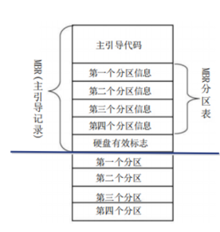
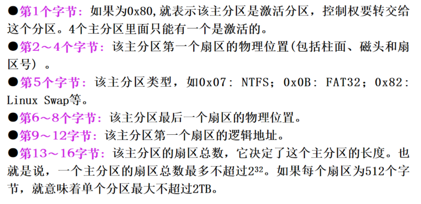
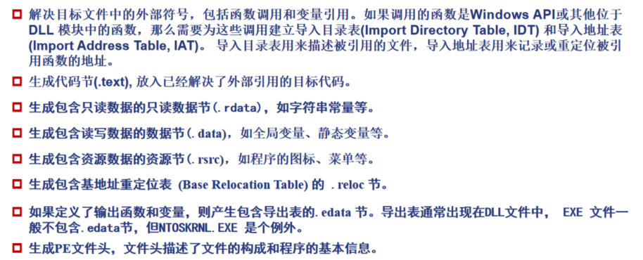
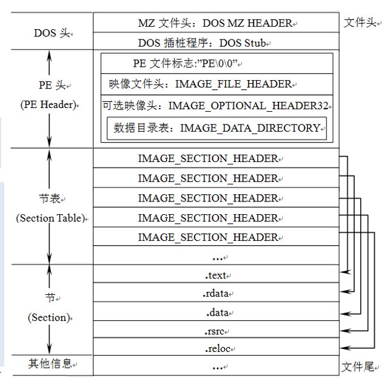
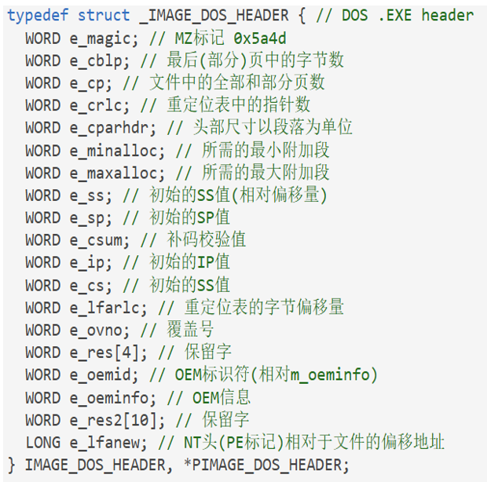
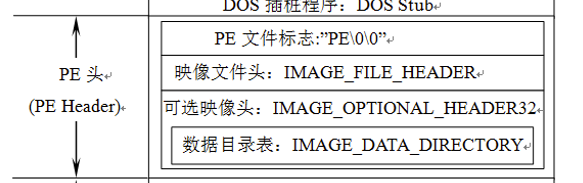
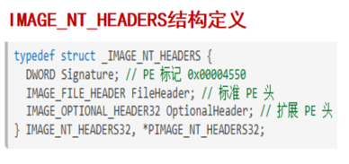
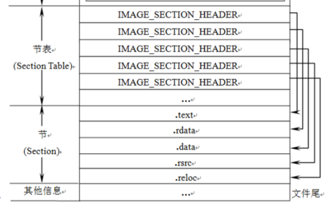
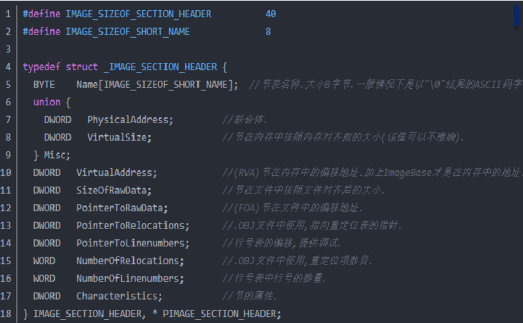
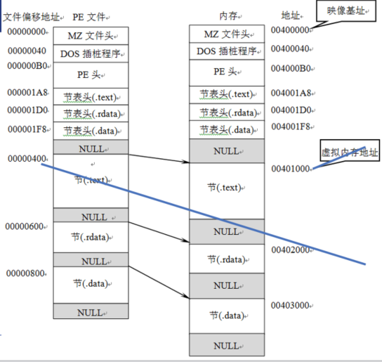

# 1、计算机启动过程

分为计算机初始化启动过程、操作系统启动过程

## 计算机初始化启动过程及其安全性分析

计算机上电 --》 BIOS代码进行加电后自检 --》 加载BIOS初始化代码 --》 BIOS代码选择启动盘 --》

安全问题：

CIH病毒修改BIOS代码破坏固件的初始化过程，向BIOS芯片执行写入操作，覆盖关键数据，导致硬件无法正常启动。

须通过BIOS重写恢复

## 操作系统启动过程及其安全性分析

读取指定启动顺序中的存储设备的主引导记录 --》 硬盘启动 --》 操作系统启动

**1、读取指定启动顺序中的存储设备的主引导记录**

BIOS根据设定将第一个可引导存储设备（硬盘）的MBR加载到内存，并跳转到引导程序的第一条指令。

主引导记录MBR：硬盘设备的第一个扇区的最前面的512字节。

主引导记录由3部分组成：

1）第1-446字节：主引导代码，即调用操作系统的机器码

2）第447-510字节：分区表，MBR中分区表的作用是将硬盘分成若干个区。分区表的长度只有64字节，里面分成4项，每项16字节。一个硬盘最多只能分4个一级分区，又称为“主分区”

3）第511-512字节：防止磁盘的有效标志。如果这两个字节是0x55和0xAA，表明这个设备可以启动。如果不是，控制权被转交给启动顺序中的下一个设备。

每个主分区的16个字节：

**硬盘启动**

4个主分区里面只有一个是被激活的，计算机会读取激活分区里的第一个扇区，称为**卷引导记录**，卷引导记录的主要作用是告诉计算机，操作系统在这个分区里的位置，然后计算机就会加载操作系统

### 安全问题

在操作系统的启动的过程中，病毒主要存在于主引导扇区、卷引导扇区和分区表，这种病毒被称为引导区病毒。由于**系统在引导时没有对主引导扇区和引导扇区内容进行正确性判断，而是直接执行，所以病毒程序只要占领其位置就可以获取控制权**。待病毒执行完之后再通过跳转方式调用已经被写到其他扇区的真正的引导区内容。

MBR病毒就是对系统磁盘的MBR进行修改，最终导致病毒程序在系统启动过程中优于操作系统及其他应用程序运行。

内核装载阶段病毒：内核装载阶段与Smss.exe Winlogon.exe等有关，病毒主要采用重写、替换、加载易于引起混淆的具有相似文件名的文件以达到加载和隐身的目的

# 2、程序的生成和运行

 C/C++程序生成可执行程序 直到在内存中加载的一般过程

1）编辑

2）编译：源程序经过**编译器**编译为等价的**汇编代码**，再经过**汇编器**产生出与目标平台CPU一致的**目标代码**（.obj），亦称**机器码**

3）链接：链接器把目标代码文件和其他一些库文件和资源文件连接起来，产生出符合目标平台上的操作系统所要求格式的**可执行程序**(.exe), 并保存在磁盘上

4）运行：Windows 操作系统的加载器会解读链接器记录在可执行程序中的格式信息，将程序中的代码和数据“布置”在内存中，成为真正可以运行的内存映像，开始运行。

## 程序的编译

编译器（含汇编器）的基本功能是，将使用一种高级语言编写的程序（源程序）翻译成目标代码（机器语言代码）

编译过程：

1、**预处理**：根据已放置在文件中的预处理指令来修改源文件的内容

2、**编译与优化**：编译程序将代码翻译成等价的中间表示或汇编代码

3、**目标代码生成**：将上面生成的中间表示或汇编代码翻译成目标机器指令

## 程序的链接

链接器的基本功能是，将编译器产生的多个目标文件合成为一个可以在目标平台下**执行的文件**。

静态链接库（.lib或.a）：在**程序生成时**被连接到目标代码中，生成的可执行文件包含了库的所有代码。

​	链接器将函数的代码从其所在地(目标文件或静态链接库中)复制到最终的可执行程序中，整个过程在程序生成时完成。

动态链接库（.dll或.so）：在**程序运行时**由系统动态加载，多个程序可以共享内存中同一个动态库实例。运行时调用即可节省内存

​	动态链接是在编译链接时只提供符号表和其他少量信息，用于保证所有符号引用都有定义，保证编译顺利通过。程序执行时，动态链接库的全部内容将被映射到运行时相应进程的虚地址空间，根据可执行文件中记录的信息找到相应的函数地址并调用执行。

链接器的目的是生成可执行文件，在Windows中就是PE格式文件

## 程序的加载与运行

程序源文件经过编译、链接后，生成可执行程序，产生的程序文件是存储在硬盘(外存)里的二进制数据。系统并非在硬盘上直接运行程序，而是通过PE加载器，将可执行程序从外存(如硬盘)加载到内存中，然后才让CPU 来处理。PE加载器根据程序PE格式文件中的各种信息，进行堆栈的申请和代码数据的映射装载，在完成所有的初始化工作后，程序从入口点地址进入，开始执行代码段的第一条指令。

# 3、PE文件

Portable Executable 可移植执行体

exe scr dll ocx drv sys vxd obj 等都采用PE文件格式

在程序被执行时，操作系统会按照PE文件格式的约定去相应的地方准确地定位各种类型的资源，并分别装入内存的不同区域。

## PE文件结构

### DOS头

DOS MZ文件头：64字节的**IMAGE_DOS_HEADER**类型的结构

DOS插桩程序：在DOS环境下执行，Windows直接跳过

**IMAGE_DOS_HEADER**结构：

DOS MZ头中只需关心两个重要成员 e_magic 和 e_lfanew，中间其他数据不是很重要

e_magic (WORD) 相当于一个标志，所有的PE文件都必须以MZ（4D5A）开始。作用是标识一个合法的PE文件，为PE加载器提供PE文件头的入口地址

e_lfanew (LONG) 指示了**PE头（即PE签名“PE\0\0”）相对于文件起始位置的偏移位置**，不同文件拥有的值不同。可以计算得出。

### PE头（NT头）

PE头 是 一 个**IMAGE_NT_HEADERS**类型的结构，用于对一个PE程序进行总体描述。该结构体包含3个部分：

- Signature (签名) 
  - 记录的是4个字节的PE文件标识符“PE\0\0”，通过分析DOS头的MZ和PE头的PE这两个标志，可以初步判断当前程序是一个合法的PE文件。
- FileHeader (映像文件头)
  - 是一个拥有20字节长度的IMAGE_FILE_HEADER类型的结构体，**描述PE文件物理分布的基本信息**。
- OptionalHeader (可选映像文件头)
  - 是一个224字节长度的IMAGE_OPTIONAL_HEADER32 类型的结构体，**描述PE文件逻辑分布的信息**。这里的“可选”是指结构体中的各字段可设置，并不是说这个结构体是否可用。

### 节表

节表是由IMAGE_SECTION_HEADER **结构体组成的数组**，每一项40个字节，包含了**一个节的具体信息**。如每一节在磁盘文件中的起始位置和大小、应该被加载到内存的哪里、这一节是代码还是数据等

IMAGE_SECTION_HEADER结构定义：

### 节

PE 文件格式的设计者把具有相似属性的数据统一保存在一个被称为“节”的地方，不同的资源被存放在不同的节中。

然后把各节属性记录在节表中

一个典型的PE文件包含的节：

- .text: 可执行代码节，由编译器产生，存放着二进制的机器代码，是反汇编和动态调试的对象。 
- .rdata(.idata): 只读数据节，包含了一些常量，如一些字符串信息等。在Release版本的PE文件中，导入表也在.rdata中，用于记录可执行文件所使用的动态链接库等外来函数与文件的信息，是分析恶意代码的重要区域。 
- .data: 可读写数据节，如宏定义、全局变量和静态变量等。
- .edata: 导出函数节，记录本文件向其他程序提供调用的函数列表。 
- .rsrc: 资源节，存放程序的图标、菜单等资源。  

### PE文件执行基本过程

- 1）当一个 PE 文件 被执行时，PE 装载器 首先检查 DOS header 里的 PE header 的偏移量。如果找到，则直接跳转到 PE header 的位置。（DOS MZ头中的e_lfanew指示了PE文件头（即PE签名“PE\0\0”）**相对于文件起始位置**的偏移）
- 2）当 PE装载器 跳转到 PE header 后，第二步要做的就是检查 PE header 是否有效。如果该 PE header 有效，就跳转到 PE header 的尾部。
- 3）紧跟 PE header 尾部的是节表。PE装载器执行完第二步后开始读取节表中的信息，并采用文件映射的方法将这些节段映射到内存，同时附上节表里指定节段的读写属性。
- 4）PE文件映射入内存后，PE装载器将继续处理PE文件中最重要的导入表，从导入表中获取函数字符串名称信息、 DLL 名称信息及导入函数地址表项起始偏移地址等。
- 5）加载器会执行PE文件的初始化代码，包括运行全局变量的初始化和执行静态构造函数等操作。
- 6）PE文件中定义了一个入口点（Entry Point）函数，通常命名为main或WinMain。加载器会跳转到入口点函数，开始执行程序的主逻辑。
- 7）程序会退出时，加载器负责释放相关资源并终止程序的执行。

## 地址映射

### 虚拟内存

虚拟内存是计算机系统内存管理的一种技术。它使得应用程序认为它拥有连续的可用的内存（一个连续完整的地址空间），而实际上，它通常是被分隔成多个物理内存碎片，还有部分暂时存储在外部磁盘存储器上，在需要时进行数据交换。

在用户模式下，用调试器看到的内存地址都是虚拟内存。Windows32让**所有的进程都认为自己拥有独立的4GB 内存空间**。进程所拥有的4GB虚拟内存中包含了程序运行时所必需的资源，如代码、栈空间、堆空间、资源区和动态链接库等。

### PE文件与虚拟内存之间的映射

- 1）**文件偏移地址** (File Offset Address, **FOA**)：**文件偏移表示文件在磁盘上存放时相对于文件开头的偏移（实质是一个值）**。文件偏移地址是线性的，即从PE文件的第一个字节开始计数，从0开始依次递增。
- 2）**映像基址** (Image Base Address)：**映像基址是指PE装入内存时的基地址**。在默认情况下， **EXE文件的0字节（FOA值）将映射到虚拟内存的0x00400000地址， DLL文件的0字节将映射到虚拟内存的0x10000000地址**(这些地址可以通过修改编译选项更改)。
- 3）**虚拟内存地址 **(Virtual Address, **VA**)：虚拟内存地址是指**PE文件中的指令被装入虚拟内存后的绝对地址**。 Windows32 系统中，各进程分配有4GB 的虚拟内存，因此VA 值的范围是00000000～FFFFFFFF。
- 4）**相对虚拟地址** (Relative Virtual Address, **RVA**)：相对虚拟地址RVA是**虚拟内存地址 相对于映像基址（Image Base）的偏移量**。

磁盘或内存均按字节编址，即每个字节一个地址号。

在PE文件中，每个节在**磁盘文件**的起始位置是`FileAlignment`（通常是**200H** 即512字节）的整数倍，未使用的空间填零

当PE文件被加载到**内存**时，每个节在内存中的起始地址是**1000H**的整数倍。如果原始数据不足一个对齐单位，则会用零填充。

****

### 地址映射的计算

（1）虚拟内存地址VA = Image Base （映像基址）+ RVA（相对虚拟地址）

（2）文件偏移地址（FOA）

因为数据在节内的偏移量是相同的（无论是内存中还是文件中）

文件偏移地址 - 节起始文件偏移地址 = RVA - 节起始RVA

=> 文件偏移地址 = RVA - 节起始RVA + 节起始文件偏移地址

=> 文件偏移地址 = RVA - （节起始RVA - 节起始文件偏移地址）

FOA = RVA - 节偏移