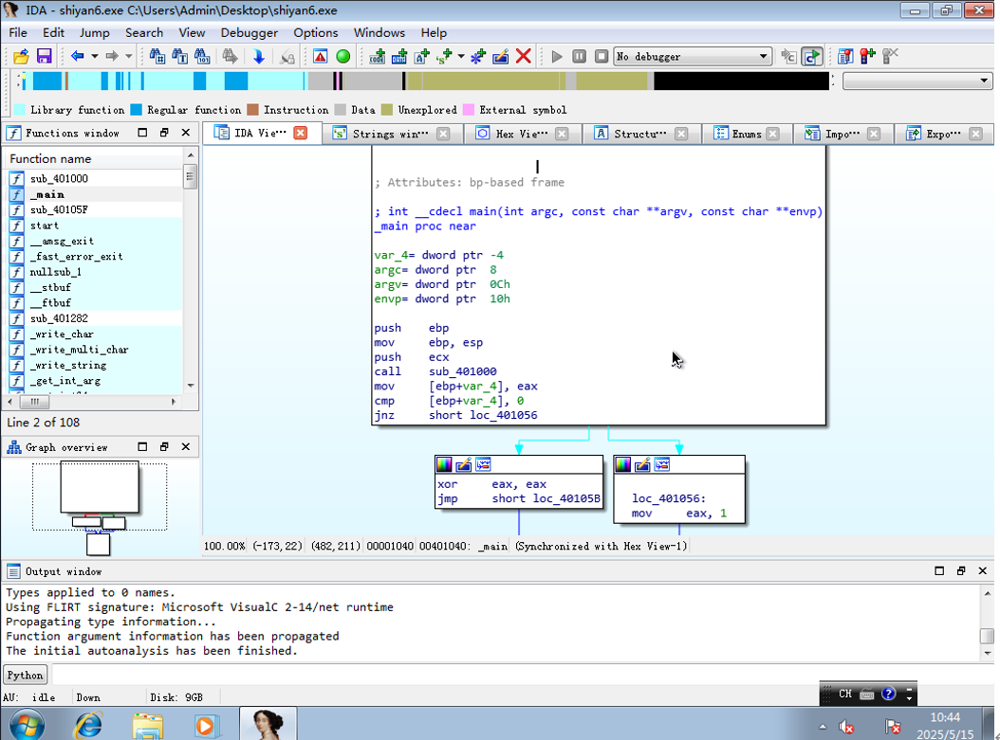
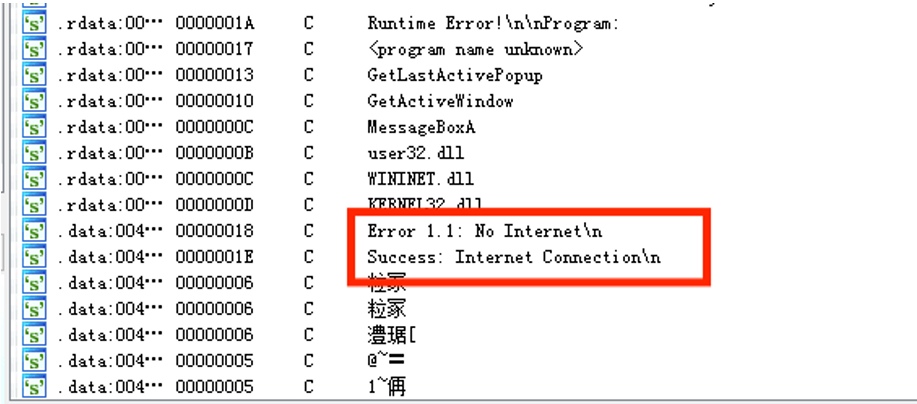
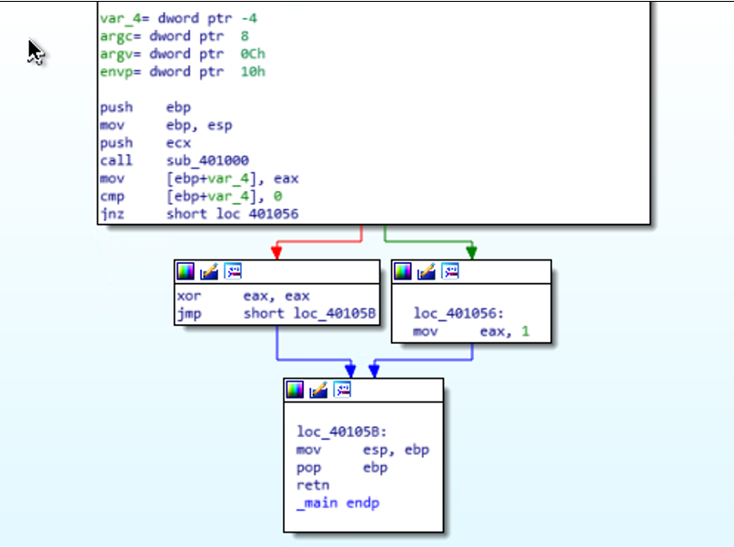
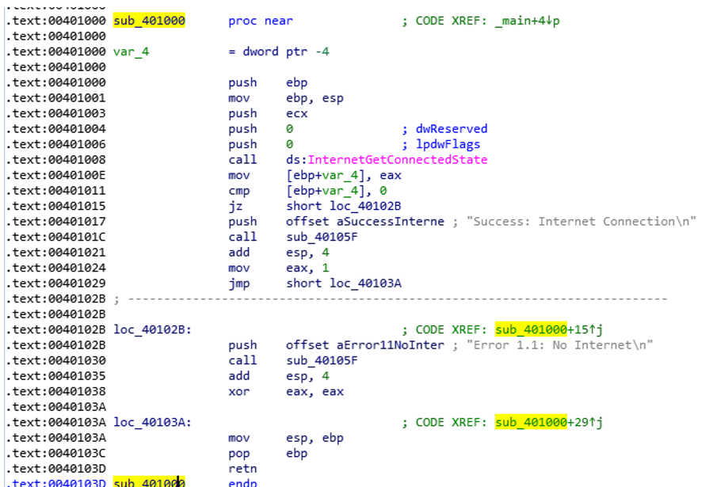
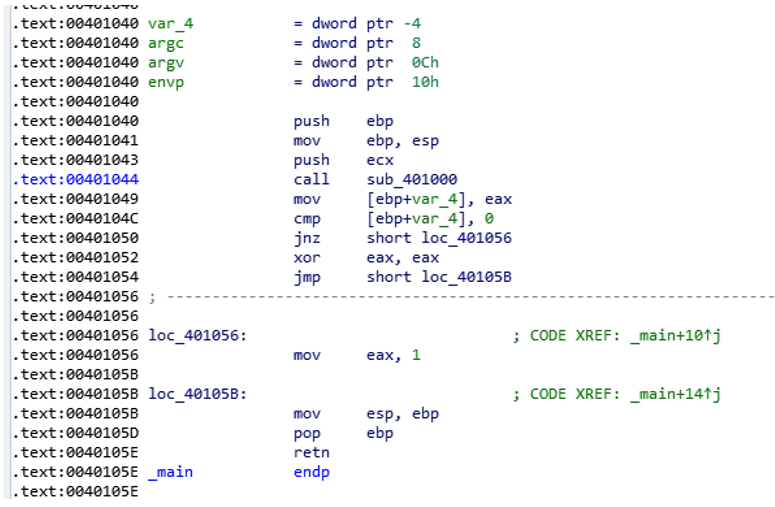
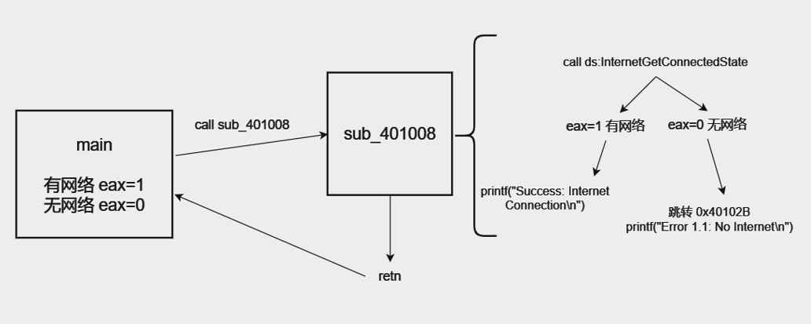

cmp A, B 计算 A-B 结果如果为0，则ZF=1

jz (jump if zero)在cmp结果为0时跳转，即在ZF=1时跳转

1、利用IDA Pro打开恶意样本，如图1所示。

2、通过shift+F12，查看字符串窗口，通过以下字符串，初步确定该软件存在网络行为，如图2所示。

3、双击_main函数，查看main函数的反汇编代码，如图3所示。

‘var_4= dword ptr -4’表示在栈上分配一个双字大小的空间作为局部变量var_4，相对于基址指针ebp偏移-4的位置。同理，下面的三个语句指定了argc参数在栈上相对于ebp偏移8的位置。Argv参数在栈上相对于ebp偏移12（0Ch）的位置。Envp参数在栈上相对于ebp偏移16（10h）的位置。

‘push ebp’将当前的ebp压入栈中，保存旧的栈帧信息。

‘mov ebp, esp’是将栈指针（esp）的值移动到基址指针（ebp），建立一个新的栈帧，用于当前函数的执行。

‘push ecx’是将ecx寄存器的值存入栈中。

‘call sub_401000’是指程序的执行将跳转到位于内存地址0x401000的子程序。

4、因为main函数中有指令“call sub_401000”，所以跳转到地址0x401000处看一下。如图4所示。

位于内存地址0x401008的指令“call ds:InternetGetConnectedState”表明，调用了Windows API函数InternetGetConnectedState。ds表

示数据段，说明这个函数位于程序的数据段中，应该是导入的动态链接库中的函数。这个函数通常用于检查系统是否连接到互联网。前面

的两个push指令可能是将0赋值给了dwReserved变量和lpdwFlags变量，这两个变量是InternetGetConnectedState函数的两个参数。

之后，将eax寄存器存储的值存在[ebp-4]的位置（在汇编语言中，方括号的作用是访问内存地址中的数据），因为

InternetGetConnectedState函数的返回值存储在eax寄存器，所以[ebp-4]就是InternetGetConnectedState函数的返回值。接着通过

cmp指令将返回值与0作比较，如果返回值是0，就跳转到0x40102B地址。该地址的程序执行了“push offset aError11NoInter ; ‘Error 

1.1: No Internet\n’”，aError11NoInter是一个字符串的标签，代表某个字符串的地址，offset是取标签的地址，结合注释来看，该指令是

将“Error 1.1: No Internet\n”字符串的地址压入栈中。然后调用了位于0x40105F的程序。“add esp, 4”是清理为字符串分配的空间，“xor 

eax, eax”是将eax寄存器中的值置零，可能作为返回值。

如果InternetGetConnectedState函数返回值不是0，执行“push offset aSuccessInterne ; ‘Success: Internet Connection\n’”指令，即将

该字符串的地址压入栈中，随后调用位于0x40105F的程序。接着，“add esp, 4”是清理为字符串分配的空间，“mov eax, 1”是将eax寄存

器中的值置1，随后跳转到0x40103A地址处，执行“mov esp, ebp”释放了当前栈帧中的所有局部变量，“pop ebp”将栈顶的数据的内容取

出，赋值给ebp寄存器，这个内容就是main函数ebp的地址。最后执行retn

因为在执行“call sub_401000”时，call指令的下一条指令会被压入堆栈，程序计数器被设置为0x401000，随后从0x401000地址开始执

行，一旦遇见retn指令，堆栈上保存的地址会弹回到程序计数器中，程序从call的下一条指令开始执行，由此保证代码执行顺序。

综上所述，如果存在网络连接，eax的值是1，不存在网络连接，eax的值是0。

5、分析完“call sub_401000”跳转后的执行逻辑，继续分析main函数的逻辑，如图5所示。

如果有网络连接，eax=1，执行“cmp 1, 0”，ZP（Zero Flag）=0，执行jnz（jump if not zero）指令跳转到0x401056，eax置为1。如果

没有网络连接，eax=0，执行“cmp 0, 0”，ZP=1，不执行jnz指令，执行“xor eax, eax”，eax置为0，跳转到0x40105B进行栈帧释放。最后

retn返回（main函数也是被调用的）。

总体流程大致如下：

6、在push offset aSuccessInterne ; “Success: Internet Connection\n”指令和push offset aError11NoInter ; “Error 1.1: No 

Internet\n”后面执行了“call sub_40105F”，其实这就是printf函数，在输出函数之前一般会有类似于“push offset aSuccessInterne”的将

字符串地址压栈的指令。