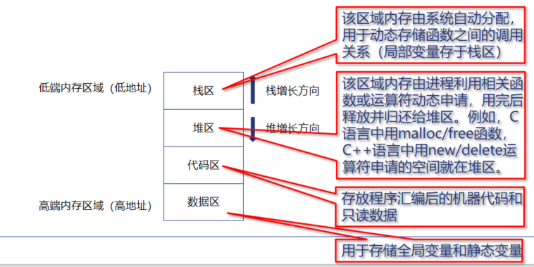
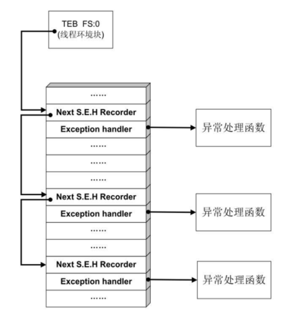
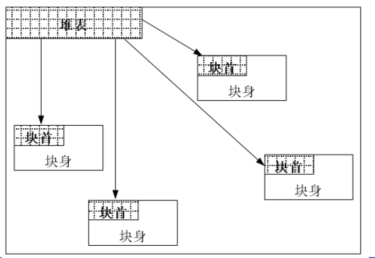

## 1、栈帧简介

函数栈帧详解参考：[函数栈帧详解](函数栈帧详解.md)



一个函数栈帧中主要包含如下信息:

1）前一个栈帧的栈底位置，即**前栈帧EBP**，用于在函数调用结束后恢复主调函数的栈帧（前栈帧的栈顶可计算得到）。

2）**该函数的局部变量**。

3）**函数调用的参数**。

4）**函数的返回地址RET**，用于保存函数调用前指令的位置，以便函数返回时能恢复到调用前的代码区中继续执行指令。


## 2、函数调用的过程

1、main函数也是被调用的：操作系统 --> kernel32.dll --> mainCRTStartup() --> main

PPT中是这样写的：

1）参数入栈。将被调用函数的实际参数从右到左依次压入主调函数的函数栈帧中。

2）返回地址RET入栈。将当前指令的下一条指令地址压入主调函数的函数栈帧中。

3）代码区跳转。CPU从当前代码区跳转到被调用函数的入口，EIP指向被调用函数的入口处。

4）将当前栈帧调整为被调用函数的栈帧


2、小端存储：

**低位优先存储**

0x12345678 (高位 --> 低位) 所以存储是 78 56 34 12


PPT中描述的Win32机器**调用某函数时**的做法：

1、将主调函数的栈帧底部指针EBP入栈，以便被调用函数返回时恢复主调函数的栈帧。

2、更新当前栈帧底部：将主调函数的栈帧顶部指针ESP的值赋给EBP，作为新的当前栈帧（即被调用函数的栈帧）底部。

3、为新栈帧分配空间：ESP 减去适当的值，作为新的当前栈帧的栈顶

4、将当前栈帧调整为被调用函数的栈帧

详细的情况可以看这个实验：[软件安全实验1](20250519_软件安全实验1.md)


PPT中**返回主调函数的步骤**

1、保存返回值。将函数的返回值保存在寄存器EAX 中

2、弹出当前栈帧，将前一个栈帧（即主调函数栈帧）恢复为当前栈帧

​	1）降低栈顶，回收当前栈帧的空间

​	2）弹出当前EBP指向的值（即主调函数的栈帧EBP），并存入EBP 寄存器

​	3）弹出返回地址RET，并存入EIP 寄存器，使进程跳转到新的EIP 所指执行指令处（即返回主调函数）。

​	4）使得EBP 指向主调函数栈帧的栈底。


## 3、栈溢出漏洞的基本原理


（1）栈溢出修改相邻变量

```cpp
void fun()
{
    char password[6] = "ABCDE"; // 注意这里应该是双引号
    char str[6];
    gets(str); //该函数无越界检查
    str[5] = '\0';
    if (strcmp(password, str) == 0)
    {
        printf("OK\n");
    }
    else
    {
        printf("Error\n");
    }
}

int main()
{
    fun();
    return 0;
}
```


（2）栈溢出后修改返回地址RET

```cpp
#include <stdio.h>
#include <string.h>
#include <stdlib.h>

void Attack()
{
    printf("Hello!:-) :-) :-) \n");//当该函数被调用时，说明溢出攻击成功了
    exit(0);
}

void fun()
{
    char password[6] = "ABCDE";
    char str[6];
    FILE* fp;
    if (!(fp = fopen("password.txt", "r")))
    {
        exit(0);
    }
    fscanf(fp, "%s", str); //fscanf() 在使用 %s 格式符时，也存在不检查目标缓冲区大小的风险

    str[5] = '\0';
    if (strcmp(str, password) == 0)
        printf("OK.\n");
    else
        printf("NO.\n");
}

int main()
{
    fun();
    return 0;
}
```

如果攻击者知道 `Attack()` 函数在内存中的地址，他们就可以构造一个输入字符串，使得当 `fscanf` 溢出时，恰好将 `Attack()` 函数的地址写入到 `fun` 函数的返回地址所在的位置。


## 4、栈溢出攻击

1、JMP ESP覆盖方法


Nop表示无关的数据，JMP ESP指令的地址 这里填充的本来是返回地址（call指令的下一条指令的地址）

PPT：当函数返回时，取出JMP ESP后， ESP 向高地址移4个字节，正好指向Shellcode, 而此时EIP指向JMP ESP指令，所以程序就转去执行Shellcode了。


2、SEH覆盖方法

Windows异常处理机制的一个重要数据结构是位于系统栈中的异常处理结构体 (Struct Exception Handler, SEH), 不同线程的 SEH 链相互

独立，每个SEH结构包含两个DWORD 指针。

- SEH链表指针Next, 用于指向下一个SEH结构。    
- 异常处理函数句柄handler, 用于指向异常处理函数的指针。

当线程初始化时，会自动向栈中安装一个异常处理结构，作为该线程默认的异常处理。多个异常处理结构体就连接成了一个由栈顶向栈底

延伸的单链表，链表头部位置通过TEB(Thread Environment Block, 线程控制块) 0字节偏移处的指针标识。



当发生异常时，操作系统会中断程序，并首先从TEB 的0字节偏移处取出最顶端的SEH 结构地址，使用异常处理函数句柄所指向的代码来处理异常。如果该异常处理函数运行失败，则顺着SEH 链表依次尝试其他的异常处理函数。如果程序预先安装的所有异常处理函数均无法处理，系统将采用默认的异常处理函数，弹出错误对话框并强制关闭程序。           

SEH覆盖方法就是**覆盖异常处理程序地址**的一种攻击方式。由于SEH结构存放在栈中，因此攻击者可以利用栈溢出漏洞，设计特定的溢出数据，**将SEH中异常函数的入口地址覆盖为Shellcode的起始地址或可以跳转到Shellcode的跳转指令地址**，从而导致程序发生异常时，Windows异常处理机制执行的不是预设的异常处理函数，而是Shellcode。


## 5、堆溢出漏洞

堆管理的3类操作：堆块分配、堆块释放、堆块合并

堆的数据结构包括**堆块**和**堆表**

**堆块：**

堆区的内存按不同大小组织成块，以堆块为单位进行标识，而不是传统的字节。一个堆块包括**块首**和**块身**。块首用来标识堆块的自身信息，块身是最终分配给用户使用的数据区。



堆区和堆块的分配都由程序员来完成。对一个堆块而言，被分配之后，如果不被合并，那么会有两种状态：

​	占有态：占有态的堆块会返回一个由程序员定义的句柄，由程序员管理。

​	空闲态：空闲态的堆块会被链入空链表中，由系统管理


**堆表：**
